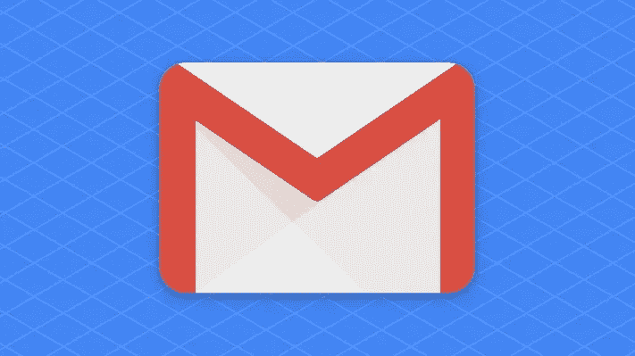

# 电子邮件如何组合成对话？

> 原文：<https://blog.devgenius.io/how-emails-are-grouped-together-into-conversations-11de4bb9d6e3?source=collection_archive---------16----------------------->

想知道电子邮件服务是如何将电子邮件组合成对话的吗？你认为这仅仅是主题和发送者的问题吗？**不**，不是的！



在了解其工作原理之前，我们需要了解一些关键术语:

[**邮件头**](https://en.wikipedia.org/wiki/Email#Message_header) **:** 邮件头由发送的邮件信息组成，如收件人、发件人、抄送、密件抄送、日期等。

[**Message-Id**](https://en.wikipedia.org/wiki/Message-ID)**:**抛开所有的行话不谈，它只是邮件头中发送的邮件的一个标识符。它看起来有点像

```
<helloworld@helpwise.io>
```

**In-Reply-To:** 这是邮件被回复的邮件的消息 Id。它是在回复电子邮件时发送的。它看起来与消息 Id 相同。

**References:** 这是作为对话一部分的电子邮件的消息 Id 的空格分隔列表，包括回复的电子邮件的消息 Id。它看起来有点像

```
<id1@helpwise.io> <id1@helpwise.io>
```

**Gmail 是怎么做到的？**

Gmail 是这个星球上最大的电子邮件提供商，他们在这里记录了他们是如何做到这一点的[。](https://support.google.com/mail/answer/5900?co=GENIE.Platform%3DDesktop&hl=en)

1.  他们检查**回复**和**参考**。我们已经注意到，它们是最重要的因素。
2.  主题应与适当的前缀相同，如 Re:，Fw:，等。你可以在这里找到完整的列表。
3.  他们检查发件人是否是对话的一部分，收件人和主题。

包括 Outlook 在内的所有其他主要电子邮件提供商紧随其后。我们在[帮助](https://helpwise.io)密切模仿 Gmail 的逻辑，给我们的客户提供他们使用 Gmail 的类似体验。

在发送电子邮件的同时，你如何正确地组织对话？

如果情况正好相反，你正在发送电子邮件，并希望将它们按收件人分组，这里有一个经验法则:

1.  发送 **In-Reply-To** 报头作为您正在回复或转发的消息的 **Message-Id** 。
2.  Send **引用**作为您收发的电子邮件的空格分隔 **Message-Id** 列表。
3.  用正确的前缀发送正确的主题。假设主题是**你好**，那么回复的主题应该是**回复:你好。**如果它已经包含了 **Re** ，那么我们可以跳过再次发送 **Re** 。