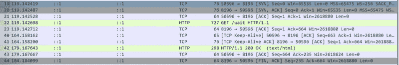

# HTTP 协议是如何工作的？

> 原文：<https://blog.devgenius.io/how-http-protocol-works-6c3636302316?source=collection_archive---------4----------------------->

HTTP 是一种请求-响应协议，允许用户进行数据通信。所以在 HTTP 中有两个分支。

1.  **持续连接**
2.  **非** - **持续连接**

# **非持久连接**

*   非持久性 HTTP 主要是 HTTP 1.0
*   RTT 往返时间是指从服务器收到响应时向发送请求的持续时间。
*   非持久连接的连接时间为 2RTT(往返时间)+ *文件传输时间*。这里首先使用 RTT 在服务器和客户端之间建立连接。
*   第二个 RTT:这里用于接受请求并返回对象。这里发生是单个对象传输。
*   举个例子，假设服务器说我们需要 10 个文件，然后当我们加载 html 页面时，它有 10 个 javascripts。
    现在我们需要向服务器发出 10 个不同的请求，以便
    获取这些文件。

# 持续连接

*   在事务完成后保持打开的 TCP 连接被称为*持久*连接。持久连接在事务之间保持打开，直到客户机或服务器决定关闭它们。
*   它的思想是使用单个 TCP 连接来发送和接收多个 HTTP 请求/响应，而不是为每个请求/响应对打开一个新的连接。
*   持久性 HTTP 又有两个部分:**有隧道和无隧道。**
*   默认情况下，HTTP 1.1 主要采用隧道技术。
*   因此，当我们创建连接并发送消息，然后得到响应时。因此，事务结束时，服务器或客户端都可以关闭连接。

让我们看看这是如何工作的。

这里我们有基于 Express 的程序。

**server.js**

*   在程序中，我们有一个称为“等待”的端点。得到响应后，它将发送“工作完成”消息。
*   这在端口 8196 上运行。
*   让我们运行这个程序，并在 Wireshark-loopback 流量捕获接口上进行监控。
*   所以当我们发送这个请求:[**http://localhost:8196/wait**](http://localhost:8191/wait)**我们可以看到如下。**

****

*   **这里可以看到标准的 TCP 握手。**

****

*   **因此，在这里您可以看到如何发送请求并获得响应**

****

*   **现在，服务器响应客户端，通知它将关闭这个连接(FIN)。然后客户端向服务器确认。但是客户端没有关闭连接。**

****

*   **所以过了一会儿客户端发送保活。**

****

*   **因此，当客户端发送保活时，服务器发送重置数据包(RST)。(因为在服务器关闭连接后，客户端试图与服务器连接)。**

****

*   **让我们看另一个例子。**
*   **在这里，我们检查在得到响应后发送另一个请求会发生什么。所以我们我们陆续发送这个请求:[**http://localhost:8196/wait**](http://localhost:8191/wait)**。****

****************

*   ****如你所见，我们的请求从客户端传到了服务器。****

********

*   ****现在，您可以看到客户端正在向响应发送 ACK。客户端发送请求。服务器确认它。服务器发送响应，然后客户端确认它。****

********

*   ****所以在我们发送另一个请求后，同样的事情会循环发生。****
*   ****此外，您可以看到这里没有任何 FIN 标志。因为我们在这里做的是保持与后端的对话，所以后端不会试图关闭连接。这就是**持续连接**的意思。****
*   ****我们只发送一次同步数据包来保持这个过程。****

*   ****现在让我们看另一个有一些小变化的演示。****
*   ****这里我们发送请求:[**http://localhost:8196/wait**](http://localhost:8191/wait)**。过了一会儿，服务器会关闭连接，然后我也会关闭浏览器。******

********

*   ****在这里，您可以看到服务器关闭了连接(FIN)。然后客户端确认关闭。在那之后，因为我关闭了浏览器，我的服务器和客户端的连接也关闭了****

********

*   ****让我们看另一个用例。****

> ****等待新的承诺((resolve) => setTimeout(resolve，60000))；****

*   ****将此添加到代码中。现在请求来了，等待 60 秒，然后它会做出响应。****

********

*   ****因此，在我们发送请求后，服务器对此进行确认。现在服务器正在等待响应，所以服务器将在 60 秒后响应。****

********

*   ****所以你可以在 45 秒后看到这里。(24 秒到 69 秒)它向服务器发送 keep-alive 报头。因为服务器没有响应。从客户端来看，我们正在等待服务器。因此服务器需要做出响应。****
*   ****所以一分钟后服务器会有反应。****

********

*   ****因此，一分钟后(在得到响应-119 s: 179 s 后)，您可以看到服务器正试图通过发送 FIN 来关闭连接。****

********

*   ****让我们看另一个用例。****
*   ****现在我们发送请求，等待服务器响应。然后我们去后端，杀死服务器。(关闭终端)。****

********

*   ****这里我们向服务器发送请求。但是服务器关闭了连接。(杀服务器)。此后，您可以看到客户端正在尝试启动一个新的连接，因为连接已关闭。(客户端同意服务器关闭连接，但要求建立新的连接。)****

********

*   ****但是现在服务器发送复位包，因为没有人从服务器端响应。****
*   ****这里你可以看到 keep-alive 报头有多重要，以及客户端如何在 HTTP 协议上保持与服务器的连接。****

******参考:******