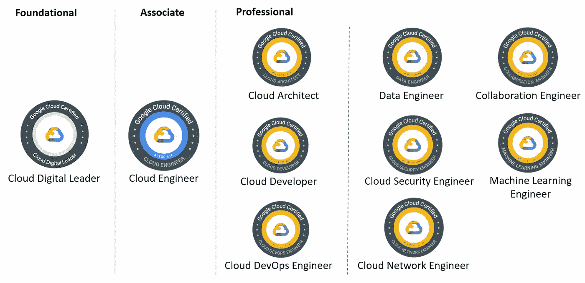
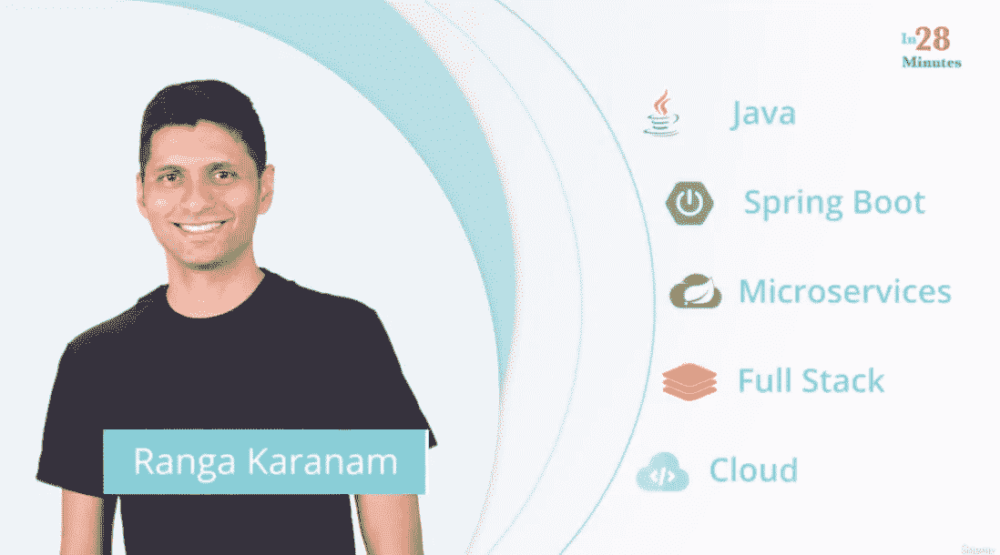
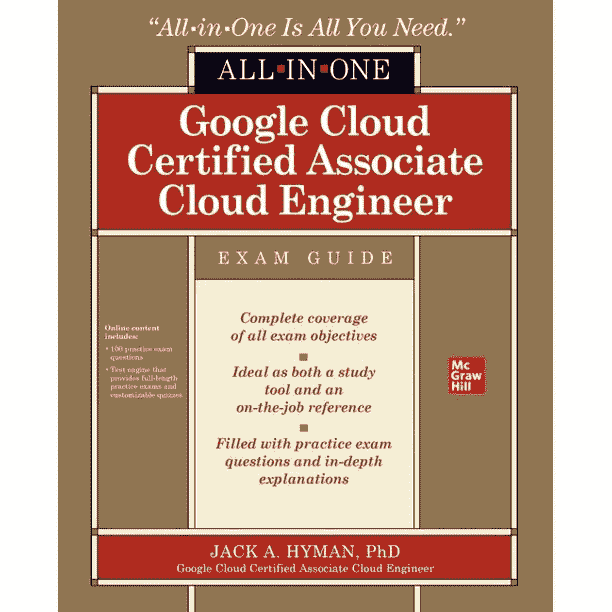
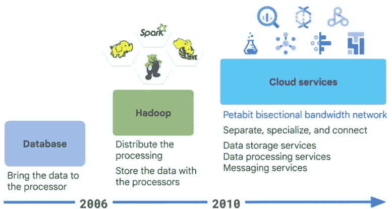
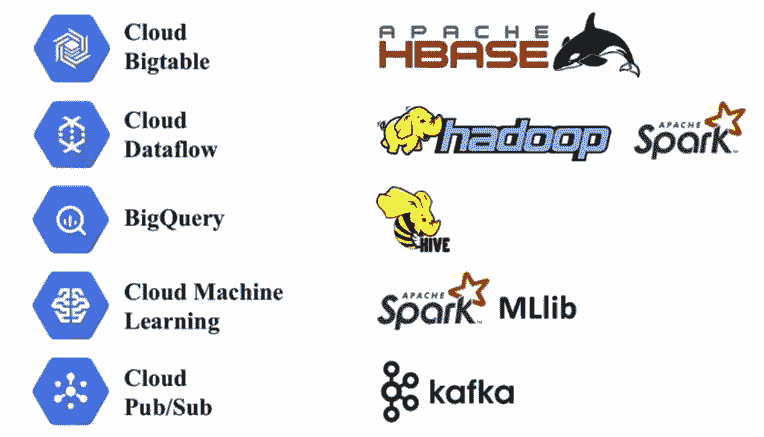

# 我如何成为认证助理云工程师和专业数据工程师

> 原文：<https://blog.devgenius.io/how-i-became-a-certified-associate-cloud-engineer-and-professional-data-engineer-8bf92ae2bab7?source=collection_archive---------7----------------------->

## 在经历了大量的材料之后，这是我推荐用来获得认证的

图片由[米切尔罗](https://unsplash.com/@mitchel3uo)发自 [Unsplash](https://unsplash.com/)

## 目录

*   我的云计算之旅
*   概述和实用信息
*   助理云工程师
*   专业数据工程师

# 我的云计算之旅

我的云之旅始于 2021 年夏天，我开发了一个机器学习模型，我想将其部署到云上。在考虑了我的选择后，我决定选择 [Heroku](https://www.heroku.com/) 。

Heroku 是一个云服务平台，支持简单的应用程序开发和部署。您可以跟随我的脚步，看看我是如何训练模型、开发框架和部署它的。我在这里写了一篇详细的文章[。](https://towardsdatascience.com/complete-guide-on-model-deployment-with-flask-and-heroku-98c87554a6b9)

> 尽管我成功部署了我的模型，但在被德勤聘用之前，我对云服务一无所知。

尽管我成功部署了我的模型，但在被德勤聘用之前，我对云服务一无所知。一个大客户雇佣了我几乎所有的团队成员来从事谷歌云项目。该团队开发了一种先进的机器学习模型，可以帮助检测欺诈性支付。这个模型被部署到 Google Cloud 上，我渴望成为这个项目的一部分。不幸的是，我仍然缺乏知识，所以我决定获得认证。

我是我们部门第一个获得认证的顾问，我用我的考试知识帮助我的同事获得认证。从那以后，我成为了专业的数据工程师，并获得了与不同客户打交道的实际经验。

虽然推荐，你不需要几个月或几年的使用谷歌云平台(GCP)的经验。你需要的只是学习的意愿和合适的材料。所以，年轻的学徒，开始学习吧。

# 概述和实用信息

谷歌提供三种类型的[证书](https://cloud.google.com/certification)，基础、助理和专业。基础是最近推出的，根据谷歌的说法，它不需要任何技术先决条件。助理的推荐经验是 6 个月以上，专业的推荐经验是 3 年以上。虽然我不同意这些数字，但它确实有助于使用这个平台。

图片由[谷歌](https://blogs.sap.com/2021/09/11/get-certified-google-cloud-digital-leader/)

## 考试

在深入研究特定证书之前，让我们先了解一下设置，所有证书都是一样的:

*   你有 50 道选择题
*   你有两个小时
*   你必须有 80%的正确率(非官方)
*   没有负面标记(猜总比没有好)
*   你可以远程或现场参加考试
*   考试结束时，你只能得到“及格”或“不及格”
*   你不能随身携带任何材料或笔记
*   在提交之前，您可以“标记”问题以供审查
*   证书有效期只有两年
*   证书可以在到期前六个月更新
*   考试后 1-5 天你会收到证书

基础证书的费用是 99 美元，助理证书是 125 美元，专业证书是 200 美元。我建议用你的工作来支付。

你通过[网络评估员](https://www.webassessor.com/)预约考试。我个人更喜欢现场考试，因为我不必担心在开始前失去互联网连接或向考官展示我的房间。

# 助理云工程师

根据谷歌的说法，云工程师助理(ACE)会做以下工作:

> 助理云工程师部署应用程序、监控运营和管理企业解决方案。他们使用谷歌云控制台和命令行界面来执行常见的基于平台的任务，以维护一个或多个部署的解决方案，这些解决方案利用谷歌云上的谷歌管理或自我管理的服务[ [来源](https://cloud.google.com/certification/cloud-engineer) ]。

定义或描述很宽泛，但说实话，这是一个很宽泛的证明。与专业证书不同，你必须具备从网络架构到在 Kubernetes 上部署容器以及在大多数服务上设置权限访问的知识。

> 参加了两次考试，我真的相信 ACE 比 professional 更难。

参加了两次考试，我真的相信 ACE 比 professional 更难。原因是一切对我来说都是新的。除此之外，我花更多的时间浏览培训材料，为考试做足准备。ACE 中引入的许多概念和服务都建立在专业证书的基础上，这使得它更容易理解。

## 考试科目

ACE 考试的官方大纲可以在[这里](https://cloud.google.com/certification/guides/cloud-engineer)找到。总体主题涵盖身份和访问管理、计费、网络、计算和存储。根据我的经验，以下几点应该很好理解(列表并不互相排斥):

*   **身份和访问管理(IAM)** :研究原始角色、预定义角色和定制角色之间的区别。角色、权限和绑定的区别。每个服务都有一组预定义权限。这些名字经常重复出现(查看者、开发者、管理员等等。);试着知道它们的区别，因为记住每一个都是不切实际的。
*   **虚拟专用云(VPC)** :关于 VPC、子网和 IP 地址的话题在考试中很常见。他们特别喜欢关于共享项目的问题(即不同 VPC 中需要共享资源的项目)。
*   **计算引擎(GCE)** :通过创建实例、实例模板和从快照中恢复实例来使用 GCE。除此之外，让自己熟悉可抢占的机器、单独租户节点、虚拟机管理器和负载平衡。
*   App Engine (GAE) :当开发者在 App Engine 上构建时，他们将实现一个包含四个组件的解决方案:应用、服务、版本和实例。除了差异之外，您还应该重点了解流量分配。假设你上传了一个新版本，你如何将流量从转移到新版本？您可以运行什么命令？你如何在不同版本之间分配流量？
*   **云函数(GCF)** :想到事件，就想到 GCF。事件可以是当文件被上传到云存储时，云功能可以被触发以将文件转换为不同的格式。
*   **Cloud Run (GCR)** :我的建议是使用 flask 构建一个简单的“Hello World”脚本，将其容器化并部署在 Cloud Run 上。GAE 和 GCR 的账单有明显的不同，你应该知道这一点。
*   Kubernetes(GKE):ACE 考试中所有服务之母是 GKE。这需要深入的研究。您应该熟悉了解什么是集群，以及节点、对象、工作负载、pod、replicaset、statefulset 和 daemonset。然后，您继续学习三种类型的服务:集群 IP、负载平衡器和节点端口。最后但同样重要的是，了解入口和出口之间的区别(入口是进入 pod 的流量，出口是从 pod 流出的流量)。
*   **云存储**:有四种存储类别:标准、近线、冷线和存档。你会被问到这个问题，这是没有办法的。了解什么是 bucket，在哪里创建它，以及如何实现对象的生命周期管理将会让你走得更远。
*   **云 SQL/Spanner** :如果数据库对你来说是新的，那么读一下关系数据库以及什么时候不要使用它们(NoSQL)。
*   **CMD** :仅仅知道如何在控制台中操作是不够的。您应该熟悉 Cloud Shell 中使用的命令行界面。

## 材料

**网络课程**:要边做边学，不妨向最优秀的学习。我指的是 Ranga Karanam，他在 [udemy](https://www.udemy.com/course/google-cloud-certification-associate-cloud-engineer/) 上开设了以下课程。每当他展示某样东西时，也做同样的动作。跟着重复他的动作。沿途记笔记，你不可能记住所有的东西；简直太多了。我确实建议把速度设置在 1.25 倍，甚至在某些视频中设置为 1.5 倍。

作者图片

**书**:除了课程，我选择买了杰克·海曼([亚马逊](https://www.amazon.com/Google-Cloud-Certified-Associate-Engineer/dp/1260473457))写的《谷歌云认证助理云工程师全合一考试指南》。

作者图片

这本书很好，但更好的是附带的在线内容。100 道模拟试题让我受益匪浅。它们为您提供了必要的视角，让您了解与特定服务相关的问题是如何形成的。

# 专业数据工程师

根据谷歌的说法，专业数据工程师(PDE)会做以下工作:

> 专业数据工程师通过收集、转换和发布数据来实现数据驱动的决策。数据工程师应能够设计、构建、操作、保护和监控数据处理系统，特别强调安全性和合规性；可扩展性和效率；可靠性和保真度；以及灵活性和便携性。数据工程师还应该能够利用、部署和持续训练预先存在的机器学习模型[ [来源](https://cloud.google.com/certification/data-engineer) ]。

如果我换一种说法，我会说 PDE 集的管道执行数据的提取、转换和加载(ETL)。不像 ACE 那样关注广泛的服务，PDE 要求您关注少数几个服务。

## 考试科目

PDE 考试的官方大纲可以在这里找到。PDE 考试的主要重点是测试您是否理解了为什么以及如何从 Apache Hadoop 生态系统过渡到 Google Cloud。我建议从研究大数据的历史开始([傻瓜大数据](https://jan.newmarch.name/IoT/BigData/Big%20Data%20For%20Dummies.pdf))。

谷歌在 2004 年推出了 MapReduce，在 2006 年推出了 Hadoop 生态系统。自那以后发生了很多事情，现在每项服务都可以被谷歌的产品取代。

根据我的经验，应该很好地理解以下服务(该列表并不相互排斥):

*   **BigQuery (BQ)** :每当你读 BigQuery 的时候，你都要想到分区和集群。记住 BQ 是以分析为目的的数据仓库。虽然可能，但是表的频繁更新在 Cloud SQL/Spanner 中处理得更好。
*   **BigTable** :了解 BigTable 模式设计。处理时序数据需要一个又高又窄的模式。除了模式设计，还要了解如何提高性能以及如何防止热点。
*   **云存储**:无论你有原始数据还是转换后的数据，云存储都可以作为数据湖或最终目的地。在 PDE 环境中，云存储被用来替代 HDFS。虽然，当速度是优先考虑的时候，HDFS 应该被使用。
*   **云 SQL/Spanner** :与 BigQuery 不同，云 SQL 和云 Spanner 用于事务性处理。您需要了解在 Cloud Spanner 中处理热点的推荐实践。除此之外，记住 Cloud Spanner 是谷歌云平台(GCP)上最贵的服务，所以只要有可能，就用 Cloud SQL。
*   **数据流**:这是主要管道，用作云发布/订阅和 BigQuery 或云存储之间的中介。数据流用于转换数据，可用于批处理和流式数据。
*   **Dataproc** :假设一个客户想把他们的 Apache Hadoop 生态系统或者 Apache Spark 迁移到云上，那么考虑 Dataproc。虽然 HDFS 是可用的，但谷歌测试你是否知道何时以及何时不使用云存储作为替代。可能会出现关于隔离的 Dataproc 服务(即没有互联网连接)以及在这种情况下如何添加 ad-on 的问题。
*   **Dataprep** :这是伪装的数据流；唯一的区别是你不需要编码技能。您可以使用图形用户界面执行转换。这对于非技术受众来说是显而易见的，并且具有一些有用的自动功能(从云发布/订阅中删除重复)。
*   **Pub/Sub** :这是阿帕奇卡夫卡的替代品，但是你要知道阿帕奇卡夫卡还是更高级的。我甚至得到了一个正确答案是阿帕奇卡夫卡的问题。云发布/订阅的目的是接收批处理或流数据，并将其移交给任何需要它的人(data proc/data flow/Cloud Storage/big query/…)。
*   **云作曲**:需要管理多条管道；想想 Cloud Composer，它取代了 Apache Airflow。
*   **数据传输**:每当客户有太多数据需要从内部传输到云时，就考虑传输设备。如果客户需要从其他云提供商(AWS)转移数据，可以考虑存储转移服务。

## 材料

**在线课程**:我通过 [Coursera 专门针对 PDE 的课程](https://www.coursera.org/professional-certificates/gcp-data-engineering?utm_source=gg&utm_medium=sem&utm_content=01-CatalogDSA-ML2-US&campaignid=12490862811&adgroupid=119269357576&device=c&keyword=&matchtype=&network=g&devicemodel=&adpostion=&creativeid=503940597764&hide_mobile_promo&gclid=CjwKCAjw46CVBhB1EiwAgy6M4m-o-c7BB9KZtid3HuDi_i-h4CVroxtYuaeztO8WdCX4MSJcLlbohRoC6QEQAvD_BwE)接触到了数据工程的世界。本课程包括下列六门辅修课程:

1.  谷歌云大数据和机器学习基础
2.  使用谷歌云实现数据湖和数据仓库的现代化
3.  在 GCP 上构建批量数据管道
4.  在谷歌云上构建弹性流分析系统
5.  GCP 的智能分析、机器学习和人工智能
6.  准备谷歌云专业数据工程师考试

视觉演示和数据实验室是一种很好的方式，可以让你在使用这些服务时感到舒适。尽管如此，我必须承认一些数据实验室有点不必要或者没有帮助，因为代码已经提供了，只需要运行它。

**在线问题**:我可以推荐的最重要的材料是在 [SkillCertpro](https://skillcertpro.com/) 上找到的，在那里你可以找到相关的考试并购买大量考试问题的访问权限。所提供的例子是相关的、艰难的和有益的。

书:我还设法买到了丹·沙利文的《谷歌云认证专业数据工程师学习指南》。这本书很浪费钱，网上的问题也太容易了。

我希望你像我喜欢写这篇文章一样喜欢它。如果您有任何意见或问题，请随时发表评论。数据科学社区给了我很多，所以我总是乐于回馈。

请随时在 Linkedin[上与我联系，并在 Medium 上关注我以接收更多文章。](https://www.linkedin.com/in/tarekghanoum/)