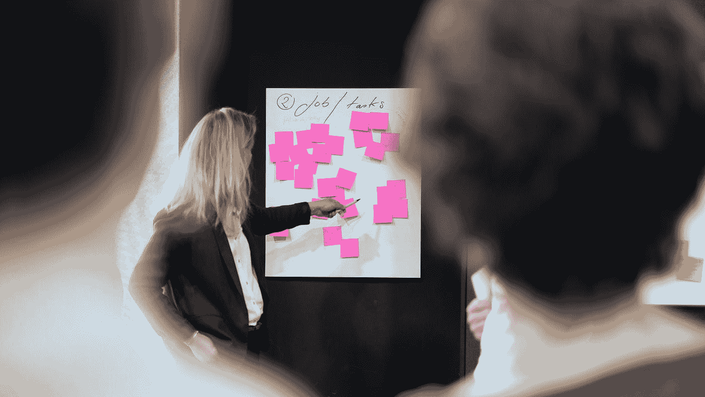

# 我如何成为产品所有者，以及如何让它为我所用

> 原文：<https://blog.devgenius.io/how-i-became-a-product-owner-3812e5421549?source=collection_archive---------30----------------------->

邦内瓦尔·塞巴斯蒂安在 [Unsplash](https://unsplash.com?utm_source=medium&utm_medium=referral) 上拍摄的照片

我可能不是第一个，也不会是最后一个说“我没有充分利用我的大学学位”的人。事实上，它帮助我的唯一方式是证明我参加了更高层次的教育。

## 背景

我学的是电视制作和技术，你可能会想……这和做产品负责人有什么关系？别担心，我不会怪你那样想。我不时地坐下来思考我是如何走到这一步的？是运气吗？辛苦？还是两者兼而有之？

就我个人而言，我倾向于认为这是两者的混合。大约四年半前，我开始在一家软件开发公司工作，最初是一名客户经理。这个角色让我与来自世界各地的众多客户一起工作。

然后，我不仅开始了解我们的产品，还开始了解我们目标行业的技术细节。我获得了如此多的知识，以至于当公司用 Scrum 从瀑布模式过渡到敏捷模式时，我很自然地成为了产品负责人……剩下的就是历史了。

## 产品负责人对我意味着什么？

对我来说，产品负责人的角色可能与你看到的或做的不同。我倾向于认为，不管设定的职责是什么，你总是会在某种程度上融入其中。重要的是你知道在哪里画这条线，它成为公司目标和你个人发展计划之间的一个组成部分。

对我来说，产品所有者包含许多要素，我发现这些要素包括:

*   与外部合作伙伴一起提供协作项目。
*   为现有客户或潜在客户举办网络研讨会。这有助于展示产品功能，这些功能可能会引发关于每个客户希望您如何使用这些功能的争议。
*   与内部利益相关者合作，建立 MVP(最低可行产品)或用产品路线图对未来进行前瞻性规划。
*   不断尝试从当前或最近的发展中寻找机会来缩短或关闭反馈循环。
*   主动管理待办事项、预先计划的 sprint 和当前 sprint，以确保当前或计划的工作按照产品路线图或客户项目计划按时完成。

这个清单真的很长，但是这些是我在 scrum 团队中工作的每一天都要牢记的要点。

## 我是如何让它为我工作的？

一开始，我有很多关于成为产品所有者的问题。我发现自己在阅读敏捷和 Scrum 方面的书籍，以便让事情运转起来。今年早些时候，我参加了一个会议，与会者来自世界各地。我发现这个活动非常有用，因为我可以和志同道合的人交谈，他们和我面临着相似的困境。

也有培训课程和资格，你可以获得进一步的学习和理解。这不仅有利于你，也有利于你决定在 Scrum 中工作的公司。CSPO(认证 Scrum 产品负责人)可能是你想要开始的地方。它提供了清晰和基本的理解，让你知道如何更好地记录用户故事，以获得更好的整体收益。

如果你想了解更多关于我和作为一个产品所有者的信息，请告诉我，因为我有很多关于定义的工作方式的话可以帮助你的日常工作。