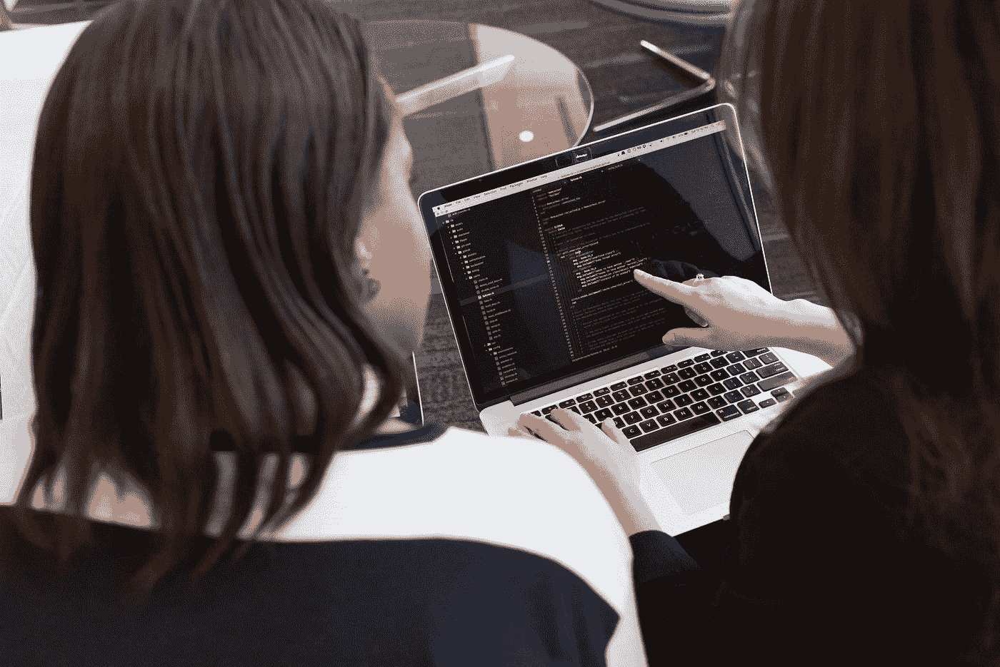
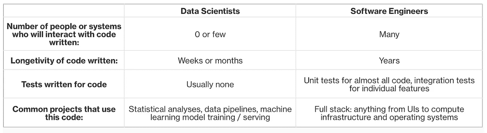

# 从事数据科学 5 年后，我如何成为一名软件工程师

> 原文：<https://blog.devgenius.io/how-i-became-a-software-engineer-after-5-years-in-data-science-e0c56b872257?source=collection_archive---------0----------------------->

克里斯蒂娜@ wocintechchat.com 在 [Unsplash](https://unsplash.com?utm_source=medium&utm_medium=referral) 上的照片

👋你好。我是扎克里。我分享我的职业转换经验，以防它能帮助其他数据科学家规划他们自己的职业。

# 为什么要从数据科学转向软件工程？🤔

我真的很享受作为数据科学家的生活。事实上，如果我在职业生涯的后期再次进入数据科学领域，我不会感到惊讶。也就是说，有几个想法驱使我探索在其他地方发展我的技能:

*   **我已经完成了大多数典型的数据科学项目:**这包括实验、指标设计、回归分析等。作为一名数据科学家，我的大部分新项目都类似于过去的工作。
*   **我认为专业知识的交叉是有价值的:**对于职业发展来说，许多人都提出了“T 型人”的想法。t 型职业者可以处理多种任务，但只擅长一种。我会比这更进一步，提倡在两件事上有深厚专长的人。这两种技能的结合通常被证明是非常有价值的。我已经有了深厚的数据科学知识，所以我去寻找一个相邻的技能技能集。
*   **职业生涯早期是培养技术技能的好时机:**人们在职业生涯早期往往有更多时间专注于培养技能，如统计分析或软件工程。尤其是在疫情期间坐在家里，我觉得我仍然有足够的带宽来学习新的技能。

在大型科技公司，产品经理和软件工程师都推动产品开发。我想调查这两种可能的职业选择。为了在两者之间做出选择，我做了详细的笔记，同时完成了对朋友和同事的信息采访。这些对话回答了我关于这两个工作角色的问题，并最终将软件工程确定为我的下一步。

# 转到工程专业是什么样子的？🔀

我走了一条非传统的道路去扮演软件工程师的角色。在参加了一个工程训练营并在工作中创建了一个工程项目组合后，我换了工作。这个工程组合帮助我向公司的招聘经理证明了我的能力。整个过程耗时一年左右，不涉及工程面试。

# ✨需要新的软件工程技能

数据分析师花很多时间写代码。然而，这些代码与软件工程师编写的代码在几个关键方面有所不同，如下表所示:

我确实发展了我的技能，成为了一名工程师。随着时间的推移，我学会了编写和维护许多人会与之交互的代码。作为一名数据科学家，我的大部分代码都存在于 [Colabs](https://colab.research.google.com/) 和 SQL 脚本中，只有在进行分析时我才会查看。

为了实现这一目标，我参加了为期 6 个月的工程训练营。在注册期间，我在周五全天上课，这是一个 20%的项目。[这是一份文件](https://docs.google.com/document/d/1kOzpbh7WFxrcj04_6KjL9Kw9cyqRtxUqWOnYz8lvAVo/edit?usp=sharing)，列出了我们讨论的主题。顺便提一下，这份名单类似于 Airbnb 数据工程师扎克·威尔森[在 Linkedin](https://www.linkedin.com/posts/eczachly_softwareengineering-activity-6959571816235368448-XYuE/) 上发布的一份名单。

我的主要收获是，成为一名软件工程师不仅仅意味着学习如何用 Java 或 C++编程。事实上，虽然学习个别语言很重要，但软件工程实际上是一整套独立于语言的技能和实践。有许多核心工程主题，如依赖注入、持续集成和异步代码，数据科学家从未真正遇到过。

# 建立投资组合🗂

这可以让职业转换更容易。对我来说，我的投资组合有三个来源:

1.  **数据科学项目:**如前所述，许多数据科学家已经拥有创建数据管道或服务机器学习模型的经验。将这些添加到你的文件夹中。
2.  **工程 bootcamp 项目:**作为 bootcamp 作业的一部分，我们搭建了一个玩具 web app。对应用程序的添加经历了典型的代码审查过程。这使我们能够应用在课堂上学到的技能，同时也增加了我们的投资组合。
3.  **软件工程轮岗:**训练营结束后，我在一个团队完成了为期六个月的轮岗，这个团队有兴趣聘请我担任软件工程师。在那段时间里，我能够用 C++和 Java 做项目，比如:

*   关闭一个功能
*   向入职流程添加屏幕
*   为边缘情况修改认证系统
*   将新数据源的 API 集成到现有要素中

轮岗之后，我的管理链审查了我的投资组合，给我开了绿灯，让我成为全职工程师。

# 工程与数据科学:我喜欢和不喜欢⚖️的什么

软件工程肯定在某些领域胜过数据科学。我特别喜欢没有电子邮件和会议。几乎每天我都有很长的时间来解决技术问题。我发现对我所拥有或熟悉的代码库进行增量式的修改非常令人满意。在我目前的职位上，很少有硬性的中间交付期限。作为一名数据分析师，我们总是有季度报告和其他分析的截止日期。正如所料，培养新的技能是我喜欢这个角色的另一个原因。

另一方面，软件工程项目比数据科学项目进展缓慢。作为一名软件工程师，我每个季度最多能做几个项目。在同一时间段，我翻阅了许多数据分析。作为软件工程师的一些日子包括繁重的上下文切换，因为集成测试可能需要很长时间。理想情况下，当这种情况发生时，我会尝试做其他项目。上下文切换通常很困难，所以我希望这种情况少一些。

我确实怀念数据科学对影响的宽泛定义。它可能包括工程交付成果，如数据集、仪表板、机器学习模型或战略交付成果，如重点分析。新的软件工程师几乎完全专注于设计和提交代码。作为工作的一部分，数据分析师必须与产品和工程负责人交流。作为一名工程师，我仍然这样做，但如果我停止，这不会影响我的(短期)成功。我真的很尊重数据科学如何借鉴各种学科，如统计学、机器学习和管理咨询。从事数据科学的人的背景也反映了这种多样性。

# 我如何不断学习📚

我才刚刚开始我的工程之旅，还有很多东西要学。

在我看来，获得一项新技能的最好方法是在工作中利用这项技能完成一个项目。这就是工作中项目选择如此重要的原因！

工作之外，我很惊讶自己竟然如此赞同工程师 Geregely Orosz 的建议，即通过阅读书籍来提高自己的工程师水平。这绝对不是我作为数据科学家的经历。然而，在阅读了谷歌的[软件工程手册后，我真的更好地理解了我的工作。你可以从我根据这本书制作的这些抽认卡](https://abseil.io/resources/swe-book)中感受到我从[中学到了什么。接下来，我将阅读约翰·奥特的《软件设计哲学》。](https://quizlet.com/749956988/software-engineering-at-google-flashcards/)

我喜欢完成在线课程。也就是说，我希望我在课程中学到的东西和我工作中需要知道的东西之间的重叠更大一些。例如，我的公司有一个开发 Android 应用程序的简化框架。因此，在线 Android 课程包含了许多“需要知道的”细节，但并没有真正帮助我在工作中完成 Android 项目。

2022 年我参加了两个会议:一个是公司内部的 Android 开发者大会，然后是外部的。作为一名工程师，这些会议让我接触到了我成长的各个领域。然而，如果让我再做一次，我会更关注会议的社交价值。做到这一点的一个简单方法是，在演讲者做了一个有趣的演讲后，向他们提出好的问题。

# 在你走之前一些赠品😎

感谢阅读！请[在媒体](https://medium.com/@zachary-thomas)上跟随我，这样我就可以继续制作像这篇文章一样的内容。

根据人们的问题，我可能会写更多关于数据科学和软件工程交叉的文章。欢迎在这里发表评论或在 zthomas.nc@gmail.com 给我发消息。

最后，在疫情期间，我写了两篇与数据科学相关的帖子。请随意查看这些内容，或者与可能觉得有用的朋友分享:

*   [最佳中硬数据分析师 SQL 面试问题](https://quip.com/2gwZArKuWk7W)
*   [设计产品指标的权威指南](https://medium.com/towards-data-science/the-definitive-guide-to-designing-product-metrics-ba5d9e8e07e9)

*感谢爱德华·班纳(Edward Banner)、陈慧敏(Vianna Chan)和杰森·蒋(Jason Chiang)对草稿的反馈🙏🏼*