# 我如何从零开始构建一个基本的 3D 图形引擎

> 原文：<https://blog.devgenius.io/how-i-built-a-basic-3d-graphics-engine-from-scratch-a54df82031f3?source=collection_archive---------0----------------------->

## 在 2D 屏幕上栅格化 3D 空间背后的直觉。

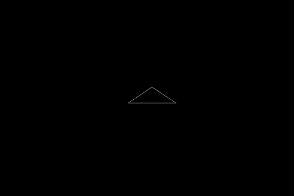

这学期我正在上一门软件设计的课，对于我们的期末项目，课程工作人员给了我们 3-4 周的时间，并告诉我们使用 C++和一个叫做 Cinder 的图形库来制作一些东西。

我认为在 2D 屏幕上构建 3D 空间可视化系统会很酷。

我项目结束时的目标是渲染一个房间内的摄像机，房间由一些白色线条代表，在黑色背景上绘制框架。

我真的不知道这将会有多困难，所以这似乎是这个项目的一个合理的北极星。

我最初的方法，在几乎没有任何先验知识或研究的情况下，是我想出如何渲染垂直和水平线条，然后从这些线条中构建一切。

除了一般的概念，我真的不知道我该怎么做，我想我可能会做光线跟踪，比如为屏幕上的每个像素投射一条光线，无论碰到什么物体，我都会画出来。

这不仅会与我的整个线的想法遇到问题，而且运行循环增加射线，直到它们碰到什么东西，这将是非常繁重的计算。为了弥补这一点，它会限制玩家的视野深度。

我仍然只是对图形系统略知皮毛，我知道随着计算机和图形变得更强大和更优化，光线跟踪变得越来越普遍，但就我的水平而言，这将是大量的工作。

研究了几分钟后，我意识到一个更好的系统是通过三角形来表示一切，然后转换三角形的点，然后画出一切。

这是目前为止的结果。

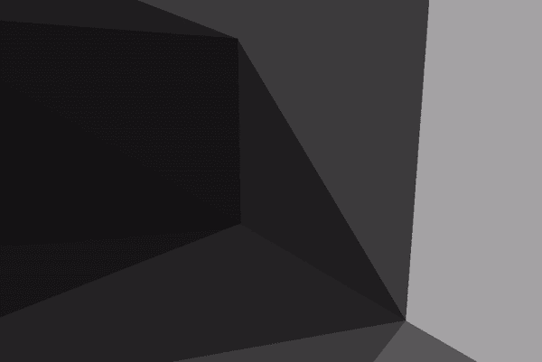

通过一些最小的移动控件，您可以向前、向后、左右移动，以及查看所有基本方向。

当然，第一次并不完全顺利，但是在工作了一段时间后，它按照我预期的方式工作了。

在本文的其余部分，我想展示这实际上是如何工作的。我不会教你如何用 C++编程，甚至不会教你如何用 C++实现这一点，因为这不是本文真正要讨论的。相反，我打算用一种希望有帮助的方式来解释直觉，这样你就能理解这个系统是如何在幕后工作的。然后，如果你想构建它，你可以自己做，并实际学习一些东西，如果你不想构建它，那么你至少会明白这东西是如何工作的，而不用遵循我的代码。

# 目录

*   从 3D 走向 2D 概述
*   线性代数
*   从绝对位置转换到相对位置
*   投影和缩放到图像
*   光栅化到显示窗口

## 从 3D 走向 2D 概述

从 3D 空间到 2D 空间有 3 个步骤，我们将在接下来的章节中更深入地探讨，但是很简单:

1.  你需要得到你的点在绝对空间的位置**相对于你的相机**，或者你的视角。
2.  然后你需要根据深度缩放这些点，并将它们投影到 2D 平面上。
3.  最后，你需要将这些点缩放到屏幕的宽度和高度，并将原点放在左上角，然后绘制所有内容。

所有这些都是通过…

## 线性代数

线性变换！

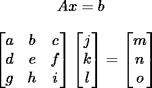

对于每一个变换，我们所做的就是把我们的点乘以一个矩阵。

如果你不知道或不记得如何乘矩阵，你应该去学习它。但基本上，你把第一个矩阵的行和第二个矩阵的列的分量的乘积相加，这就是你的新分量，对应于你使用的行和列的位置。

这是一个计算的例子:

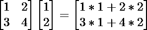

你会注意到，它实际上是所有列的总和。

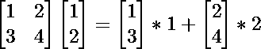

我们意识到，我们转换后的点，实际上就是我们写在变换矩阵的基底，或者列空间中的点。

作为证明，它可能有助于了解如何在我们的正常，单位矩阵的点可以写成同样的形式。

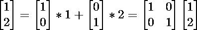

所以要把一个点转换成一个新的基，就像当我们旋转和做所有这些事情的时候，我们实际上只是乘以一个包含这些信息的矩阵。

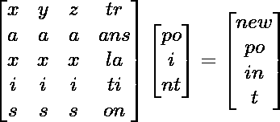

我已经非常简要地介绍了线性变换背后的直觉，足以让你理解这是如何工作的，但要真正学习和理解它，并看到它实际上有多美，我建议看看 [3Blue1Brown 的系列，线性代数的本质](https://www.youtube.com/playlist?list=PLZHQObOWTQDPD3MizzM2xVFitgF8hE_ab)。

还要注意，这是一个 4x4 的矩阵，我们的点是 3x1。基本上，当应用变换时，我假设在点的末端有一个额外的 1，我砍掉矩阵的最后一行，这就变成了一个普通的三维变换，有一个额外的平移。

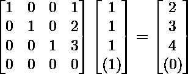

保持法向轴的变换，将一个点平移(1，2，3)。

我将它保存在一个 4x4 的矩阵中，因为将所有信息保存在一个实体中很好。

## 从绝对位置转换到相对位置

因此，我们不希望只是将事物可视化，而是希望在 3d 空间中移动和环视。

为了做到这一点，我们不仅需要知道事物在绝对空间中的位置，还需要知道它们相对于我们的位置，以及我们在看什么方向。

那么我们有什么信息会影响某个物体的相对位置呢？

首先，明确我们自己的立场。

那我们看的是哪个方向？有不同的方法，但我发现使用球坐标是最直观的。

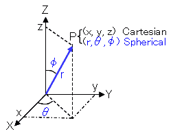

这意味着我们有φ，代表我们的垂直角度，从 0 度向上看，到 180 度向下看。

然后我们有类似θ的东西，代表我们的水平角度，从 x 轴逆时针旋转 360 度。

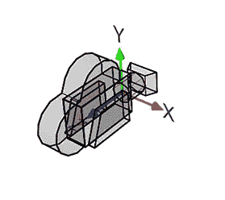

第一轴由您提供，真正使用 MS Paint，相机图像来自[https://www . scratchpapixel . com/lessons/3d-basic-rendering/computing-pixel-coordinates-of-3d-point/mathematics-computing-2d-coordinates-of-3d-points](https://www.scratchapixel.com/lessons/3d-basic-rendering/computing-pixel-coordinates-of-3d-point/mathematics-computing-2d-coordinates-of-3d-points)，另一个很好的资源。注意:在我的系统中，正 z 轴指向远离相机的方向，与图像相反。

还有一件事。

如果我们看三维轴的法线表示，我们看到 z 指向上，而 x 和 y 是“平的”

但是在水平和垂直角度为 0，0 时，如果 y 轴上有一个点，它实际上在我们的左边。所以相对于相机的点 0，1，0 就是-1，0，0。

这种转换是另一种转变。

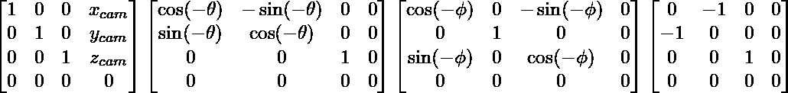

这是我的最后一次变换，将绝对空间中的一个点转换到它相对于我的位置。最后，我们希望执行以下转换。偏移我们的位置，水平旋转(绕 z 轴)，垂直旋转(绕 x 轴)，转换我们的轴。我不会深入解释我是如何得到这些的，但是如果你想自己思考的话，我会把矩阵留给你。此外，试着想想为什么顺序很重要，不仅因为矩阵乘法是如何工作的，而且如果你在水平旋转之前说垂直旋转，变换实际上是如何变化的。

## 投影和缩放到图像

好了，让我们继续。接下来的两个要简单得多，或者至少只有 1 个矩阵，而不是 4 个。

那么，当我们“投射到图像平面”时，我们实际上在做什么呢？就我的目的而言，这是缩放三角形的深度，这样距离越远的东西就越小，然后将其缩放到-1 和 1 之间的空间，通常称为“剪辑空间”，这样我以后就可以轻松地将其缩放到我的显示大小。

这两件事都不是真正的投射，因为投射意味着我们正在摆脱一个维度，但我们实际上并不需要这么做。当我们画到屏幕上时，不管我们的向量是否有第三维度，我们只取 x 和 y 坐标来画，所以它是投影的。

首先，让我们按深度缩放。这其实很容易。将 x 和 y 值除以其 z 值。我们已经转换了我们的坐标轴，这样东西离我们越远，z 值就越大，所以当我们除以它时，值就越小。这将产生赋予事物深度的效果。

然后，我们稍后会想要将 x 和 y 值缩放到我们的显示窗口的宽度和高度，所以现在对我们来说将所有东西缩放到距离我们的原点 0 和 1 之间是很方便的。

为此，我们需要除以 x 和 y 值的最大值。因为我们除以 z，这是比值的最大值。

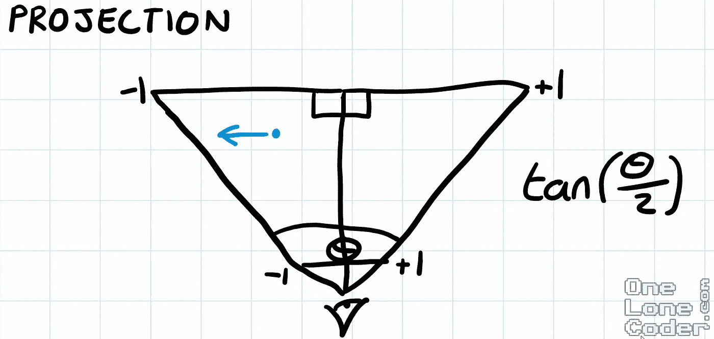

来自[https://youtu.be/ih20l3pJoeU](https://youtu.be/ih20l3pJoeU)的截图——虽然我的系统最终变化很大，但这个视频从一开始就帮助我们在直觉方面有所进展。

为此，我们必须设置垂直轴和水平轴的视角。那么，方便的是，比值就是我们的 x 除以我们的 z 值，它最多是 tan(θ/ 2)。

对于我们设置的视场，无论 x 和 z 值是多少，在我们的视场内，比值的最大值就是这个比值，与相邻值相反。我们的纵轴也是如此。

## 光栅化到显示窗口

所以我又一次撒谎了。光栅化是图像在像素化显示器上的实际绘制，这更多的是面向显示窗口。

这里，对于绝大多数的图形库、程序等，原点在左上角，y 轴指向下。所以法线轴上的点 1，2 应该在显示屏上。

要做到这一点，因为我们方便地将所有内容缩放到-1 和 1 之间，所以我们可以简单地乘以宽度，再乘以高度的负值来反转它。现在我们的图像被缩放了，我们可以通过将它偏移屏幕高度和宽度的一半来平移原点，因为这是原点当前的位置，即中心。

这将把事物画到我们直观想象的非直观显示轴上。

然后砰！一旦你实现了这个系统，画出所有的三角形，并添加一些相机运动，你就有了一个基本的 3D 图形系统。

我还有大约 2 周的时间来继续这个项目，虽然我的演示中肯定隐藏了一些剪辑问题，但我可能会转向一些新的东西。我对自己的进步非常满意，这让我对不久的将来更多的系统编程和/或图形感到兴奋。我觉得我从这个项目中学到了不少东西，我希望通过这篇文章，也许你也有所收获。