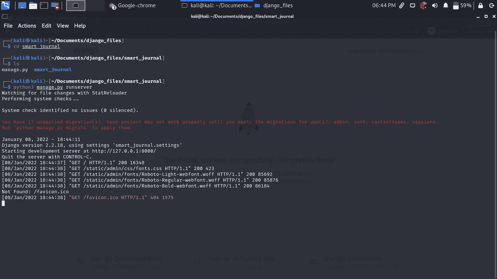

# 我如何在一天之内建立一个基于 django 的画报

> 原文：<https://blog.devgenius.io/how-i-built-a-django-based-pictorial-journal-in-one-day-440f52f9ee0b?source=collection_archive---------11----------------------->

由 unsplash 提供

在本教程中，我将分享一篇基于 django 画报的日记，这篇日记是我在 5 个小时内完成的。

这里有几张最终产品的截图。

这是主页

这是“添加日志”页面。

该日志的一些功能是:

1.  创建日志
2.  删除日志
3.  更新日志
4.  将照片上传到您的日志
5.  在日志中搜索
6.  将日志标记为收藏夹
7.  团体收藏杂志

**要求。**

1.  计算机编程语言
2.  Visual studio 或 pycharm

**安装包**

在这个项目中，我们将需要一些 python 包来开始

1.  姜戈
2.  枕头

要安装这个软件包，请键入 pip3，安装<package name=""></package>

你可以在 [**django**](https://pypi.org/project/Django/) 和[**枕头**](https://pypi.org/project/Pillow/) 找到各自的包

安装了 Django 和 python 之后，现在让我们创建一个 Django 项目。进入你的终端，输入**django-admin start project smart _ journal**smart _ journal 是我给我的项目起的名字，你可以选择自己的名字。通过执行这个命令，将在同一个目录中创建一个名为 **smart_journal** 的文件夹。这个文件夹包含与 Django 为您创建的项目相关的文件。

为了测试这个项目是否工作正常，进入 **smart_journal** 文件夹，打开一个终端，输入**python 3 manage . py runserver**

您的终端应该显示如下内容

我运行**python 3 manage . py runserver**后的终端

之后打开你的浏览器，输入地址[**http://127 . 0 . 0 . 1:8000**](http://127.0.0.1:8000)**，然后按回车键。您应该会看到类似这样的内容**

****

**现在我们的项目运行良好，现在我们需要在 django 中创建另一个应用程序，输入**python 3 manage . py startapp journal****

**执行这个命令后，django 将创建一个名为 **journal** 的文件夹，默认情况下，它会在那里插入一些文件。**

****配置。****

**现在我们需要配置一些东西，然后才能开始项目工作。在 smart_journal 文件夹中，转到 **settings.py** 文件，转到已安装的应用程序行，在已安装的应用程序中添加 **journal** 。**

**将您的应用程序添加到已安装的应用程序后，现在我们需要在 **settings.py** 文件的末尾添加几行，这将使我们能够将文件上传到我们的项目。**

**在 **settings.py** 文件的末尾追加以下几行**

**现在保存文件并移动到 **urls.py** 文件**

**在这里，我们将添加以下几行**

**这里我们在**路径**功能后增加了**包含**功能**。然后我们包括 **if 设置。调试**语句，帮助我们定位用户上传的媒体文件。****

**我们还定义了日志应用的路径。**

****创建文件夹和文件****

**接下来我们来看看我们的日志应用。在这里，我们将创建几个文件夹和文件，然后再继续。在 journal 文件夹内创建一个名为 **templates 的文件夹，**在 templates 文件夹内创建另一个名为 **journal 的文件夹，**在 journal 文件夹内创建以下文件；**base.html，create.html，journal_detail.html，listjournals.html，detail.html，search.html，delete.html，create.html。****

****

**在日志文件夹中创建一个静态文件夹，并从这个 [**链接**](https://github.com/bunnythecompiler/smart_journal/tree/master/journal/static) **中添加以下文件。它们是 css 和 javascript 库，可以帮助我们不用上线就有一个很好的引导主题。****

**现在移动到 **models.py** 文件。在这里，我们将为应用程序制作模型。**

**添加以下详细信息。**

**在这里的 **models.py** 中，我们已经创建了一个继承自 models.Model 的类 Journal。我们正在创建的日志需要有作者、日志的标题、日志的内容、标记日志的常用按钮、日志创建的日期。然后，我们有一个照片领域，我们将上传我们的照片。将这些行添加到 **models.py** 后，保存并运行以下命令。**python 3 manage . py make migrations**该命令执行完毕后，还要运行 **python manage.py migrate。**这些命令自动创建一个表日志，并将这些项目添加到数据库中。**

**现在我们需要在与 **models.py 相同的目录下创建一个文件 **forms.py** 。**在 forms.py 中添加以下内容，**

**这里我们从 django 导入了表格，我们也从 **models.py** 文件导入了日志模型。**

**然后我们创建了一个继承自 forms.Model 的类 **JournalForm** 。**

**我们只想显示在**字段**变量中定义的字段。**

****创造功能。****

**现在我们想创建一个创建功能，在这里我们创建一个日志。转到**视图。py** 添加以下行。**

**这里我们创建一个 create_journal 函数，它将从 create.html 模板中请求数据并保存它，然后将其重定向到我们稍后将创建的 listjournals 视图。现在让我们将下面几行添加到我们之前创建的 create.html 文件中。**

**这是我们的**create.html**模板，它继承了**base.html**文件的样式。我们用 post 方法创建了一个表单，并添加了一个 **enctype** 来指定发送的数据在提交到服务器时应该进行编码。然后我们添加一个 **csrf_token** ，它将防止跨站点请求伪造攻击。然后我们传递我们的 **form.as_p** 标签，这个标签将呈现我们的表单，并将其样式化为一个段落。这就是创建功能。**

****列出已创建的日记账功能。****

**现在我们将创建**列表所有**功能，我们将使用它来显示所有创建的日志。在 **views.py** 文件中添加以下几行。**

**这里我们创建了一个函数 **listjournals** ，它将查询数据库中的所有期刊，并在**listjournals.html**模板中显示它们。我们创建了一个对象 **all** ，它将从日志表中获取所有数据，然后我们将该对象传递给**listjournals.html**模板。**

**为了显示结果，这里是**listjournals.html**模板。**

**这里我们显示日志的内容，如果日志是作为收藏夹创建的，我们还会在它上面添加一个收藏夹标签按钮。**

****列出喜爱的期刊功能****

**我们将创建一个基于类别的视图，该视图将只列出具有最喜欢的标签的期刊。**

**我们已经包括了一个计数功能，将计算最喜爱的杂志的数量。**

**现在让我们展示你最喜欢的杂志。这是模板**

****让我们创建一个搜索功能**来搜索我们的日志。首先，让我们创建一个搜索视图。**

**在上面的搜索功能中，我们通过期刊的标题来查询数据库。**

**现在让我们创建一个搜索模板，我们将在其中输入我们的搜索查询并显示结果。**

**这里我们创建一个表单，用于输入查询。然后我们提交它，它被查询，结果被发送回模板。然后，我们使用 for 循环迭代结果并显示它们。这就是所有的搜索功能。接下来，我们转到详细视图功能。**

****详细视图功能****

**现在我们将创建详细视图。**

**这里我们创建了一个函数，它接受一个参数 id，也就是您想要查看其完整细节的当前文章的 id。我们将该特定 id 的内容呈现到我们的细节模板中。这是模板。**

**接下来，我们转到更新功能。**

****日志更新功能****

**让我们在**视图. py** 文件中创建一个更新函数。这将有助于我们编辑我们的日志。**

**这里我们创建一个更新函数。该函数接受一个参数 **id** ，它是您想要更新的日志的 **id** 。让我们创建一个更新模板。**

****让我们创建一个删除功能。****

**这是删除视图。**

**这是删除功能的模板。**

**现在让我们为我们的应用程序创建路线。在 **urls.py** 文件中添加以下代码行。**

**在这里的 **urls.py** 文件中，我们定义了各种视图的路径。现在让我们启动我们的应用程序。如果在 linux 上，键入**python 3 manage . py runserver**，如果在 windows 上，键入**python manage . py runserver**。现在打开你最喜欢的浏览器，输入以下网址[**http://127 . 0 . 0 . 1:8000/list journals**](http://127.0.0.1:8000/listjournals)**

**这将显示我们创建的所有日志。这是我的日志截图。**

****

**我创建了一个漂亮的导航条，方便导航。**

****

**创建日志**

****

**收藏夹功能**

****

**搜索功能**

**本教程到此为止。要获得这个项目的源代码，请在这里查看我的 github [**。**](https://github.com/bunnythecompiler/smart_journal/tree/master) 感谢阅读。**