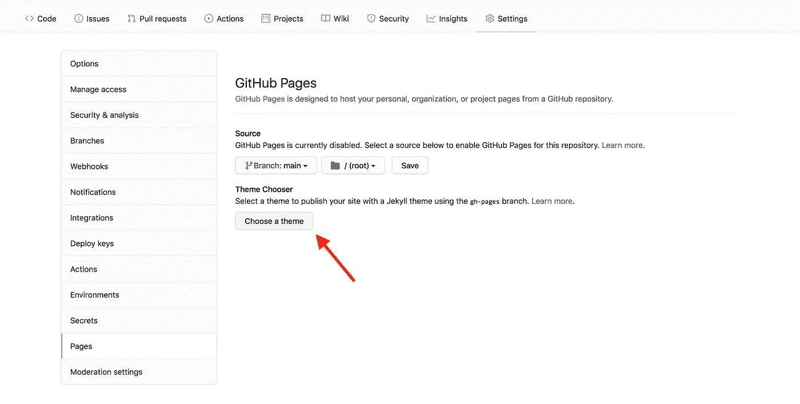

# 我如何建立和部署我的第一个开源 NPM 图书馆

> 原文：<https://blog.devgenius.io/how-i-built-and-deployed-my-first-open-source-npm-library-6247a5217f23?source=collection_archive---------18----------------------->


# 概观

如果你用 Javascript 开发应用程序，我相信你已经用 NPM 安装了很多帮助你构建应用程序的库。今天，我将向您概述开发您自己的 NPM 图书馆是什么样子，以及如何使用 Github 来管理发布、文档和标签。

# 入门指南

首先，在开发你自己的开源 NPM 库之前，你需要确定你正在构建的东西是否对其他开发者有帮助。

例如，当确定我应该首先构建什么时，我发现几乎没有用于 CircleCI V2 API 的 SDK，也没有用于带有类型声明的 Javascript 的 SDK。这让我在 Typescript 中为 API 构建了一个 SDK，支持浏览器和 NodeJS。

# 最佳实践

## 测试

为了防止尽可能多的错误，在你的库中有广泛的测试覆盖是很重要的。如果您正在进行像我的库这样的 API 调用，模拟是非常有用的，因为它消除了对第三方的依赖，并且纯粹测试您代码的功能。下面是我编写的一个模拟 Axios GET API 调用的测试示例:

使用 [Jest](https://jestjs.io/docs/getting-started) ，我模拟了 Axios 库。然后在测试组中，在运行每个测试之前，我实例化了我的 SDK 的一个新客户端。在测试中，我模拟 get 调用的返回值，然后调用我的 SDK，并期望响应是我模拟的数据。

## 证明文件

文档对于开源库尤其重要，因为用户需要知道如何安装和使用它们。我个人在我的项目中使用了 [TypeDoc](https://typedoc.org/) 来自动生成我在代码中包含的描述和类型的文档。

# 准备发布

一旦你写好了所有的代码，有了广泛的测试覆盖面，并且包括了你的库的文档，如果你还没有的话，我们可以在你的代码库中添加一些东西，这将使你的库的使用和部署更加容易。

## 代码捆绑

捆绑本质上是将多个文件中所有导出的代码和依赖项编译成一个文件，而不需要格式化或空白来减小文件大小。您可以拥有针对不同环境的包，例如浏览器和/或节点。这也意味着用户可以从根目录导入你的所有代码，而不必指定目录。

不捆绑

```
import { Hello } from '@hello/package/src/components/hello'
```

带捆绑

```
import { Hello } from '@hello/package'
```

我个人使用 [Rollup](https://rollupjs.org/guide/en/) 来捆绑我的代码，因为它有一个庞大的插件生态系统，并且在 NPM 图书馆中非常流行。关于使用 Rollup 的更详细的解释，我推荐阅读 [Craig Buckler](https://medium.com/u/b05da89e13a3?source=post_page-----6247a5217f23--------------------------------) 的[a Introduction to the roll up . js JavaScript Bundler](https://www.sitepoint.com/rollup-javascript-bundler-introduction/)。

## 林挺

林挺有助于识别错误和增加代码的一致性。我个人使用 [ESLint](https://eslint.org/) ，因为它能持续发现错误，自动修复常见问题，并支持自定义规则和使用 Airbnb 和 Google 等公司的配置。

# 放

现在我们准备将我们的图书馆开放给 NPM。我将向您展示我如何使用语义版本化和自动化将我的库发布到 NPM，将文档发布到 Github pages。

## 版本控制

大多数开源库使用语义版本控制来保持版本的一致性和易于理解。本质上，根据语义版本控制:

> 进行不兼容的 API 更改时的主要版本(例如，从 1.0.0 到 2.0.0)
> 
> 以向后兼容的方式添加功能时的次要版本(例如 1.0.0 到 1.1.0)
> 
> 进行向后兼容的错误修复时的补丁版本(例如 1.0.0 到 1.0.1)

来源:[语义](https://semver.org/)

NPM 有内置的命令，使您能够增加版本。以下是可用的命令和选项:

```
npm version [<newversion> | major | minor | patch | premajor | preminor | prepatch | prerelease [--preid=<prerelease-id>] | from-git]
```

运行时，`package.json`、`package-lock.json`、`npm-shrinkwrap.json`(如果存在)将被更新为新版本。

## 自动化

我使用 Github 动作来自动化发布我的 npm 库和将文档部署到 Github 页面的过程。我将分解我建立的工作流程，将我的库发布到 NPM。

## 事件

动作需要一个事件来触发工作流。在第 3–7 行中，您可以看到我的工作流是如何被推送到主分支或工作流分派(从 UI 手动运行)触发的。更多活动列表，请参见[此处](https://docs.github.com/en/actions/using-workflows/events-that-trigger-workflows)。

## 乔布斯

作业定义了工作流中运行的各个步骤，它们可以相互依赖。例如，部署作业(第 21 行)依赖于测试作业(第 10 行)。如果测试失败，我们就不想部署，对吗？我定义的工作如下:

**测试作业:**测试作业配置节点并运行两个命令来安装依赖项和运行测试脚本。

**部署作业:**部署作业配置节点、安装依赖项、配置注册表 URL，并将我的包发布到具有公共访问权限的 NPM。我还在环境变量中添加了一个名为 NPM 令牌的秘密来验证我的发布请求。千万不要直接把秘密粘贴到动作里。[以下是如何在 Github 中创建一个加密的秘密。](https://docs.github.com/en/actions/security-guides/encrypted-secrets)

**Docs 作业:**Docs 作业配置节点，安装依赖项，使用 [TypeDoc](https://typedoc.org/) 构建 Docs 文件夹，并使用第三方库将生成的文件夹部署到 gh-pages 分支上。以下是如何在 Github repo 上启用 docs。



来源:[图书馆木工](https://librarycarpentry.org/lc-git/05-github-pages/index.html)

# 最后的步骤

既然我们已经向 NPM 发布了我们的库，我们可以在 Github 中创建一个发布和标记。

## Github 发布

Github 中的版本可以用来通知用户新版本和对库的更改。标签是与包含特定时间点的存储库源代码的发布一起创建的。[以下是如何在 Github 中创建发布和标签。](https://docs.github.com/en/repositories/releasing-projects-on-github/managing-releases-in-a-repository#creating-a-release)

就是这样！我希望我发布第一个 NPM 图书馆的旅程能帮助你发布你自己的图书馆。请随意查看我的开源库，并分享您对库或文章的任何反馈！

[](https://github.com/jithenshriyan/circleci-v2-sdk) [## GitHub-jithenshriyan/circle ci-v2-SDK:circle ci V2 API 的 Typescript SDK

### 浏览器和 Node.js 的 Typescript circle ci V2 SDK @ Ji then/circle ci-v2-SDK 包集成了管道…

github.com](https://github.com/jithenshriyan/circleci-v2-sdk)