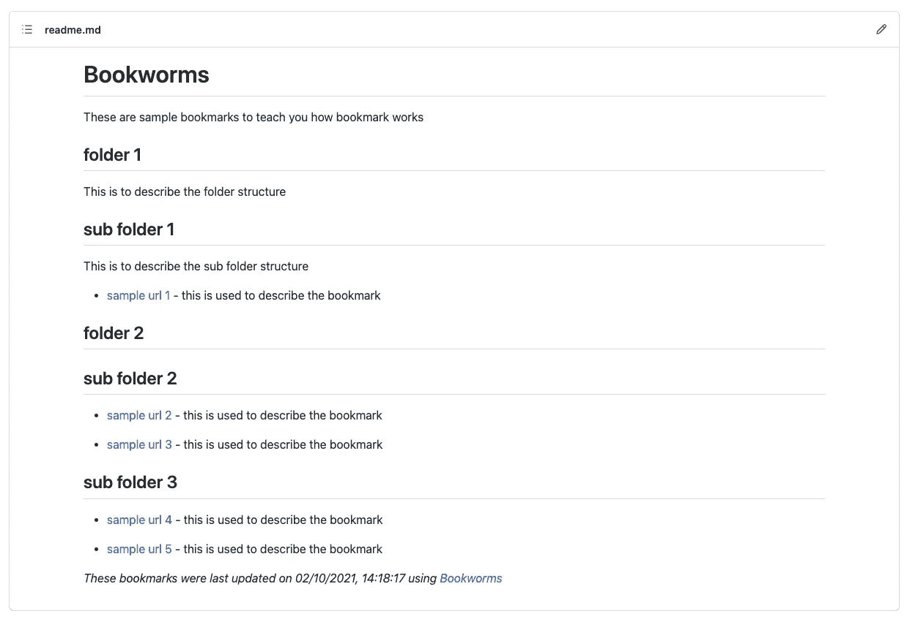
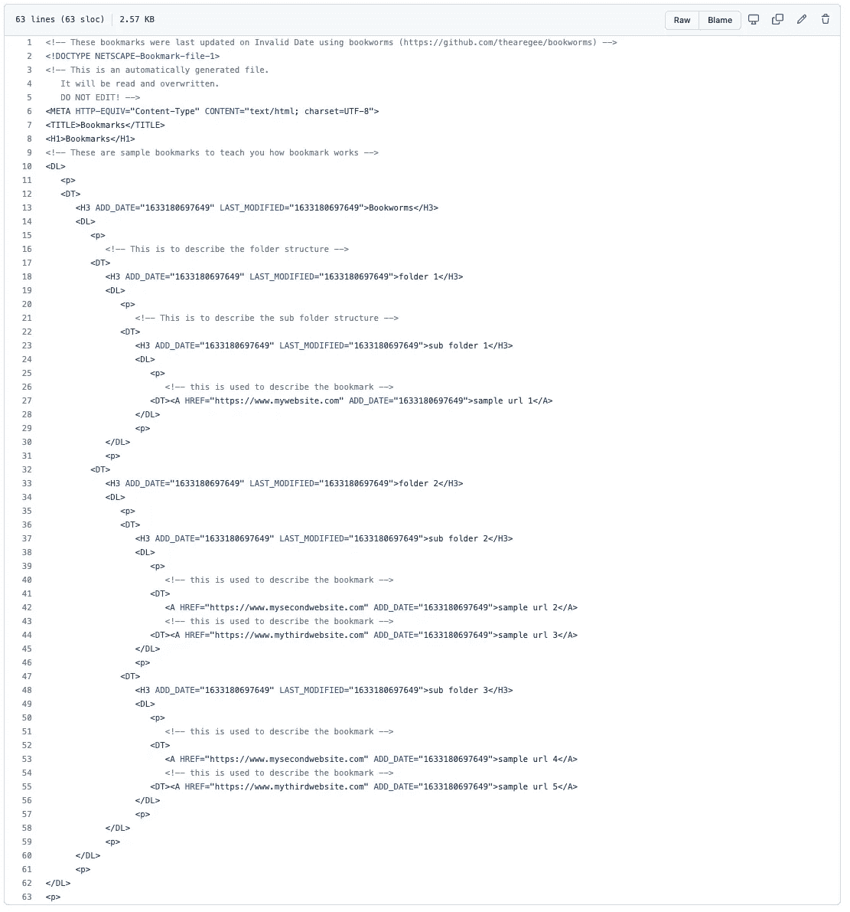
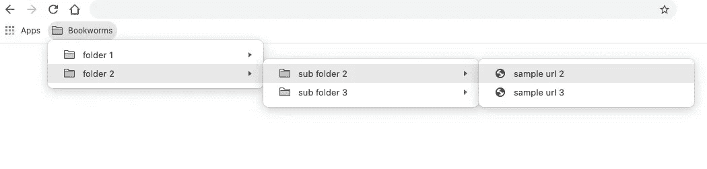
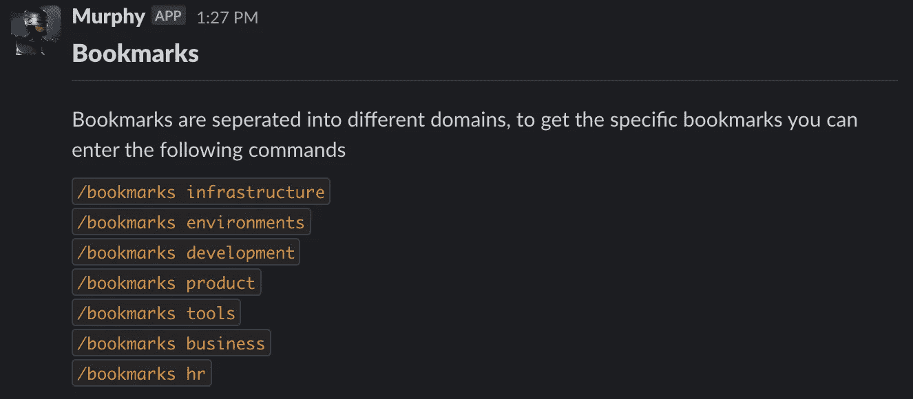
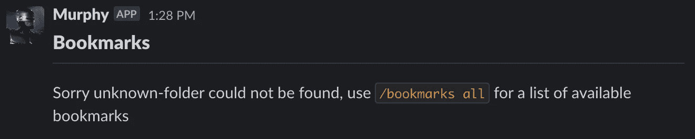
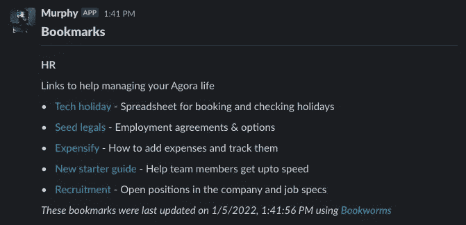

# 我如何集中和分发我的书签

> 原文：<https://blog.devgenius.io/how-i-centralize-and-distribute-my-bookmarks-cc8b11bb7475?source=collection_archive---------0----------------------->

在一个大公司，有成千上万个不同的内部 URL，来自多个开发环境、工作流工具和人力资源系统。新的工具经常被引入，旧的工具退役或者主机名改变，我经常开玩笑说，如果我清除了我的互联网历史，我就不能做我的工作了。

真相的唯一真正权威是通过在 Slack 中询问某个服务的 URL 是什么来众包的。如果你幸运的话，有人可能已经设置了一个机器人来回应，如果你不幸的话，它可能会引发一场关于最新的人力资源平台有多糟糕的激烈争论。众包网址及其真实性的想法会在脑海中出现一段时间。

今年年初，我转到了一家初创公司，虽然网址少了很多，但它们仍然分布在不同的工具中，而且并不总是最新的。我再次开始思考一种方法来集中书签，同时仍然允许您使用现有的工具。在过去几年的职业生涯中，我一直在从事基础设施方面的工作，我脑海中只有一个解决方案… `YAML`！

```
label: Bookworms
description: These are sample bookmarks
folders:
  - label: folder 1
    description: This is to describe the folder structure
    folders:
      - label: sub folder 1
        description: This is to describe the sub folder structure
        bookmarks:
          - label: sample url 1
            description: this is used to describe the bookmark
            href: '[https://www.mywebsite.com'](https://www.mywebsite.com')
  - label: folder 2
    folders:
      - label: sub folder 2
        bookmarks:
          - label: sample url 2
            description: this is used to describe the bookmark
            href: '[https://www.mywebsite.com'](https://www.mywebsite.com')
          - label: sample url 3
            description: this is used to describe the bookmark
            href: '[https://www.mywebsite.com'](https://www.mywebsite.com')
      - label: sub folder 3
        bookmarks:
          - label: sample url 4
            description: this is used to describe the bookmark
            href: '[https://www.mywebsite.com'](https://www.mywebsite.com')
```

基于书签和文件夹为 URL 创建一个标准化结构，将允许人们轻松地贡献内容，并增加将这些数据转换成不同格式的能力。

## 降价

业内很常见的是人们维护一个有用链接的列表，并将它们作为一个`README.md`存储在 Github 中。你可以在这里看到一个很好的例子:[https://github.com/binhnguyennus/awesome-scalability](https://github.com/binhnguyennus/awesome-scalability)

如果你将书签保存为`YAML`，这是一个非常简单的转换。通过`NodeJS`中的几行代码，我能够将书签`YAML`转换成`README.md`。



## 铬

虽然转换成 markdown 是一种自我记录存储库的好方法，但我希望这些书签更加实用，并且在我需要的时候和地方都可以使用。

查看 Chrome [书签管理器](https://support.google.com/chrome/answer/188842?hl=en-GB&co=GENIE.Platform%3DDesktop)我看到导出你的书签只是保存了一个`HTML`文件。我需要做的就是从`YAML`生成这个`HTML`文件。



同样，我可以用`NodeJS`来做这件事，生成并保存一个我可以导入浏览器的文件。



我的书签现在可以在我的 Chrome 工具栏中找到了。令我惊讶的是，这款`HTML`在大多数普通浏览器中都是标准化的，测试文件适用于:

*   [铬合金](https://support.google.com/chrome/answer/96816?hl=en-GB)
*   [Safari](https://support.apple.com/en-gb/guide/safari/ibrw1015/mac)
*   [边缘](https://support.microsoft.com/en-us/windows/move-internet-explorer-favorites-to-a-new-pc-a03f02c7-e0b9-5d8b-1857-51dd70954e47)
*   [火狐](https://support.mozilla.org/en-US/kb/import-bookmarks-html-file)
*   [勇敢](https://support.brave.com/hc/en-us/articles/360019782291-How-do-I-import-or-export-browsing-data-)

你可以在上面的链接中找到如何导入书签的说明，其他浏览器也可能工作，但它们尚未经过测试。

# 书虫


[Bookworms](https://github.com/thearegee/bookworms) 是我写的工具，它允许人们、团队或公司存储、共享、更新和集中他们的重要链接，同时给出多个有用的输出。

目前你需要在你的机器上安装`Node`和`npm`一旦完成，你可以使用以下命令:

```
npx bookworms get ./my-bookmarks.yaml
```

这将在它运行的同一个目录中生成文件`README.md`和一个`browsers.html`。您还可以从远程位置获取书签，并将导出内容输出到不同的目录中:

```
npx bookworms get [https://raw.githubusercontent.com/thearegee/bookworms/main/demo/config/bookmarks.yaml](https://raw.githubusercontent.com/thearegee/bookworms/main/demo/config/bookmarks.yaml) -d="./output"
```

为了存储你的书签，我建议建立一个包含`YAML`、`README.md`和`browsers.html`文件的存储库，在这里人们可以查看、导入或贡献你的书签。这里可以看到一个例子:[https://github.com/thearegee/bookworms/tree/main/demo](https://github.com/thearegee/bookworms/tree/main/demo)

目前你需要在每次更新`YAML`文件后运行`npx`命令，签入修改，然后重新导入`browsers.html`，然而这是我正在努力实现的。

您也可以像普通的`npm`模块一样导入 Bookworms，然后以编程方式使用它。我最近在一次公司黑客马拉松上做了这件事，在那里我制作了一个 Slackbot，可以用公司书签来响应。

这从使用 [Fastify](https://www.fastify.io) 构建一个简单的 web 服务器开始。

这个服务器公开了一个端点，可以被 Slack 的 slash 命令使用。当这个端点被调用时，我们检查主体，看他们是否在斜杠后添加了额外的信息。这允许我们根据用户的请求给出不同的响应，但在此之前，我们需要将书签加载到内存中。

这段代码将`YAML`加载到内存中，将其转换为 markdown，然后基于来自 webhook 的斜杠注释返回所请求文件夹的书签。

最后一部分是格式化对 Slack 的响应。

这两个简单的方法用于响应 Slack slash 命令，返回一个风格化的响应。在标准降价和休闲裤版本之间有一些细微的差别，我用了`slackifyMarkdown`来处理。

下面你可以看到一些在我们的 [AGORA](https://www.agoraworld.co/) Slack 频道上运行的例子。当用户调用`/bookmarks`或`/bookmarks all`时，基于书签`YMAL`中的顶层文件夹，他们可以使用所有不同的命令。



如果用户输入一个不可识别的文件夹名，他们会得到一个有用的错误信息:



如果请求成功，他们将获得与`README.md`相同结构的所有书签，但这次只获得请求的文件夹。



**更新:** *我已经将驱动这个 Slack bot 的代码移动到模块中，用于*[*Express*](https://expressjs.com/)*和*[*Fastify*](https://www.fastify.io/)*，这样您就可以将用于 Slack* *的* [*书虫添加到您的工作流中。*](https://github.com/thearegee/bookworms-slack-webhook)

# 试试吧！

Github 上的 CLI 可用于导出您现有的书签，生成书签`YAML`并将其导入您的浏览器或项目。如果你有兴趣投稿，或者你对如何使用[书虫](https://github.com/thearegee/bookworms)有其他想法，你可以在这里阅读更多:[https://github.com/thearegee/bookworms](https://github.com/thearegee/bookworms)

谢谢你和快乐书签！

如果您对此感兴趣，或者与我一起研究其他技术解决方案，您可以通过 [gullwing.io](http://gullwing.io/) 联系我。