# 我如何使用谷歌云创建“森巴科机器人”

> 原文：<https://blog.devgenius.io/how-i-create-sembako-bot-using-google-cloud-5c347057859e?source=collection_archive---------7----------------------->

## 如何在谷歌云上运行 TELEGRAM BOT

## 相信我，没那么难。

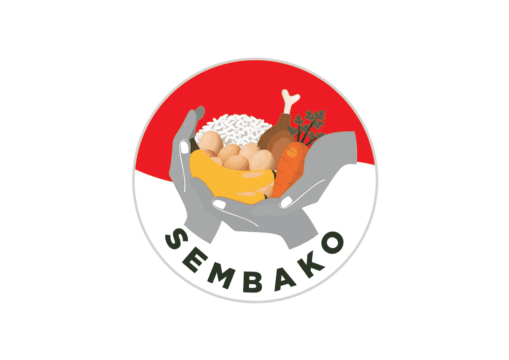

印度尼西亚政府的官方“sembako”标志。

免责声明:我在这个帖子里写的所有东西都代表我的观点，仅仅代表我的观点，不代表我的雇主的观点。

# 关于“森巴科机器人”

所以我实际上在存储库的自述文件中写了关于“sembako”的内容，但是我可以在这里简单解释一下。

 [## 位于 main iamdejan/sembako-bot 的 sembako-bot/README.md

### 一个电报聊天机器人发送各种 sembako 的每日价格。Sembako 是印度尼西亚语中…

github.com](https://github.com/iamdejan/sembako-bot/blob/main/README.md) 

“Sembako”是“sembilan bahan pokok”的印度尼西亚语缩写，翻译为“九种主要商品”，尽管它也可以翻译为“杂货”。那九种商品是什么？它可以包括原材料(如肉类)、水果和蔬菜，甚至是在印度尼西亚非常流行的液化石油气(LPG)来烹饪食物。

现在，我制作这个机器人的真正原因是因为印度尼西亚的“sembako”的价格在不断上涨，尤其是棕榈油的价格。因此，棕榈油价格的上涨从 2021 年 12 月开始，但直到 2022 年 2 月才真正感受到危机。通货膨胀的发生是由于多种因素的综合作用，从[马来西亚](https://www.thejakartapost.com/paper/2021/12/12/malaysias-palm-oil-producers-adjust-to-labor-shortages-higher-recruitment-costs.html)的供应中断、[经销商的供应“游戏”(印度尼西亚)](https://ekonomi.bisnis.com/read/20220218/12/1502138/ternyata-ini-alasan-distributor-timbun-stok-minyak-goreng)，以及[俄乌战争扰乱葵花籽油的供应](https://time.com/6155095/sunflower-oil-russia-ukraine/)(公平地说，战争并没有引发通货膨胀，只是加速了通货膨胀)。bot 的基本前提是用户可以密切监控价格，以便他们可以决定是今天购买“sembako”还是保留到明天**。

*在印度尼西亚，最受欢迎的食用油是棕榈油，尽管还有许多其他类型的食用油，如菜籽油、橄榄油等。

**我们还没有达到极端通胀，但我认为了解价格仍然是一件好事。

## 为什么电报

在我制作机器人之前，我必须决定平台。想到了一些候选，像 [LINE](https://line.me/en/) ，WhatsApp，Discord，Telegram。

对于 WhatsApp，我没有想太多，因为我知道在那里创建一个 bot 是相当困难的。据我所知，你必须成为一个企业主才能创建一个机器人。

至于 LINE，我记得很久以前我做过一个简单的 bot in LINE 聊天 app。然而，LINE 并非在所有平台上都可用(Linux 上的 LINE 只附带插件)。再加上 LINE 不是轻量级聊天 app(比 Telegram 重)，这让我即使在笔记本电脑上也懒得登录。

对于不和，我很少用。然后，CMIIW，但是我在 Discord 上见过的 bot 都在 Discord 服务器(群)上。我最初设计的机器人是供个人使用的，而不是供团体使用的。

对于 Telegram，我认为我选择它的主要原因是因为我从 YK 道场的频道找到了一个关于 Telegram 聊天机器人开发的教程[。当我跟进时，我认为 SDK 非常容易使用。这就是我选择电报的原因。](https://www.youtube.com/watch?v=NwBWW8cNCP4)

## 如何使用机器人

**注意:**目前该机器人只有印度尼西亚语版本。

为了使用这个机器人，你必须用 ID `@tele_sembako_bot`搜索它。森巴科机器人会出现。

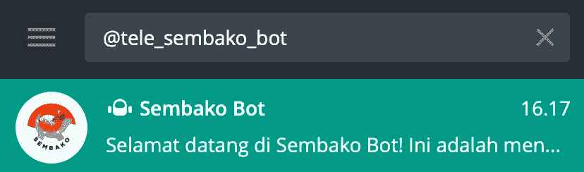

当我们在电报中搜索机器人时。

你加完之后。你需要输入`/start`。这样做会给你一个可以使用的命令列表。

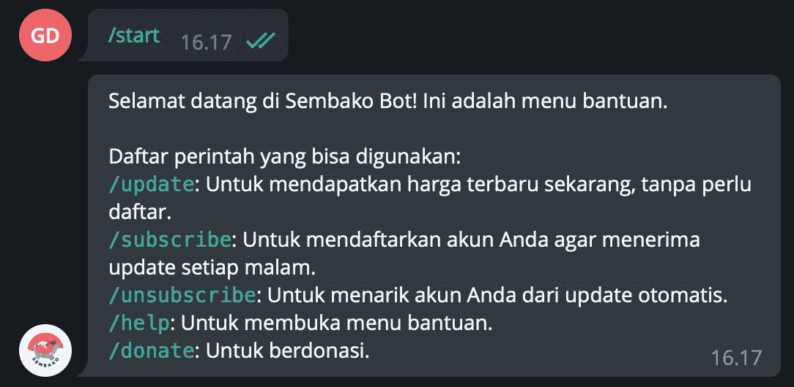

当我们输入“T2”时，就变成了“森巴科机器人”。

我将在这里简要解释每个命令:

1.  `/update`:您可以使用此命令获取“sembako”价格，而无需注册每日更新。等待 5-10 秒后，您将获得股票价格(印尼盾)。
2.  `/subscribe`:如果你想得到每日更新的价格，你可以使用这个命令。
3.  `/unsubscribe`:如果你想退出每日更新，使用此命令。
4.  `/help`:如果你想查看所有命令的列表，使用这个命令。
5.  如果你想资助这个项目，你可以使用这个命令。有关更多信息，请参见下面的底部。

如果你输入一个无效的命令，机器人会告诉你这个命令是无效的，你需要用`/help`检查可用的命令。

当输入一个无效的命令时，bot 告诉我们使用/help 命令来查看可用命令的列表。

# 高层架构

这是`Sembako Bot`项目的高层架构。至于 Google Cloud 和数据库内部那些组件的解释，后面会解释。

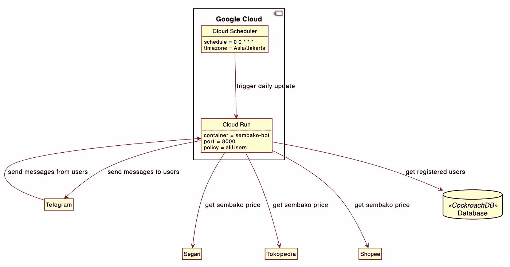

为了理解上面电报服务器的作用，下面我做了一个序列图。以下是使用`/update`命令时的序列图:

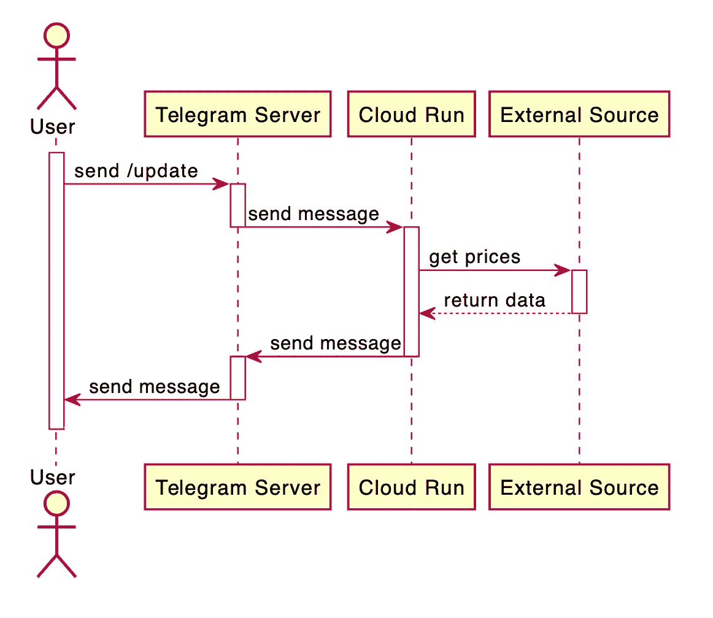

上面的序列图描述了 Telegram bot 的实际工作方式*。当用户向聊天机器人发送消息时，消息实际上首先被发送到电报服务器。Telegram 然后将消息发送到我们设置的 webhook URL(稍后在 Terraform 第一部分我将解释如何设置 webhook)。在这种情况下，服务器托管在云上运行。然后，Cloud Run 会将请求发送到相应的容器。容器将获取数据，然后从外部来源(Segari、Tokopedia 和 Shopee)获取价格。之后，它将使用`chat_id` sent 发回响应消息。

*如果设置了 webhook，则该图是正确的。但是，您也可以创建一个没有 webhook 的电报聊天机器人。你可以使用轮询机制，如 [YK 道场的视频](https://www.youtube.com/watch?v=NwBWW8cNCP4)所示。然而，轮询机制不适合无服务器方法(因为它可以缩小到零容器，也就是关闭)，所以我选择了 webhook。

# 服务器

每个技术堆栈的解释可以在每个小节中找到。

## 语言

我选择 Python 语言。为什么？不是因为我是 Python 语言专家。我用 3 年的 Java 编程建立了我的职业生涯。但对于 Telegram bot，我在聊天机器人教程中发现的最常见的语言都是使用 Python 进行开发，包括来自 YK 道场频道的[教程(该教程由 ClarityCoders 的 Jacob 提供)。](https://www.youtube.com/watch?v=NwBWW8cNCP4)

## 结构

我使用 FastAPI 是因为它简单。与 Django 不同，您可以用一个 Python 文件启动 FastAPI。对于这样的小项目，使用 FastAPI 是非常有诱惑力的。

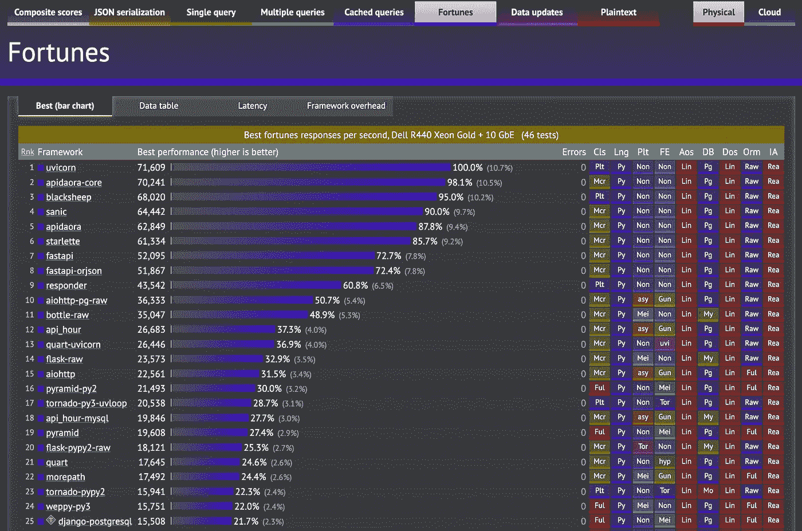

TechEmpower Web 框架基准测试，第 20 轮(2021–02–08)，仅针对 Python 框架进行了筛选。

我使用 FastAPI 的第二个原因是因为它是 Python 最快的 web 框架之一(见上面的截图)。当我们把 runner 和 Uvicorn 结合起来的时候，这是 Python 中最快的速度了。当然，有更快的语言，只是因为我决定使用 Python，FastAPI 是性能的最佳选择。抱歉，弗拉斯克。

一件可能很难搜索的事情是计算出电报服务器的有效载荷。在查找了几个帖子后，我发现[这篇来自 Kendrew C](https://medium.com/@kendrewchanys/learn-webhooks-with-telegram-54e4e3eddf0a) 的帖子和[一篇来自 dicoffeean(印尼语)](https://dicoffeean.com/bot-telegram-webhook/)的博客帖子告诉了我 Telegram 的有效载荷的结构。从这两篇文章中，我知道了`chat_id`和`text`的结构。

## 数据源

这个聊天机器人中最重要的当然是价格。我从哪里得到价格？

许多人认为可以通过抓取从网页中提取价格。然而，我有另一种方法，那就是使用开发者工具上的[网络标签。我的方法受到了侯赛因·纳赛尔的开发工具播放列表的启发，他根据网络呼叫来判断网站是否高效。然而，我们不会走得太远。](https://blog.bitsrc.io/exploring-the-network-tab-in-chrome-dev-tools-9e8b8a25a81f)

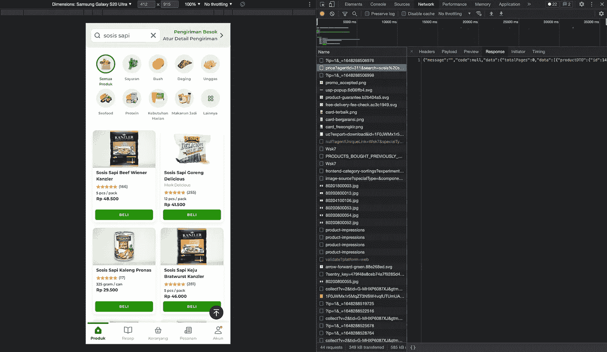

调试 Segari 网站中的网络调用。

我们感兴趣的是价格。在 Segari 中，端点很容易找到。在截屏上，您可以看到我遍历了每个请求，直到找到带有价格数据的 JSON 响应。一旦找到请求，我就将 cURL 请求复制粘贴到 Postman，看看是否可以减少发送的头或参数。原来有一些头是不需要发的。

对于 Tokopedia，方法类似。然而，在 Tokopedia 中，您必须调试产品详细信息页面，相比之下，Segari 则需要调试搜索页面。为什么？因为 Segari 没有产品详情页。每个细节都放在搜索页面中(PWA 方法)。

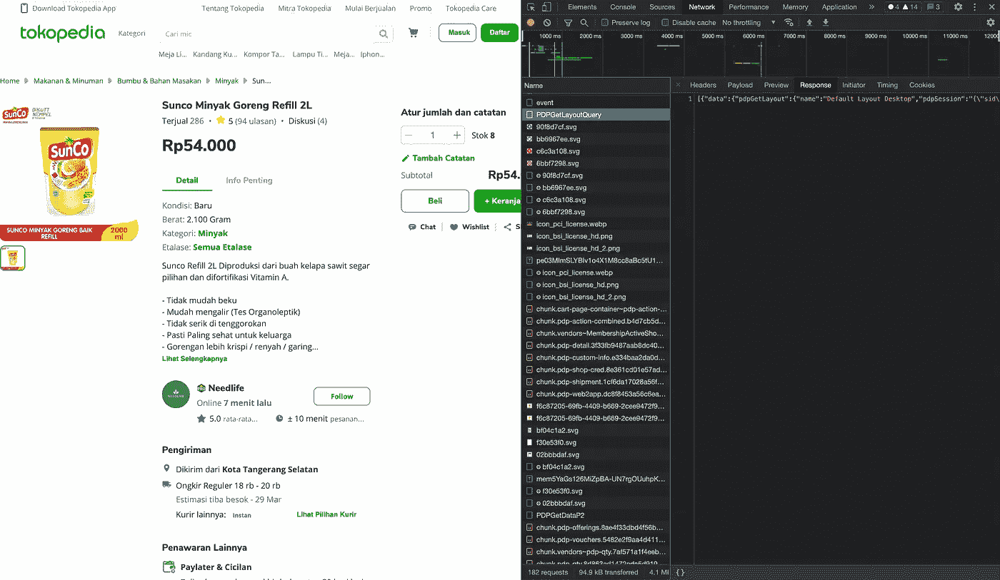

“PDPGetLayoutQuery”端点是价格和股票返回到前端的地方。

看来我得到了请求。问题是它返回了太多的数据。我如何减少响应？

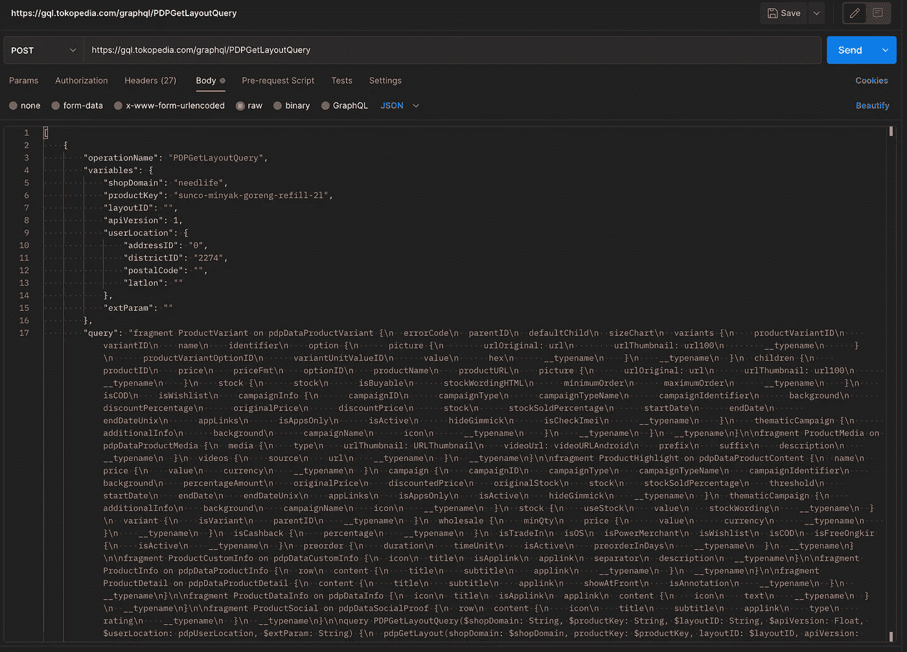

“PDPGetLayoutQuery”实际上是一个 GraphQL 端点。

在 Postman 中调试后，我发现它实际上是一个 GraphQL 查询！哇，塞翁失马焉知非福！所以我只需要修改 GraphQL 查询(减少响应查询)，然后我们就好了。

最有挑战性的是 Shopee。我几乎没有将 Shopee 作为价格提供者列表，因为不清楚聊天机器人中哪个网络调用实际上携带了我需要的数据。

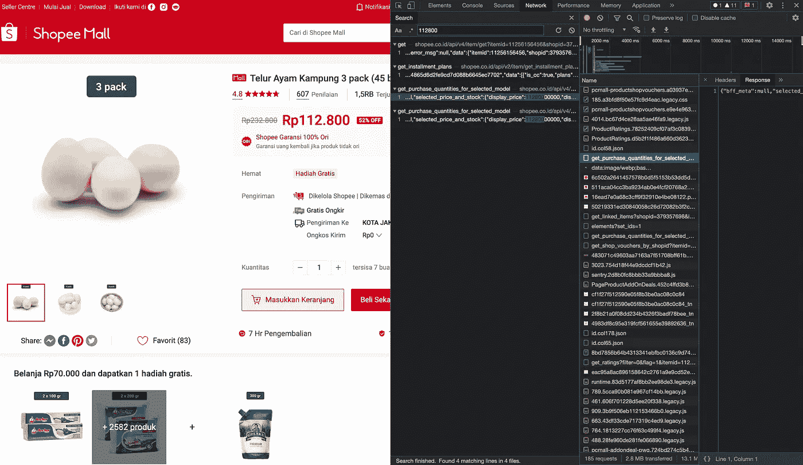

Shopee 网站调试的额外步骤是搜索价格。

所以我做了一些“稍微”不同的事情。我在网络选项卡中搜索价格(如`112800`根据产品详情 apge)，希望我得到网络调用。我发现了几个结果。我决定使用`get_purchase_quantities_for_selected_model`请求，看看我发现了什么！价格和库存都在。

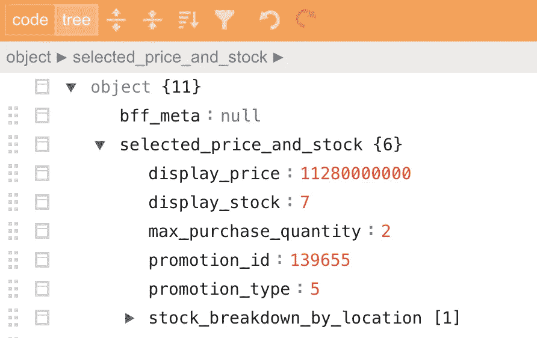

来自 Shopee 的回复细分"`get_purchase_quantities_for_selected_model" endpoint.`

所以我们有它。三个提供者，三个不同的 API 端点，因此有三个数据源。

## 数据库ˌ资料库

对于数据库，我选择了一个新的解决方案:CockroachDB。为什么呢？原因很简单，因为我有 5 GB /月的 CockroachDB 免费计划。

"但是，你也有[与蒙哥图集](/deploy-socket-io-to-kubernetes-part-2-infrastructure-7764fec252d0)的免费计划？"是的，正确。但问题是。在以前的项目中，我使用 TypeScript。在之前的项目中，我有过用 TypeScript 运行 MongoDB 的经验，所以设置起来更容易。但是对于 Python 呢？我在 Python 中使用数据库的经验是使用`[peewee](http://docs.peewee-orm.com/en/latest/)` [库](http://docs.peewee-orm.com/en/latest/)，所以我想我最好坚持使用它。使用`peewee`的问题是，现在我对数据库免费计划的选择有限，所以我选择了 CockroachDB。我知道[cocroach db 是 NewSQL](https://www.cockroachlabs.com/blog/automated-rebalance-and-repair/) ，但这不是我选择它的原因，尽管公平地说，如果这个项目成为病毒，[我就不需要再考虑分片了](https://www.cockroachlabs.com/docs/stable/frequently-asked-questions.html#does-cockroachdb-support-distributed-transactions)。

# 基础设施

## 谷歌云运行

引用[谷歌云文档](https://cloud.google.com/run/docs):

> Cloud Run 是一个托管计算平台，使您能够运行可通过请求或事件调用的容器。

换句话说，Google Cloud Run 是一个来自 Google 的无服务器解决方案，我们可以在 Google Cloud 中运行我们的容器，Google 会处理剩下的事情(自动伸缩等)。).

我使用 Google Cloud Run 来服务来自 Telegram 服务器的请求。Google Cloud Run 是 Google 提供的无服务器功能，与 AWS Lambda 有一个区别:它是为运行容器而设计的，不同于 AWS Lambda(和 Google Cloud Function)是为运行一个“函数”而设计的。

我喜欢谷歌云运行的一个想法是，他们已经为我们设置了 HTTPS。这对聊天机器人的开发很重要，因为 Telegram 只允许注册 HTTPS webhook(他们不接受 HTTP URL 作为 webhook)。

为了设置 Google Cloud Run，我使用了 Terraform。我只配置了容器的名称(上传到 Google 容器注册中心)、公开的端口和环境变量。

您可以在这里看到配置:

 [## SEM bako-bot/02-cloud-run . TF at main iam dejan/SEM bako-bot

### 此时您不能执行该操作。您已使用另一个标签页或窗口登录。您已在另一个选项卡中注销，或者…

github.com](https://github.com/iamdejan/sembako-bot/blob/main/02-cloud-run.tf) 

## 谷歌云调度程序

Google Cloud scheduler 是 Google 提供的托管调度服务，可以定期调用 HTTP 端点。

这很容易设置(特别是用 Terraform)，我只需要用 [cron 的符号](https://crontab.guru/)设置我想要的时间表，以及时区。在这种情况下，我使用雅加达的时区(`Asia/Jakarta`)。

您可以在这里看到配置:

 [## SEM bako-bot/03-cloud-scheduler . TF 位于主 iamdejan/sembako-bot

### 此文件包含双向 Unicode 文本，其解释或编译可能与下面显示的不同…

github.com](https://github.com/iamdejan/sembako-bot/blob/main/03-cloud-scheduler.tf) 

## 使用 Terraform 部署

我总是用 Terraform 配置基础架构。那对我来说是显而易见的。如果没有 Terraform，一次误点击就可能导致错误配置，而使用 Terraform 可以确保我的配置有据可查，并且可以复制(如果需要的话)。

至于部署，我至少要做两个小改动:

1.  我总是在每次配置时替换云运行。这里的替换意味着我删除了现有的云运行资源，然后我将创建一个新的。我为什么这么做？因为在测试过程中，我发现有时 Terraform 在应用时会出现 [409 错误](https://cloud.google.com/resource-manager/docs/core_errors#CONFLICT)。Terraform 尝试创建新版本的云运行部署(同名)，但结果是该名称已经存在。因此，我的解决方法是更换资源，这导致了 2-3 分钟的停机时间。我想这没关系，因为 Telegram 会重试 webhook API 调用*。
2.  我在每次部署后设置 webhook。你可以在这里看到地形图。我不应该这样做，但与第 1 点相关，如果云运行 URL(出于某种原因)被更改，那么我必须手动设置 webhook。我认为如果云运行 URL 发生变化，webhook 自动设置会更好。

*我其实不知道多长时间电报会重试。在测试期间，当我有一个导致内部服务器错误的 bug 时，Telegram 仍然在热修复程序部署后重试(bug 被推送到生产环境后 5 分钟)。

# 结论

所以，高层架构很容易。我们只需要使用云运行和云调度程序。至于 Telegram SDK，它也很简单，尽管 webhook 要复杂一点。

至于未来的改进，我有两个想法:

1.  我将通过迁移我使用的资源来比较谷歌云和亚马逊网络服务。我将看到同等的资源如何相互叠加。
2.  用 Grafana 和 Prometheus(或者 InfluxDB，如果太复杂的话)设置一个仪表板。仪表板可以比较给定时间范围内的价格。这更复杂，当然需要更多的资源(时间、金钱等)。)进行设置。

如果你想阅读整个代码，这里是最终的源代码。

 [## GitHub - iamdejan/sembako-bot:一个聊天机器人，定期发送 sembako 价格。

### 一个电报聊天机器人发送各种 sembako 的每日价格。Sembako 是印尼语中…的缩写

github.com](https://github.com/iamdejan/sembako-bot) 

**注意:**如果你是印度尼西亚人，你想让这个机器人继续运行，你可以通过在机器人上键入`/donate`命令来查找指南。机器人会告诉你所有可用的捐赠方法。每一点捐赠都帮助我维持这个项目，尤其是支付云服务。