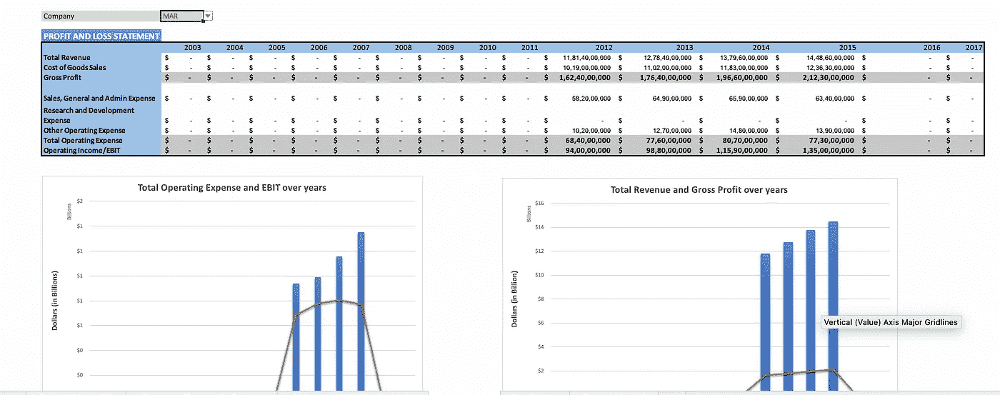
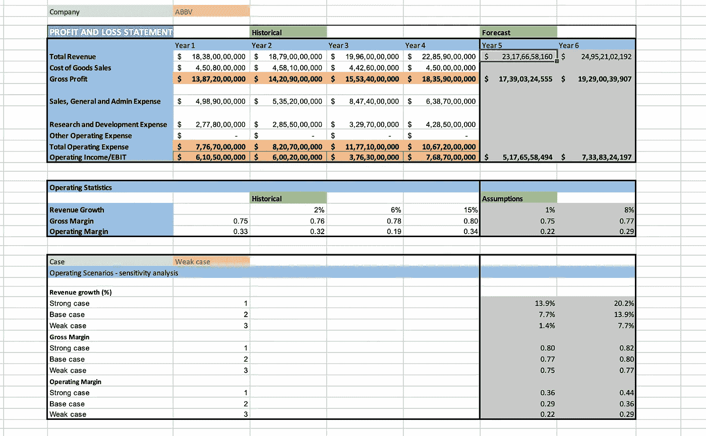

# 我如何用 Excel 创建纽约证券交易所 500 强公司的 P&L 报告？

> 原文：<https://blog.devgenius.io/how-i-created-a-p-l-report-of-nyse-500-companies-using-excel-790681de09cf?source=collection_archive---------23----------------------->

## 可能有几十种分析工具。但是，没有其他任何东西能与 Excel 的力量相媲美！

米卡·鲍梅斯特在 [Unsplash](https://unsplash.com/?utm_source=unsplash&utm_medium=referral&utm_content=creditCopyText) 上的照片

许多编程语言可能会用于数据分析和建模过程，但没有一种语言可以超越 Excel 的熟练程度。有一次一位采访者告诉我，“如果其他分析工具加起来是灭霸，那么只有微软 Excel 拥有复仇者联盟的超能力”。虽然当时这似乎是一个可笑的说法，但我意识到他的说法是黄金。

这就是为什么我试图用 Excel 建立一份纽约证券交易所 500 强公司的 P&L 报告。别无其他！

**数据集**

NYSE 500 公司数据集有 1711 行和 10 列。这些列包括“Ticker_Symbol”、“Years”、“Period_Ending”、“T6”、“Total _Revenue”、“Revenue”、“COGS”、“Sales”、“General and Admin”，
'R & D '，【其他 _ 经营 _ 费用'，
' GICS _ 行业'，' GICS _ 子行业'。

> 您可以从[这里](https://github.com/essharmavi/Predictive-Analytics-for-Business-Nanodegree/tree/master/NYSE%20500%20Companies%20Analysis)访问数据集

**清洗过程**

第一步是清理数据，删除空值，更改列的数据类型。通过解析“Period Ending”来添加“Year”列是我必须做的另一项任务。

**分析和可视化**

为了创建 P&L 报告，需要创建一些列，包括“毛利”和“营业收入”。

为了给每一家公司做一份 P&L 报告，我必须在股票代码上加上“数据验证”。使用匹配和索引组合，我在报告中包含了“总收入”、“商品销售成本”等字段。

P&L 报告中用于“总收入”的公式:

> =IF(ISNUMBER(INDEX(收入，MATCH(1，($ D3 = Ticker)*(M6 =年)，0)))，INDEX(收入，MATCH(1，($ D3 = Ticker)*(M6 =年)，0)，NUMBERVALUE(0))

结合使用这两个功能，我创建了整个 P&L 报告，并做了进一步的分析和可视化。

**财务模型**

为了建立财务模型，我为“最佳”、“基本”和“弱”情况构建了另一个数据验证选项。使用描述性统计函数，我试图根据每种情况预测每家公司的收入模式——最坏的或最好的。

> 进一步的了解，可以在这里找到整个 Excel 文件[。](https://github.com/essharmavi/Predictive-Analytics-for-Business-Nanodegree/tree/master/NYSE%20500%20Companies%20Analysis)

我没有使用 Python 或 R，而是使用 Excel，创建了这个成熟的财务模型。我只需要三个主要功能“匹配”、“索引”和“偏移”。

如需讨论和反馈，请发短信至 [Linkedin](https://www.linkedin.com/in/vishal-sharma-239965140/) ！