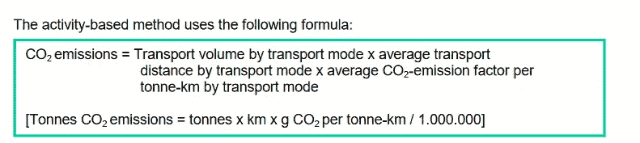
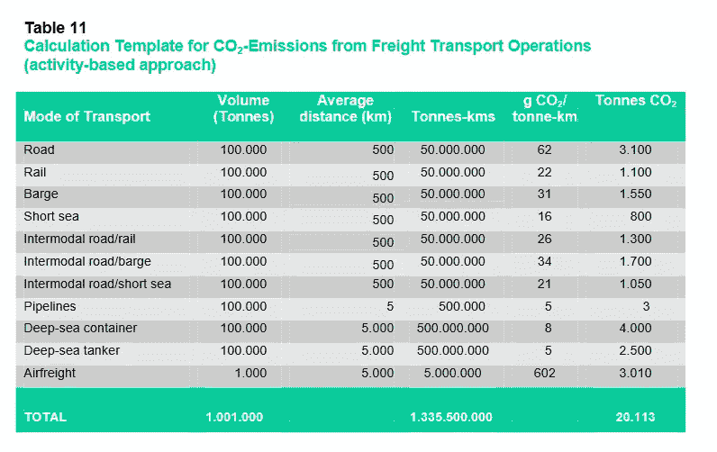
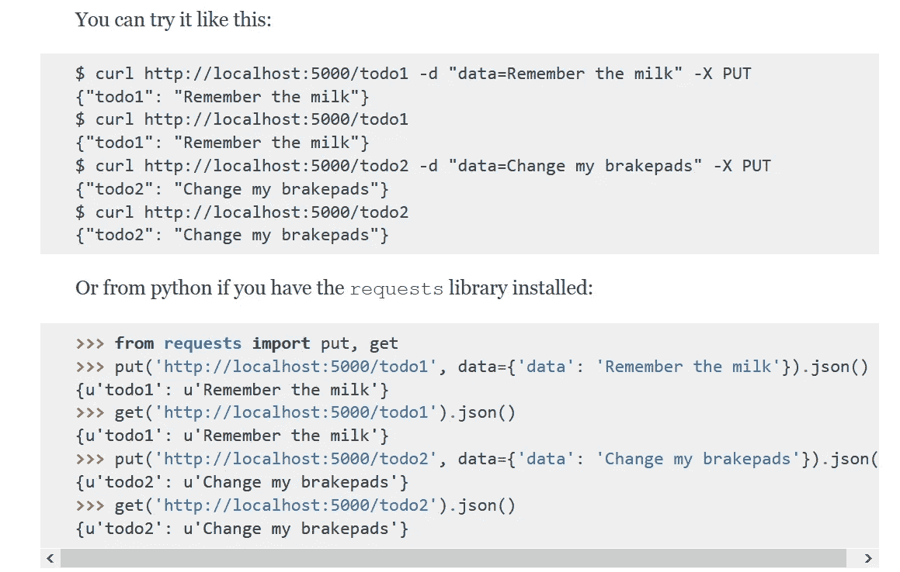
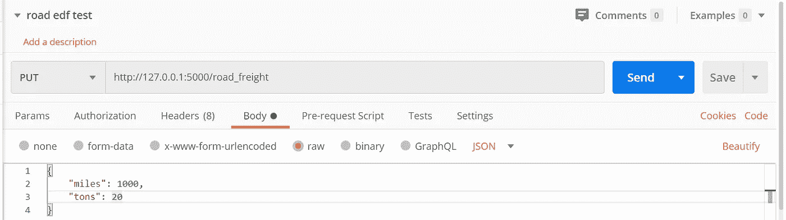
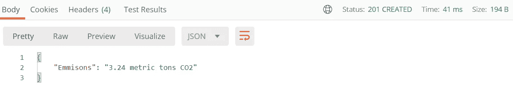
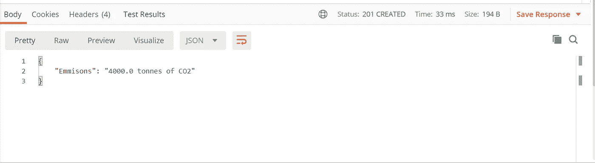

# 我如何创建一个 API 来计算你的运输排放量

> 原文：<https://blog.devgenius.io/how-i-created-an-api-that-can-work-out-your-shipping-emissions-9754442f73be?source=collection_archive---------32----------------------->


诺贝特·昆德拉在 [Unsplash](https://unsplash.com?utm_source=medium&utm_medium=referral) 上的照片

最初发表于我的[网站](https://www.tobiolabode.com/blog/2020/6/25/python-api-for-carbon-emmissions)

## 灵感

我正在用 python 开发一个 API，它将计算在世界各地运输产品时产生的排放量。我从一个叫做[补丁](https://www.usepatch.com/)的网站上得到这个想法。该公司通过计算运输产品时产生的排放量来抵消碳排放。

# 计算

为了计算碳排放量，我需要收集行驶的距离。项目的质量。和使用的运输类型。需要距离和质量来计算出吨/英里或吨/公里的单位。这是一个简单的测量，显示一公斤或一短吨如何移动一英里或一公里。

为了计算一辆卡车的运输量，我使用了美国非营利组织环境保护基金会的公式。

> 第一步:确定吨英里的总量。将 1，000 英里乘以 20 吨，我们总共可以得到 20，000 吨英里。
> 
> 第 2 步:获取货运卡车基于重量的卡车排放系数。美国货运卡车平均每吨英里排放 161.8 克二氧化碳。
> 
> 第三步:将这一排放系数乘以总吨英里数{161.8 X 20，000 }，得出二氧化碳的总量为 3，236，000 克。
> 
> 步骤 4:将总克数转换成公吨。公吨是公司温室气体排放的标准计量单位。一公吨等于一百万克。为了转换第三步的答案，我们将其除以 1，000，000。这一次移动会产生 3.24 公吨的二氧化碳。

API 的下一部分。我计算了一次海上货运旅程。我使用了欧洲化学运输协会的一个公式。



下面是一个模板，展示了如何将该公式用于不同的运输方式。



我将用深海集装箱的例子来说明碳因素。因为这与海运非常相似。

# 烧瓶宁静

为了开发 API，我将使用 [Flask-RESTful](https://flask-restful.readthedocs.io/en/latest/index.html) 。Flask-RESTful 是一个 Flask 扩展，它有助于抽象出一些构建 API 的工作。

首先，您需要一个定义 API 应用程序的类。Flask-RESTful 使用一个名为 resource 的对象来访问多个 HTTP 方法，您可以使用这些方法来开发您的 API。我将部分解释他们在其网站上展示的示例代码:

该代码高度基于普通烧瓶。我将跳到它是 TodoSimple(Resource)的定义类的部分。TodoSimple 是类的名称，因此也是 API 的名称。该类使用上面提到的资源对象。接下来，这个例子定义了我们想要使用的 HTTP 方法。

```
def get(self, todo_id): return {todo_id: todos[todo_id]}
```

这定义了 get 方法。它从 API 获取数据。方法用 self 调用实例。和待办事项 id。class 方法返回一个以 todo_id 为键的字典。和使用 todo_id 访问 todos 目录的内容。让内容以 dictionary 的形式返回意味着以后可以以 JSON 文件的形式访问它。

```
def put(self, todo_id): todos[todo_id] = request.form['data'] return {todo_id: todos[todo_id]}
```

这个方法与上面的 get 方法非常相似。唯一增加的是允许用户向 API 发送数据。

`todos[todo_id] = request.form['data']` 使用申请表添加待办事项。

`api.add_resource(TodoSimple, ‘/<string:todo_id>’)`

为开发的类设置路由。 `/<string:todo_id>` 表示访问该类时需要输入一个 todo ID。字符串:设置一个接受文本的变量。

来访问 API。使用您选择的允许您发送和接收请求的 HTTP 服务。

这是网站上的一个例子:



# 道路货物运输代码

我在示例中没有解释的一段代码叫做 reqparse。该函数允许您设置验证请求。通过设置参数。

```
parser = reqparse.RequestParser()parser.add_argument('miles')parser.add_argument('tons')parser.add_argument('ton_miles', type=float)args = parser.parse_args()
```

解析器是通过在变量中保存`reqparse.RequestParser()`来设置的。之后，您可以使用它来添加新的参数。我用 `parser.add_argument`表示英里数和音调。所以，用户可以输入英里数和吨数。`parser.add_argument(‘ton_miles’, type=float)`将类型设置为 float 以允许十进制数字。

`args = parser.parse_args()`将所有这些参数合并到一个变量中。现在可以用一个键来访问这个参数。参数的名称是关键。例:`args[‘tons’], args[miles]`。

这是我在代码中使用 args 变量的方式:

```
if args['miles'] or args['tons'] is None: ton_miles = args['ton_miles']
```

该代码设置了一个 if 语句，用于检查 miles 和 tons 参数是否为空。然后将 ton_miles 参数存储到一个变量中。如果用户使用既不需要吨也不需要英里的 ton_miles 参数，就会这样做。以吨/英里计算的距离乘以质量。

```
if args['ton_miles'] is None: miles = float(args['miles']) tons = float(args['tons']) ton_miles = miles * tons
```

if 语句检查 ton_miles 是否为空。然后继续讨论英里和吨。并通过使用用户提供的数字来计算吨/英里。

```
grams_of_CO2 = 161.8 * ton_milesmetric_tons = grams_of_CO2 / 1000000Emmisons = round(metric_tons, 2)
```

现在我们开始计算碳足迹。通过使用博文中提到的环境保护基金的公式。`grams_of_CO2 = 161.8 * ton_miles` 计算产生的二氧化碳克数。这是通过将吨/英里乘以碳系数来实现的。二氧化碳的克数然后被转换成公吨。这是通过将二氧化碳的克数除以 1，000，000 得出的。

`Emmisons = round(metric_tons, 2)`公吨四舍五入到小数点后两位。以避免尾随小数点。

```
calculations = {‘Emmisons’: str(Emmisons) + ‘ metric tons CO2’}return calculations, 201
```

排放显示在字典中。排放变量被更改为字符串。所以“公吨二氧化碳”这个词被附加在排放量的后面。

现在，保存排放信息的计算变量被返回。状态代码为 201。[状态代码 201](https://httpstatuses.com/201) 表示请求已成功创建。

# 使用邮递员

为了测试 API，我们将使用一个名为 postman 的程序。Postman 是一个允许你使用各种 HTTP 方法测试 API 的程序。Postman 有更多的功能，比如制作文档、自动化测试、设计 API 等等。但是我坚持使用 put 方法，这样我就可以向 API 发送输入。

我将使用环境保护基金例子中提供的数字。这辆卡车已经行驶了 1000 英里，载重 20 短吨。按照网站和博客文章前面的所有步骤。它应该给出 3.24 公吨 CO2 的最终结果。

使用 Postman，我们向 API 的地址发送一个 put 方法。请求是 JSON 文件格式的原始主体数据。包含英里和吨。



现在我们发出了请求:



我们得到正确的数字。我们还生成了一个 201 状态代码。

# 船舶货运旅程代码

船只货运的法规允许更多的争论。这是因为在我开始掌握 Flask-RESTful 之后，我开始从公路货运类扩展。因此，船运费的代码允许更多的功能。新功能是允许用户在英制和公制中进行测量。

这也是因为我用来计算的公式是欧式的。我在博文的开头提到过。

```
parser = reqparse.RequestParser() parser.add_argument('miles', type=float) parser.add_argument('km', type=float) parser.add_argument('tonnes', type=float) parser.add_argument('km/tonnes', type=float) parser.add_argument('miles/tonnes', type=float) args = parser.parse_args()
```

其类型设置为 float 的参数。这样做是为了我不需要使用 float 函数将参数转换成十进制数。

```
if args['miles'] is not None: args['km'] = args['miles'] / 0.621371 args['km/tonnes'] = args['km'] * args['tonnes']
```

该 if 语句检查 miles 参数是否有数据。然后将英里转换成公里。然后计算吨公里单位。将质量和距离相乘。

```
if args['miles/tonnes'] is not None: args['km/tonnes'] = args['miles/tonnes'] * 1.459972
```

第二个 if 语句检查 miles/tons 是否不为空。然后将英里/吨转换成吨-公里。

```
if args['km/tonnes'] is None: args['km/tonnes'] = args['km'] * args['tonnes']
```

下一个 if 语句检查 km/Tony 是否为空。如果是这样的话，公里/吨是用公里和吨来计算的。

```
g_CO2_tonne_km = args['km/tonnes'] * 8metric_tons = g_CO2_tonne_km / 1000000Emmisons = round(metric_tons, 2)
```

比如计算之前公路货运的碳足迹。使用碳系数 8 计算二氧化碳克数。由 ECTA 提供。(见本文开头)。然后将二氧化碳的克数除以一百万，转换成公吨。

然后将排放量四舍五入到两位小数。

```
calculations = {'Emmisons': str(Emmisons) + ' tonnes of CO2'} return calculations, 201
```

该类返回计算结果。也是一个 201 状态代码。

使用 Postman，我们可以测试 API。以 ECTA 模板中的深海集装箱为例。我们希望 API 返回 4000 吨二氧化碳。

将距离和重量输入邮递员，如下所示:

```
{ "km": 5000, "tonnes": 100000}
```

我们得到了这个结果:



API 给出了正确的数字。

# 使用 python 请求访问 API

我将展示一个用户如何使用 API 的更实际的例子。通过使用 python 请求向 API 发送 put 方法。向 API 发送数据并获取它们的排放量。

```
import requestsr = requests.put('http://127.0.0.1:5000/boat_freight', data={'km': 5000, 'tonnes': 100000})print(r.status_code)print(r.json())
```

运行代码会得到以下结果:

```
201{'Emmisons': '4000.0 tonnes of CO2'}
```

这很好。因此，用户可以简单地使用请求库并获得他们的碳足迹。只需几行代码。

# 丰富

这个 API 是一个非常基础的。所以，我想增加一些新功能，解决一些问题。其中一个主要问题是 road fright 功能没有公制系统支持。这在当时是有意义的，因为这是我制作的 API 的第一部分。但我认为支持公制和帝国将是一个好主意。

第二个问题是，如果要为基本的运输实现一些东西。那么质量的测量将需要改变。例如，如果你从网上商店买几本书，它只有几公斤重。不是很多吨。这是 API 中实现的比例。因此，这是近期要考虑的事情。

# 结论

尽管在整个项目中，我一直使用我的本地主机作为 API 的服务器。如果你有兴趣在某种类型的产品中使用 API，那么你可以亲自使用 API。给我发了一条信息，所以我可以衡量一下对这项服务的兴趣。你可以在 [GitHub](https://github.com/tobiolabode/Flask_Carbon_API) 上查看该项目的代码。如果你觉得你可以添加功能的 API，请随时发送拉我的方式请求。

 [## 喜欢你阅读的内容吗？

### 注册我的时事通讯。更多有用和有趣的内容

转换工具](https://upbeat-teacher-3421.ck.page/875d4eafc9)