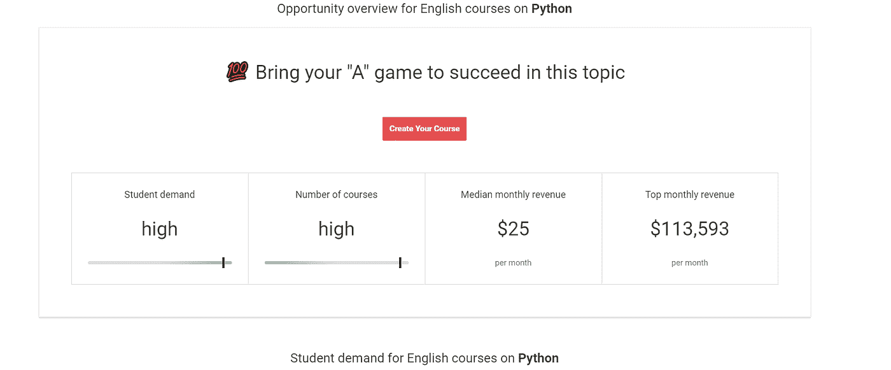

# 我如何在 Udemy 上创建我的第一个课程

> 原文：<https://blog.devgenius.io/how-i-created-my-first-course-on-udemy-e428aadb4f2e?source=collection_archive---------6----------------------->

两天前，我的第一个 Udemy 课程出版了

安德里亚·皮亚卡迪奥在[像素](https://www.pexels.com/)上拍摄的照片

高中的时候，我就开始以家教的身份帮助学生实现学业目标。对我来说，这是一次鼓舞人心和充实的经历，它给了我一个服务他人和更多了解自己的机会。

作为一名导师，我知道了倾听的重要性，理解每个人的独特性，因此，对每门课程都采用了特定的方法。但也是一种激励，帮助他人相信他们的潜力。

我以前从未有过如此惊人的经历，我感到很幸运能够在有所作为的同时谋生。

于是，我开始考虑成为一名在线家教。

# 为你的课程寻找一个主题

## 你的专长是什么？

要开始在线教学，你需要找到一个课程主题。当你创建在线课程时，选择一门尽可能具体的**课程是至关重要的。**

要做到这一点，问问自己在不同的学科中你知道多少，能教多少，对这些课题的需求是什么。会帮你找到好的搭配。

## 检查你的主题需求

要选择正确的主题，你可以使用不同的工具。

我使用了 Udemy 的市场洞察工具,它帮助我找到了不同主题之间的最佳契合点，这也是我强烈推荐你尝试一下的原因。

这个工具向你展示了某个特定主题的学生需求和主题竞赛。它的优点是使用起来非常简单，你可以使用 Udemy 的数据库来了解你的市场。

Udemy 的市场洞察工具

# 构建你的知识并创造内容

## 创建在线课程的结构

在为我的在线课程找到一个主题后，我需要以一种有意义并且容易理解的方式来讲述它。

这就是为什么我不得不把我的话题分成几个部分，并从逻辑上把一部分和另一部分联系起来。

我选择写我所有的内容，因为它帮助我在接下来的步骤中流畅。

## 录制和编辑您的内容

然后，有了结构，我开始对内容的工作。

对于这第一次体验录制在线课程，我选择以经典的“Powerpoint”演示风格授课。

为了录制我的屏幕，我使用了 SreenApp.io，并在编辑视频时用我的 iPhone 录制了我的声音。

# 寻求反馈

确保您的内容是高质量的，以给学生提供良好的用户体验，这一点绝对至关重要。有了 Udemy，你有机会就视频和声音质量征求反馈，同时也可以了解你的课程内容是否吸引人。

这是在你开始在线课程时很快收到反馈的好方法。你也可以请朋友或家人告诉你他们对此的看法。你必须确保你的内容引人入胜，易于理解。

# 发布您的在线课程

然后，我需要找到可以托管我的在线课程的地方。

Udemy 是一个很好的选择，因为它是拥有数百万学生的最大的在线课程平台之一。

它也很直观，当您开始使用该平台时，可以找到很多帮助。

# 让我们看看会发生什么

现在，让我们看看会发生什么。

我会写一篇新的文章来分享这第一个 Udemy 在线课程的进展。

希望**这篇文章**对你**有所帮助**，并鼓励你也考虑创建一个在线课程！