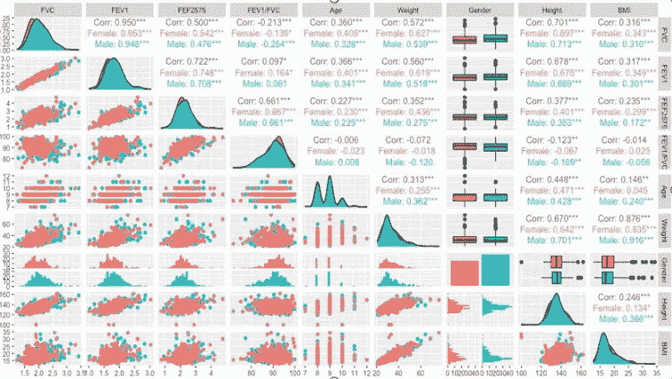
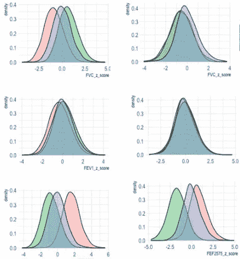
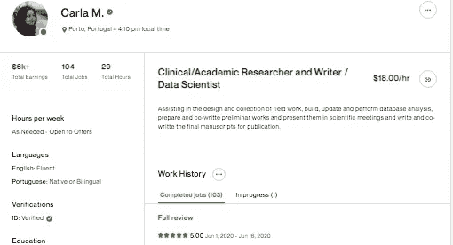

# 我如何创建自己的数据科学工作

> 原文：<https://blog.devgenius.io/how-i-created-my-own-data-science-job-64023cbd5e32?source=collection_archive---------0----------------------->

## 从卫生技术背景开始

图片来自作者。

自 2012 年《哈佛商业评论》宣布数据科学家是 21 世纪最性感的工作以来，在数据科学领域工作似乎是许多计算机科学、数学、IT、统计学和其他 STEM 学位毕业生的圣杯。这并不奇怪，因为大多数数据科学家职位的职位描述都承诺高薪、低压力、持续的学习机会、远程工作、安静友好的工作环境以及其他福利。

媒体和教育机构(学院、大学和代码学校)也广泛传播对数据科学家的需求超过了市场上可用的专业人员数量。这并不完全正确。

事实上，对数据科学家的需求很高，但没有经验的数据科学家似乎没有座位。从数据科学家职位的面试人数远低于候选人数就可以看出这一点。此外，选拔面试竞争非常激烈。它们分几个步骤进行，在这些步骤中，候选人必须表现出技术和人际交往技能，以及专业知识技能(通常只有在多年的工作经验后才能获得)。

**那么，如何在不是数据科学家的情况下获得数据科学家的职位呢？**

显而易见的答案是，我们必须从别的地方开始。最常见的方式是从生物统计学家、数据分析师、数据库管理员甚至数据录入员等职位做起。另一种方法是将数据科学带到我们当前的位置，并以一种数据在我们工作中占据重要部分的方式对其进行转换。

我的情况符合最后一个例子。然而，我必须承认，我不是那个“强迫”数据科学进入我的工作的人，而是根据过去 10-12 年的技术进步，我的专业活动的发现和自然演变。

**2009 年毕业**

我的专业是北葡萄牙卫生技术学院的卫生技术(临床生理学的一个子领域)。它不是一个华丽的头衔，也不是一所华丽的学院/大学。事实上，这个领域的一些早期专业人士甚至没有毕业证书，而是高中文凭或理科学士学位。我这样做是因为我不想让你认为我特别聪明，或者我已经进入了一所好大学，因为那不是真的。但是，我一直是一个好奇的人，喜欢学习和尝试新事物。

**2010 年我毕业后的第一份工作**

这个领域的大多数毕业生最终会在医院、诊所或制药公司工作。2010 年末，我开始在我国第二大医院工作，但就科研生产而言，这是最大的医院。这也是一所大学医院，教学和科研联系紧密。

我的主要职责是对患者进行诊断测试，主要是那些需要使用计算机和复杂系统的测试，校准系统，收集所有患者的数据和结果，批判性地分析和报告结果，并维护一个更新健康/疾病参数的数据库。

**2011 年用 SPSS 发现统计数据**

仅仅几个月后，在我完全适应我的工作后，我意识到有多少数据在我手中流动。通过一些重要的指导，以及与我一起工作的人的无数帮助，我了解到这些数据有多么重要，以及我可以用它们做些什么。

数据科学的热潮还没有开始，我们拥有的一切都是统计。于是我开始学习统计学。我学到的第一件事是描述性分析，然后我学习了更有趣的话题，如组间比较、推理和回归。我的第一个统计软件是 SPSS。

**2012 年第一笔赠款**

新获得的知识立即被付诸行动。因此，在 2012 年，我把它应用到我一直在收集的数据中，和我的同事们一起，我写了我的第一篇文章，并提交给了一家国家科学杂志。这篇文章不仅被接受，还获得了同类最佳文章一等奖。这笔赠款的金额让我能够资助我接下来的步骤。

**2013 年生物统计学高级课程**

2013 年，我参加了生物统计学的研究生课程。这个课程对 SPSS 来说仍然很难。然而，我回忆起的是我学到的概念，而不是使用的工具。通过实用的方法，这门课程帮助我巩固了以前的统计知识，教会了我新的概念，但最重要的是，它提高了我对未来的信心。经过这次培训，我觉得自己更有能力和动力进行独立的数据分析。

今年，我和我的同事们再次申请了我们去年获得的同一奖项。你猜怎么着？我们又赢了，我简历上的又一个一等奖！更多的钱来资助我的教育之路。

我还记得，大约就是在这个时候，我开始注意到医院的同事在有问题或需要统计方面的帮助时来找我。我很享受被当作“专家”对待并能够帮助他人的感觉。

**2014 研究生研究方法，从 R 开始**

图片来自作者

今年，我申请了一个研究方法的研究生，并被录取了。研究方法研究生的主要目标是以更广泛的方式教授与研究相关的概念，包括伦理学、同行评议出版和那些攻读博士学位的人的职业机会。

统计学不是这个毕业后教学大纲的主要目标。然而，在这个课程中，我第一次接触到了 R 编程语言。我还记得我看到两三行代码时是多么的害怕，我想一个人要多聪明才能理解这一切。我不喜欢感到害怕，而且正如我在介绍中所说，我是一个好奇的人，喜欢学习新的东西。今年我学习 R 的唯一目的是进行数据分析，并从 SPSS 向前迈进。

**2015 认真对待统计和数据分析**

这时，我觉得我已经被当成了我所在领域的“专家”,在统计学领域也是如此。认识到这一点后，两个新的机会出现了。我受邀成为两个有趣研究项目的顾问团队的一员。

其中一个项目是评估 5000 名儿童的健康参数的研究，这些儿童从他们的母亲怀孕到成年一直被跟踪。在这个阶段，儿童大约 5-6 岁，将接受他们的第一次呼吸评估。我的职责包括选择研究中使用的设备、材料和消耗品，培训和监督负责进行考试的人员，审查所有考试和报告，严格评估和监督并解释结果。这项研究仍在进行，每年都会对儿童进行评估，这意味着我仍在从事这个项目。

**2016 年更多资助，并在世界大会上认真展示我的作品**

多好的一年啊！2016 年，利用我在 2015 年开始的儿童呼吸评估项目的数据，我向一个国际大会提交了我的第一篇论文，这是我知识领域中最大的论文之一。我有 4 篇论文被接受为第一作者，另外 5 篇被接受为合著者。

图片来自作者

我还收到了大会的旅行资助，包括我所有的旅行、住宿和注册费用。我觉得自己真的很重要，因为一个国际协会支付了我去另一个国家旅行并展示我的研究成果的费用。提交的论文之一是一项研究，该研究建立了一个多元回归模型，以预测葡萄牙人口儿科年龄的肺功能参数，这仍然是我国第一个此类项目。

今年，我参加了另外两次世界大会，展示了利用我所在医院的数据开展的工作。其中一个项目旨在改善工作流程和减少患者接触时间，另一个项目旨在获取和提高肺功能参数的诊断准确性。从 2016 年开始，我开始积极参加代表大会，并申请资助(我获得了大多数次)。

**2017 开始数据分析自由职业，学习 SQL**

今年，我开始从事数据分析/数据科学方面的自由职业。我已经完成了一些有趣的项目，其中也包括一些系统安全方面的工作。

作为自由职业者，我很高兴地“被迫”探索和学习新工具，比如关系数据库(mySQL 和 PostgreSQL)。我在两个项目中使用过 SAS。技术写作也是客户经常提出的要求，它帮助我发现我是多么喜欢写(和研究)技术和科学内容。

**2019 发现 Python 暨首届 ML 项目**

2019 年是技术发现、学习和实验的又一年。今年开始学数据科学的 Python。使用 Python，我还尝试了不同的交互式数据科学环境，包括流行的 Jupyter 笔记本和强大而著名的源代码编辑器 VS Code。后来我爱上了 Google Colab。我创建了一个 GitHub 库来管理我所有的项目。

学习 Python 并开始使用数据科学(不仅仅是统计学)所需的更复杂的代码，这一事实让我意识到我是多么缺乏计算机科学技能。这个因素对我的下一步产生了深远的影响。

**2020 年回到大学**

所以我回到了大学。这一次，我决定认真投入时间学习。我注册了几门计算机科学和数学课程，包括微积分 2 和 3(我上次毕业时已经学过微积分 1)、线性代数、离散数学、命令式编程(用 C)、函数式编程(用 Haskell)和数据结构(用 Java)。

我的目标是在理论知识方面为未来做更好的准备，并在我编码时更好地理解“屏幕背后”发生的事情。

**2021 新想法、新观点、新项目、新机遇**

2021 年，我开始了一系列新项目。我的兴趣转向了机器学习，以及如何将它应用到我在医院的工作中，哪些可以改进或自动化，可以从数据中提取哪些额外的信息，可以应用哪些技术来显示现有技术的优势。一些例子包括医学图像的自动质量控制和报告、更好的患者结果预测技术、更频繁的参考值更新，等等

所有这些问题给我带来了新的机遇，需要大量的工作、研究和投资。目前最大的挑战之一是复杂数据库(大数据)的组织和使用这些数据的法律条款(2016 年公布的欧洲数据保护法，自 2018 年起全面生效)。

另一方面，当前硬件为我们提供的越来越多的可用性和分析便利性(价格更实惠的 GPU，如 M1 Pro 或 Max 处理器，甚至是在线服务，如谷歌 Colab 或 Kaggle)，使得软件工程跟上这些进步并提供同样精明的实施解决方案几乎势在必行。

下一步是什么？

未完待续…

**总结并带回家笔记**

这是我在这 10 多年的职业经历中学到的:

*   如果你正在努力争取一个数据科学家的职位，试着从一个不同的职位开始，然后在有机会的时候跳槽。
*   不要低估统计学的重要性，哪怕你只从事 AI 和 ML 的工作。
*   申请助学金，即使你不相信自己能胜任。你永远不会。
*   投资于持续学习。尽可能选择最好的认证或课程，但不要把它填满你的整个简历。你的经验和过去的项目同样重要。
*   参加你的知识领域的会议，但是要以积极的方式。许多会议允许与会者提交论文，作者可以被邀请介绍他们的工作并获得资助。
*   试试自由职业。开始并找到第一批客户可能很难，但你可以赚更多的外快，并从不同的项目中学到很多东西。
*   这并不容易，但请尝试使用数据科学中使用的工具进行更新。这并不意味着你需要知道一切，而是选择一些最常用的并坚持下去。
*   开始数据科学职业生涯不需要 STEM 学位(不过，我推荐你做一些数学和计算机科学方面的大学课程)。
*   要有好奇心，要有创造力，并且总是试图找到解决方案，而不是问题！

最后，要在数据科学领域(以及其他职业)工作、成功和快乐，你需要对你所做的事情充满激情和自我激励。不是每一天都是美好的，我们常常怀疑自己的价值。机会也不总是对每个人都公平和平等的。但是激情、奉献、坚持和强大的意志力让这条路和最终目的地一样美味。

**如果:**你喜欢这篇文章，别忘了关注我，这样你就能收到关于新出版物的所有更新。

**否则如果:**你想了解更多，你可以通过[我的推荐链接](https://cdanielaam.medium.com/membership)订阅媒体会员。它不会花你更多的钱，但会给我一杯咖啡。

**其他:**谢谢！