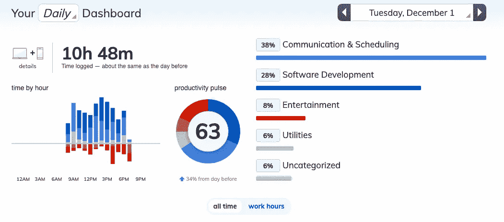

# 在家工作时，我如何将工作效率提高一倍

> 原文：<https://blog.devgenius.io/how-i-doubled-my-productivity-while-working-from-home-501aa29e02e4?source=collection_archive---------9----------------------->

今年是有趣的一年，尤其是因为世界上许多人——尤其是科技行业的人——结束了长时间在家工作。

在家工作曾经被认为是工作场所的耻辱。雇主们似乎怀疑你在这样一个令人分心的环境中如何高效工作。不用说，这已经被证明是可行的，但我没有预料到的是，它将如何成为生产力实际增长的催化剂。让我们来看看造成这种情况的一些因素。

由[弗兰克·布施](https://unsplash.com/@frankbusch?utm_source=unsplash&utm_medium=referral&utm_content=creditCopyText)在 [Unsplash](https://unsplash.com/s/photos/chart?utm_source=unsplash&utm_medium=referral&utm_content=creditCopyText) 上拍摄的照片

# 追踪你的生产力

任何伟大变革之旅的第一步都是收集数据。收集关于你从哪里开始，每一步你做了什么，以及最终你在哪里结束的数据。像生产率这样主观的东西，这是很难做到的。对我来说，我已经使用 [RescueTime](https://www.rescuetime.com/) 取得了很好的结果，这是一个工具，它可以显示我在任何给定的一天里在哪里度过的时间的摘要。

RescueTime 最近的快照

就像他们说的，马后炮是 20/20。有了这样的信息，就很容易反思和发现你在哪里浪费了时间，在哪里你可以获得额外的生产力。

(每当我看到我的统计数据时，看到我每天在 Slack 上花了多长时间起初有点不和谐，但后来我记得，平均而言，办公室工作人员一天中大约有 28%的时间花在电子邮件上。)

跟踪你的时间花在哪里不是你应该跳过的步骤。这就像训练你的身体。如果你正在努力减肥 10 公斤，但从未踏上秤，你怎么知道它是否有效？

如果你正在努力提高你的工作效率，但是没有办法衡量，那么祝你好运。

# 避免多重任务

人类擅长很多事情，但通常不擅长多任务处理，或者记住很多小事。这导致了一个众所周知的问题，叫做“上下文切换”，当你试图在多项任务之间切换时，你的工作效率会急剧下降。

发生这种情况有几个原因，但本质上，你围绕一项任务创造的“环境”由许多小信息组成，你需要把这些小信息记在脑子里以完成任务。如果在任何时候，有人或事打断了你的任务，所有这些小的上下文都有丢失的危险。即使分心只有一分钟，任务之间切换的成本也会让影响远大于仅仅 1 分钟。

根据[托德等待](https://insights.sei.cmu.edu/devops/2015/03/addressing-the-detrimental-effects-of-context-switching-with-devops.html)

> [……]项目之间的切换需要团队成员的运营开销，以确定他或她从哪里停止，需要做什么，该工作如何适应项目，等等。一旦一个团队成员被分配了五个项目，他或她对任何给定项目做出贡献的能力就会下降到 10%以下，80%的努力都浪费在了项目环境之间的切换上。

上下文切换的影响是众所周知的，也是无法克服的。不管你认为自己在多任务处理方面有多好，很可能你给了自己太多的信任。正确应对上下文切换影响的唯一方法是尽可能地将其从等式中移除。

卡尔·纽波特[的优秀著作《深度工作》](https://www.amazon.com.au/Deep-Work-Focused-Success-Distracted/dp/0349411905/)深入探讨了这个话题，并详述了你可以用来从重要任务中获得最大收益的系统。如果你要从这篇文章中学到什么，就让它成为这篇吧。

不要一心多用。它不起作用。

# 将一切外在化

这对我来说是个大问题。

我知道说“不要一心多用”很容易。实际上，这要困难得多，因为即使你不打算这么做，所需要的只是一个错误的 Slack 消息，然后 Boom，上下文切换。(值得注意的是，RescueTime 有一个很棒的 Slack 集成，可以在焦点时间静音通知。黑仔特稿)

那么，我们应该如何解决这个问题呢？在听了[克里斯·贝利的“生产力项目”](https://alifeofproductivity.com/the-productivity-project/)之后，他谈到了将你的待办事项清单外部化的好处，我开始对清单有点着迷了。起初，这正是克里斯建议的。如果你有需要做的事情，把它写下来，这样你就不用再去想它了。

最终，这演变成了某种滚动的“工作日志”。我尝试了一些工具，最终决定采用[概念](https://www.notion.so/)(但是你可以使用任何东西)。

这个想法很简单。我们*知道*我们会被打断，我们*知道*当我们被打断时，会降低我们的工作效率，因为我们会丢失大脑中所有的上下文。

但是，如果我们可以将上下文外部化呢？

当处理有很多活动部件的复杂问题时，只要有新的值得注意的进展，比如发现、问题或解决方案，我都会记下来。不需要太详细；这只是给你未来的自己的一个笔记，这样当你不可避免地分心时，你的笔记应该包含所有你需要从你离开的地方重新获得的信息。

这些信息可能是你目前正在努力解决的挑战，你仍然需要完成的待办事项，甚至是你正在使用的系统的一些小趣闻，你不想花时间去记住，但又不能忘记。

听起来不像它应该有一半的效果。

使用这个系统，我已经能够在很大程度上减轻我通常在上下文切换时所承受的负担。我不用担心午休会丢了位置。我不必害怕每一条传来的无聊信息，而且我相信，当我们大规模返回办公室时，我不必担心肩膀上不经意的轻轻一拍会让我脆弱的精神家园轰然倒塌。

如果这给了你一些提高工作效率的想法，或者你有自己的小窍门，我很乐意听听你的意见。在下面留下评论，或者在 Twitter 上关注我**了解更多类似的内容。**