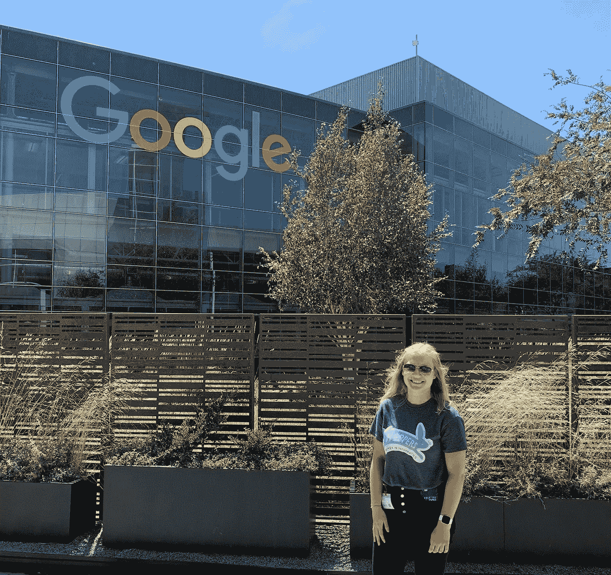

# 我是如何在谷歌获得实习机会的

> 原文：<https://blog.devgenius.io/how-i-got-a-step-internship-at-google-1c7aa346e6cd?source=collection_archive---------3----------------------->

我去年在 Instagram 上发布了一篇文章，标题是“假装成谷歌员工的一天”#fakeittillyoumakeit，照片来自谷歌山景城办公室。当时，这显然是一个笑话。我一点也不知道，几个月后，我将签署一份在我梦想中的公司实习的聘书。

# **这一切是如何开始的**

11 月 8 日，谷歌的一名招聘人员通过电子邮件联系了我。她有我申请奖学金的简历，认为我可能会对 STEP 实习感兴趣(暑期见习工程项目，一个针对大学一年级和二年级学生的软件工程实习)。在我回答了几个关于我的 GPA 和编程经验的问题后，我们安排了一次聊天来更多地谈论这个项目，并确认我符合所有的正式要求。

> 小贴士:通过申请他们的奖学金，参加他们的比赛，或者参加他们的校园活动来表达你对这家公司的兴趣。

招聘人员认为我很适合，于是我进入了下一阶段。首先，我必须填写一份关于我的兴趣、偏好和过去项目的调查问卷。然后，我需要在接下来的两周内安排我的技术面试。

> 提示:问卷在主机匹配阶段非常重要(如下所述)，所以我建议花些时间思考一下答案。

# **技术面试**

整个过程中最伤脑筋的部分之一是技术面试。有太多的谣言说它们是为了欺骗你而设计的，几乎不可能通过，如果你从出生起就没有编程，很难相信你还有机会(尽管我有两个哥哥都在科技行业工作，但我肯定没有——事实上，我在大约 17 岁之前不想与编程有任何关系)。

我的两次面试都是在 11 月 27 日，也就是谷歌第一次联系我的 3 周后。我大多是用 [*破解编码面试*](https://www.amazon.co.uk/Cracking-Coding-Interview-6th-Programming/dp/0984782850/ref=sr_1_1?adgrpid=52066480006&dchild=1&gclid=Cj0KCQjwoPL2BRDxARIsAEMm9y8R69R9_pwO323SnDocYb4PNaLYPypKQcSWLfJJvx0AgzhnOLx9LW0aAlMHEALw_wcB&hvadid=259122221188&hvdev=c&hvlocphy=9046888&hvnetw=g&hvqmt=e&hvrand=12967863975768995316&hvtargid=kwd-300294466709&hydadcr=17613_1817768&keywords=crack+the+coding+interview&qid=1591531114&sr=8-1&tag=googhydr-21) 和 [HackerRank](https://www.hackerrank.com) 来准备的，考虑到时间不多，一天也就学习了几个小时。

> 小贴士:如果可以的话，在你申请之前，提前几个月开始准备——这将为你以后省去很多压力。

事实证明，面试并不像有些人描述的那样糟糕。谷歌的面试官实际上希望你成功，他们尽力让你感到舒服。我收到的问题很有挑战性，但是感谢良好的氛围，我几乎感觉到我在和我的朋友们一起解决问题。

> 小贴士:面试时不要沉默——如果你不知道什么，不要害怕提问。

我的招聘人员告诉我，我必须等待大约两周才能得到反馈，果然，在 12 月 10 日，我收到了一封电子邮件，告诉我招聘委员会决定我将进入实习生安排面试阶段。我刚要开始上班的时候看到了，我记得我的手开始发抖。这仍然不意味着我会得到一个报价，但感觉很好，有可怕的技术部分在我身后。

# **主持人匹配面试**

另一个步骤是主持人匹配过程，在此过程中，您的个人资料和所有信息(简历、面试反馈、前面提到的问卷)将被添加到候选人名单中，潜在的主持人可以访问这些信息来决定他们是否要为他们的团队面试您。面试不是技术性的，纯粹是为了让你和主持人看看你是否适合这个团队。找到一个合适的人选可能会持续 8 周以上，大多数实习生在得到工作机会之前都会有几次面试。

当我第一次听说这个时间框架时，我感到非常紧张——大约在同一时间，我收到了另一家公司的邀请，而我只有一周的时间来签署它。我知道我不能延长那份工作，在那种情况下，除了谷歌，这是我暑期实习的唯一选择。

幸运的是，我很幸运地在几天后获得了我的第一次(也是唯一一次)主持人匹配面试——这是一个与我的兴趣完全匹配的团队，并且位于我非常想实习的苏黎世。我不得不等待几天的官方反馈(潜在实习生和主持人都提交了他们的反馈，如果他们都满意，那么要约就被起草了——否则，实习生的信息就会回到候选人库中)。12 月 24 日，我被正式告知反馈是积极的，我的提议将在圣诞假期后发给我。这可能是我收到的最好的圣诞礼物；)

> 小贴士:如果你到了匹配主持人的阶段，并不能保证你会得到一份工作，所以在面试中尽你所能，真正表现出你的兴趣。也就是说，要真诚——从一个完全不符合你兴趣的团队那里得到一份工作是没有意义的。

仍然很难相信我最大的梦想之一会在不到一个月的时间里实现。尽管今年的实习必须是虚拟的，我不会获得完整的体验，但我仍然很兴奋，迫不及待地想看看这个夏天会带来什么。