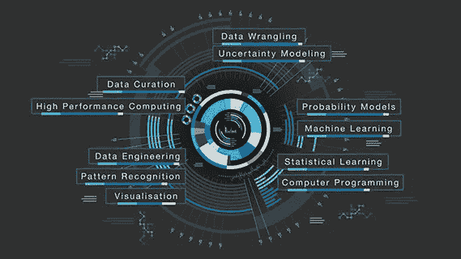

# 我是如何进入编程的

> 原文：<https://blog.devgenius.io/how-i-got-into-programming-d1ddb0d797ad?source=collection_archive---------25----------------------->

我不知道去哪里。还是有兴趣，决定一年后走哪条路。现在，该说说我是怎么进入编程的了。

## 1-我在人工智能和数据科学之间犹豫不决

在区块链之前，我对数据科学和人工智能感兴趣。我随机找了免费的数据科学和人工智能课程。而且我申请了 WorldQuant 大学的科学计算和数据科学中的 python 程序。我第一次被拒绝，但一年后我设法通过了他们的测试。

## 2-我爸爸阻止我学习编程课程

当我咨询了一位计量经济学教授，找到了正确的方法后，情况发生了变化。除此之外，一个邻居是软件项目的项目经理，他帮我画出了我的道路。我真的不知道怎么感谢他才好。

## 3-区块链、人工智能和 Consensys 学院考试

我没有通过 Consensys 学院的考试，但仍然同时在两个领域努力。直到我被迫做出选择。我选择了区块链，让自己远离沉重的负担。但是，我不得不停止学习编程，因为我试图建立一个俱乐部。尽管我不得不付出高昂的代价，但这还是很棒的。尽管如此，这是非常值得的。

## 4-建立俱乐部，并在我停下来的地方继续

这是我全力以赴编程的地方。因此，我学习了 JavaScript 的基础知识，并成为 Python 的中级水平。这是我被 Python 的科学计算和数据科学项目录取的时候。更重要的是，院长帮助我们联系了一个非政府组织，以提高我们在为学生编程方面的知识。

## 5-当隔离来袭时

这确实是学习编程的最佳时机。下载以太坊环境，学习 Python OOP 并开始统计分析，学习以太坊基础扎实。我完全找到了我想去的地方，从未如此快乐过。现在，随着编程知识的增加；我肯定可以做更多的事情，不管统计和区块链编程。

*你是怎么开始编程的？请在下面的评论区分享你的经历。*