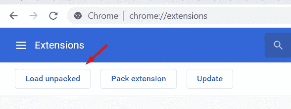
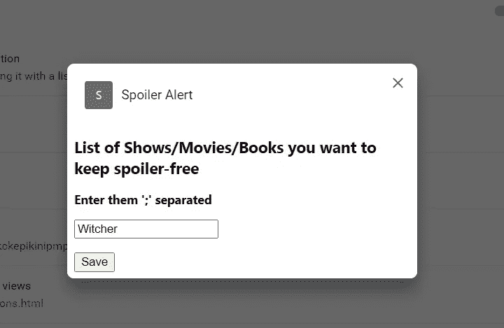
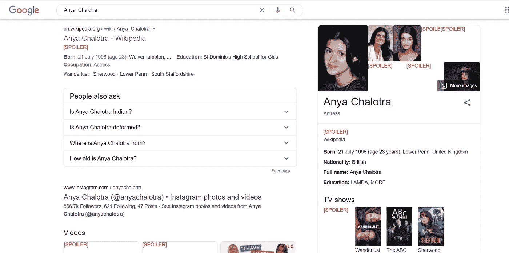
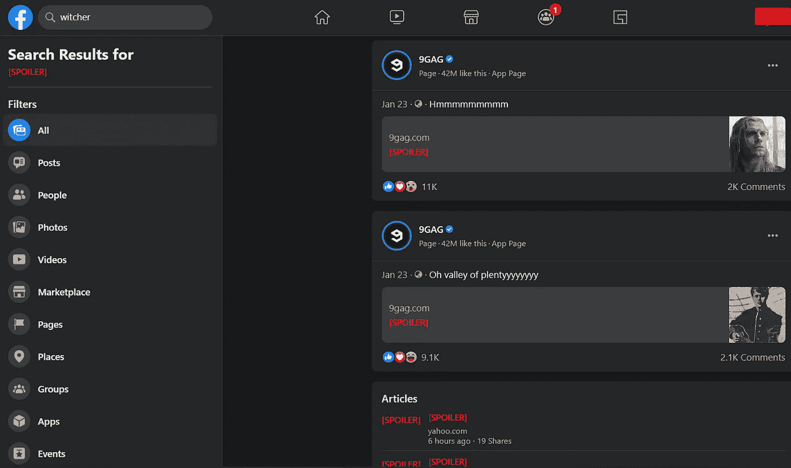
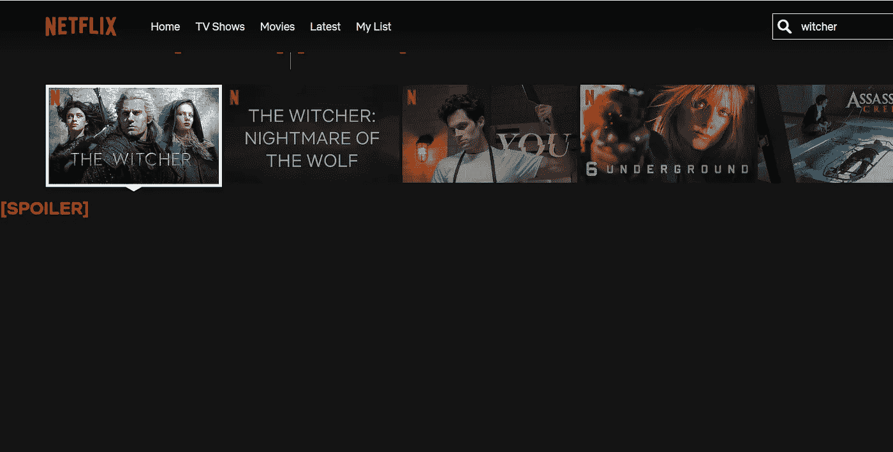

# 我如何保持我的浏览器不受干扰(Javascript)

> 原文：<https://blog.devgenius.io/how-i-kept-my-browser-spoiler-free-javascript-91fa32530f75?source=collection_archive---------16----------------------->

编写一个 chrome 扩展，帮助你避开任何剧透，电视节目，文学，电影。


**1。写一个** [**的清单**](https://developer.chrome.com/extensions/manifest) **文件。**内容脚本的 JSON 对象接受 matches 等参数，这是一个正则表达式，用于决定内容 js 文件将运行哪些网页。

```
{ 
 "manifest_version" : 2, 
 "name" : "Spoiler Alert", 
 "description": "Proividing it with a list of literature, TV, Films that whose spoilers you want to keep away",
 "version" : "0.103",
 "content_scripts" : [ 
  { 
   "matches" : [ 
    "*://*/*" 
   ], 
  "js" : ["content.js"]
  }
 ]
}
```

**2。将 option_ui 添加到清单中，以便我们可以接受用户的输入。在我们的例子中，我们将采用用户想要避免的各种文献/媒体。我们还需要添加存储权限，这样我们就可以使用 [chrome.storage](https://developer.chrome.com/apps/storage) API 来存储用户输入。**

```
{
"manifest_version" : 2, 
 "name" : "Spoiler Alert", 
 "description": "Proividing it with a list of literature, TV, Films that whose spoilers you want to keep away",
 "version" : "0.103",
 "content_scripts" : [ 
  { 
   "matches" : [ 
    "*://*/*" 
   ], 
  "js" : ["content.js"]
  }
 ],
 **"options_ui": {
     "page": "options.html",
     "open_in_tab": false
 },
 "permissions": [
     "storage"
 ]**
}
```

**3。编写选项页面**。定义了一个文本框供用户提供“；”独立的内容以防止剧透，以及一个具有触发功能的按钮以将值存储在 chrome.storage 中。使用 chrome.storage.sync 可以在用户级别进行处理。也就是说，你可以在用户登录的任何 chrome 浏览器上读取存储内容。

*options.html:*

```
<!DOCTYPE html>
<html>
 <body>
  <h2>List of Shows/Movies/Books you want to keep spoiler-free</h2>
  <h3>Enter them ';' separated</h3>
  <input type="text" id="collection" name="collection"><br><br>
  <button id="save">Save</button>
  <script src="options.js"> </script>
 </body>
</html>
```

*options.js :*

```
// Saves options to chrome.storage
document.getElementById(“save”).addEventListener(“click”, save_options);
function save_options() {
 var collection = document.getElementById(‘collection’).value;
 console.log(collection);
 chrome.storage.sync.set({‘collections’: collection.split(“;”)});
}
```

**4。编写 content.js** 遍历 HTML 元素，如果包含用户提供的媒体元素之一，则用 ***【剧透】*** 替换这些元素。

```
window.onload = function() {replace()};
window.onscroll = function() {replace()};function replace() {

 var tags = ["p", "span", "h", "h3", "a"];
 let spoiler = "<h1 style=\"color:#FF0000\">[SPOILER]</h1>";chrome.storage.sync.get(['collections'], function (retVal) {
  var precious = retVal.collections;
  for (element of precious){
    if(element != ""){
      item = element.toLowerCase().trim();
      for(tag of tags){
        let currentTag = document.getElementsByTagName(tag);
        for (elt of currentTag){
          if(elt.innerHTML.toLowerCase().indexOf(item) != -1)
             elt.innerHTML = spoiler;
          }
        }
      }
    }
 });
}
```

**5。将延伸部分装载到 chrome** 上。将包含所有文件的扩展项目文件夹添加到 chrome://extensions



chrome 扩展页面截图

尝试网飞系列《巫师》的延伸。



将巫师设定为你想避免的剧透



谷歌搜索巫师演职人员



在脸书寻找巫师



在网飞寻找巫师