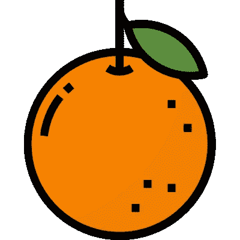

# 我如何制作一个 chrome 扩展，使用声音识别来控制网页上的 DOM 元素。

> 原文：<https://blog.devgenius.io/how-i-made-a-chrome-extension-that-uses-vocal-recognition-to-control-dom-elements-on-a-webpage-a3a5cb19a584?source=collection_archive---------18----------------------->

所以最近我发表了我的第一个 chrome 扩展“orange”。它允许用户用他们的声音控制任何网页。“orange”与其他语音识别 chrome 扩展的区别在于，它允许用户录制自己的命令。这对于控制 Spotify、网飞和 Youtube 等网站上音频和视频播放非常有用。

[链接到 chrome 商店的 Chrome 扩展模块](https://chrome.google.com/webstore/detail/orange/ibamdegelmgihmnlomabhfkomnpdfjmc)



从下拉列表中点击记录；那么网页上可控制的按钮将以橙色标出。一旦你点击一个按钮，你将被提示说出一个单词；这将是命令字。在说出你选择的任何单词后，你的控制事件被记录下来！点击开始激活您的麦克风，每当您说“橙色<command word=""></command>”时，分机将触发您之前记录的事件。

在这篇文章中，我将回顾我是如何产生这个想法的，以及我是如何编写代码的。我也会检查我认为需要改进的地方和未来的计划。

所以我第一次想到这个主意是在玩这个演示的时候:[https://www.google.com/intl/en/chrome/demos/speech.html](https://www.google.com/intl/en/chrome/demos/speech.html)

web speech API 背后的工程团队能够实时执行语音识别服务器端，这给我留下了深刻的印象。不容易的壮举！我想这个扩展应该能够处理除了语音到文本之外的动作。想法就是这样开始的。

这些扩展如何工作的主要逻辑是一个简单的对象。对象的键是记录的命令字，那些键的值是记录的 DOM 元素(按钮)。记录事件存储这些值，然后开始事件返回它们。

```
{[“command_word_1]: “button 1”,[“command_word_2”]: “button 2”,}
```

为了防止 DOM 元素在不需要的时候被触发，我添加了检查字；橙色”。橙色这个词被选为一个内部笑话。没有其他东西和它押韵，这样就有希望避免任何识别错误。

每当扩展看到单词“orange ”,然后下一个单词是主对象中的一个键，它就会知道调用记录的 DOM 元素。

```
//Recorded commands
const output = {['play']: “button 1”,['pause']: “button 2”,}// Example input: ['', '', 'orange', 'play', '']//If the input includes 'orange' and the word after 'orange' is 
//a recorded command key, like "command_word_1", then the return //will have the command key value, "button 1"if (input.includes('orange')) {
let return = output[command.indexOf('orange') + 1];
}
```

为了管理语音识别输出的数据流，我使用了布尔值，它将根据 popover 菜单的输入进行设置。

```
let start = false;let record = false;let stop = trueif (popover.message === “start”){stop = falsestart = true....}if(popover.message === “record”){start = falserecord = truestop = true...}
```

一旦我有了基本的功能，我注意到我想用很多相同的词作为命令词，但用于不同的页面。我想为 Spotify 和 Youtube 调用“orange play”。因此，解决方法是将嵌套对象存储在父对象中，父对象的键由记录命令的页面的主机 URL 组成。现在，我可以为多个站点使用类似的命令，如“播放”和“暂停”。

```
//Updated recorded command object{ www.youtube.com : { ['play']: “button 1”, }, www.netflix.com : { ['command_word_1']: “button 1”, },
}
```

编写这个扩展的最大障碍是在扩展的每个范围之间传递数据。我有一个后台脚本，它运行声音识别实例并存储命令。还有一个与 DOM 交互的内容脚本，它充当每个动作的外部和入口点。内容和背景都在来回传递信息。当事件被记录在客户端时，客户端脚本将数据传递到后台。当一个命令被调用时，后台将数据传递给客户端。消息传递的方式是使用 Chrome API。它最大的缺点是不能发送或接收整个 DOM 元素；我不得不满足于传递 DOM 元素类名的字符串变量。从那里，我可以根据事件存储或搜索类名。

这导致了 orange 最大的局限性。它不能处理 SVG Dom 元素。大多数 SVG 元素都有相同的类名。所以如果我按类名搜索，我会得到多个结果。当然，现在任何元素都可以与其他元素共享类名，但是对于大多数主要网站，如 Youtube、Spotify 或网飞(orange 与这些网站合作得很好)，单个 DOM 元素至少有一个特定的类名。

接下来，我更想关注的一个领域是改进语音识别。如果音频输入有噪音，它会变得不太准确。因此，如果你正在播放音乐，并试图给“橙色”一个命令，那么它将很难识别这个命令。

一种解决方法可能是在发出命令时降低音量。这可能会稍微改善识别，但是首先识别命令仍然会有相同的限制。

另一种解决方法是过滤发送到识别实例的音频。因为我只关心识别人的声音，所以我可以计算出低于 400 赫兹的频率(人的声音会降低，但识别低于 400 赫兹的单词可能不会被错过)和高于 10 千赫兹的频率。这些只是非常粗略的估计，但主要思想是缩小输入音频的范围，只关注语音。此外，我已经看到一些令人印象深刻的技术，可以过滤掉所有频率的噪音，只留下改变的声音。可能有很多 javascript 来处理哈哈，但可能会有一个更智能的过滤器。

无论如何，希望你觉得这本书有趣。如果你想聊聊这个扩展或者看看有什么可以改进的地方，请在下面留下你的评论。