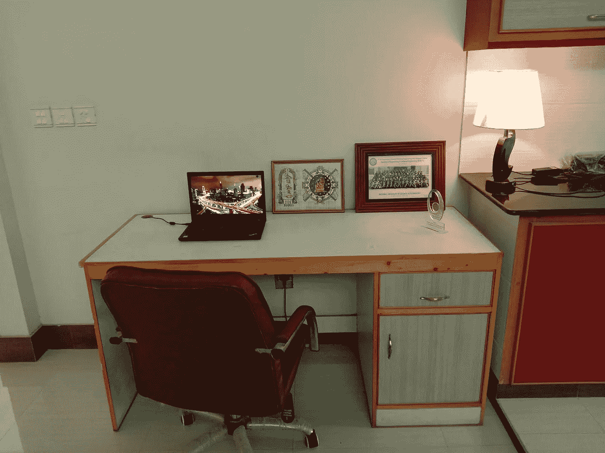
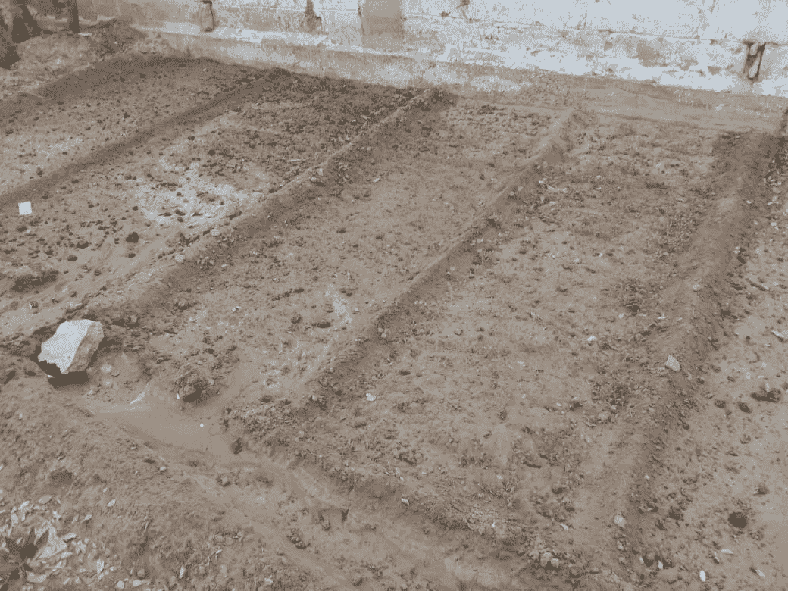
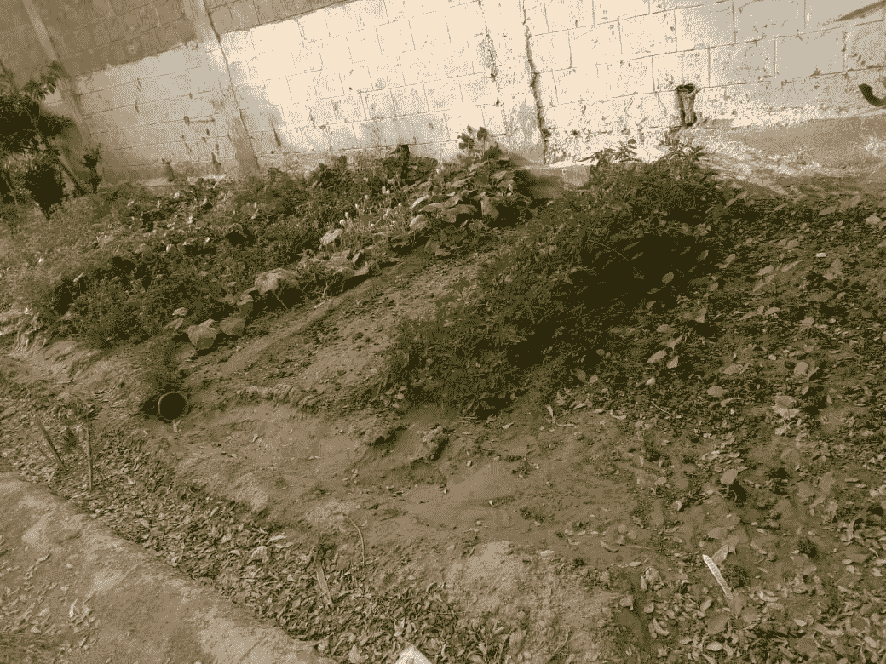
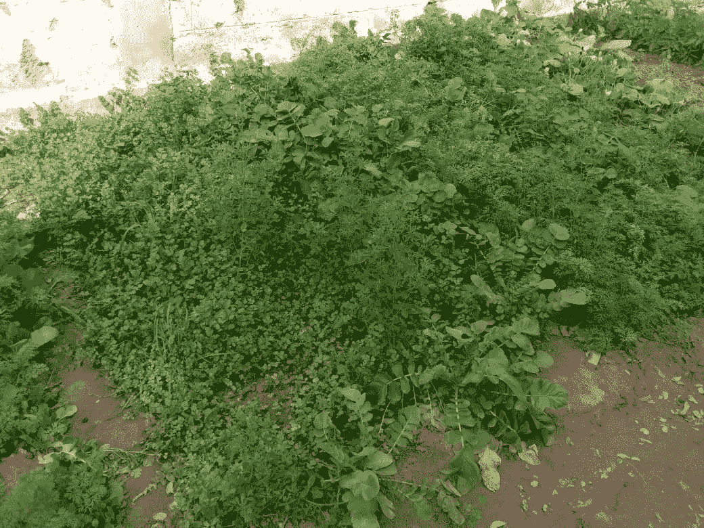

# 我如何让我的锁定/在家工作富有成效(鼓舞人心)

> 原文：<https://blog.devgenius.io/how-i-made-my-lockdown-work-from-home-productive-inspirational-1876298c0d43?source=collection_archive---------5----------------------->

不是很好的照片，但这是我的远程办公室

新冠肺炎改变了事情的运作方式。当疫情开始时，各国开始实施封锁，因此公司不得不要求他们的员工在家工作，因为工作必须继续。全球都有旅游禁令，一些公司不得不裁员。但与此同时，一些公司发现了所有这些机会。远程工作和在家工作各有优势。

1.  公司不必为他们的办公室以及安全和办公室维护支付电费。
2.  员工不必燃烧燃料去上班，因此他们节省了时间和金钱。

在 IBM 工作也有类似的优势。我从事远程项目已经有一年半多了，那时还没有实施封锁，也没有出现新冠肺炎。就个人而言，我可以跳过交通时段，因为我去现场客户办公室的路线单程约 35 公里，在我开始远程项目工作之前，我花了 1 个小时开车去上班，1.5-2 个小时开车回来(这在我所在的城市很常见)。

就我个人而言，我将远程工作视为一个机会，因为它节省了我的燃料(每月大约 100 美元)和每天 2.5 到 3 小时的旅行时间。这也让我有更多的时间花在这个项目上，和家人在一起，还有一些其他的事情，如果我每天都要去上班的话，我是不可能做这些事情的。

# 园艺:

我发现，园艺是我在家工作时可以做的事情，而且不会影响我的项目时间。我所说的园艺，并不是指全部由我一个人完成，而是指监督我的园丁，让我的前院和后院变得更好。我抽出时间来看看哪些地方可以改进，如何改进。我观察到在我的区域，我的邻居很少种植蔬菜，所以我想我可以投资一些钱在我的区域种植蔬菜。我家外面有一块空地，平时被走在路上的人当做垃圾箱。我决定用那个地方种菜。(我希望我捕捉到了它的照片，以显示前后的情况)。

在清理完这个区域并整理好之后。

在计划、决策、选择蔬菜和种植之后，我照了上面的照片。承蒙真主的恩典，已经过了 3-4 个月，我的蔬菜已经长好了，我们可以吃健康的自家种的蔬菜了。这些蔬菜包括菠菜、胡萝卜、胡芦巴(methi)、大根(mooli)，还有西红柿、胡椒和青椒还没有种植和收获。大约 3-4 个月后，我们得到了以下结果。

在过去的 3-4 个月里，我只是在监督我的园丁这样做后才设法得到这个结果。

在这个过程中，我学到了监督或管理的重要性。虽然我没有亲自做园艺，但我帮助规划，监督和确保工作已经完成，并处于良好状态。

# 吸取的教训:

我提倡从生活中吸取教训。种植蔬菜的经验如下:

1.  项目管理对于任何项目/任务的成功都至关重要。如果我只是投资，而不是亲自监督工作，那么结果可能不会如我所愿。
2.  如果可以的话，公司应该允许在家工作的政策。不是所有的工作都可以在家里完成，比如客户指定的工作，或者工业制造或建筑，但是可以在家里完成的工作应该被允许。它利大于弊。
3.  如果我可以每天节省 2.5-3 小时的旅行时间，并通过每天花费少于 10-15 分钟(平均)来做一些有成效的事情，那么所有在家工作的人也可以做一些他们感兴趣的事情。
4.  随着视频会议和在线协作软件使用的增加，在家工作变得比以往任何时候都容易。
5.  单独节省燃料和时间会产生连锁反应，那些主要进口燃料的国家可以节省这些钱，也可以为国家做一些更有成效的事情。

# 结论:

节省时间和金钱，做一些有成效的事情。

快乐阅读！！！！！！！