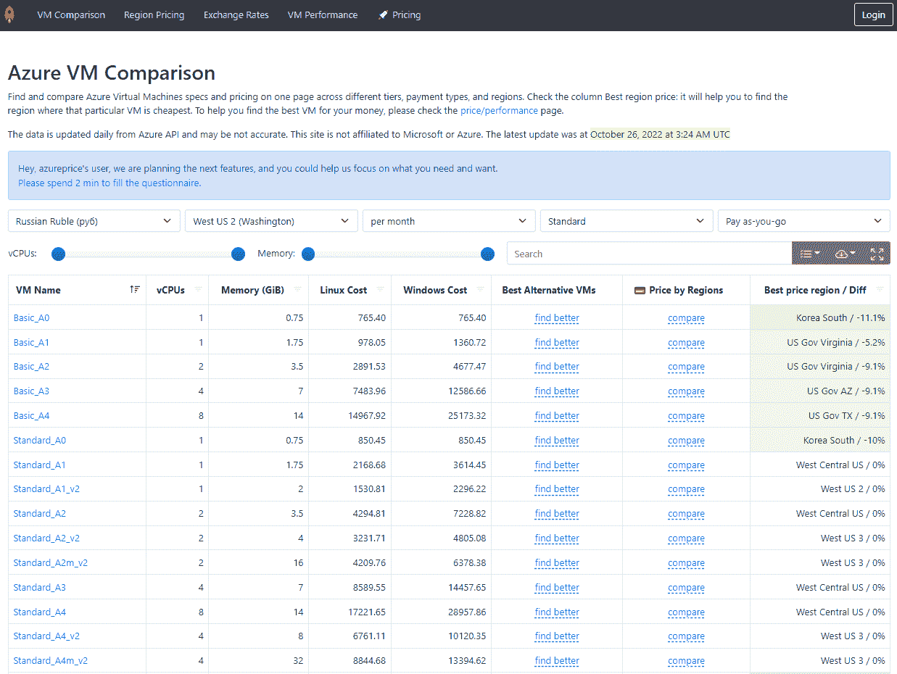
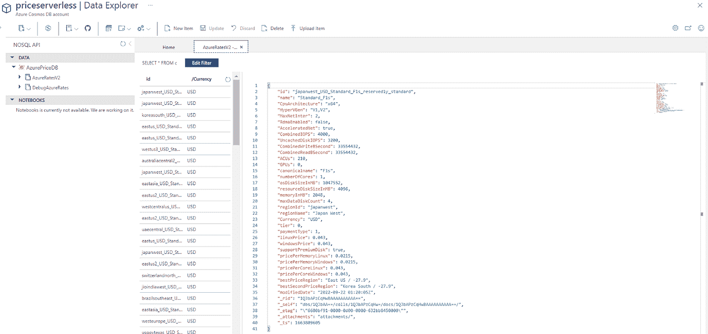
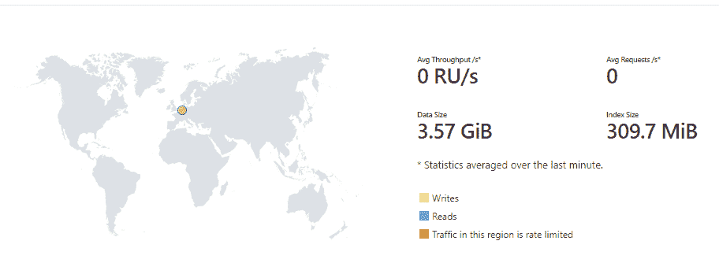
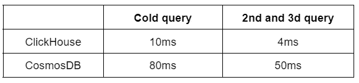
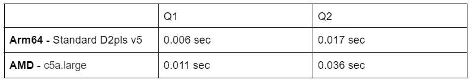
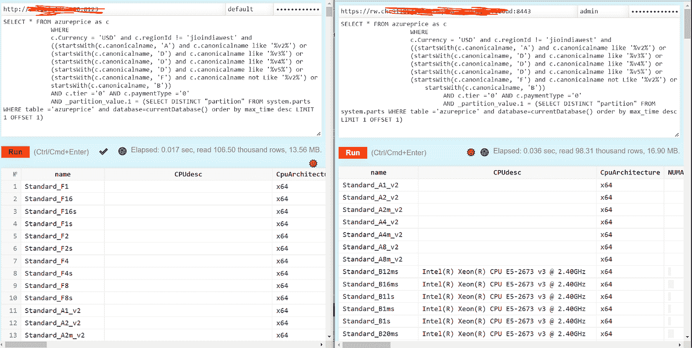
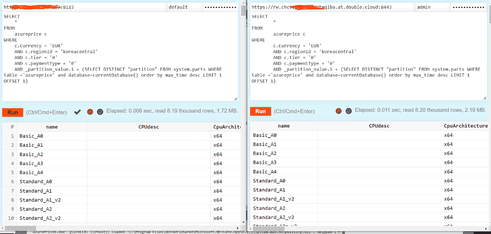

# 我如何迁移到 Clickhouse 并使我的后端速度提高 7 倍，成本降低 6 倍，第 1 部分

> 原文：<https://blog.devgenius.io/how-i-migrate-to-clickhouse-and-speedup-my-backend-7x-and-decrease-cost-by-6x-part-1-2553251a9059?source=collection_archive---------5----------------------->

五年前，当我在微软工作时，我建立了一个小项目——[azureprice.net](http://azureprice.net)而不是**作为帮助自己的工具。这是一个简单的备忘单页面，列出了 Azure 上所有可用的虚拟机，能够通过搜索或过滤快速找到虚拟机。5 年前，Azure 计算器和 Azure 网站并不擅长完成它们的任务，老实说，它们仍然不怎么样。**

**下面我将描述几周前我如何优化我的主数据库，从 CosmosDB 迁移到 ClickHouse，在那个项目中，速度提高了大约**7 倍，**成本降低了**6 倍，**和优化了**存储****44 倍**，而没有任何模式变化(疯狂，对吧)。**

**通过这篇文章，我想强调针对适当的工作负载使用适当的技术的重要性，并评估技术，而不是基于存在另一种新奇或炒作的技术，或者使用您习惯的技术来完成每项任务。试着分析你的项目在 1-2 年内将如何发展，以及你将来需要从这项技术中得到什么。**

****

**azureprice.net 现在的日子**

## ****Azureprice.net 背后的想法****

**最初的想法很简单。这个项目非常简单:显示每个虚拟机的规格。当时，Azure 上只有 50 种不同的虚拟机类型。**

**这个项目是用 C#写的。net，托管在 Azure 上，并将所有数据存储在 Azure CosmosDB 中——这是 5 年前作为 AWS DynamoDB 的竞争对手出现的。是的，对于数据库有更好的选择，特别是对于这 5 年来项目所涉及的内容。**

**目前，该网站更多的是一个分析工具，帮助用户选择正确的虚拟机大小，比较技术规格，分析跨地区的定价，推荐使用机器学习的最佳选项等。**

**这是一个基于 Azure 函数的简单数据管道，每天触发并重新上传所有数据，包括定价和规格，来自官方的 Microsoft Azure API。**

**我将几千个 JSON 对象连接在一起，并以(反)规范化的方式将其保存为 Azure CosmosDB 中的 JSON 文档。每个文档都是定价数据和虚拟机规范的混合，这给了我相对较快的结果，因为我确实需要运行定价数据和虚拟机规范之间的任何连接。**

****

**CosmosDB 中的文档结构**

**从存储的角度来看，这不是最理想的，因为我为每个定价点存储了相同的虚拟机规范属性，但从速度的角度来看，这非常有效。**

**主要想法是提供最快的工具来查看信息，这个目标目前仍然有效。**

## ****速度和成本开始带来伤害****

**但是时间飞逝，很快，从 50 种虚拟机类型变成了 608 种。每个虚拟机的属性从 10 个增加到 30 个。**

**用户开始要求更多的功能和**聚合分析**,例如特定虚拟机在所有地区的最低价格，或者地区之间的平均价格比较或价格历史。**

**所有这些都很难在文档数据库上实现；因此，在大多数情况下，我创建了额外的 Azure 函数，这些函数是每日预先计算的**。****

**大量代码浪费时间连接数据库、获取数据、序列化/反序列化这些文档、计算指标并存储在 S3 中。哦，这真是浪费我的精力和时间来编写代码，并且仍然提供支持。**

**当你运行一个项目并从口袋里掏钱的时候，你会立即注意到所有地方的未优化成本。每当你看到这样的事情，你内心的声音就开始对你大喊大叫。**

**Azure CosmosDB 是一个无服务器的数据库，它基于您存储数据的量以及您插入和查询数据的量。**

**最后两个方面随着我的网站的受欢迎程度从每月 2k 用户增长到 30k，开始线性增长。但最大的成本来自插入/更新，因为我每天上传大约 450 万行，每次上传花费我大约 20-30 美元。**

****从 50 美元，一个月的费用涨到 300 美元**。**

****

**无服务器服务**

**那个时候，我每个月大约有 50-100 美元的利润，我开始越来越担心。**

**CosmosDB 有一个基线选项，但是它限制了这种情况下的吞吐量。我试图在上传之前自动缩放，之后再缩小，但仍然很痛苦，并且我得到了很多关于达到吞吐量极限的错误。**

**很明显，我需要将数据库更改为更适合我的工作量的东西。**

# **新的希望**

**大约一年前，我看到并向自己介绍了 [ClickHouse](https://clickhouse.com/) ，这是一个基于列的数据库，目标是让它像我的项目一样快。**

**它最初由 Yandex 开发，几年前开源，在 GitHub 上有大约+ [25k](https://github.com/ClickHouse/ClickHouse) ⭐ [，得到了社区的广泛支持，提交了**+100k**。](https://github.com/ClickHouse/ClickHouse)**

**几个月前，我花了半天时间分析我的项目如何使用 ClickHouse 作为主数据库。我的主要要求是:**

*   **快速查询以获得每个 azure 区域(500–600 个文档)的虚拟机列表，计算所有数据集的聚合，而与数据集大小没有任何关联。**
*   **与 CosmosDB 相比，消除成本增长，甚至进行优化。**
*   **易于部署和使用。网芯。**

**我在[https://double.cloud/](https://double.cloud/)为我们的小团队部署了 Clickhouse 开发和测试环境，以了解它将如何处理我们的工作负载和查询，从而避免在配置 SSL、备份、安全方面以及开箱即用的监控工具上花费时间。**

**我用一个 32GB gp2 磁盘来测试 2 个 vCPUs 和 4GB RAM 的最小实例。**

**使用几乎相同的数据模式范例和(非)规范化方法上传大约 4.5M 行的数据。**

**我需要解决的两件事是调整数据类型和找到一个好的。net 核心库与 Clickhouse 一起工作。**

**该模式非常简单，设置列类型非常简单。我只是将[低基数](https://clickhouse.com/docs/en/sql-reference/data-types/lowcardinality/)应用于一些属性，使属性类似于动态字典，以加快查询速度。**

```
CREATE TABLE default.price
(
 `name` LowCardinality(String),
 `CPUdesc` LowCardinality(String),
 `CpuArchitecture` LowCardinality(String),
….
 `bestPriceRegion` String,
 `bestSecondPriceRegion` String,
 `modifiedDate` DateTime,
 `_upload` Int32
)
ENGINE = MergeTree
PARTITION BY _upload
ORDER BY (regionId,  Currency, name, tier, paymentType)
```

**关于。net 核心库，我找到了最流行的几个:**

*   **[点击之家。Ado](https://www.nuget.org/packages/ClickHouse.Ado) ⭐210，Nuget 下载量:496.3K**
*   **[点击屋。客户端](https://www.nuget.org/packages/ClickHouse.Client) ⭐175，Nuget 下载量:272.0K**
*   **[ClickHouse.Net](https://www.nuget.org/packages/ClickHouse.Net)⭐54，Nuget 下载量:121.8K**

**最后我选择用 [ClickHouse。客户端](https://www.nuget.org/packages/ClickHouse.Client)因为它有一个更简单的 API 用于批量上传。**

# **基准测试的结果**

## **储存；储备**

**首先，我注意到了压缩。这是 ClickHouse 的一颗真正的隐藏宝石，我的 CosmosDB 数据集一天上传的数据**为 3.57 GB。****

****

**CosmosDB 中的数据大小**

**在 ClickHouse 中，同样数量的文档/行在磁盘上变成了**80MB；未压缩时，大约为 640MB，压缩率为 8 倍。****

**看起来 CosmosDB 在几个副本内存储数据，索引所有导致 3.5GB 的字段。与 ClickHouse 相比，差异是 44 倍。**

**将超高可用性 CosmosDB 存储与单节点 EBS 磁盘进行比较肯定是不诚实的。然而，如果我在高可用性配置(3 个节点)中使用 ClickHouse，差异仍然会是大约 15 倍。**

**我没有提到 ClickHouse 的 [S3 混合模式，它可以实现零拷贝数据存储。](https://clickhouse.com/docs/en/engines/table-engines/integrations/s3/)**

****查询速度****

**我将每次上传的数据存储在一个专用分区中，这在速度和重复数据删除方面给了我一些优势。我计划在文章的第 2 部分讨论这些内容。**

**我的大多数查询看起来像这样:**

```
SELECT
 *
FROM
 price c
WHERE
 c.Currency = 'EUR'
 AND c.regionId = 'westus2'
 AND c.tier = '0'
 AND c.paymentType = '0'
```

**我只需要一个过滤器使用 WHERE 语句，有时有分组依据。这几乎与我在 CosmosDB 中使用的查询相同，速度差异与其他类似的查询几乎相同。**

****

**注意:**

*   **CosmoDB 每页有最大条目数，在我的场景中，一页容纳不下这么多文档，这导致一次查询要花两倍的时间。**
*   **我没有提到需要计算平均值或对行进行更多计算的查询，因为 CosmosDB 不太适合这样的工作负载。**

## **奖金 ARM64 与 AMD 基准**

**我还运行了测试，以比较 Arm64 —标准 D2pls v5 (2 个 vCPU，4 个 GiB 内存)与 AMD — c5a.large (2 个 vCPU，4 个 GiB 内存)实例，它们具有相同的 vCPU 和 ram 特征。**

********

**查询 1(左臂，右臂)**

****

**查询 2(左臂，右臂)**

# **摘要**

**这次迁移花了我整整 3 天的时间，包括了解 Clickhouse 细节和列类型，以及迁移到另一个数据库的 SDK。**

**我得到了什么好处？**

*   ****不再有持续的成本增长**，我当前的实例使用 2 个 CPU 来处理工作负载，即使在高负载摄取期间也只使用了大约 5–10%的 CPU，内存也是如此。我将数据库的成本从每月 300 美元的**缩减到 50 美元的**6 倍！**
*   ****我解锁了能力**，并且已经实现了**价格历史**并开始存储，因为从成本和速度的角度来看，我不再有任何限制。**
*   **API 后端的速度从**200–400 毫秒提高到大约 50 毫秒，提高了 7 倍。****

**我希望其他人会考虑我的错误，并开始将正确的技术用于正确的工作负载。**

**第二部分是为那篇文章而发表的,涵盖了我如何在 ClickHouse 与重复做斗争以及面对一些怪癖和边缘的方方面面。**