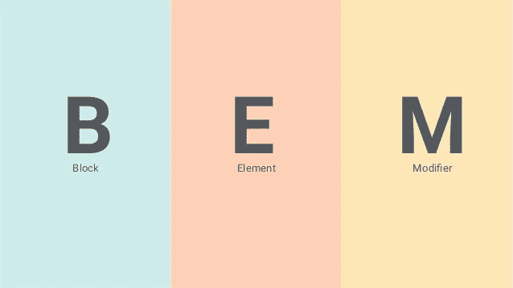

# 我如何为 React.js 组织 CSS

> 原文：<https://blog.devgenius.io/how-i-organize-css-for-react-js-7c9c212c1719?source=collection_archive---------1----------------------->

BEM！

你的 React 项目的 CSS 是不是乱成一个没有结构的 index.css 文件？你有一堆旧的 CSS 修饰符并且不确定它们是否被使用了吗？

换句话说，你的 CSS 是不是很乱，你需要一种组织 CSS 的方法来应对？不要再看了！这是我用来组织 React CSS 的系统。

我不是真正的专家，但在观看了其他经验丰富的 React 开发人员的一些 Youtube 视频并阅读了 BEM 之后，这些是我收集的一些技巧。

# 总是使用类名

首先，由于 React 的性质，使用类名而不是 id 来修改所有组件。

有一段时间，我同时使用了 id 和类名，因为我知道有些组件我只会使用一次，而有些组件我会多次使用。虽然这种逻辑在编写普通 HTML 元素时是有意义的，但 React 完全是为了创建可重用的组件。因此，React 总是在组件定义中使用类名是有意义的，不管它们会被使用一次还是两次。

老实说，是否使用 id 或类名并没有太大的关系，但就个人而言，我认为使用类名对 React 组件更有意义。此外，它看起来干净得多，因为一致性。

# 不列颠帝国勋章

BEM (Block，Element，Modifier)是 CSS 修饰符的一个流行的命名约定。它给出了元素的类名上下文和关联。

检查我的旧组件没有 BEM。

还有贝姆。

仅仅通过类名来理解元素是什么不是更容易吗？*这在使用 CSS 时会更加明显。*

## BEM 是什么？

BEM 对 CSS 的分类方式是块及其元素(也是修饰符，但我只说块和元素)。[阅读更多关于 BEM](https://css-tricks.com/bem-101/) 的信息。

块是某种抽象层次上的组件，它的元素是组成块的更小的部分。例如，如果你有一堆棒球卡，你可以这样看待它，每张棒球卡是一个积木。该块中的元素将是玩家的名字，他的统计数据等…

在 CSS 中是这样的:**(元素是用语法定义的:blockName__element。)**

如果您为 PlayerCard“块”创建了 React 组件。

**注意***** :通过使任何组件中外部 div 的类名与组件名相同，使类名一致且可预测！！**具有可预测和一致的命名使得查找和使用 CSS 更加容易。**

**对于嵌套组件，只需使用顶层块的名称**。您不需要指定它所嵌套的每个元素。

举个手的例子:

# 单独的 CSS 文件

最后，为每个 React 组件创建一个单独的 CSS 文件。

1.  保持独立的 CSS 将使你更容易找到你要找的 CSS。
2.  保持较小的 CSS 文件有组织和最新也更容易。
3.  更快地导航到 CSS 文件，因为 Name.css 将紧挨着 Name.js。这比每次想要修改组件时都试图找到 index.css 要好。

为每个组件创建和导入单独的 CSS 文件，看起来像是一堆工作。当你有很多组件的时候，但是它使得使用 CSS 更加容易。

对我来说，当我的代码被组织和结构化时，添加到一个大项目中就容易多了，这三个技巧帮助我保持了 CSS 的整洁和可管理性。

感谢阅读，希望这篇文章对你有所帮助！:)