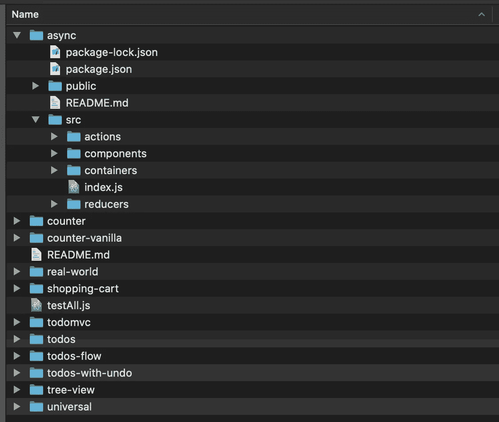
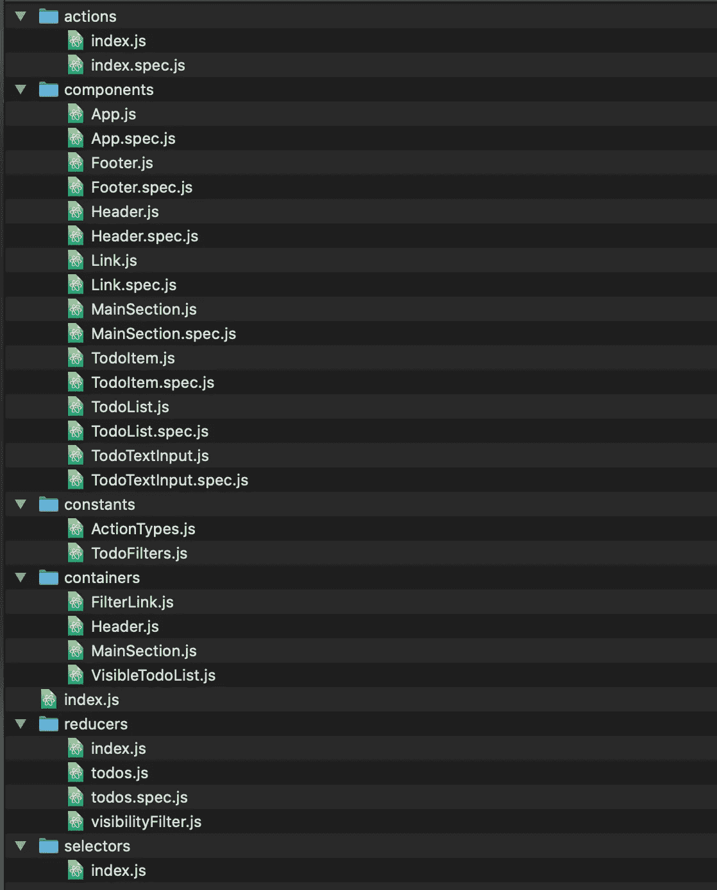
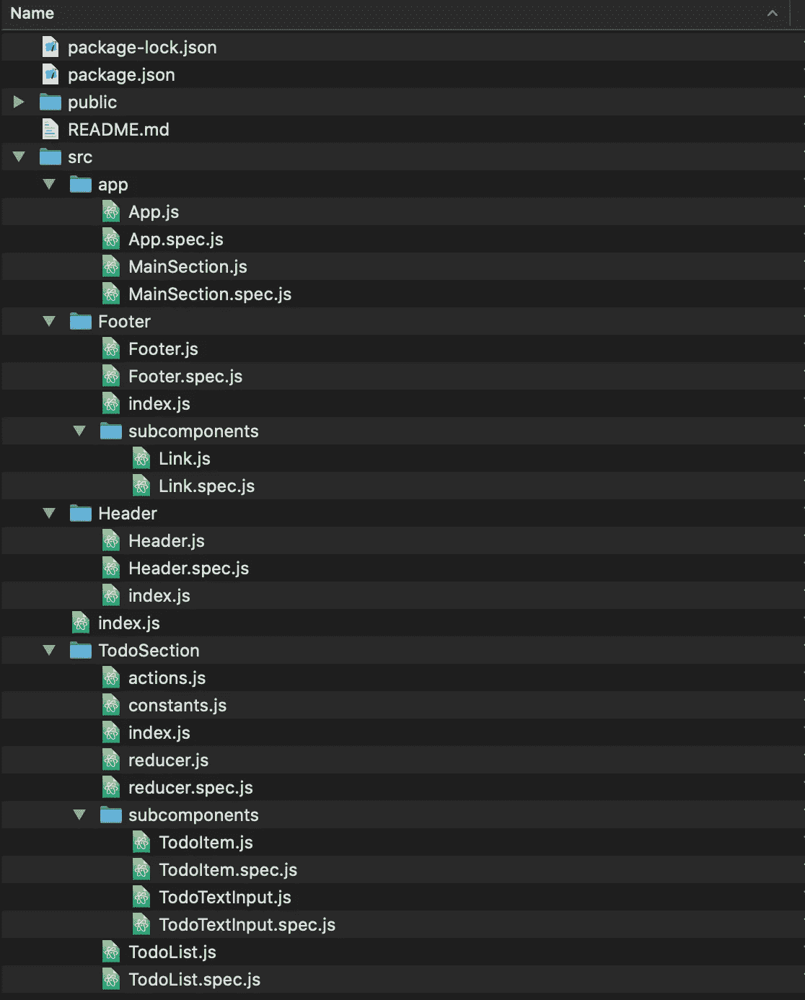

# 如何组织我的 react/redux 应用程序

> 原文：<https://blog.devgenius.io/how-i-organize-my-react-redux-application-cc39c0ebea0f?source=collection_archive---------12----------------------->


在 [Unsplash](https://unsplash.com?utm_source=medium&utm_medium=referral) 上由 [Max Duzij](https://unsplash.com/@max_duz?utm_source=medium&utm_medium=referral) 拍照

当我第一次学习 ReactJS 和 Redux 时，我学到了一个非常特殊的文件夹结构:按文件类型组织文件。在 redux 应用程序中，文件通常分为以下几类

*   成分
*   容器
*   还原剂
*   行动
*   常数

官方的 Redux [回购实例](https://github.com/reduxjs/redux/tree/master/examples)显示，文件按每个类别分类。



所有示例都遵循相同的文件夹结构

对于只有少量组件的小应用程序来说，这非常有意义。然而，随着应用程序变得越来越大，它变得越来越难以管理。让我们以 redux repo 中的 [todomvc 示例](https://github.com/reduxjs/redux/tree/master/examples/todomvc/src)为例:



谁有足够高的显示器能看到所有这些文件？

假设您正在构建一个使用 redux 连接的新组件。这意味着你必须与每个文件夹进行交互。随着添加越来越多的文件，尤其是添加规范文件，在文件树中展开所有内容变得难以管理。

当然，有快速浏览文件的键盘快捷键，但是，嘿，有时我只是喜欢点击侧边栏中的文件夹。

所以，我认为一个更好的组织可能是我喜欢称之为模块的组织。我对模块的定义是

> 一个独立的组件，处理所有的内部逻辑，对外部的依赖性最小。

这实际上意味着，我将拥有一个名为 TodoSection 的文件夹，而不是一个名为 components 的文件夹。

现在让我们重新看看 todomvc 的例子。以下是我组织文件的方式(请记住，这并不完全是一对一的关系。我主要是想演示一般的想法，非常肯定的应用程序不会再运行)



新的和改进的:)

该应用程序现在分为 4 个主要部分

*   应用
*   页脚
*   页眉
*   TodoSection

现在假设您需要构建一个连接到 redux 的名为“侧边栏”的全新部分。你所需要做的就是创建一个新的文件夹，并添加必要的文件，你只需要在这个文件夹下工作。

我喜欢使用的文件夹结构如下(使用 TodoList 作为模块名)

```
- TodoList
  - index.js
  - TodoList.js
  - actions.js
  - constants.js
  - reducer.js
  - subcomponents
    - index.js
    - TodoItem.js
```

*   `index.js` —这是使用`connect`映射 redux 状态和分派函数的容器文件。我也喜欢使用`[react-loadable](https://github.com/jamiebuilds/react-loadable)`来延迟加载模块。这是为渲染而导入的文件，因为如果从文件夹导入，节点默认为`index.js`文件。

```
import TodoList from '<path>/TodoList';
```

*   `TodoList.js` —这是组件本身。
*   `actions.js` —这里包含所有的动作创建者/thunk 动作。
*   `constants.js` —模块所需的任何常数。通常包含减速器中使用的常数。
*   `reducer.js` —负责减速状态的减速器。假设 redux 状态看起来像

```
{
  todoList: [{ id: 1, todo: 'buy milk' }, {...}]
}
```

*   `subcomponents` —任何在主要成分中重复使用的提取成分。我也喜欢用一个`index.js`文件来组织这个文件夹。我是这样使用它的

这个设置允许我在一行中导入多个子组件。这可以节省空间(有时)。

你有什么想法？你喜欢如何组织你的 React/Redux 应用程序？