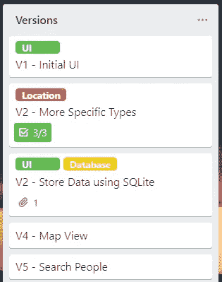
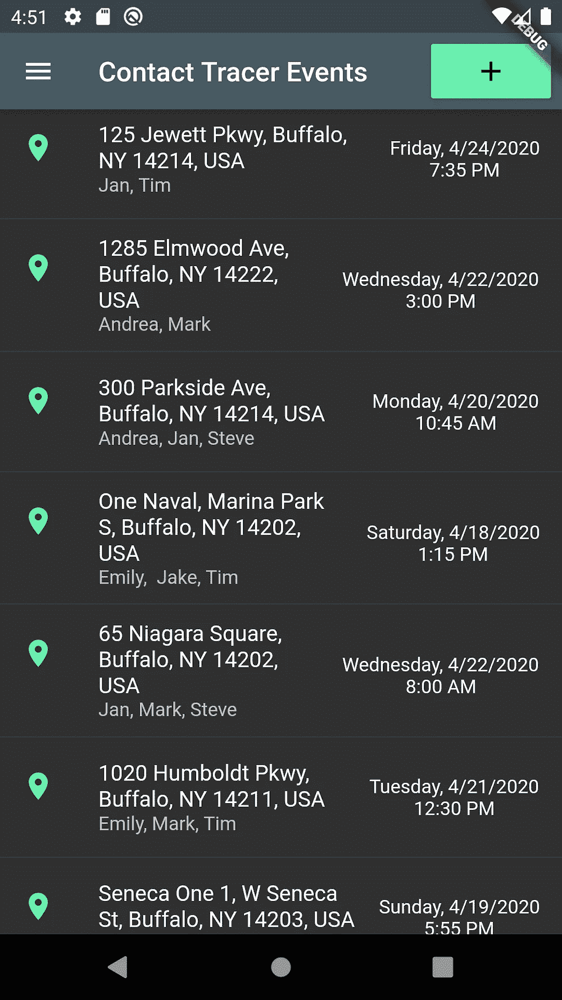
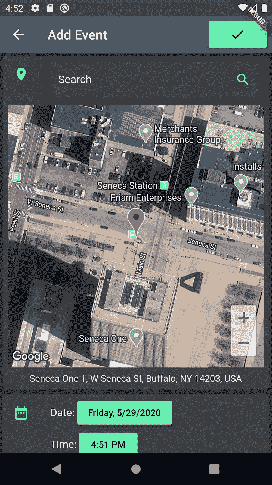
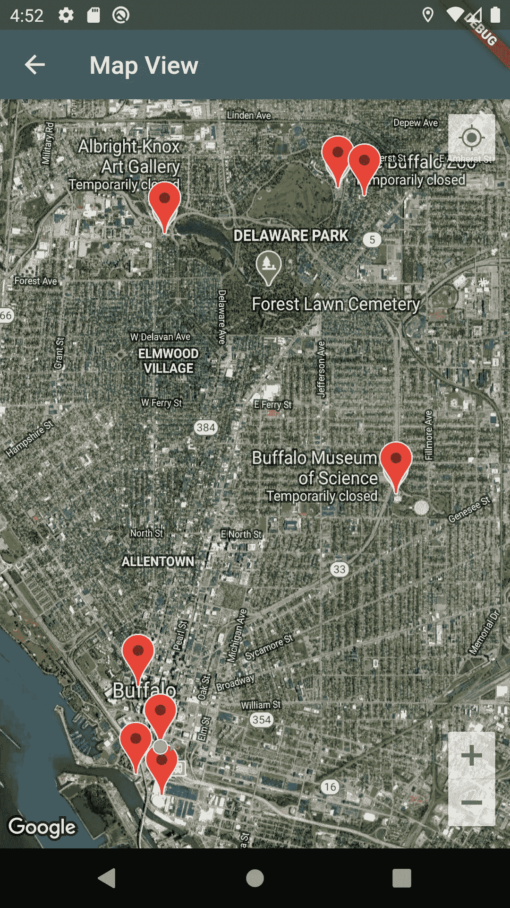
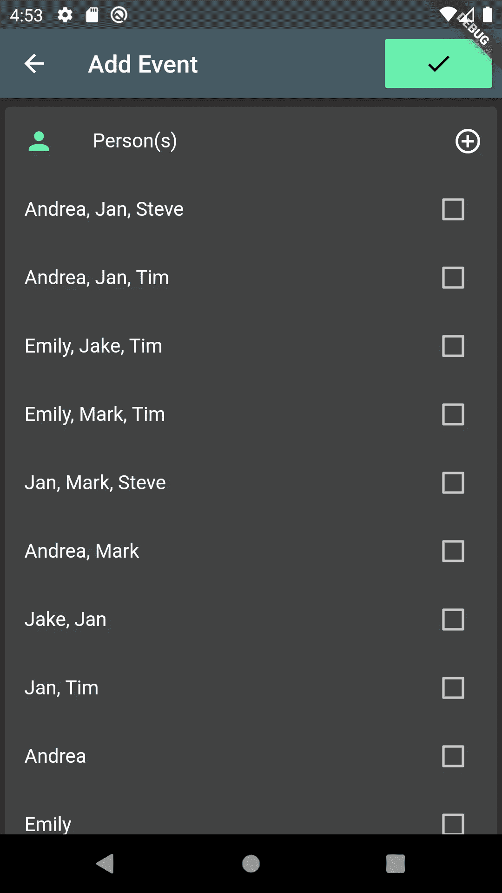
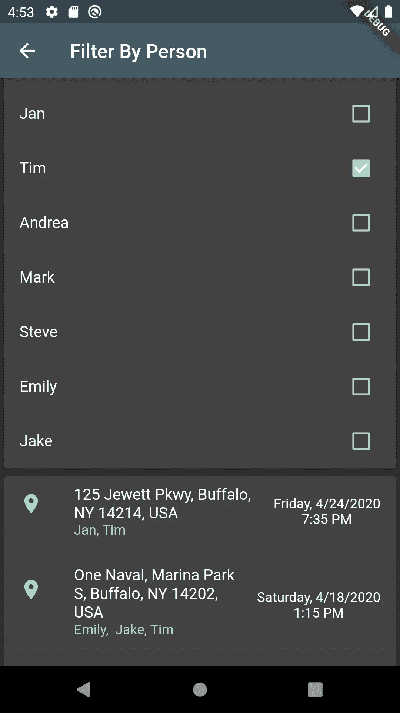

# 我如何在我的第一次黑客马拉松中获得第四名

> 原文：<https://blog.devgenius.io/how-i-placed-4th-in-my-first-hackathon-e9eab0fbe009?source=collection_archive---------13----------------------->

随着隔离的现实开始出现，我越来越感到厌烦。一切都突然嘎然而止，我在寻找新的东西来学习，所以我尝试了一些关于 [Flutter](https://flutter.dev/) 的教程，这是一个由谷歌制作的 SDK，它使制作出色的跨平台应用程序变得非常容易和快速。了解这项技术本身很棒，但我真的在寻找一个项目来应用它。

大约在同一时间，我在浏览 Instagram 时，看到了一则关于[代码的广告:水牛黑客马拉松](https://www.43north.org/code-buffalo/)，这是一项当地活动，通常在会议中心举行，但由于隔离，现在完全在网上进行。我以前听说过黑客马拉松，但从来没有机会参加。

对于外行人来说，黑客马拉松是一种定时的编程竞赛，通常持续一个周末，由于时间跨度相对较短，团队成员需要长时间工作来创造一个“黑客”。hack 是一个编程项目，它展示了某项技术在现实世界中的使用，但通常不是“生产就绪”黑客马拉松的目的是让赞助商将创造的黑客技术转化为真正的业务，或者展示他们的新技术，同时参与者可以学习和竞争奖品。

在这次比赛之前，我有相当多的编程经验，但我还有很多东西需要学习，并抓住任何机会去学习。结果我就点了广告，报了名。

正如我之前提到的，我已经学习了关于 Flutter 的基础教程，随着“帮助水牛社区”的比赛提示，结合新冠肺炎的情况，我受到启发，制作了一个帮助对抗 COVID 的应用程序。但是它能做什么呢？

受到上面视频的启发，特别是它对从人群中移除感染者的有效性的说明，我决定创建一个联系追踪应用程序，这是一项苹果[和谷歌最近在](https://blog.google/inside-google/company-announcements/apple-and-google-partner-covid-19-contact-tracing-technology)合作在各自设备上实现的技术。

接触追踪是一种防止疾病传播的方法，在这种方法中，人群中的公民跟踪他们接触过的人，并在得知他们已经被感染时，通知他们可能也已经感染的人。对于 COVID 来说，这将导致感染者接触的所有人自我隔离 2 周，并在出现症状时接受检测。这种方法可以通过技术以多种不同的方式实现。

既然我已经完成了黑客马拉松的第一个重要步骤，提出了一个令人信服的想法，我必须想出如何实现它。作为第一次开发应用程序的人，我有 2 周的时间来完成这个项目，我有效地提出了我将如何实现某些功能。

我在黑客马拉松期间完成的版本。

在我开始实施我的想法之前，我必须先组织起来。我在这个项目中使用的主要组织工具是 Trello。由于我很不确定时间框架会如何影响我的项目，我将我想要构建的特性编译成了一系列版本。这些版本相对来说比较具体，因为我预计会完成多个版本。这种创建目标的方法为我的项目提供了保险，以防在实现某些东西或时间耗尽时出现问题，因为当我完成每个版本时，我确保如果我不能完成下一个版本，我会有一个像样的项目。如果出现技术问题，有可能跳过或重新订购一个版本。

> [我所有的代码，包括文档和大量注释，都可以在 GitHub](https://github.com/dylantompkins/ContactTracer) 上公开获得。

在本文中，我不打算一行一行地讨论代码，但是我将回顾一下我用来实现我的项目的技术，如果您想了解更多，请查看上面链接的 GitHub 资源库。

Flutter 是这款应用的基础，所有的功能都是建立在它的基础上的，首先是用户界面。最初，有两个屏幕:主页列表和添加事件表单。主页列表显示用户记录的所有交互，添加事件表单是用户记录联系事件的方式。

事件列表和添加事件屏幕

虽然一开始所有的信息都是基于文本的，但我很快转向使用 GPS。手机的 GPS 用于获取用户的当前位置，这是表单的默认输入，但可以通过使用谷歌地图搜索栏进行更改，所选位置显示在谷歌地图中。我通过使用[谷歌云平台](https://cloud.google.com/)的地图应用编程接口来使用这些谷歌地图技术。这是我第一次使用 API 或应用程序编程接口，这是一些其他人编写的代码，开发人员可以使用这些代码轻松扩展他们自己项目的功能。我后来用同样的技术创建了一个全屏地图视图，在这个视图上，用户的所有活动都是基于位置显示的，而不是按时间顺序显示在主页列表上。

全屏地图视图

事件的第二个组成部分是它发生的时间。为了让用户尽可能容易地选择时间，我使用了 Flutter 内置的时间和日期选择器，因此这与用户手机上的时钟应用程序交互是一样的。

时间选择器

事件的最后一部分是用户接触到的人。为此，该应用程序有一个你之前输入的人员清单，因此用户只需输入一个人的名字一次，并有一个加号按钮来将一个人添加到列表中。以前的人群也在列表中，这些人群也自动分解为个人。

人员选择器

在项目的这一点上，我遇到了我在整个黑客马拉松中遇到的最大挑战:这些数据都没有被保存。这是我预料到的事情，但仍然很难实现。我使用了一个存储在用户手机上的 SQLite 数据库来保护他们的数据隐私。数据库实际上是电子表格的集合，可以通过链接来反映嵌套数据(例如，一列中的每个单元格都可以从另一个电子表格的选项中提取)。

在我的用户输入的数据被实际存储后，我对最终产品感到满意，但我想推出一些更高级的功能。这是我构建全屏地图视图的时候，我还添加了一个屏幕，用户可以在其中选择与他们互动的某些人，并只查看包含这些人的事件。该功能对于说明我的应用程序的用例非常有用，因为它旨在当用户被其他人通知他们已被感染时使用。然后，用户将选择此人并查看他们与他们接触的所有时间，以便能够评估他们自己也被感染的可能性。

按人员筛选屏幕

从数据库中选择一个人是我完成的最终版本，比赛还剩 12 个小时左右。在剩下的时间里，我必须制作一个视频向评委展示我的项目。在 90 秒的时限内，我坐在我的相机前，尽可能快地解释我的应用程序做了什么。为了让我的解释更直观，我录制了我的应用程序的运行，然后做了一些快速的视频编辑。在做了一些最终的代码文档后，我提交了我的项目，我完成了。

我提交评审的视频

结果公布的那天是苦乐参半。我从未想过我的第一个黑客马拉松项目会获得荣誉奖，特别是因为我的对手比我更有经验，但我离获奖只有一步之遥。尽管如此，我还是为自己的成就感到非常自豪。

回想起来，有些事情我肯定会做得不同，这些事情可能会让我登上领奖台，其中大部分都与我的视频有关。我真的很高兴我用这个应用程序实现了什么，但我的视频是匆忙和无聊的。我想，如果我用最后一天的时间来制作视频，我可能会想出一些更有创意的东西，更像是一个推销，而不仅仅是解释我做了什么。

代码:水牛城黑客马拉松对我来说是一次很棒的学习经历，我完全打算在未来参加更多的黑客马拉松。如果你正在寻找创建一个项目，展示你能做什么，或者只是学习一些全新的东西，那么我全心全意地推荐你自己尝试一次黑客马拉松。