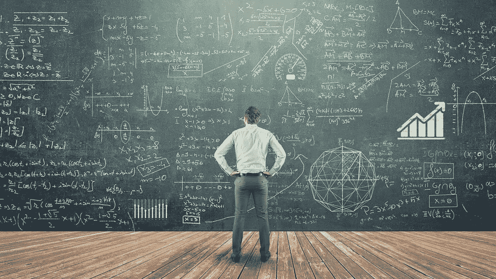

# 我是如何意识到我需要学习数学的

> 原文：<https://blog.devgenius.io/how-i-realized-my-need-to-learn-math-bcf7a76d64f6?source=collection_archive---------5----------------------->

人们花了一年时间在各种技术上不断做出决策，才意识到这一点。

那一刻，我意识到我无法理解共识上的数学方程式是什么意思。因此，我决定踏上旅程，在那里我可以提高我的数学技能，以加深我对区块链技术的理解。现在让我们深入研究细节

## 第一部分(与我的计算机技术教授的连续讲座和个人对话)

在我的第一个学期，我不知道他在做什么。更有甚者，我把他当成了一个不知道自己在说什么的老人。但是第二学期结束的时候他证明我错了。此外，当我在他的房间里谈论数学话题时，他深刻的谈话进一步激发了我的兴趣。因此，我开始寻找。

## 第二部分(当我看不懂比特币白皮书上的数学方程式时)

当我看不懂比特币白皮书中的两个数学方程时，我决定更进一步。这是作为一个系列制定的，这是我问我的朋友的时刻。他跟我说是去中心化。但事实并非如此。在我学习了微积分中的级数之后，我知道这意味着什么。这意味着:无论黑客如何尝试，只要链变长，同时控制 51%的节点的概率将接近于 0。这就是所谓的“工作证明”。我很放松，在完成微积分的道路上走得更远。

## 第三部分(当我问我的统计学教授区块链统计学是否可行时)

这是我有过的最短的争论。他说，“只要数据存在于技术上，技术的统计数据也存在”。所以，这是我学习统计学的一种方式。在学期末，我几乎没有学到任何与统计学相关的东西，下一学期也是如此。直到我的统计学教授向我解释了如何学习统计学。更令人震惊的是，我所知道的唯一学习方法是在教室里。他只是告诉我用几门编程语言学习统计编程，另一边是一本统计学的书。更重要的是，他帮助我如何开始学习统计编程。他甚至推荐我从 R 和 Python 开始，并告诉我，我将比普通教授更需要统计学。因此，我开始同时理解统计和学习。

*你是如何意识到你需要学习数学的？在下面的评论区分享你的时刻。*