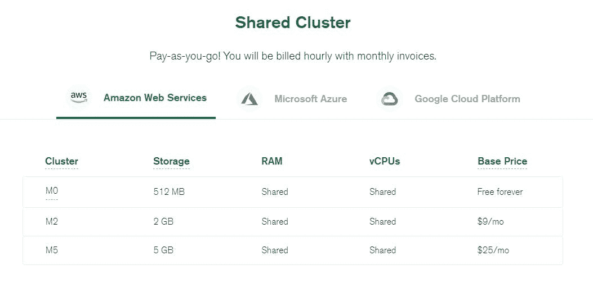

# 我是如何“扩展”我的 SaaS 数据库并破坏我的应用程序的。

> 原文：<https://blog.devgenius.io/how-i-scaled-my-saas-database-and-broke-my-app-2ad2412ee4a3?source=collection_archive---------5----------------------->


## 这篇文章是对我未来自我的一个温和的提醒…

像你们中的许多人一样，在推出我的 SaaS 之前，我接触了一个免费的托管云数据库。有很多选择，但我倾向于我已经熟悉的，一个由 Atlas 上的 [MongoDB 推广的文档数据库](https://www.mongodb.com/)🌿

[Sinosend](https://sinosend.com) tech stack 是一个非常简单的多云架构，非常依赖由[阿里云对象存储](https://www.alibabacloud.com/product/object-storage-service) & [Cloudflare R2](https://blog.cloudflare.com/introducing-r2-object-storage/) 支持的弹性存储。事实证明，大规模存储大量加密的用户文件并使其随时随地都可以在边缘访问并不是一项简单的任务。我们相信，由于多年来在处理不良、间歇性连接和高延迟移动网络方面的反复试验，我们基本上解决了应用程序的复杂部分。更重要的是，我们的许多客户跨洲发送文件。因此，能够进入中国&印度，对我们的成功至关重要，我应该说，我们的竞争对手在印度已经受到了‘防火墙保护’。

# 其实越便宜越好。

虽然存储方面的成本超过每月 2800 美元，但我们需要一个数据库来存储文件对象 id 的元数据。不要告诉我们的客户这些，但是信不信由你，对我们来说最有效的是在 Atlas，Azure 上的一个 M0 实例。它运行了一年多，处理的工作负载超过了该实例的设计目标。


然而，我们错过了一个关键的事情，M0 不提供备份。😳

# 备份，是的，他们是一个东西

> *我们还没有想到数据库的备份解决方案。当然，我们的存储服务一天要备份几次，并且有 99.99995%的 SLA，但是我们把我们的数据库留在了尘埃中；我们现在已经达到了 300 MAU(每月活跃用户)。是时候升级了。*

好吧，M0 的阿特拉斯·蔚蓝怎么样了？下一个选项是 M10，其计算结果为:


我的数学糟透了。我希望这些云服务能从一开始就告诉我们每月的费用，而不是像廉价的汽车旅馆房间那样按小时收费。我们没有运行 Heroku 实例，我们可以上下旋转，所以为什么不显示我们每月的费用。

所以对于 Azure (East)
按 0.10/小时 x 24 x 30 = 72 美元/月。

72 美元/月我能得到什么？

*   1 个潜在 vCPU(共享)
*   大约和我 1999 年的笔记本电脑内存一样大(2GB)

可怜，不用了，谢谢。我更喜欢 [Atlas 的无服务器产品](https://www.mongodb.com/cloud/atlas/serverless)，遗憾的是它仍处于测试阶段，不支持一些更高级的功能，如领域功能和数据库触发器。一旦无服务器的 Mongo 正式发布，我会很乐意切换到它。在那之前，我需要寻找更有说服力的东西。

MongoDB 最近推出了付费共享数据库 M2/M5 实例，包括每月固定费用的备份；现在我们在谈话。



好吧，这能有多难？我需要做的就是升级到 M2。


但是，M2 在“东亚”(我们目前所在的地区)的 Azure 上不可用

要解决这个问题，我需要将“东亚”中 M2 可用的地区更改为 AWS。每月 9 美元的托管 3 副本数据库和备份听起来很完美。让我们开始吧。


我匆忙点击了“升级”


> *哦，等等！连接字符串会改变吗？！*

因为我在改变云提供商 AZURE -> AWS，所以连接字符串从:

```
mongodb+srv://name:<password>@hkg-cluster.azure.ksqyh.mongodb.net/dbname
```

🔽

```
mongodb+srv://name:<password>@hkg-cluster.ksqyh.mongodb.net/dbname
```

Sinosend 采用了 [JAMSTACK](https://jamstack.org/) 的方法，我们所有的函数在阿里云上都是无服务器的，这意味着我们需要更新我们所有的 100 多个函数 DB 连接字符串！

错误日志开始弹出，*我的额头开始冒汗。*

# 你知道那种感觉…

> 恶心袭来，一种恐惧的下沉感，知道我错过了如此简单的东西！

我必须快速工作。取消升级是不可行的。

我使用[阿里巴巴函数计算](https://www.alibabacloud.com/product/function-compute)作为我们的无服务器 API 后端。就在那时，这 100+个函数开始产生难看的 **500 个 http 错误**。

幸运的是，大多数云函数都使用“层”，这是一个简单的共享代码抽象，你可以在函数之间使用，类似于 [AWS LAMBDA 层](https://docs.aws.amazon.com/lambda/latest/dg/configuration-layers.html)。层允许您在每个无服务器功能之间共享公共实用程序代码。众所周知，无服务器功能是相互独立运行的。


深入我的层" *mongoConnect* "函数，我很快意识到它实际上不在我设置连接 DB 字符串的地方。

```
const {MongoClient, ObjectId } = require('mongodb'); var cachedDb const dbConnect = async (URI) = > { let cachedDb = null { if (cachedDb) { console.log('Using cached database instance'); return Promise.resolve(cachedDb); } return MongoClient.connect(URI) .then(db = > { console.log('Using New DB Instance') cachedDb = db; return cachedDb; }); } return await connectToDatabase(URI) } exports.dbConnect = dbConnect exports.ObjectId = ObjectId
```

上面的‘层’是我几年前写的，谁还记得旧代码，更别说读了？连接字符串不存在；它来自 KMS(密钥管理服务)，我在那里存储了这个秘密。啊哈！我很聪明，用 KMS 来存储我的加密密钥和秘密！


对新升级的 M2 集群的秘密值进行简单的更改:-


## 然后，60 分钟后的关键时刻。

所有无服务器功能现在都使用新的阿特拉斯 M2 实例。经过一个小时的停机和一些愤怒的电子邮件(顺便说一下，*现在都是快乐的顾客)一切都解决了。任务完成，升级完成。*

# 没有脱离险境

一切都很顺利，直到大约 5 个小时后；我从 MongoDB 收到了这封邮件


> *我刚刚解决了一个问题。现在我又得到了一个！*为粪！

简单地说，这封邮件说，我必须在未来七天内将我的 Mongo 节点驱动程序升级到版本 4.x 或更高版本，因为 Mongo 正在强制将我的云数据库升级到版本 5。Mongo 对此的解决方案是升级到一个专用实例，这样我就可以控制版本升级；好吧，我们已经讨论过这个问题了，在完整的无服务器产品正式上市之前不会发生。

快速检查我的项目`package.json`显示我正在使用 mongodb 3.6，这意味着我需要将我的“层”函数更新到 MongoDB 4 . x 版，否则我所有的 api 调用将再次失败！好了，这个应该很简单吧！？

没有。

阿里巴巴函数计算“层”有版本。每个版本由一个压缩节点模块文件夹处理，并自动分配一个版本号。


我们正在进入杂草中，但是记住，这篇文章是为我未来的自己写的。如果你还和我在一起，这意味着如果我用更新的 npm 模块`npm i mongodb`’*创建一个新的层函数，层*将创建一个新的版本，这导致我必须手动更新所有 100 多个函数层的版本号。😧


> *啊啊啊！多痛苦啊，更新图层版本又要一个小时，更别说测试每个无服务器功能了！*

我联系了阿里巴巴的支持人员，看看是否有什么方法可以在不改变版本号的情况下编辑图层，希望我能很快得到他们的回复！

截至 2 月 13 日，我一直在等待解决方案的回音。

# 还剩两个选项

*   手动更改所有云功能层版本号
*   更新现有层功能，同时保持原版本号(*首选方案，但无法实现)*

如果你感兴趣的话，我会把结果贴在评论里。

# 吸取的教训

升级或更改数据库实例并非没有问题，甚至最简单的更改也会导致不必要的停机。幸运的是，我使用 KMS 存储我的密钥和层来共享我的数据库连接。一个简单的改变在一个小时内就解决了问题。它让我不用手动修改 100 多个无服务器功能。

希望很快我能停止做一周的首席技术官，转而从事作为一名 SaaS 创始人最重要的部分，市场营销。

推特: [@rishi](https://twitter.com/RishiUttamHK)

博客: [EasyWeb。开发](https://easyweb.dev)

我在这里工作: [Sinosend](https://sinosend.com)

*最初发布于*[*https://easy web . dev*](https://easyweb.dev/how-i-scaled-from-m0-greater-m2-instance-on-mongodb-atlas-and-broke-my-app)*。*