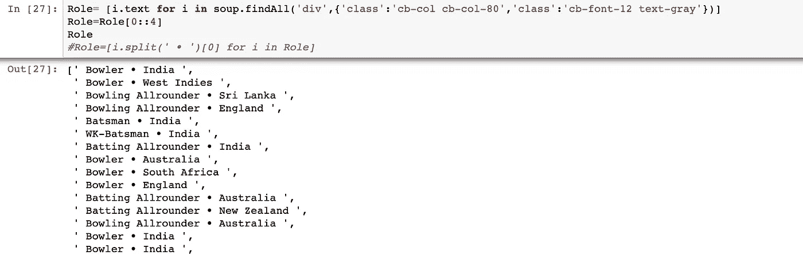

# 我是如何用美汤刮出 IPL 拍卖数据的

> 原文：<https://blog.devgenius.io/how-i-scraped-ipl-auction-data-using-beautiful-soup-b5f94f0fd300?source=collection_archive---------7----------------------->

## IPL 2020 数据从零开始报废！


samarth shirke 在 [Unsplash](https://unsplash.com/s/photos/cricket?utm_source=unsplash&utm_medium=referral&utm_content=creditCopyText) 上拍摄的照片

P ython 几乎无所不能——从数据分析、构建 web 框架、处理后端，或者从 web 上抓取数据。当人们阅读代码的时候，抓取看起来非常混乱。但是，不是的！你读到的那些胡言乱语通常是我们从中提取数据的 web 元素。除此之外，一切都很简单。

我用美汤刮过 IPL 拍卖 2019–2020 赛季数据。看看刮任何网站都需要什么？大多数情况下，鹰眼捕捉网页元素和图书馆的知识。所以，我们刮吧！

**包含的库**

我已经包括美丽的汤，熊猫，并要求图书馆。Requests 库将发送 HTTP 请求，BeautifulSoup 将获取 web 元素，Pandas 将分析数据。

```
from bs4 import BeautifulSoup
import pandas as pd
import requests as rq
```

**请求并解析 URL**

我使用了“请求”库来调用 URL。调用成功后，我用“美汤”解析网站的 web 元素。

```
url="https://www.cricbuzz.com/cricket-series/ipl-2020/auction/completed"
get_url=rq.get(url)
soup=BeautifulSoup(get_url.text,"html.parser")
```

## **获取网页元素**

我使用“findAll”方法，通过列表理解将每个名字和状态放入列表中。findAll 用于查找使用特定标签的每个 web 元素。并且，您可以使用循环来遍历它们。此外，从每次迭代中提取值，并将其添加到一个列表中，就像我在下面的场景中所做的那样。

```
Name= [i.text for i in soup.findAll('div',{'class':'cb-font-18'})]Sold_Unsold= [i.text for i in soup.findAll('div',{'class':'cb-col cb-col-20 cb-lst-itm-sm'})]
```

只是在这里和那里做了一点调整，比如在 Price 列和 Sold_To 列中用空白替换' \xa0\xa0 '。

```
Base_Price= [i.text for i in soup.findAll('div',{'class':'cb-col cb-col-33 cb-lst-itm-sm text-left','class':'cb-font-16'})]Base_Price=Base_Price[0:len(Base_Price)-3:3]
Base_Price=[i.replace('\xa0\xa0',' ') for i in Base_Price]Final_Price= [i.text for i in soup.findAll('div',{'class':'cb-col cb-col-33 cb-lst-itm-sm text-left','class':'cb-font-16'})]Final_Price=Final_Price[1:len(Final_Price)-3:3]
Final_Price=[i.replace('\xa0\xa0',' ') for i in Final_Price]Sold_To= [i.text for i in soup.findAll('div',{'class':'cb-col cb-col-33 cb-lst-itm-sm text-left','class':'cb-font-16'})]Sold_To=Sold_To[2:len(Sold_To)-3:3]
Sold_To=[i.replace('\xa0\xa0',' ') for i in Sold_To]Role= [i.text for i in soup.findAll('div',{'class':'cb-col cb-col-80','class':'cb-font-12 text-gray'})]Role=Role[0::4]
Role=[i.split(' • ')[0] for i in Role]
```

我包含了一个 split 函数来从表中获取每个板球运动员的角色。我的输出如下所示:



所以，我只在我的角色列表中添加了第 0 个索引。

**最终触摸**

最后，将每一列都放入数据报。使用 pandas 的 *to_csv* 方法将数据帧转换为 CSV 文件。你完了！

```
Table=pd.DataFrame({
    "Name":Name,
    "Role": Role,
    "Status":Sold_Unsold,
    "Base Price": Base_Price,
    "Final Price": Final_Price,
    "Team": Sold_To })Table.replace("-","",inplace=True)Table.to_csv("IPLAuction2019.csv")
```

只需 10-20 分钟就能刮出这样的东西。而且，你可以得到一个很好的数据集，你可以用它来获得洞察力和进行探索性分析。

**平安！**