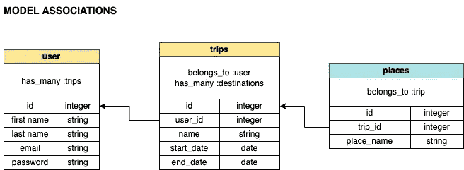
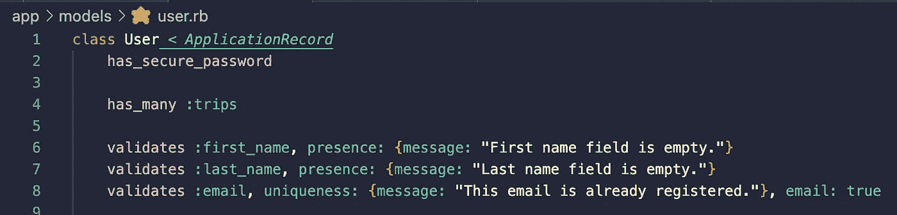
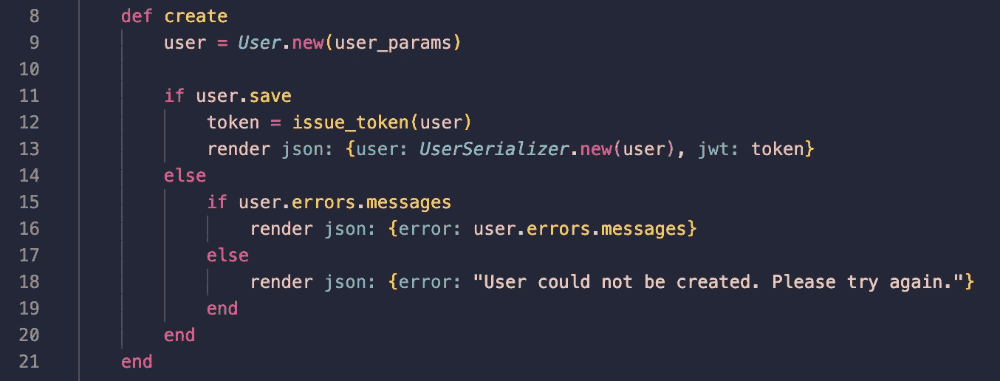
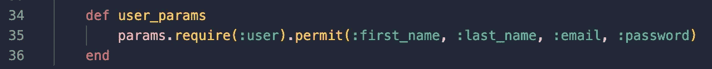
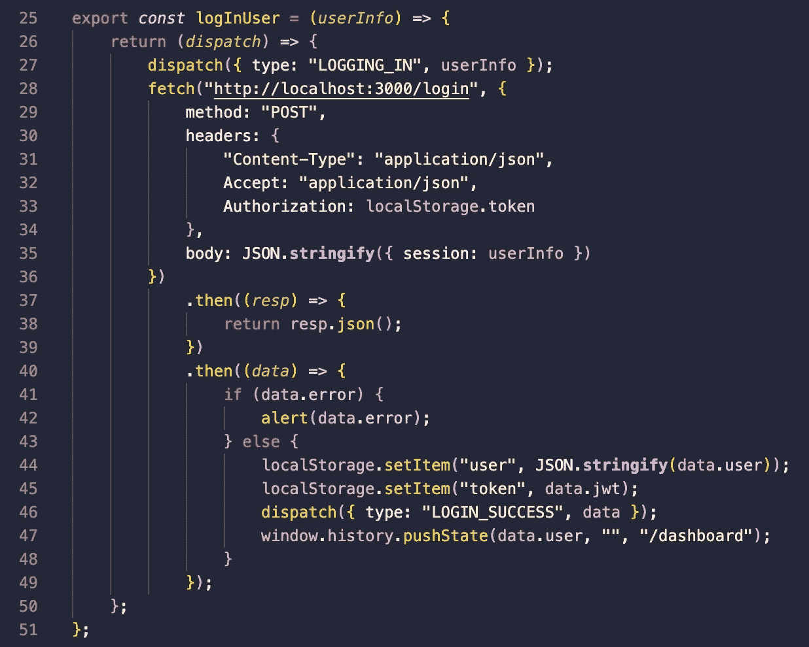
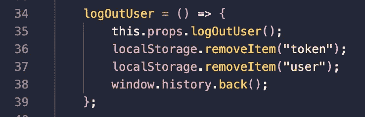

# 我如何用 Rails API 设置 JWT 和 React

> 原文：<https://blog.devgenius.io/how-i-set-up-jwt-with-rails-api-and-react-3caec9b00482?source=collection_archive---------0----------------------->

在熨斗学校的最后一个项目中，我决定创建一个 web 应用程序，它可以让用户使用 JWT 安全地登录。在我从 Bootcamp 毕业之前，我想测试我在客户端配置用户身份验证的技能，因为好的应用程序是安全的应用程序。

在很大程度上，我从几篇不同的文章中获得了很多帮助(所有这些文章都在最后链接了下来)，但是当然，我必须自己弄清楚逻辑，这本身就是一个令人沮丧的时刻。😵‍💫

# 后端设置

我首先使用 API 标志创建了我的 Rails API 项目，并通过在我的终端中键入以下内容来指定我的数据库系统:

`rails new project-name-here --api --database=postgresql`

通过指定我希望 postgreSQL 用于我的数据库，这使得以后部署到 Heroku 上更容易，并且如果您的开发和生产使用相同的数据库系统，实际上对您的应用程序更好。

接下来的步骤自然是将新创建的应用程序推送到我的 GitHub，并向`gemfile`添加必要的宝石。

## 宝石💎

我用来设置 JWT 的相关宝石有`pg`、`bcrpyt`、`jwt`和`active_model_serializers`。

在终端中运行了`bundle`之后，我已经准备好开始实际操作了。

## 模型💁🏻‍♀️

对于这个特定的项目，我创建了三个模型:用户、旅行和地点。它们是如何联系在一起的:



为了生成这些模型，我在终端中输入(以用户模型为例):

```
rails g resource User first_name last_name email password_digest --no-test-framework --skip-template-engine
```

添加`--skip-template-engine`纯粹是为了确保没有视图文件夹/文件被创建，包含`password_digest`是因为我们正在使用`bcrypt`。



用户模型

正如你从上面看到的，我们不需要验证密码，因为来自`bcrypt`的`has_secure_password`会帮我们处理好。

## 🕹主计长

我们需要注意的三个控制器是:

1.  `application_controller`
2.  `users_controller`
3.  `sessions_controller`

让我们先来处理一下`**application_controller**`，因为这一个有点疯狂。

我知道这有很多要解释的。我们先从第一种方法开始:`jwt_key`。

为了利用`Rails.application.credentials.jwt_key`，我们需要首先创建并隐藏我们的密钥。

1.  **创建 256 位密钥，使用** `**openssl**`

在你的终端输入:`openssl rand -base64 32`。

这将输出一个随机的 32 字节/256 位字母和字符的混乱。抓住这个键，因为现在我们必须把它藏在应用程序文件中的某个地方。

2.藏钥匙

在你的终端输入:`EDITOR="code --wait" rails credentials:edit`

这将在您的 VS 代码中打开一个文件，您可以在其中存储密钥。

3.将密钥添加到文件中

添加以下散列:`jwt_key: 256-bit-secret-key-here-instead-of-this`并保存和退出该文件。

现在，我们已经创建了我们的密钥并保存了它，我们可以继续其他控制器。关于`application_controller`的其他方法，我不会说太多细节，但是要真正理解他们在幕后做什么，请随意在控制台中摆弄你的代码或者谷歌一下来掌握这个概念！🤓

就这样，让我们进入`**users_controller**`。提醒一下，`users_controller`和`sessions_controller`的区别在于*新*用户将被定向到`create`的方法，而*返回的*用户将被定向到`create`的方法。



用户 _ 控制器创建方法



用户 _ 控制器用户 _ 参数

第 12 行的`issue_token`来自`application_controller`，第 13 行的`UserSerializer`来自我之前添加的`active_model_serializers`宝石。

这是非常不言自明的，所以我将移动到 JWT 设置的下一个控制器，这是`**sessions_controller**`，我同样不会太详细，因为代码本身也是不言自明的。

`create`方法用于登录用户，而`show`方法用于确定用户是否已经登录。而且提醒一下，`user.authenticate`来源于`bcrypt`。

## 🛣路线

随着我们的模型和重要控制器的设置，我们可以移动到我们的`routes.rb`文件中的路线。我为我的项目设置 URL 的方式如下:

```
post "/signup", to: "users#create"
post "/login", to: "sessions#create"
get "/authorized", to: "sessions#show"
get "/dashboard", to: "users#show"
```

至此，我们已经基本完成了后端的工作，现在让我们开始前端的工作吧！

# 前端设置

不幸的是，前端设置不像后端设置那样简单，因为每个人的前端架构都会略有不同，但在大多数情况下，它涉及到利用`localStorage`。

## localStorage.setItem()

现在我们已经在后端生成了一个 JWT，我们如何让前端识别这个 JWT 呢？对于我的项目，我已经在我的`logInUser` action creator 中设置了这个，但是你可以把这个逻辑放在你自己项目中任何你认为合适的地方。



登录用户操作创建者

重要的 note❗️，因为我们在后端设置了我们的头应该包含一个授权对象(来自第 20 行的`application_controller`，我们必须在上面的第 33 行包含`Authorization: localStorage.token`。

正如您在第 44 行和第 45 行中看到的，我们获取了从登录用户那里接收到的用户和令牌对象，并将其保存到我们的`localStorage`中。

我们需要利用`localStorage`，因为每次应用程序刷新时，状态不会持续，这意味着应用程序状态中的令牌将被清除。因此，为了确保我们的应用程序意识到用户确实登录了，我们必须能够保存最初从登录生成的令牌，并将其保存到我们的`localStorage`中，因此我们的应用程序现在知道查看浏览器的`localStorage`来查看令牌是否确实存在，也就是用户是否登录了。

我知道这听起来很复杂，所以一定要花几秒钟来读一遍。

## localStorage.getItem()

既然我们已经在`localStorage`中设置了用户和令牌对象，我们必须*从存储中获取*对象以便使用数据。

对于我的项目，我希望应用程序在启动时检查用户和令牌对象是否存在于`localStorage`中。因此，我在我的`App`组件的`componentDidMount()`方法中添加了以下代码。

```
*let* token = localStorage.getItem("token");
*let* user = localStorage.getItem("user");if (token && user) {
   this.props.fetchCurrentUser();
}
```

要了解更多细节和查看完整代码，请务必查看该项目的前端 [GitHub](https://github.com/kim-jenny5/my-travelogue-frontend) 。

## localStorage.removeItem()

正如设置和获取令牌很重要一样，确保包含从`localStorage`中移除对象的代码。

我已经将我的`localStorage.removeItem()`行代码包含在两个不同的组件中——一个在错误发生时作为自动防故障装置，另一个在用户注销时使用。

主要针对您的应用程序，您只需添加以下代码行，供用户单击注销按钮时使用。



从上面可以看到，一旦用户点击退出按钮，就会触发这个函数，从`localStorage`中删除用户和令牌对象，并将一个动作分派给`logOutUser()`动作创建者。

总之，这是关于如何用 JWT 设置你的应用程序安全的一般要点。我试图尽可能地深入，但是如果我要详细描述每一行，这篇文章将会很长(甚至更多🤯比它已经是)。

我强烈建议看看我的 GitHub 后端和前端报告，以了解整个代码流，以及我在下面链接的三篇文章，因为每篇文章都帮助我完成了创建安全应用程序的个人挑战。我希望这有所帮助，并希望你的过程顺利！😊

# 资源

## 我的 GitHub 关于这个项目的报告

*   [后端](https://github.com/kim-jenny5/my-travelogue-backend)
*   [前端](https://github.com/kim-jenny5/my-travelogue-frontend)

## 对我有帮助的文章

*   [https://dev . to/evanrpavone/setting-up-jwt-in-rails-API-back end-for-react-frontend-9d 8](https://dev.to/evanrpavone/setting-up-jwt-in-rails-api-backend-for-react-frontend-9d8)
*   [https://dev . to/kahawaiikailana/rails-API-quick start-guide-with-PostgreSQL-and-jwt-tokens-3pnk](https://dev.to/kahawaiikailana/rails-api-quickstart-guide-with-postgressql-and-jwt-tokens-3pnk)
*   [https://medium . com/swlh/the-client-side-authentic ation-system-using-jwt-token-on-my-rails-react-app-65d 4760 be3d](https://medium.com/swlh/the-client-side-authentication-system-using-jwt-token-on-my-rails-react-app-65d4760be3d)