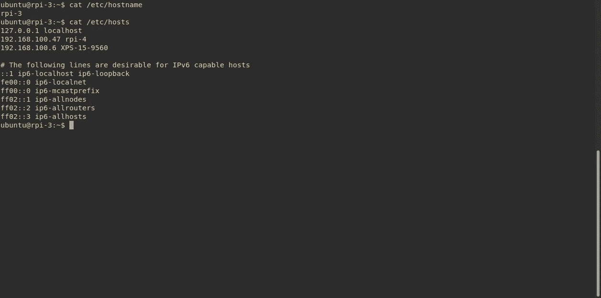

# 为我的第一个 Hadoop 和 Spark 集群做准备

> 原文：<https://blog.devgenius.io/how-i-set-up-my-first-hadoop-spark-cluster-preparation-663893486d12?source=collection_archive---------0----------------------->

我设想建立一个大数据实践集群已经有一段时间了。从传统的商业智能背景进入软件工程角色(尽管仍然与数据密切相关)，大数据技术引起我的注意只是时间问题。


在第二次尝试中，我的普通集群的 2/3(几乎)正确组装

从局外人的角度来看，大数据景观听起来像是一个时髦词汇和无数产品的集合:从更熟悉的 Hadoop 开始，到适合该生态系统的广泛组件:HDFS、Yarn、Spark、Pig、Hive、Airflow 或 Nifi。我不得不承认他们中的一些人有着非常有趣的名字，但是他们是如何融入这幅画的呢？

嗯，我一定会开始发现，但这种事情不是你通过观看视频教程就能学会的。此外，学习新事物在开始时总是令人兴奋的，但当你遇到障碍时就会非常沮丧。我之前确实尝试过至少两次设置 Hadoop:一次是在本地，另一次是使用 [Cloudera 快速启动虚拟机](https://www.cloudera.com/developers/get-started-with-hadoop-tutorial.html)。第一次，我在几分钟后就放弃了尝试设置我的本地 Java 环境(我知道，我知道)，而第二次，我觉得这是一个单节点的沙盒设置，并不像我想要的那样接近“真实的东西”。

这篇文章是一系列文章中的第一篇，本质上是我在这段旅程中的游记汇编。它并不真的是一个教程，因为我将参考其他全面的和写得很好的资源，涵盖了 90%的方式。它的目的是减少读者(或未来的我)需要花在其他 10%上的时间，或者作为一个主题的软介绍。这是一个非常长的介绍，所以让我们开始工作吧！

# 准备工作

在开始做任何事情之前，我会在网上寻找不同的资源，寻找能够全程指导我的教程。

我发现这个 [**是一个很好的记录，也是一个杰出的系列**](https://dev.to/awwsmm/building-a-raspberry-pi-hadoop-spark-cluster-8b2) ，作者是都柏林的一个叫 Andrew 的家伙，他基本上解释了我在开始之前需要知道的一切。我不得不在这里和那里做一些调整。

## 五金器具

首先，我想走真正的硬件路线，而不是建立一个虚拟机舰队。所以我决定来个树莓派集群。我已经有了一个 1GB 的树莓派 3B(T1)(几年前花 35 英镑买的)，还买了另一个 2GB 的树莓派 4B(T3)和一个带散热风扇的集群机箱(T5)。好消息是:我在 24 小时内就把它们从英国送到了布加勒斯特。除了两个 Pi 节点之外，我将在我的笔记本电脑上设置另一个节点，它也将是主节点。

虽然网络性能和外观有更好的选择( [PoE](https://en.wikipedia.org/wiki/Power_over_Ethernet) )，但由于我的设备有 WiFi 连接，我决定让它们通过无线通信，并使用标准(类似手机的)充电器充电。两者都有一个 16GB 的 microSD 卡作为存储。


为我的集群制定计划

## 操作系统

接下来，设置 Pis。虽然它们配备了[Noobs](https://www.raspberrypi.org/downloads/noobs/)——一个简单的操作系统安装程序——允许安装 [Raspbian](https://www.raspberrypi.org/downloads/raspbian/) ，一个基于 Debian 的 Linux，这是 Rasbperry Pis 最受欢迎的选择，但我决定在这个平台上使用 Ubuntu。我下载了 [Ubuntu 服务器映像](https://ubuntu.com/download/raspberry-pi)，并使用带有 [Pi 成像仪](https://www.raspberrypi.org/blog/raspberry-pi-imager-imaging-utility/)的 SD 适配器将它刻录到我的 PC 上的 microSD 中——这是一个简单的过程，大约需要 3 分钟。


Raspberry Pi 成像仪

然后，我使用这里的说明[为我新设置的 Raspberry Pi 设置了无线连接。](https://askubuntu.com/questions/1143287/how-to-setup-of-raspberry-pi-3-onboard-wifi-for-ubuntu-server-18-04)


/etc/net plan/50-cloud-init . YAML

## 主机名

接下来，我在每台机器上设置了主机名和主机。



其中一个 pi 的/etc/hostname 和/etc/hosts

## 嘘

另一个重要步骤是 SSH 设置。这将允许连接到我们集群中的机器并在其上运行命令。我们从在机器上启用 SSH 开始:

```
sudo apt update
sudo apt install openssh-server 
```

我们可以通过以下方式测试服务是否正常运行:

```
sudo systemctl status ssh
```

现在，假设 *ubuntu* 是我们的用户， *rpi-3* 是我们想要连接的机器，我们可以执行下面的命令，输入密码并连接。

```
ssh ubuntu@rpi-3
```

我们还需要处理几件事情。要启用无密码登录，让我们在主服务器上创建一个公钥-私钥对:

```
ssh-keygen
```

这将生成一个公钥和一个私钥，默认位置为 ***~/。ssh*** 。


我们现在将把我们的**公钥**附加到从机的 authorized_keys 上

```
cat ~/.ssh/id_rsa.pub | ssh ubuntu@rpi-3 'cat >> .ssh/authorized_keys'
```

然后，在主服务器上，我们将在 ***~/处设置一个配置文件。ssh/config* 和**如下:

```
Host rpi-3
HostName rpi-3
User ubuntu
IdentityFile ~/.ssh/id_rsaHost rpi-4
HostName rpi-4
User ubuntu
IdentityFile ~/.ssh/id_rsa
```

现在，通过 SSH 连接到另一台机器非常简单:


## 安全性和实用性

前面提到的教程[也采取了措施来保护集群(禁用密码登录、登录和当天可能泄露的消息)——我认为应该遵循的重要建议。此外，建议使用实用函数，使集群中的所有机器都能执行一次命令。例如，我在我的 ***中添加了以下内容。bashrc*** 以便可以从主节点发出一个命令并在所有节点上执行。我稍微修改了一下我的命令，这样*other pi*就可以查找名称中有 *rpi-* 的主机，而 *clustercmd* 就不会在我的主机上执行这个命令。](https://dev.to/awwsmm/building-a-raspberry-pi-hadoop-spark-cluster-8b2)

```
function otherpis {
  grep "rpi-" /etc/hosts | awk '{print $2}' | grep -v $(hostname)
}function clustercmd {
  for pi in $(otherpis); do ssh $pi "$@"; done
}
```


## 结论

现在我们有了一组可以执行命令的机器，我们可以继续设置 Hadoop 和 Spark。我将在下一篇文章中详细介绍我在这个过程中遇到的问题。感谢您的阅读，再见。