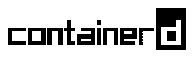

# 我如何离开 Docker 桌面

> 原文：<https://blog.devgenius.io/how-i-switch-away-from-docker-desktop-e9aae32dc122?source=collection_archive---------7----------------------->


来自 Pexels 的 Josh Sorenson

说正经的，Docker 是一个很常用的工具。过去，Docker-Desktop 是免费的，但是许可发生了变化。因此公司不能再免费使用它(如果他们有超过 250 名员工或超过 1000 万美元的年收入)。

# 什么是 Docker 桌面

> Docker Desktop 是一个易于安装的应用程序，适用于您的 Mac 或 Windows 环境，使您能够构建和共享容器化的应用程序和微服务。Docker 桌面包括 [Docker 引擎](https://docs.docker.com/engine/)、Docker CLI 客户端、 [Docker 撰写](https://docs.docker.com/compose/)、 [Docker 内容信任](https://docs.docker.com/engine/security/trust/)、 [Kubernetes](https://github.com/kubernetes/kubernetes/) 、[凭证助手](https://github.com/docker/docker-credential-helpers/)。

因此，你可以说 docker 桌面是一个安装和运行就绪的产品，对于那些没有时间建立自己的 Docker 环境的人来说。我将 docker 用于许多场景，例如，启动大型 SQL Server(无需安装服务器本身)或创建小型 docker 映像(由。网络核心)

# 我的要求

对我来说，让以下功能重新工作很重要:

*   易于设置
*   支持本地装载
*   托管 Kubernetes 服务器

# 有哪些替代方案？

在网上搜索了一下，我发现有两种方法。最难的方法是让你自己安装完整的 docker 基础设施。在这一点上，我将引导你到[这篇文章](https://medium.com/better-programming/how-to-install-docker-without-docker-desktop-on-windows-a2bbb65638a1)，它将帮助你建立你自己的环境。

另一方面，你有可能得到一个引导安装程序来设置你的 docker 环境。

# 利马+ nerdctl



这个选项只使用 contained(由 lima 支持),我正在寻找 docker 的替代品，所以对我来说，现在还不是完全切换到不同的运行时的时候。虽然包含的是 Kubernetes 的行业标准和默认运行时。另一方面，nerdctl 使用的 API 与 docker 使用的 API 非常相似，所以这是一个很好的接触，最重要的是它非常容易安装，我一定会在将来再给它一次机会。

链接到站点:[容器 id](https://containerd.io/)

# 牧场主桌面

> 适用于 Mac、Windows 和 Linux 的开源桌面应用程序。Rancher Desktop 在您的桌面上运行 Kubernetes 和容器管理。您可以选择想要运行的 Kubernetes 版本。您可以使用 containerd 或莫比(dockerd)构建、推送、拉取和运行容器映像。您构建的容器映像可以立即由 Kubernetes 运行，而不需要注册。

所以你会看到它是 Docker 桌面的一个很好的替代品，而且免费使用。这个的安装非常好[有据可查](https://docs.rancherdesktop.io/getting-started/installation/)。所以在 Windows 上非常简单。只需执行设置并安装它。

链接到网站:[牧场主桌面](https://rancherdesktop.io/)

# 我的最终决定

所以根据我的需要，我选择了 Rancher Desktop，它是 docker-desktop 的完美替代品。也许对此有更好的解决方案(也许是 Portainer 和 s.th .之类的管理解决方案)，但对我来说，这符合我的要求(如上所述)。

你对我的离去有什么看法？

```
**Want to Connect?** Say Hello on: [LinkedIn](https://www.linkedin.com/in/sascha-peter-bajonczak-32a17a2a/), [GitHub](https://github.com/sbajonczak), and [Blog](https://blog.bajonczak.com/).
```