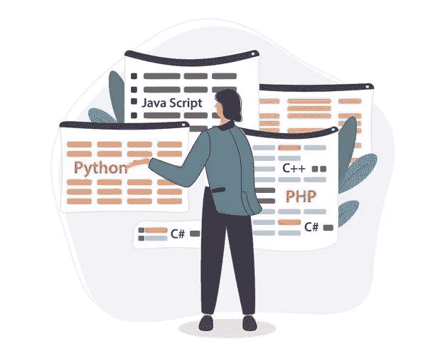

# 我是如何从新手成为 Python 编程专家的

> 原文：<https://blog.devgenius.io/how-i-went-from-noob-to-expert-in-python-programming-8c4e141a0be1?source=collection_archive---------2----------------------->

## 我一直使用的资源汇编

由 [svstudioart](https://www.freepik.com/free-vector/programmer-working-web-development-code-engineer-programming-python-php-java-script-computer_14723889.htm#page=1&query=python&position=2) 创建的计算机向量

前几天，我在简历中提到了一项新技能。不是做饭而是 Python 编程。说到 Python，我还没见过比 Python 本身更简单的语言。

一开始我以为它只是用来教孩子们如何编码的。后来，我发现了 Python 编程语言在当今世界的所有用途，在当今世界，学习编程语言与学习驾驶汽车一样重要。

以下是 Python 编程语言的重要用途:-

1.  **解决一个面试编程问题**
2.  **网络开发(Django)**
3.  **机器学习**

在了解了 Python 编程语言的广泛用途之后，让我们来看看您可能会接触到的资源。

## 阅读官方文档

让我澄清一个事实，我不是一个发明 Python 新事物的人。简单地说，在 Python 语言中，事情非常清楚，当你找不到函数时，你不需要成为一个研究者。

Python 是 Guido Van Rossum 在 1991 年发明的，那家伙比我大 3 倍。因此，已经有了一套你需要遵守的预先定义的规则，而规则是要改变的。

您可以随时参考 Python 编程语言的官方 [**文档**](https://docs.python.org/3/) ，在那里您会找到软件中所有必要的内置函数和所有新的更新。

## 维基网

是的，你没看错。Python 有一个独立的 wiki 页面，所有的资源都在这里汇集。本页汇集了初学者进阶的所有最佳教程。

当我还是一个 Python 编程的新手时，我经常参考这个 wiki 页面。你可以简单的在 Google 上搜索 [**Python Wiki**](https://wiki.python.org/moin/BeginnersGuide/Programmers) 找到页面，使用足以让你成为 Python 专家的教程汇编。

此外，Python wiki 页面上有你可以注册的所有最佳视频和免费课程的汇编，以及比维基百科更真实的内容。

## YouTube 教程

就我个人而言，我见过很多不喜欢看厚重文档或者看教程网站的人。对于这些人，我有一个非常好的资源，最棒的是它在 YouTube 上是完全免费的。

1.  [**Python 为大家—大学全程课程**](https://www.youtube.com/watch?v=8DvywoWv6fI)
2.  [**Python 教程— Python 初学者**](https://www.youtube.com/watch?v=_uQrJ0TkZlc)
3.  [**学习 Python —初学者全教程**](https://www.youtube.com/watch?v=rfscVS0vtbw)

你可以从 YouTube 上的这个视频教程中学习，开始你的 Python 程序员之旅。

我希望你喜欢学习 Python，也希望这篇文章对你有用。祝你编程之旅好运。

 [## 阅读 Aniket 上的每一个故事(以及媒体上成千上万的其他作者)

### 作为一个媒体会员，你的会员费的一部分会给你阅读的作家，你可以完全接触到每一个故事…

aniketz.medium.com](https://aniketz.medium.com/membership)  [## 每个程序员都应该读的 3 本书

### 帮助我理解编程基础的书籍。

javascript.plainenglish.io](https://javascript.plainenglish.io/3-books-every-programmer-should-read-97ac12422cfb)  [## 如果你不知道这些，你就不是一个软件开发人员。

### 对软件开发人员来说最重要的方面

blog.devgenius.io](/you-are-not-a-software-developer-if-you-dont-know-this-81ef29865100)  [## 2021 年十大编程语言

### 你是使用顶级编程语言的用户之一吗？

javascript.plainenglish.io](https://javascript.plainenglish.io/top-10-programming-languages-of-2021-d2d48c634ae7)  [## 每个程序员都应该关注的 3 个 YouTube 频道

### 我推荐您观看节目内容的最佳 YouTube 频道

javascript.plainenglish.io](https://javascript.plainenglish.io/3-youtube-channels-every-programmer-should-follow-66952f1f24e4)