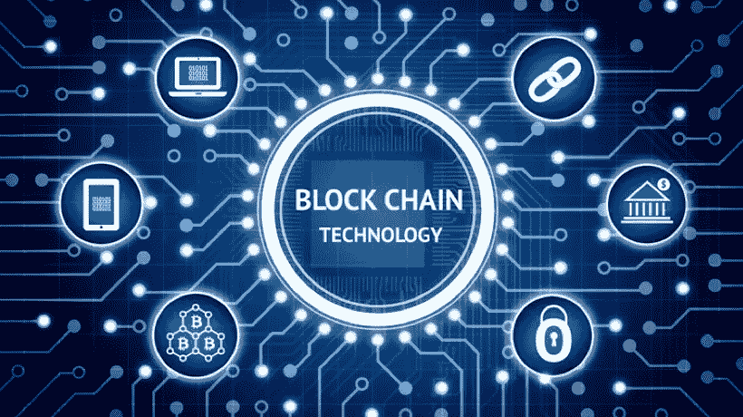
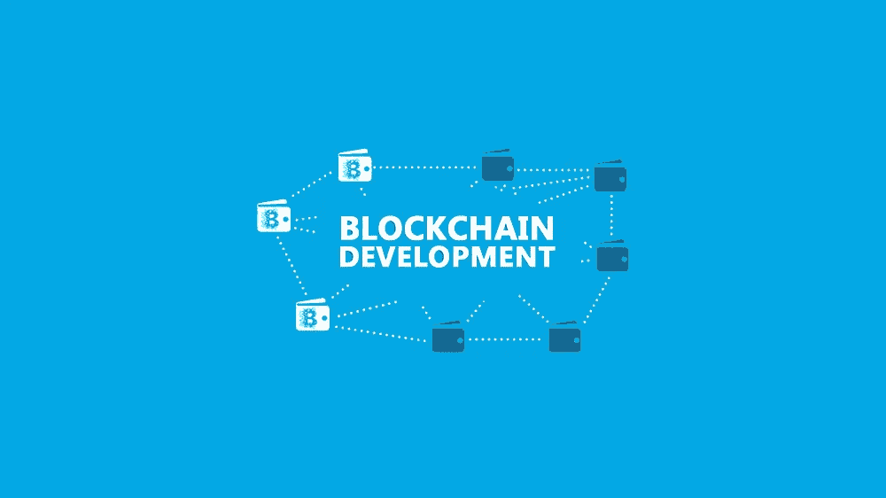

# 如果我必须从头开始，我将如何开始学习区块链

> 原文：<https://blog.devgenius.io/how-i-would-start-learning-blockchain-if-i-had-to-start-all-over-again-2cc867407acd?source=collection_archive---------3----------------------->

一年前我开始学习区块链，同时也学会了如何做和不做。以下是我学习区块链的细节。

## 1-我读过区块链是如何在互联网上工作的

我通过阅读各种人写的白皮书和学术文章了解了区块链是如何工作的。尤其是 Chaum 的不可追踪支付盲签名，比特币白皮书，以太坊白皮书。但是，如果你对区块链和某些数学定理一无所知，无法理解该系统在不同情况下的表现，它们可能会令人困惑。一开始我真的很困惑，因为我没有足够的数学知识。为了消除等式中的混乱，你可以看看互联网上的各种资源，这些资源可以更容易地解释区块链的工作。

## 2-我会同时继续学习数学

有时光靠文字无法给出完整的解释，一些陈述需要中级到高级数学理解某些共识结构及其背后的数学证明。而这些题目大多包括微积分、概率、博弈论。然而，一些白皮书可能使用线性代数、微分方程和随机过程来强调他们的区块链共识协议。

## 3-我会从一开始就参加课程

如果你想快速了解整个系统是如何工作的，而不必在网上支付高价，这是打破区块链的最简单的方法。虽然大多数区块链课程价格非常便宜，旨在通过在线学习平台上购买课程的人数来赚钱，但也有很多来自某些地方的优秀资源，旨在教授区块链知识，并开始从我的电脑上寻找它们。然后我会根据你的进度选择课程并完成它们，如果有一个截止日期，进度可以根据需要进行一定程度的调整。

## 4-当我通过区块链学习时，我会阅读用例

但是阅读用例是有条件的。你必须了解区块链是如何运作的。然后，您将把您的知识与不同领域的用例结合起来，以了解如何解决每个领域的问题，以及哪些工具对此有用，而不是埋头编写代码几个月，考虑如何解决问题。

## 5-我会在区块链社区更公开地讨论

与人交流通常是学习区块链不同应用的最佳来源。更重要的是，如果你犹豫不决，他们可以让你在某些问题上思路清晰。但是，不要谈论太多关于区块链的事情，因为这会让人厌烦，让你在其他人眼里看起来很无聊，从而给团队带来不必要的麻烦。为了防止这种情况，最好的解决办法是研究这个话题，如果你不明白这个话题，就去问有经验的人。之后，你可以随心所欲地出去玩，以保持更强的联系。

## 6-我会更早开始发育

这是我带着一点点内疚看待没有更早开始编程的一个原因。但是你不必了解代码，除非你想成为一名开发人员。如果你愿意，你可以学习与区块链技术完全相关的编程课程，并在某些平台上发布这些课程，以展示你的技能和专业知识。

你会如何学习区块链？你有没有想过如果必须的话，你会如何开始学习区块链？在下面的评论区分享你的想法和经历。