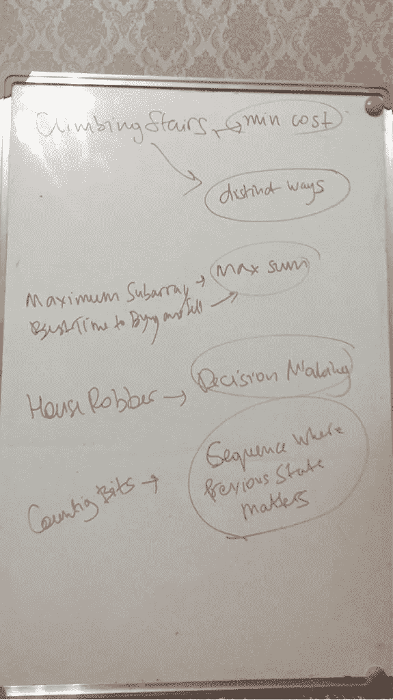

# 我如何写我的第一本编程电子书

> 原文：<https://blog.devgenius.io/how-i-wrote-my-first-programming-ebook-3b2c183f6150?source=collection_archive---------3----------------------->

格伦·卡斯滕斯-彼得斯在 [Unsplash](https://unsplash.com/s/photos/write?utm_source=unsplash&utm_medium=referral&utm_content=creditCopyText) 上拍摄的照片

最近，我完成了我的第一本电子书[动态编程指南](https://gumroad.com/l/cAEgH)。今天，我想分享我写这个指南的故事。

决定倒带准备编码面试的时候是 2019 年。我从解决 LeetCode 问题开始，没有研究新的题目。我的目标是登陆谷歌，所以我希望能轻松应对中等和高难度的问题。当然，动态编程是谷歌面试中最受欢迎的问题之一，这对我来说是一场噩梦。我记得我在大学的时候很努力的去理解 DP。然而，我只能理解 DP 是关于记住以前的决定，仅此而已。在我准备面试的时候，我总是尽量避免 DP，跳过它，或者希望在面试中不要遇到 DP。但是这个策略让我失去了信心。我总是觉得我没有准备好接受采访，因为我没有涵盖所有的话题。

有一天，我意识到我选择的策略不是通向成功的道路。我就是这样开始了我的 DP 之旅。我开始寻找关于 DP 的教程，视频，或者文章。尽管网上有很多资源，但要找到一个系统的方法来理解这个话题并不容易。有些视频解释了什么是 DP，自顶向下还是自底向上的解决方案。一些文章解释了如何递归地解决问题，例如，众所周知的 DP 问题的解决方案。我寻找一种结合所有这些资源的方法。在看了一些视频和博客后，我开始稳定地解决简单的 DP 问题，大部分时间都花在寻找解决方案上。为了使学习更容易，我开始在问题中寻找模式，将它们分类。通过这种方式，我想弄清楚从一个关于约束和可能的解决方案的问题中期望得到什么，比如期望字符串上 DP 问题的二次时间复杂度，或者总结组合问题的可能方法。我花了两个月的时间把我解决的 DP 上的所有 LeetCode 问题分类。我就是这样产生了写[动态编程模式](https://leetcode.com/discuss/general-discussion/458695/dynamic-programming-patterns)的想法。我创建了一个 markdown 文件，开始每天一点一点地写。两个月，我想出了六种模式。

图片来自 2019 年

12 月，LeetCode 宣布了 2019 年最佳帖子的比赛，我决定在那里上传我的作品。我没想到它会产生重大影响，因为即使我发现这些模式对我有用，这仍然是我的观点。

令人惊讶的是，这个帖子像病毒一样传播开来，在头两天，它就获得了 894 次投票和 1 万次浏览。Upvotes 每天都在增长，在 12 月底，我的帖子被选为 2019 年最佳帖子之一。我从 LeetCode 那里收到了非常棒的赠品。

目前,《邮报》平均每天获得五张赞成票。在写这篇文章的时候，动态编程模式被投票 6.9k 次，被浏览 358k 次(LeetCode 中投票最多的文章)。我收到了很多反馈。有时人们会说，如果你不理解大意，学习模式是没有用的。在某种程度上，我同意先建立基础总是更好的这个事实。这促使我在 DP 上创作了一个视频系列。那时候我已经有一个上传编程视频的 YouTube 频道了。在接下来的几天里，我录制了第一个解释动态编程概念的视频。我应该说，在一个镜头中制作一个视频并不容易。我认为原因是我在录制视频时没有讲稿可循。所以我决定先写下我的课堂笔记，然后录制视频。我决定把我的课堂笔记保存在减价文件中。

我阅读了理查德·贝尔曼关于动态编程的论文，以了解动态编程的理论。本文给出了动态规划的思想，如动态规划要解决什么问题，如何利用状态变量进行记忆。我想让人们更容易理解如何解决 DP 问题；因此，我把解决问题分成了可以遵循的步骤。写完对自顶向下解决方案的解释后，下一步是解释自底向上的解决方案。类似于自顶向下的解决方案，我把自底向上的解决方案分成几个步骤。在每一个解释之后，我都会在这些步骤之后添加一些问题的解决方案，比如斐波那契数列。下一步是写时间和空间复杂性的分析。在接下来的几个月里，我的讲稿初稿准备好了。尽管已经准备好了讲稿，我还是改变了制作视频系列的想法。相反，我决定将课堂笔记转换成电子书。我把初稿发给了我的朋友，并收到了许多修改电子书中特定主题的建议。考虑到所有的建议，我改变了电子书中的一些主题，并删除了一些不必要的部分。之后，我给我的朋友发了一个更新版本，但这一次，我得到的建议很少，他们承认电子书整体看起来不错。我改变了几个地方，并添加了一个在加拿大制造的封面。最后一部分是校对，并发送给 Gumroad。我最初无法决定将电子书上传到 Gumroad 还是亚马逊 KDP。但后来，我停在了 Gumroad。

总结一下，这是我第一次写比文章更大的东西。我希望我能保持这个速度，写更多关于编程的书。你可能会好奇我从哪里得到 FAANG 的邀请，但这是另一回事。

感谢您的阅读！