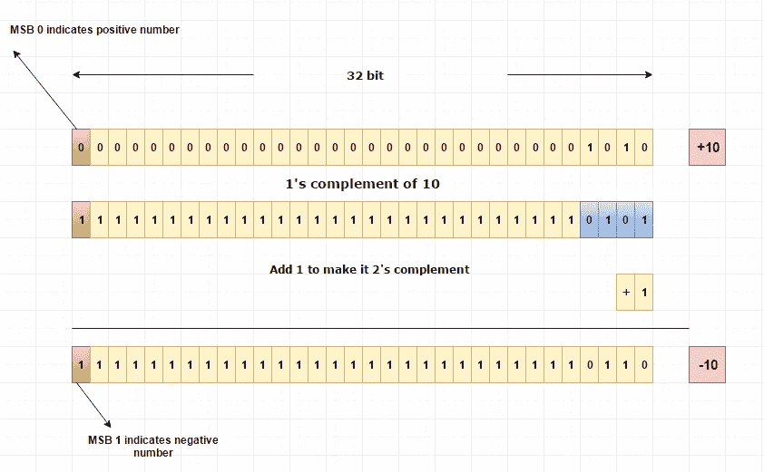
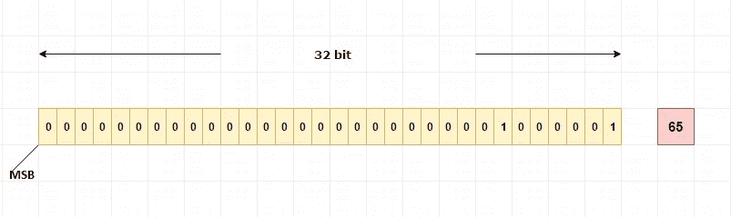
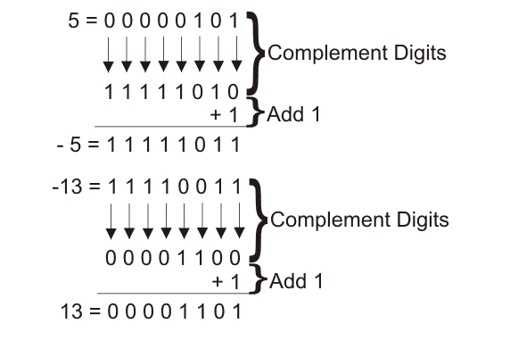

# 如何使用二进制补码将整数存储在内存中

> 原文：<https://blog.devgenius.io/how-integers-are-stored-in-memory-using-twos-complement-9131880ae9b3?source=collection_archive---------11----------------------->

图片来源:log2base2.com

在这篇短文中，我将分享如何使用二进制补码将整数存储在计算机内存中。如果你想了解更多关于内存的知识，你可以阅读[我之前的博客文章，C 编程中的内存](https://medium.com/@chiaracaprasi/memory-in-c-programming-5fee2e0f17a2)🔗。所以，事不宜迟，我们开始吧！

## 什么是整数？

一个**整数是一个整数**(来自拉丁语 *integer* 意为“整体”)——这是一个可以不用分数部分书写的数字。

大多数编程语言都提供了一种叫做‘integer’的数据类型，通常简称为‘int’。在计算机中，整数用 4 字节(32 位)内存存储。

在编程的上下文中，整数是用二进制值表示的整数。

## 二进制数

二进制数是以 2 为基数的数字系统或二进制数字系统表示的数，这是一种仅使用两个符号的数学表示方法:0(零)和 1(一)。

所有计算机数据都用二进制表示，所以数字 0 和 1。二进制数字，或称**位**，是计算中最小的数据单位。

## 正数和负数

计算机需要存储正数和负数。由于二进制中只有两个可用的符号(0 和 1)，我们需要找到一种方法来用 0 或 1 表示正负符号。

二进制补码格式是计算机存储负数的方式。

在二进制数中，MSB(最高有效位)，即最左边的位，用来表示该数是正数还是负数。

*   正数的 MSB 是 0。
*   在负数中，MSB 将是 1。

让我们乘 65 路。它的二进制 8 位表示(char)将是 01000001 或 32 位数量(int ),如下图所示。

32 位二进制 65 的图像。图片来源——log2base2.com

## 二进制补码

计算机用二进制补码存储一个数的负值。为了理解 2 的补码，我们需要先看看 1 的补码。

在一个数的 1 补码中，我们只需反转该数的二进制位，这样 0 就变成了 1，反之亦然。

因此，如果我们继续使用 0100 0001(基数为 10 的 65)，它的 1 补码就是 1011 1110

要获得 2 的补码，我们只需在 1 的补码上加 1。所以 0–65 在二进制中是 1011 1111。

如果我们想从负/正或到负/正进行计算，这种反转加一的方法是双向的。

让我们来看另一个例子——以十进制数 10 为例

*   小数:10
*   二进制:0000 1010
*   1 的补码:1111 0101
*   二进制补码:1111 0110

如下图所示👇🏾

我希望这篇文章对你有所帮助。如果你有任何问题、评论或者想打个招呼，请通过 LinkedIn 联系我，或者通过 Medium 关注我。

*保持快乐，继续编码！*👩🏻‍💻

资源

 [## 整数—维基百科

### 整数(来自拉丁语 integer，意为“整体”)的通俗定义是一个可以不用…

en.wikipedia.org](https://en.wikipedia.org/wiki/Integer)  [## 整数如何存储在内存中|负数如何存储在内存中

### 整数是用 4 字节(32 位)内存存储在计算机中的整数。示例 65 二进制…

www.log2base2.com](https://www.log2base2.com/storage/how-integers-are-stored-in-memory.html)  [## 二进制补码

### 托马斯·芬利，2000 年 4 月二进制补码并不是一个复杂的方案，也不适合任何过长的内容…

www.cs.cornell.edu](https://www.cs.cornell.edu/~tomf/notes/cps104/twoscomp.html)