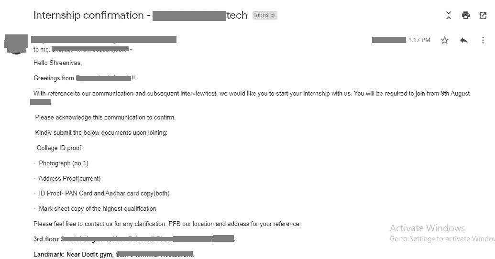
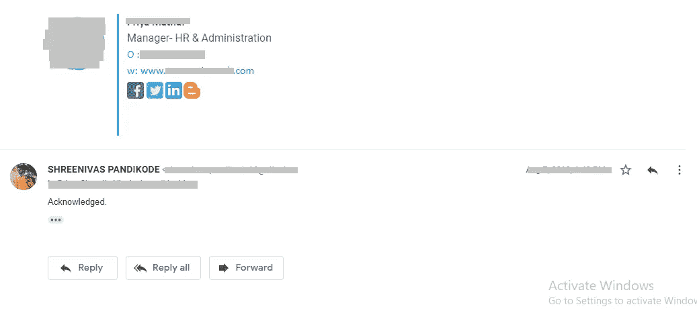
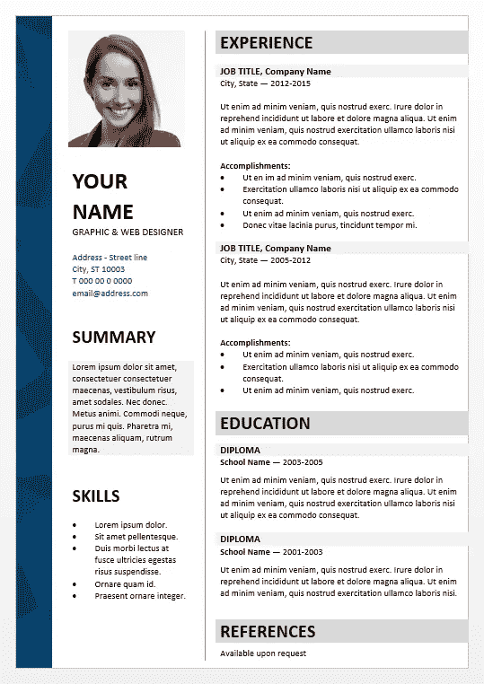
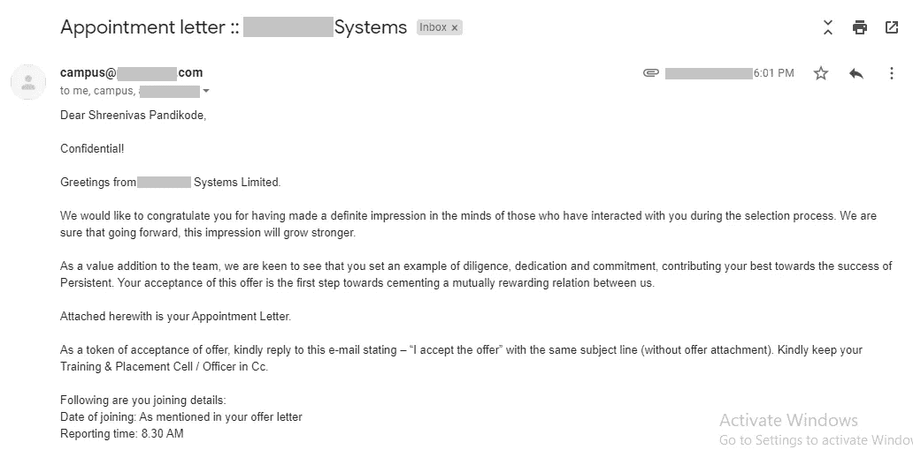

# 实习如何帮助我获得全职软件工程师的工作(价值 4.5 万美元)

> 原文：<https://blog.devgenius.io/how-internship-helped-me-to-get-full-time-software-engineer-job-worth-45k-9ec3b6328b7d?source=collection_archive---------18----------------------->

由于新冠肺炎，整个世界都在震动，许多人失去了工作。

许多新手正试图通过做远程工作或任何他们能在世界任何地方做的事情来在科技领域发展自己的事业。

然而，在技术世界中，每天都有一些令人惊奇的事情发生。

但是对于许多新开发人员来说，投身于技术行业，尤其是编程行业的前景可能会令人生畏。

有这么多的技术要学习，有这么多的编程语言可供选择。没有人知道今天有效的东西，明天可能有效也可能无效。

因为技术本身也在进化，而且每天都在变化。

当我在工程的第三年时，我已经筋疲力尽了，通过大量的考试，实习和学术上的许多事情来学习越来越多的技术。

我想知道是什么让我着迷于在科技领域做真正的工作。

为了弄清楚这一点，我决定在科技行业工作，找一份真正的工作，即毕业前在公司实习。

我开始寻找一份暑期实习，用我仅有的一点知识在一家科技公司获得一些真正的编程经验。

在申请了 20 多家公司后，我最终在一家小公司获得了为期 2 个月的暑期实习。

在实习期间，我开始知道在现实世界中做项目需要什么，而不是你愚蠢的大学实习或你在学术期间做的项目。

我是一名前端开发人员，在那里我必须用简单的 UI 构建一些基本的项目。一开始学了 HTML，CSS，还有一些前端框架的介绍。

在那之后，在工程的最后一年，我们必须完成为期六个月的实习，因为这是一门学术课程，我认为这是我整个工程生涯中最好的学习经历。

同样，我开始申请为期六个月的冬季实习，因为我在去年夏天有一些经验，当时我所有的大学朋友都习惯于度假，而我在一家公司为自己工作，以培养技术技能。

因此，凭借在现实世界科技公司的经验优势，我最终在一家我所能想象的大型科技公司获得了为期六个月的带薪实习。

这是我收到的一封电子邮件的截图，上面有一家公司的实习机会

实习聘书

当我得到一份工作时，没有浪费一点时间，我就接受了这份工作，实现了我技术旅程中的下一个里程碑。

我接受实习

几年前，我开始了我的第一份“软件工程工作”，我必须说，在获得任何全职工作之前进行实习是我职业生涯中所做的最好的决定之一。

现在，与你在互联网上读到的数百篇其他博客文章(或经历)不同，这篇文章将会有所不同。

# 会有什么不同？

好吧，我将揭示帮助我的实际策略和事情，以及所有简历技巧、个人资料优化、作品集网站和实习平台，这样你就可以清楚地知道如何让事情朝着正确的方向发展。

所以不要再浪费时间了，让我们开始吧。

## **我们将讨论以下主题-**

1.  选择技术堆栈以及如何仅从基础开始
2.  构建真实世界的项目并建立您的投资组合网站
3.  优化你的简历
4.  申请实习

让我们深入了解其中的每一项…

# **1。仅从基本面开始**

关于选择编程语言或任何技术堆栈，任何技术人员可以给你的最常见的建议是开始学习 Python、Java、HTML 或 Javascript，或者选择当前世界需求较高的语言。

现在让我们明确一件事——

> 没有什么叫做“高需求和流行语言/技术栈”，无论是“Java”还是“Python”——只要你在学习，任何东西都有需求。

科技行业没有任何被称为高需求的指标(不同语言内部的竞争是行业竞争，而不是学习多种语言或只学习一种语言的开发人员的竞争)。

科技行业的竞争越激烈，开发者的竞争就越激烈，因此薪资潜力也就越大。

下面是您可以做的事情，以找到易于选择的编程语言:-

1.  列出所有你听过的顶级编程语言。事实上，以下是你可以选择的前 5 种编程语言

*   C
*   Java 语言(一种计算机语言，尤用于创建网站)
*   计算机编程语言
*   java 描述语言
*   红宝石

> **注意:**我的第一个也是一直推荐的是用 C 语言。因为它教会了你核心的编程概念，当你学完 c 语言后，这些概念可以应用到任何其他编程语言中。

2.不要第一眼就选择任何技术组合——敞开心扉，你可以学到任何东西。

3.从基本的概念开始，然后试着用你选择的任何语言学习高级的东西。

我说——不要选择任何特定的语言或堆栈的原因是，当我开始申请我的第一份实习时，我只知道 C 语言和 HTML 的基础知识以及 Tech 中的 CSS。

我开始申请实习，只使用那些技能，并希望有一天我能在一家公司实习，成为一名 C 开发人员。

你猜怎么着，我根据我仅有的 C 基础知识进行了面试，最后得到了一份前端开发人员的实习工作，在那里我不得不从头开始学习。

最初，我开始学习 HTML，CSS 的细节，之后，我做了真正的项目。

通过这样做，你将拥有比任何人第一次尝试都要多的科技领域和知识。

# 2.构建一些真实世界的项目

创建现实世界的项目，如如果你知道 HTML 和 CSS，建立网上餐厅网站，网上订票，点餐，预订出租车，可以让你与其他人区分开来。

当谈到在网上申请实习时建立信任时，拥有不同的项目是非常重要的。

此外，如果你有一个文件夹，里面有关于你的技能和项目的详细信息，可以在面试中给你留下更好的印象。因为在当今世界，在网上建立信任非常重要。

投资 10 美元购买一个域名或者从像 [Netlify](https://www.netlify.com/) 、 [Heroku](https://www.heroku.com/) 、 [GitHub](https://github.com/) 这样的网站创建一个免费的投资组合可能是你能做的最好的投资。

你所要做的就是确保你写的任何东西都是有条理的，并且当任何人来访问你的网站时都能理解。

你需要确保你不需要在你的投资组合网站上有一个侧边栏部分或许多菜单，这将节省更多的空间，使一切简单易读。

你要更加注重可读性！

以下是你需要确保在你的网站中拥有的基本页面-

*   关于我们/我
*   联系我们/我
*   项目
*   技能
*   隐私策略
*   关联披露(如果需要)

让我们把事情变得更有趣-

当我申请实习的时候，我只有一个项目，是我在大学期间做的，也是用 C 语言做的。

因此，我带着我仅有的一个项目开始申请实习，你猜怎么着，我没有得到任何公司的回应。

原因是，我的简介太简单了，任何人都可以拒绝我。我没有优化我的简历，投资组合网站，也没有足够的项目来展示我的才华和技能。

当我开始制作我的简历、投资组合网站和建立另外两个项目时，公司开始注意到我并从众多候选人中脱颖而出。

**警告-** 不要仅仅为了在简历上提及而完成那些不同平台的在线认证课程。因为如果你不自己建立一些真正的项目，这是不值得的。

# **3。优化你的简历**

创建你的简历是如此简单，但优化它以脱颖而出是相当困难的。

但你不必担心，以下是我注意到的人们在简历中常犯的错误:

*   谈论更多关于认证之类的事情，而忘记讨论他们已经参与的项目
*   没有使用合适的简历模板来脱颖而出，使其独一无二。
*   与字体及其大小不一致。没有使用任何适当的格式
*   制作超过 2 页长的简历
*   有常见的愚蠢的语法错误
*   不使用 PDF 格式文件

简历中所有的小错误都会让招聘人员看到你性格的不同方面。因此，我们的工作就是让简历没有错误，脱颖而出。

以下是你在优化简历时应该考虑的几点

**1。在简历中推销自己-**

不要羞于谈论你的技能、证书和成就。用粗体列出一个你职业生涯中令人印象深刻的成就。

不管是什么。写下来。

**2。添加一点自己的个性-**

不要只做简历，到处塞关键词。一定要有一点个性，让任何招聘人员浏览你的简历时都能记住。

**3。使用适当的格式-**

简历中恰当的格式会使可读性更加干净整洁。如果你使用任何字体，在简历中保持一致。不要改变它。

具有相同的字体大小。必要时使用项目符号。

**4。避免冗长的简历-**

不要制作超过两页的简历。招聘人员正忙着审阅他们的大量简历。

他们没有时间阅读你所有的长篇简历。尽量保持简短。

**5。使用在线简历模板-**

使用在线简历模板，确保你的简历脱颖而出，独一无二。我建议你使用以下在线工具制作简历:

*   [Canva](https://www.canva.com/)
*   [VisualCV](https://www.visualcv.com/)
*   [Kickresume](https://www.kickresume.com/en/)
*   [泽蒂](https://zety.com/)

**6。关注相关性-**

在你的简历中只列出相关的技能。重点强调你想找工作的技术。不要列出你从未用过的每一项技术技能。

7。总是使用 PDF 文件-

PDF 文件将确保您的格式与招聘人员看到的格式一致。

这是一份简历模板的样本，你可以在制作简历时参考。

来源:[显示表](https://www.showeet.com/18/12/2015/resume-cv/dalston-elegant-powerpoint-resume-curriculum-vitae-template/)

正如我在上一节中解释了各种类型的错误以及如何克服它们，现在你必须知道如何展示你的简历。

如果你能设法让一群人或你的朋友分享他们对你简历的反馈，你就能得到免费的建议以及他们会在你简历中遇到的错误，所以这是一个优势。

# 4.**申请实习**

在你完成上述所有步骤后，如果你完全相信你想在该公司实习，你唯一剩下的就是申请实习并从中获得行业经验。

在我看来，以下是你可以开始并申请实习的最受欢迎的网站:

*   [LinkedIn](https://www.linkedin.com/)
*   [Internshala](https://internshala.com/)
*   [玻璃门](https://www.glassdoor.com)
*   [AngelList](https://angel.co/)

当你申请任何公司的实习职位时，试着在其中一个网站上申请 2-3 个高度相关的实习职位，当你能达到至少 50%的标准时再申请

这需要时间。不要在申请了 2-3 个实习机会后被拒绝或没有得到任何回应就放弃。

我申请了 30 多家公司的实习机会，通过了一次面试，三个月后被选中。

所以不要放弃。优化你的个人资料，从错误中学习。

申请就好！

最坏的情况会是什么，他们只会对你说一个大大的不。如果你得到了梦寐以求的实习机会呢。所以只要你符合条件，就开始申请吧。

获取一些行业经验。重复这个过程，直到你感到自信，然后找到一份全职工作。一切都是值得的。

让我告诉你发生在我身上最重要的事情-

由于我在毕业前已经在公司实习过，所以我比任何人都更有信心。

我有很好的行业经验，一毕业就开始面试全职软件工程师的职位。

这是我收到的一封电子邮件的截图，其中有一家公司提供了一个全职软件工程师的职位，年薪 4.5 万美元。

预约信电子邮件

这是我的第一份全职工作，对我来说，报酬也更好，因为我刚获得大学学位就开始了我的第一份工作。

因此，这是我最好的方式来实现我毕业前的梦想。我愉快地接受了邀请，对此我也非常感激…

# **总结**

我试图给你 100%可行的建议，以我自己的经验为依据，不考虑任何获得实习机会的假设。

如果让我用一句话概括所有的事情，我会说:

> 培养技能，创造真实世界的项目。公司会联系你的！追公司没有建筑技能，没有真实世界的项目，最终会死追！

所以如果你真的想利用实习机会，我祝你好运，我希望有一天能读到你的故事。

如果你喜欢实习的这个观点，别忘了告诉我你的想法。

如果你想告诉我你的想法并实时关注我的经历，你可以在 Twitter 上联系我！