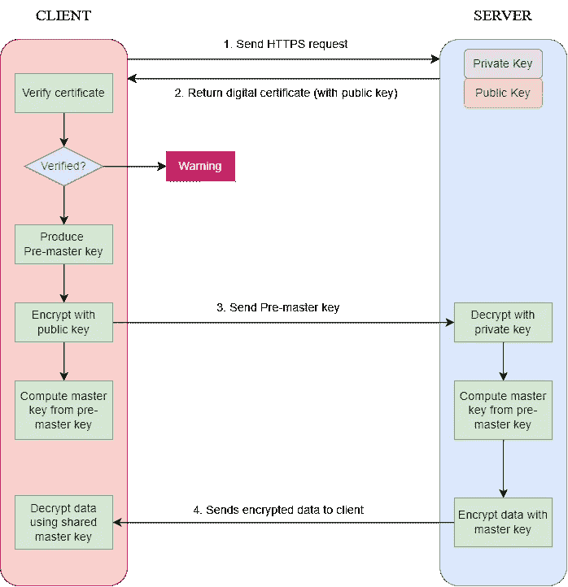

# HTTPS 和 HTTP 有什么不同？

> 原文：<https://blog.devgenius.io/how-is-https-different-from-http-93ccf93a7abf?source=collection_archive---------9----------------------->

这可能是一个老问题，但我确实有一些非技术类的朋友仍然在问我这个问题。

起初，我只知道 HTTPS 使用了我从学校学到的非对称加密技术，但我不太清楚具体的工作流程。

所以我潜得更深。

基本上，HTTPS 是 HTTP 的“升级”版本。

> HTTPS = HTTP + SSL/TLS。

**SSL** 代表安全套接字层 **TLS** 代表传输层安全，SSL 的继承者。使用 SSL 或 TLS 可以保证传输数据的安全性。

对于 HTTP，这可能是在网络传输中看到的内容:

> 这是一条明文消息。

与 HTTPS，这是相反的:

> dg5e6fd465h76ea8g4wa23g132a1b

HTTPS 对攻击者了解传输的真实数据提出了挑战。

## 那么 HTTPS 到底是如何运作的呢？

为了更容易理解，图表可能会有所帮助。

首先，客户端请求一个 HTTPS 请求，并连接到服务器的 443 端口。(第一步)

服务器持有一个数字证书，其中包含**公钥**、证书颁发者和到期日期。它将证书发送回客户端。(第二步)

## 暂停。什么是公钥？

公钥加密由公钥-私钥对组成。公钥暴露给网络中的每个人，可以用来加密发送给接收方的数据。当接收者收到加密的数据时，他/她使用私钥解密数据。这确保了传输数据的安全性和隐私性。

因此，当服务器将其数字证书发送给客户端时，公钥被提供给客户端，而服务器保留私钥。

当客户端收到证书时，它会验证证书的有效性。如果验证通过，客户端将生成一个随机的**预主密钥。**该密钥将使用服务器的公钥加密并发送给服务器。(第三步)

由于服务器拥有私钥，因此它可以解密预主密钥。

现在客户机和服务器都有了预主密钥。

基于他们商定的密码套件，他们将生成一个**对称主密钥**。

## 再次暂停。什么是对称主密钥？

主密钥是用于网络会话的客户端和服务器之间的密钥。这不同于我们之前讨论的私有和公共密钥。它涉及另一种类型的加密技术— **对称密钥算法，**而公钥加密技术是**非对称的**。在对称加密中，明文的加密和密文的解密都依赖于同一个密钥。

获得主密钥后，服务器和客户端可以使用主密钥相互通信，没有人知道网络中正在传输什么。

## 复杂？

HTTPS 是一个完美的用例，其中非对称加密和对称加密同时出现，这有助于确保网络通信中的数据安全。

你有什么想法？请在下方留言评论。

我希望这篇文章对你有所帮助。

我是后端软件工程师。如果你像我一样，渴望了解技术，请关注我的频道，了解我在日常工作和生活中获得的灵感。

> ***阅读更多:***[*一个关于 Java 静态关键字在职期间的案例*](/a-case-about-java-static-keyword-during-my-job-53cebb6af597)[*如何解决这个 Java 多线程面试问题？*](/how-can-you-solve-this-java-multithreading-interview-problem-8e6ec53fab27)
> 
> ***获取连接:***[*我的 LinkedIn*](https://www.linkedin.com/in/daini-wang-5127b2182)