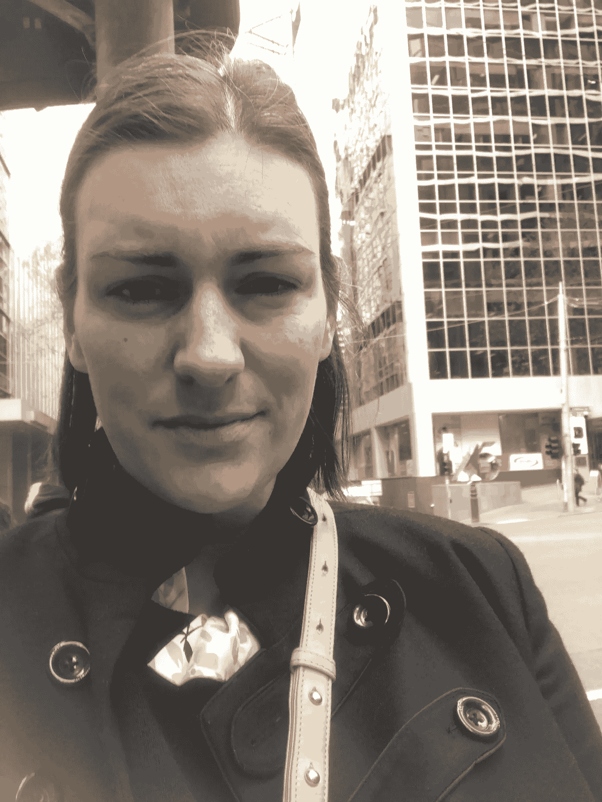
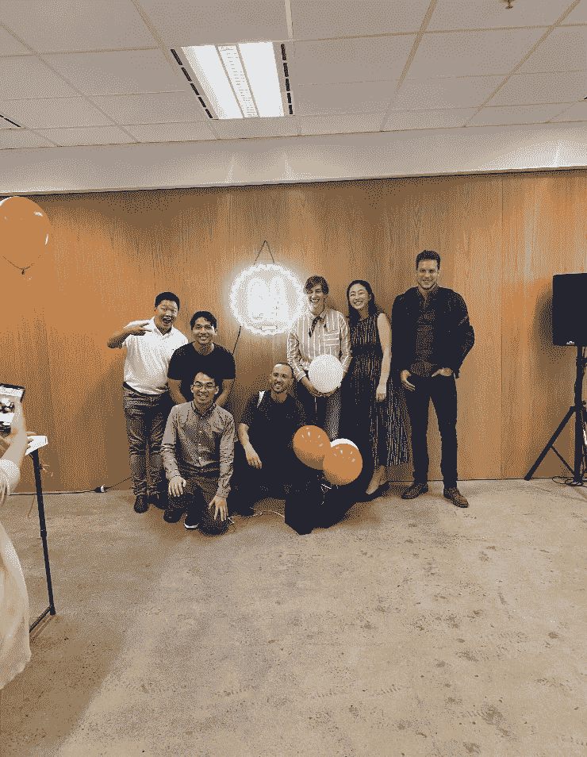
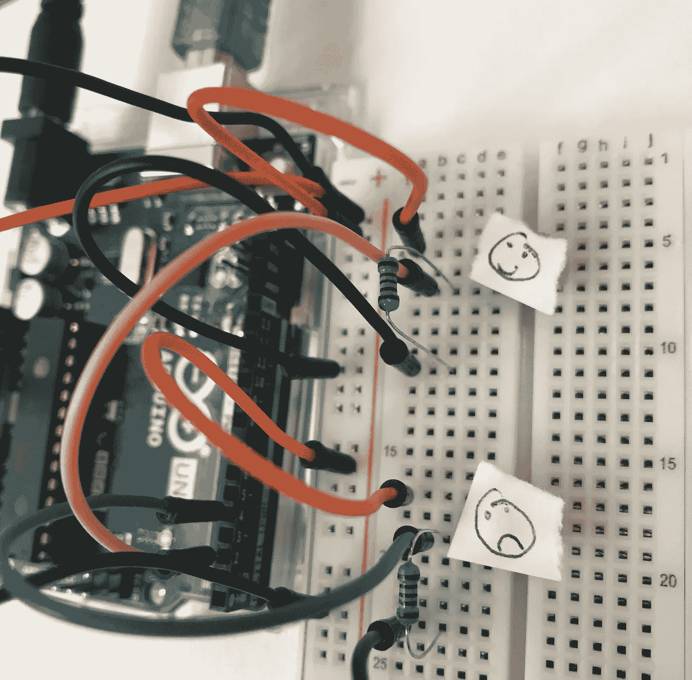

# 你在科技训练营的时间到底是怎么度过的？

> 原文：<https://blog.devgenius.io/how-is-your-time-spent-in-a-tech-bootcamp-exactly-6d2e1911a3fd?source=collection_archive---------15----------------------->

我想知道！我在那里找不到任何信息。在 6 个月的时间里，我从漫不经心的自学变成了认真的自学，然后试图研究训练营提供了什么。我想知道我的日子会怎样，但找不到任何实质性的东西。

现在我已经经历过了，我想我应该概述一下小时、天、周是如何构成的，以便给别人一个想法。我于 2019 年 12 月在墨尔本大会完成了为期 12 周的软件工程沉浸式学习。

我第一天上课时在大会办公室前拍了这张照片……我发誓我真的很兴奋！:)

在训练营开始之前，我们被安排了 50 个小时的准备工作，这真的很有帮助。这都是通过一个大会仪表板在线进行的。你必须创建一个 Github 账户，并推出一个纸牌匹配游戏项目，他们会一路指导你。

课程正式开始后，我们被告知要投入 40 个小时的课堂时间(周一至周五，上午 9 点至下午 5 点)以及大约 10 个小时的晚上和周末时间。我大概每晚都是半夜左右睡觉，周末跳过大部分社交活动。节奏快得令人难以置信，以至于我和其他学生都在谈论我们有多讨厌上厕所，因为我们认为我们会错过太多！

沉浸式课程是结构化的，为期两周的讲座——为期一周的项目组合，到处都有一些职业辅导。这是细目分类:

## 讲座周:第 1、2、4、5、7、8、10 和 11 周:

9:00–10:00—代码挑战。助教向班上的学生发出了一个挑战。全班安静地坐着，每个人都独自解决这个问题。这个问题类似于你在 [CodeWars](https://www.codewars.com/) 、[exercisem](https://exercism.io/)或 [Robin](https://myrobin.io/) 上发现的问题。

10:00–10:30/11:00—挑战评估。一名学生被随机叫到全班面前展示他们的代码，并谈论他们的思考过程、解决方案和挑战。然后每个人都有机会谈论它。这对我来说是难以置信的伤脑筋。我每天都非常努力地做这个挑战(大部分时间都失败了)，在全班同学面前表达你的思维过程很困难，但是，这是一次很好的经历。

破裂

11:00/11:30–1:00—复习、讲座和编写代码。在这里，班主任将回顾前一天讨论的内容，检查作业，然后展示课堂上涉及的以下技术的新材料:

*   命令行界面
*   饭桶
*   JavaScript / Node.js
*   AJAX、jQuery
*   HTML/CSS
*   Ruby with Sinatra(结尾有一点 Rails)
*   结构化查询语言
*   Github / Heroku
*   反应
*   TimeDivisionDuplex 时分双工
*   使用 API

午餐

2:10–3:00/5:00—讲座、编码、作业/评估。我们会有更多的讲课时间，通常会根据一天的学习情况给我们布置一些任务或挑战。

我同伴中的一些人！我的眼睛当然是闭着的。

## 项目周:第 3、6、9 和 12 周

这就是训练营的好处所在，在这里你不得不花整整一周的时间来学习前两周的知识。以下是我的回购项目和链接:

第 3 周— JavaScript。我们都接受了用 JavaScript 构建井字游戏的挑战。对我来说，我做了一个东西，我称之为“井字游戏”

第 6 周——Ruby CRUD 应用程序。我选择从事一个我称之为[周日创始人](https://github.com/nikkiricks/sundayfounders)的创业想法。

第 9 周—小组项目。我们选择使用 Ruby on Rails，并创建了一个名为 [TripTogether](https://github.com/nikkiricks/trip_together) 的旅行创意

第 12 周——期末项目(开放式，你可以选择*任何你想做的*)。我选择用开源硬件 Arduino 构建一个项目。非常有趣。我以我女儿的名字给它命名，称它为"[斯隆电话](https://github.com/nikkiricks/Sloane-Phone-Node)"

## 职业辅导

除了技术之外，还有大约 6 场会议，涵盖了你的 LinkedIn 个人资料、简历撰写、面试技巧、求职板搜索、人际关系网，我们还参观了两家公司( [Zendesk](https://www.zendesk.com/) 和 [REA](https://www.rea-group.com/) )。

## 全部的

总的来说，我对我的经历很满意。这是令人难以置信的快节奏，但能够在几个月内转换职业是惊人的。

在以后的文章中，我会分享我是如何选择训练营的，以及在你选择的时候需要注意的事情。

你也可以看到我在训练营期间的[思想回顾](https://medium.com/@nikki.ricks/a-recap-of-my-software-engineering-immersive-experience-at-general-assembly-in-12-tweets-d750fa95c766)和[我是如何找到工作的](https://medium.com/@nikki.ricks/what-my-post-software-engineering-bootcamp-3-month-job-search-looked-like-d037d474093d)。