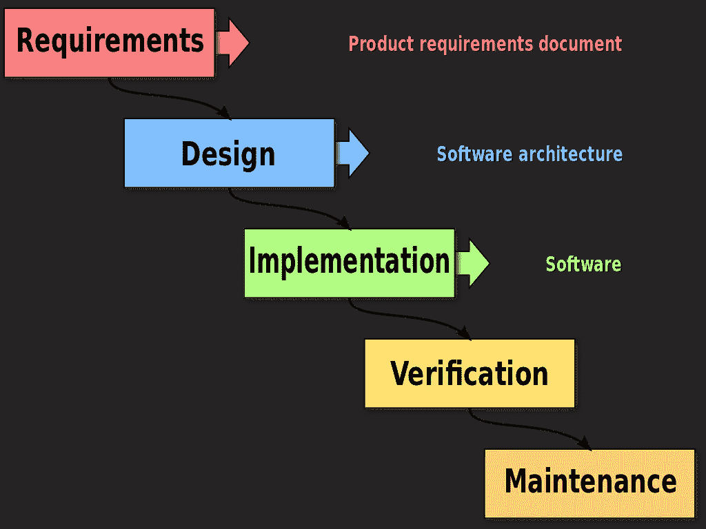

# 和 CodeRiders 一起工作的感觉

> 原文：<https://blog.devgenius.io/how-it-feels-to-work-with-coderiders-14eb41cc8367?source=collection_archive---------6----------------------->

软件外包公司可以成就你的事业，也可以毁掉你的事业。软件外包确实非常有益。然而，选择合适的软件供应商，能够拥有有效和简单的软件开发过程或软件开发生命周期(SDLC)也同样重要。

软件开发过程有几种方法，每一种都取决于合作的类型或客户的需求。在 CodeRiders，我们定义了最[有效的软件外包参与模式](https://www.coderiders.am/software-development-process)，并在讨论了客户对项目的期望后，轻松地向他们推荐其中一个。我们也对客户建议的定制或混合合作模式持开放态度。

在这篇文章中，我们将通过 CodeRiders 揭开有效和多产的软件外包过程的所有秘密。我们将带您了解我们团队的工作环境和氛围、参与模式、报告流程、日常沟通、项目管理、项目结果和交付成果等。如果你想了解软件公司是如何运作的，请继续阅读。

**什么是软件开发过程或软件开发生命周期(SDLC)？**

软件开发过程或 SDLC 是以一种对各方都有效和富有成果的方式组织软件开发工作的过程。整个软件外包过程被分成更小的步骤、里程碑或子过程，以改进产品和项目的管理和设计。

在开始之前，让我们简短地介绍一下 [CodeRiders 软件开发公司](https://www.coderiders.am/)和它的故事。

**code riders 软件开发公司是谁？**

CodeRiders 是一家位于亚美尼亚的软件开发公司。该公司最初成立于 2013 年，当时是一所软件开发学校。短短一年时间，我们给了 800 多位校友，其中 15 位已经成为 CodeRiders 现在的开发者，并在 2014 年组建了 CodeRiders 软件外包公司。

我们是一个由科技爱好者组成的团队。我们公司由不同级别的后端、前端和全栈软件工程师、设计师、项目经理、支持工程师等组成。我们相信时间是宝贵的，自动化可以节省时间。因此，我们努力帮助我们的客户以技术上简单和安全的方式实现业务自动化。

到目前为止，我们已经交付了 [300 多个成功完成的项目](https://www.coderiders.am/portfolio)，与全球 30 多个客户合作。我们开发的产品在全球拥有超过 18 万用户。我们在以下方面拥有专业知识:

*●* CRM 系统，

*●* 电子商务和零售软件、

*●* 移动应用，混合移动应用开发，渐进式 web 应用，

*●* EdTech 软件开发、

*●* 健康科技软件开发，

*●* 为媒体和娱乐行业构建应用和软件，

*●* 金融科技软件开发，

*●* 企业(ERP)软件开发，等等。

欢迎您随时[联系我们](https://www.coderiders.am/contact-us)并获取更多关于我们[软件解决方案](https://www.coderiders.am/solutions)的信息。

***图片来源:***[***https://itel.am/am/news/12931***](https://itel.am/am/news/12931)

我们已经被许多著名的、受人尊敬的目录和奖项认定为值得信赖的软件外包公司。其中一些是:

*●* 欧亚创业奖[最佳软件开发合作伙伴](https://www.coderiders.am/blog/coderiders-is-awarded-as-best-software-development-partner-by-easa)，

*●* 由 [TechReviewer](https://www.coderiders.am/blog/coderiders-is-among-top-php-development-companies-in-2021) 评选的顶级 PHP 开发公司，

*●* 最佳软件开发公司 [TopDevelopers](https://www.coderiders.am/blog/coderiders-is-among-best-software-development-companies) ，

*●* 顶级软件开发公司由 [DesignRush](https://www.designrush.com/press/top-software-development-companies) ，

*●* 亚美尼亚顶级网页开发公司 [AppFutura](https://snip.ly/22e8qj) ，

*●* 顶级软件开发机构由 [TDA](https://snip.ly/it4gii) 、

*●* 由 [GoodFirms](https://www.coderiders.am/blog/coderiders-selected-as-one-of-the-best-tech-service-and-solution-providers-by-goodfirms) 评选的最佳技术服务和解决方案提供商，等等。

**是什么让 CodeRiders 团队脱颖而出**

**团队精神和工作氛围**

我们坚信软件开发的质量与软件外包团队成员之间的内部交流和关系直接相关。我们重视工作中的友好沟通和专业精神。

我们[的员工](https://www.coderiders.am/company-why-us)大部分都有家庭关系，是童年或者大学的朋友，彼此的优缺点都非常了解。这有助于我们的团队在最短的时间内交付高质量的产品。

由于 CodeRiders 最初是作为一所软件开发学校成立的，我们有一个巨大的人才库可供选择。我们的校友彼此熟悉，因此我们可以根据要求灵活地提供熟练的开发人员，他们将很快融入我们的团队。

**没有语言障碍**

我们有国际公认的工作程序，能流利地说多种语言，并与来自不同背景和国家的人分享业务联系。

我们的许多开发人员直接与客户交流；因此，不存在语言障碍。此外，他们中的大多数人英语和俄语都很流利。我们还有两个会说法语和阿拉伯语的开发人员。

我们的[员工](https://www.coderiders.am/company-why-us)大部分都有家庭关系，是童年或者大学的朋友，对彼此的优缺点非常了解。这有助于我们的团队在最短的时间内交付高质量的产品。

由于 CodeRiders 最初是作为一所软件开发学校成立的，我们有一个巨大的人才库可供选择。我们的校友彼此熟悉，因此我们可以根据要求灵活地提供熟练的开发人员，他们将很快融入我们的团队。

**没有语言障碍**

我们有国际公认的工作程序，能流利地说多种语言，并与来自不同背景和国家的人分享业务联系。

我们的许多开发人员直接与客户交流；因此，不存在语言障碍。此外，他们中的大多数人英语和俄语都很流利。我们还有两个会说法语和阿拉伯语的开发人员。

**高品质和实惠价格齐头并进**

亚美尼亚政府非常重视我国信息技术产业的进一步发展。IT 公司免除了许多税收，有机会参加各种国际展览，并有机会接受免费教育。这对市场利率有直接的积极影响。

CodeRiders 也不例外。我们能够不断地培训我们的员工，确保我们了解国际软件开发行业中的所有新奇事物。与此同时，我们有足够的灵活性来建议可承受的价格。

选择亚美尼亚软件外包公司有很多好处。如果你曾经想知道哪个国家最适合软件外包，我们推荐你去看看关于软件外包给亚美尼亚的利弊的文章。在选择软件外包的下一个国家之前，您将了解最重要的提示。

**持续汇报和日常沟通**

我们很容易融入新的业务合作方式，并保持成功的业务伙伴关系。总的来说，亚美尼亚人没有特定的心态，这使得他们很难与国际市场合作。我们有足够的灵活性来适应任何新的环境。

在开始合作之前，我们的业务开发团队确保每个问题或信息都清楚明了。一旦合作开始，通常项目经理会致力于保持你和 CodeRiders 开发人员之间的持续沟通。

可能会有这样的情况，客户方有一个专门的项目经理，或者希望与开发人员直接沟通。在这种情况下，我们让客户直接与我们的开发人员对话，并由他们自己管理流程。

我们的团队非常重视任务报告。我们同意提前向您报告的频率。因此，报告是每天、每周、每两周还是每月进行，取决于您的需求。我们也愿意与您举行日常会议，以确保我们在同一页上，每个请求都得到正确处理。

**基于里程碑的可交付成果**

我们将您的整个项目分成几个里程碑，并逐一完成每个里程碑。每个里程碑都有其任务、要求和截止日期。一旦里程碑完成，我们将向您报告我们的进展，并随时向您更新任何问题或顾虑(如果有)。一旦我们得到您的批准，我们就进入下一个里程碑。

基于里程碑的方法对双方都有帮助。我们确保我们与您的要求保持一致，您确保到目前为止我们交付的产品符合您的标准。

**灵活的支付模式**

我们灵活的方法是我们的客户最喜欢的。因为付款是开始合作前的主要讨论话题之一，所以我们让您轻松选择最方便的模式。

主要的两种[支付方式](https://www.coderiders.am/software-development-process#industry-standard-engagement-models)是固定价格和时间&物料模型。当有完整的工作范围(SOW)或技术文档时，固定价格是理想的选择。我们所要做的就是浏览需求，并向客户提供时间和预算估计。如果 SOW 不完整，我们只能提供粗略的估计，这些估计在开发过程中可能会发生变化。

当没有文档时，或者当项目在开发过程中将有新的特性、功能和变更时，时间和材料支付模型是理想的。在这种情况下，我们为每项资源提供基于小时或基于月的报价。他们按要求的任务工作，你只为工作时间付费。

我们还有团队增强参与模型，它是需要多种资源的项目的理想选择。我们能够为我们的客户提供网络和移动开发人员，设计师，项目经理，质量保证专家等。在这种情况下，项目成本取决于团队规模、专业人员的资历水平、项目持续时间等。

由于我们在支付模式上很灵活，我们也对您建议的任何定制或混合参与模式持开放态度。我们可以结合不同合作模式的一些特点，获得一种新的混合模式，专门为您服务。

**客户答谢词**

我们重视与客户的长期关系，因此我们的最终目标始终是客户对他们的软件项目交付、质量、安全性和可持续性的正面评价。收到他们赞赏的话语会让我们开心并有动力继续我们的工作。你可以在我们的网站上阅读我们的评价和案例研究。我们也有对第三方流行目录的评论，如 [G2](https://www.g2crowd.com/products/coderiders/reviews) 、[摘录](https://extract.co/coderiders)和[离合器](https://clutch.co/developers/research)。

下面是对我们长期合作关系的一个评价。一家澳大利亚公司 Dwel Online 与我们合作，构建了一个用于生活方式管理的私有家庭云软件。这是我们从项目负责人 Al Segian 那里收到的评论。

CodeRiders 是 Dwel 项目的官方开发团队。在过去的两年里，他们一直在我们的项目上勤奋工作，展示了出色的技能，良好的沟通，以及交付准确预期结果的能力。对于任何复杂的、多方面的现代应用程序开发项目，我都强烈推荐这个团队，并期待我们继续合作。

**典型的 CodeRiders 软件开发过程是什么样子的？**

正如我们已经提到的，一个成功的 SDLC 应该被分解成更小的阶段或里程碑。在这一节中，我们将用 CodeRiders 的一个真实例子来展示软件开发生命周期的各个阶段。

CodeRiders #1 的软件开发过程:

**软件开发咨询或需求分析**

在 CodeRiders，我们对自由软件开发咨询持开放态度。此外，我们可以进行多次通话和讨论，以了解您的需求以及我们的服务和解决方案是否能真正帮助您。我们的每一次合作都始于明确的信心，即我们 100%有能力提供必要的软件开发服务。

当我们收到报价或来电请求时，我们通常会在一个工作日内给您回复，并安排一次会面。在会议期间，我们会详细讨论您的期望和需求，评估您的问题，并建议我们的软件解决方案。为了给出简明的时间和成本估计，我们通常需要[技术文档(TD)](https://www.coderiders.am/blog/tips-for-writing-a-candid-technical-documentation) 、工作范围(SOW)文档或类似的东西。

CodeRiders #2 的软件开发过程:

**软件开发解决方案**

在彻底检查您的 SOW 文档后，我们将安排与您的讨论，并提出最适合您的解决方案。我们指定你需要哪些专业人员(后端开发人员，前端开发人员，用户界面/UX 设计人员，项目经理，质量保证专家等)。).

例如，如果您希望对每个子项目的计划、组织和指导的完成有一个清晰的了解，我们也将为您提供一个项目经理。另一方面，如果你有一个专门的项目经理，我们会建议哪些有技术背景的专业人士对你的项目最有帮助。

在此阶段，我们还将与您讨论最佳的软件外包项目模式，并就时间和成本估算达成一致。

我们热爱敏捷软件开发方法。敏捷方法基于迭代开发。它有助于通过自组织、跨职能团队及其最终用户的协作努力来发现需求和开发软件解决方案。

CodeRiders #3 的软件开发过程:

**软件架构和设计**

在就软件开发过程达成一致并讨论了每个细节之后，我们从谈论转移到行动。如果有需要，我们愿意与你签署保密协议(NDA)，或者只是开始合作关系。

架构和设计阶段定义了需要什么样的系统需求，并集中在整个系统的基础上。这一阶段的结果直接归入下一阶段。我们致力于整个系统的架构和数据库，包括所有组件、它们之间的交互、它们运行的环境以及将用于设计软件的原则。

这个阶段是整个项目的基线。所有其他工作高度依赖于架构和数据库设计部分。它是整个系统的基础，非常类似于房屋建筑。你不能跳过或快速完成基础部分，否则，房子的基础会很薄弱，墙壁很容易因暴风雨或其他自然 phenomenon․而毁坏

这就是为什么预先关注架构和设计是至关重要的。许多企业没有评估这一部分的重要性，并经历了漫长的软件开发。

当软件架构完成时，UI/UX 专业人员同时在软件设计部分工作。

如果您需要关于 CodeRiders 软件架构解决方案的详细信息，请务必[给我们留下快速消息](https://www.coderiders.am/contact-us)。

点击下面的链接，阅读 [CodeRiders](https://www.coderiders.am/blog/how-it-feels-to-work-with-coderiders) 博客上的其余文章。

 [## 和 CodeRiders 一起工作的感觉

### 软件外包公司可以成就你的事业，也可以毁掉你的事业。软件外包是非常有益的…

www.coderiders.am](https://www.coderiders.am/blog/how-it-feels-to-work-with-coderiders)