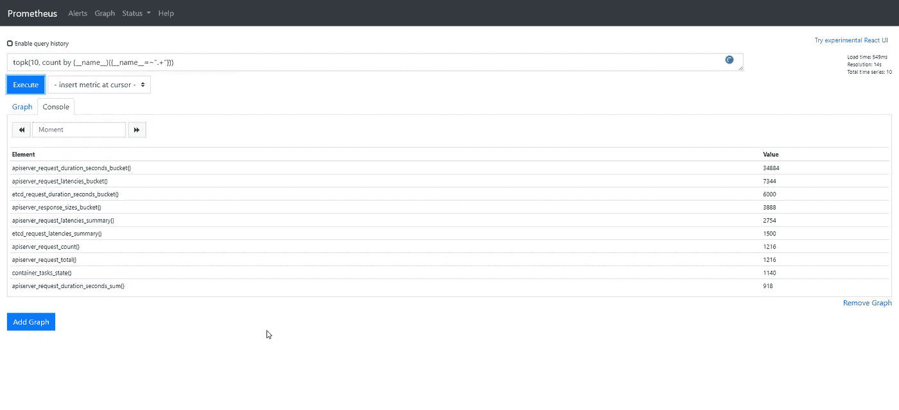

# 它是如何优化 Prometheus 数据库中的磁盘使用的？

> 原文：<https://blog.devgenius.io/how-it-optimize-the-disk-usage-in-the-prometheus-database-ef8151d201db?source=collection_archive---------0----------------------->

## 了解一些技巧来分析和优化 TSDB 的使用情况，并节省云部署的资金。


马库斯·斯皮斯克在 [Unsplash](https://unsplash.com?utm_source=medium&utm_medium=referral) 上的照片

在以前的帖子中，我们讨论了存储层如何为 Prometheus 工作，以及它有多有效。但在当前时代，我们是云计算的一员，我们知道每项技术优化也是成本优化，这就是为什么我们需要非常谨慎地对待我们使用的任何优化选项。

我们知道，通常当我们使用 Prometheus 进行监控时，我们有如此多的出口商可供我们使用，而且每个出口商都暴露了许多非常相关的指标，我们需要这些指标来跟踪我们需要的一切。但是，我们也应该意识到，还有一些我们目前不需要或者不打算使用的指标。那么，如果我们不打算使用，为什么我们要浪费磁盘空间来存储它们呢？

那么，让我们开始看看我们系统中的一个出口商。在我的例子中，我想使用一个 BusinessWorks 容器应用程序，它公开了关于其利用率的指标。如果您检查他们的指标端点，您会看到类似这样的内容:

```
# HELP jvm_info JVM version info
# TYPE jvm_info gauge
jvm_info{version="1.8.0_221-b27",vendor="Oracle Corporation",runtime="Java(TM) SE Runtime Environment",} 1.0
# HELP jvm_memory_bytes_used Used bytes of a given JVM memory area.
# TYPE jvm_memory_bytes_used gauge
jvm_memory_bytes_used{area="heap",} 1.0318492E8
jvm_memory_bytes_used{area="nonheap",} 1.52094712E8
# HELP jvm_memory_bytes_committed Committed (bytes) of a given JVM memory area.
# TYPE jvm_memory_bytes_committed gauge
jvm_memory_bytes_committed{area="heap",} 1.35266304E8
jvm_memory_bytes_committed{area="nonheap",} 1.71302912E8
# HELP jvm_memory_bytes_max Max (bytes) of a given JVM memory area.
# TYPE jvm_memory_bytes_max gauge
jvm_memory_bytes_max{area="heap",} 1.073741824E9
jvm_memory_bytes_max{area="nonheap",} -1.0
# HELP jvm_memory_bytes_init Initial bytes of a given JVM memory area.
# TYPE jvm_memory_bytes_init gauge
jvm_memory_bytes_init{area="heap",} 1.34217728E8
jvm_memory_bytes_init{area="nonheap",} 2555904.0
# HELP jvm_memory_pool_bytes_used Used bytes of a given JVM memory pool.
# TYPE jvm_memory_pool_bytes_used gauge
jvm_memory_pool_bytes_used{pool="Code Cache",} 3.3337536E7
jvm_memory_pool_bytes_used{pool="Metaspace",} 1.04914136E8
jvm_memory_pool_bytes_used{pool="Compressed Class Space",} 1.384304E7
jvm_memory_pool_bytes_used{pool="G1 Eden Space",} 3.3554432E7
jvm_memory_pool_bytes_used{pool="G1 Survivor Space",} 1048576.0
jvm_memory_pool_bytes_used{pool="G1 Old Gen",} 6.8581912E7
# HELP jvm_memory_pool_bytes_committed Committed bytes of a given JVM memory pool.
# TYPE jvm_memory_pool_bytes_committed gauge
jvm_memory_pool_bytes_committed{pool="Code Cache",} 3.3619968E7
jvm_memory_pool_bytes_committed{pool="Metaspace",} 1.19697408E8
jvm_memory_pool_bytes_committed{pool="Compressed Class Space",} 1.7985536E7
jvm_memory_pool_bytes_committed{pool="G1 Eden Space",} 4.6137344E7
jvm_memory_pool_bytes_committed{pool="G1 Survivor Space",} 1048576.0
jvm_memory_pool_bytes_committed{pool="G1 Old Gen",} 8.8080384E7
# HELP jvm_memory_pool_bytes_max Max bytes of a given JVM memory pool.
# TYPE jvm_memory_pool_bytes_max gauge
jvm_memory_pool_bytes_max{pool="Code Cache",} 2.5165824E8
jvm_memory_pool_bytes_max{pool="Metaspace",} -1.0
jvm_memory_pool_bytes_max{pool="Compressed Class Space",} 1.073741824E9
jvm_memory_pool_bytes_max{pool="G1 Eden Space",} -1.0
jvm_memory_pool_bytes_max{pool="G1 Survivor Space",} -1.0
jvm_memory_pool_bytes_max{pool="G1 Old Gen",} 1.073741824E9
# HELP jvm_memory_pool_bytes_init Initial bytes of a given JVM memory pool.
# TYPE jvm_memory_pool_bytes_init gauge
jvm_memory_pool_bytes_init{pool="Code Cache",} 2555904.0
jvm_memory_pool_bytes_init{pool="Metaspace",} 0.0
jvm_memory_pool_bytes_init{pool="Compressed Class Space",} 0.0
jvm_memory_pool_bytes_init{pool="G1 Eden Space",} 7340032.0
jvm_memory_pool_bytes_init{pool="G1 Survivor Space",} 0.0
jvm_memory_pool_bytes_init{pool="G1 Old Gen",} 1.26877696E8
# HELP jvm_buffer_pool_used_bytes Used bytes of a given JVM buffer pool.
# TYPE jvm_buffer_pool_used_bytes gauge
jvm_buffer_pool_used_bytes{pool="direct",} 148590.0
jvm_buffer_pool_used_bytes{pool="mapped",} 0.0
# HELP jvm_buffer_pool_capacity_bytes Bytes capacity of a given JVM buffer pool.
# TYPE jvm_buffer_pool_capacity_bytes gauge
jvm_buffer_pool_capacity_bytes{pool="direct",} 148590.0
jvm_buffer_pool_capacity_bytes{pool="mapped",} 0.0
# HELP jvm_buffer_pool_used_buffers Used buffers of a given JVM buffer pool.
# TYPE jvm_buffer_pool_used_buffers gauge
jvm_buffer_pool_used_buffers{pool="direct",} 19.0
jvm_buffer_pool_used_buffers{pool="mapped",} 0.0
# HELP jvm_classes_loaded The number of classes that are currently loaded in the JVM
# TYPE jvm_classes_loaded gauge
jvm_classes_loaded 16993.0
# HELP jvm_classes_loaded_total The total number of classes that have been loaded since the JVM has started execution
# TYPE jvm_classes_loaded_total counter
jvm_classes_loaded_total 17041.0
# HELP jvm_classes_unloaded_total The total number of classes that have been unloaded since the JVM has started execution
# TYPE jvm_classes_unloaded_total counter
jvm_classes_unloaded_total 48.0
# HELP bwce_activity_stats_list BWCE Activity Statictics list
# TYPE bwce_activity_stats_list gauge
# HELP bwce_activity_counter_list BWCE Activity related Counters list
# TYPE bwce_activity_counter_list gauge
# HELP all_activity_events_count BWCE All Activity Events count by State
# TYPE all_activity_events_count counter
all_activity_events_count{StateName="CANCELLED",} 0.0
all_activity_events_count{StateName="COMPLETED",} 0.0
all_activity_events_count{StateName="STARTED",} 0.0
all_activity_events_count{StateName="FAULTED",} 0.0
# HELP activity_events_count BWCE All Activity Events count by Process, Activity State
# TYPE activity_events_count counter
# HELP activity_total_evaltime_count BWCE Activity EvalTime  by Process and Activity 
# TYPE activity_total_evaltime_count counter
# HELP activity_total_duration_count BWCE Activity DurationTime by Process and Activity 
# TYPE activity_total_duration_count counter
# HELP bwpartner_instance:total_request Total Request for the partner invocation which mapped from the activities
# TYPE bwpartner_instance:total_request counter
# HELP bwpartner_instance:total_duration_ms Total Duration for the partner invocation which mapped from the activities (execution or latency) 
# TYPE bwpartner_instance:total_duration_ms counter
# HELP bwce_process_stats BWCE Process Statistics list
# TYPE bwce_process_stats gauge
# HELP bwce_process_counter_list BWCE Process related Counters list
# TYPE bwce_process_counter_list gauge
# HELP all_process_events_count BWCE All Process Events count by State
# TYPE all_process_events_count counter
all_process_events_count{StateName="CANCELLED",} 0.0
all_process_events_count{StateName="COMPLETED",} 0.0
all_process_events_count{StateName="STARTED",} 0.0
all_process_events_count{StateName="FAULTED",} 0.0
# HELP process_events_count BWCE Process Events count by Operation
# TYPE process_events_count counter
# HELP process_duration_seconds_total BWCE Process Events duration by Operation in seconds
# TYPE process_duration_seconds_total counter
# HELP process_duration_milliseconds_total BWCE Process Events duration by Operation in milliseconds
# TYPE process_duration_milliseconds_total counter
# HELP bwdefinitions:partner BWCE Process Events count by Operation
# TYPE bwdefinitions:partner counter
bwdefinitions:partner{ProcessName="t1.module.item.getTransactionData",ActivityName="FTLPublisher",ServiceName="GetCustomer360",OperationName="GetDataOperation",PartnerService="TransactionService",PartnerOperation="GetTransactionsOperation",Location="internal",PartnerMiddleware="MW",} 1.0
bwdefinitions:partner{ProcessName=" t1.module.item.auditProcess",ActivityName="KafkaSendMessage",ServiceName="GetCustomer360",OperationName="GetDataOperation",PartnerService="AuditService",PartnerOperation="AuditOperation",Location="internal",PartnerMiddleware="MW",} 1.0
bwdefinitions:partner{ProcessName="t1.module.item.getCustomerData",ActivityName="JMSRequestReply",ServiceName="GetCustomer360",OperationName="GetDataOperation",PartnerService="CustomerService",PartnerOperation="GetCustomerDetailsOperation",Location="internal",PartnerMiddleware="MW",} 1.0
# HELP bwdefinitions:binding BW Design Time Repository - binding/transport definition
# TYPE bwdefinitions:binding counter
bwdefinitions:binding{ServiceName="GetCustomer360",OperationName="GetDataOperation",ServiceInterface="GetCustomer360:GetDataOperation",Binding="/customer",Transport="HTTP",} 1.0
# HELP bwdefinitions:service BW Design Time Repository - Service definition
# TYPE bwdefinitions:service counter
bwdefinitions:service{ProcessName="t1.module.sub.item.getCustomerData",ServiceName="GetCustomer360",OperationName="GetDataOperation",ServiceInstance="GetCustomer360:GetDataOperation",} 1.0
bwdefinitions:service{ProcessName="t1.module.sub.item.auditProcess",ServiceName="GetCustomer360",OperationName="GetDataOperation",ServiceInstance="GetCustomer360:GetDataOperation",} 1.0
bwdefinitions:service{ProcessName="t1.module.sub.orchestratorSubFlow",ServiceName="GetCustomer360",OperationName="GetDataOperation",ServiceInstance="GetCustomer360:GetDataOperation",} 1.0
bwdefinitions:service{ProcessName="t1.module.Process",ServiceName="GetCustomer360",OperationName="GetDataOperation",ServiceInstance="GetCustomer360:GetDataOperation",} 1.0
# HELP bwdefinitions:gateway BW Design Time Repository - Gateway definition
# TYPE bwdefinitions:gateway counter
bwdefinitions:gateway{ServiceName="GetCustomer360",OperationName="GetDataOperation",ServiceInstance="GetCustomer360:GetDataOperation",Endpoint="bwce-demo-mon-orchestrator-bwce",InteractionType="ISTIO",} 1.0
# HELP process_cpu_seconds_total Total user and system CPU time spent in seconds.
# TYPE process_cpu_seconds_total counter
process_cpu_seconds_total 1956.86
# HELP process_start_time_seconds Start time of the process since unix epoch in seconds.
# TYPE process_start_time_seconds gauge
process_start_time_seconds 1.604712447107E9
# HELP process_open_fds Number of open file descriptors.
# TYPE process_open_fds gauge
process_open_fds 763.0
# HELP process_max_fds Maximum number of open file descriptors.
# TYPE process_max_fds gauge
process_max_fds 1048576.0
# HELP process_virtual_memory_bytes Virtual memory size in bytes.
# TYPE process_virtual_memory_bytes gauge
process_virtual_memory_bytes 3.046207488E9
# HELP process_resident_memory_bytes Resident memory size in bytes.
# TYPE process_resident_memory_bytes gauge
process_resident_memory_bytes 4.2151936E8
# HELP jvm_gc_collection_seconds Time spent in a given JVM garbage collector in seconds.
# TYPE jvm_gc_collection_seconds summary
jvm_gc_collection_seconds_count{gc="G1 Young Generation",} 540.0
jvm_gc_collection_seconds_sum{gc="G1 Young Generation",} 4.754
jvm_gc_collection_seconds_count{gc="G1 Old Generation",} 2.0
jvm_gc_collection_seconds_sum{gc="G1 Old Generation",} 0.563
# HELP jvm_threads_current Current thread count of a JVM
# TYPE jvm_threads_current gauge
jvm_threads_current 98.0
# HELP jvm_threads_daemon Daemon thread count of a JVM
# TYPE jvm_threads_daemon gauge
jvm_threads_daemon 43.0
# HELP jvm_threads_peak Peak thread count of a JVM
# TYPE jvm_threads_peak gauge
jvm_threads_peak 98.0
# HELP jvm_threads_started_total Started thread count of a JVM
# TYPE jvm_threads_started_total counter
jvm_threads_started_total 109.0
# HELP jvm_threads_deadlocked Cycles of JVM-threads that are in deadlock waiting to acquire object monitors or ownable synchronizers
# TYPE jvm_threads_deadlocked gauge
jvm_threads_deadlocked 0.0
# HELP jvm_threads_deadlocked_monitor Cycles of JVM-threads that are in deadlock waiting to acquire object monitors
# TYPE jvm_threads_deadlocked_monitor gauge
jvm_threads_deadlocked_monitor 0.0
```

您可以看到许多指标，但老实说，我并没有在我的控制面板中使用其中的大部分来生成我的警报。我可以使用关于每个 BusinessWorks 进程及其活动的应用程序性能的指标，也可以使用 JVM 内存性能和线程数量，但像 JVM GC 如何为 JVM 的每一层工作(G1 年轻一代，G1 老一代)之类的东西，我根本不会使用它们。

因此，如果我显示相同的指标端点，突出显示我没有使用的东西，它将是这样的:

```
***# HELP jvm_info JVM version info
# TYPE jvm_info gauge
jvm_info{version="1.8.0_221-b27",vendor="Oracle Corporation",runtime="Java(TM) SE Runtime Environment",} 1.0***
# HELP jvm_memory_bytes_used Used bytes of a given JVM memory area.
# TYPE jvm_memory_bytes_used gauge
jvm_memory_bytes_used{area="heap",} 1.0318492E8
jvm_memory_bytes_used{area="nonheap",} 1.52094712E8
# HELP jvm_memory_bytes_committed Committed (bytes) of a given JVM memory area.
# TYPE jvm_memory_bytes_committed gauge
jvm_memory_bytes_committed{area="heap",} 1.35266304E8
jvm_memory_bytes_committed{area="nonheap",} 1.71302912E8
# HELP jvm_memory_bytes_max Max (bytes) of a given JVM memory area.
# TYPE jvm_memory_bytes_max gauge
jvm_memory_bytes_max{area="heap",} 1.073741824E9
jvm_memory_bytes_max{area="nonheap",} -1.0
***# HELP jvm_memory_bytes_init Initial bytes of a given JVM memory area.
# TYPE jvm_memory_bytes_init gauge
jvm_memory_bytes_init{area="heap",} 1.34217728E8
jvm_memory_bytes_init{area="nonheap",} 2555904.0***
***# HELP jvm_memory_pool_bytes_used Used bytes of a given JVM memory pool.
# TYPE jvm_memory_pool_bytes_used gauge
jvm_memory_pool_bytes_used{pool="Code Cache",} 3.3337536E7
jvm_memory_pool_bytes_used{pool="Metaspace",} 1.04914136E8
jvm_memory_pool_bytes_used{pool="Compressed Class Space",} 1.384304E7
jvm_memory_pool_bytes_used{pool="G1 Eden Space",} 3.3554432E7
jvm_memory_pool_bytes_used{pool="G1 Survivor Space",} 1048576.0
jvm_memory_pool_bytes_used{pool="G1 Old Gen",} 6.8581912E7
# HELP jvm_memory_pool_bytes_committed Committed bytes of a given JVM memory pool.
# TYPE jvm_memory_pool_bytes_committed gauge
jvm_memory_pool_bytes_committed{pool="Code Cache",} 3.3619968E7
jvm_memory_pool_bytes_committed{pool="Metaspace",} 1.19697408E8
jvm_memory_pool_bytes_committed{pool="Compressed Class Space",} 1.7985536E7
jvm_memory_pool_bytes_committed{pool="G1 Eden Space",} 4.6137344E7
jvm_memory_pool_bytes_committed{pool="G1 Survivor Space",} 1048576.0
jvm_memory_pool_bytes_committed{pool="G1 Old Gen",} 8.8080384E7
# HELP jvm_memory_pool_bytes_max Max bytes of a given JVM memory pool.
# TYPE jvm_memory_pool_bytes_max gauge
jvm_memory_pool_bytes_max{pool="Code Cache",} 2.5165824E8
jvm_memory_pool_bytes_max{pool="Metaspace",} -1.0
jvm_memory_pool_bytes_max{pool="Compressed Class Space",} 1.073741824E9
jvm_memory_pool_bytes_max{pool="G1 Eden Space",} -1.0
jvm_memory_pool_bytes_max{pool="G1 Survivor Space",} -1.0
jvm_memory_pool_bytes_max{pool="G1 Old Gen",} 1.073741824E9
# HELP jvm_memory_pool_bytes_init Initial bytes of a given JVM memory pool.
# TYPE jvm_memory_pool_bytes_init gauge
jvm_memory_pool_bytes_init{pool="Code Cache",} 2555904.0
jvm_memory_pool_bytes_init{pool="Metaspace",} 0.0
jvm_memory_pool_bytes_init{pool="Compressed Class Space",} 0.0
jvm_memory_pool_bytes_init{pool="G1 Eden Space",} 7340032.0
jvm_memory_pool_bytes_init{pool="G1 Survivor Space",} 0.0
jvm_memory_pool_bytes_init{pool="G1 Old Gen",} 1.26877696E8
# HELP jvm_buffer_pool_used_bytes Used bytes of a given JVM buffer pool.
# TYPE jvm_buffer_pool_used_bytes gauge
jvm_buffer_pool_used_bytes{pool="direct",} 148590.0
jvm_buffer_pool_used_bytes{pool="mapped",} 0.0
# HELP jvm_buffer_pool_capacity_bytes Bytes capacity of a given JVM buffer pool.
# TYPE jvm_buffer_pool_capacity_bytes gauge
jvm_buffer_pool_capacity_bytes{pool="direct",} 148590.0
jvm_buffer_pool_capacity_bytes{pool="mapped",} 0.0
# HELP jvm_buffer_pool_used_buffers Used buffers of a given JVM buffer pool.
# TYPE jvm_buffer_pool_used_buffers gauge
jvm_buffer_pool_used_buffers{pool="direct",} 19.0
jvm_buffer_pool_used_buffers{pool="mapped",} 0.0
# HELP jvm_classes_loaded The number of classes that are currently loaded in the JVM
# TYPE jvm_classes_loaded gauge
jvm_classes_loaded 16993.0
# HELP jvm_classes_loaded_total The total number of classes that have been loaded since the JVM has started execution
# TYPE jvm_classes_loaded_total counter
jvm_classes_loaded_total 17041.0
# HELP jvm_classes_unloaded_total The total number of classes that have been unloaded since the JVM has started execution
# TYPE jvm_classes_unloaded_total counter
jvm_classes_unloaded_total 48.0***
# HELP bwce_activity_stats_list BWCE Activity Statictics list
# TYPE bwce_activity_stats_list gauge
# HELP bwce_activity_counter_list BWCE Activity related Counters list
# TYPE bwce_activity_counter_list gauge
# HELP all_activity_events_count BWCE All Activity Events count by State
# TYPE all_activity_events_count counter
all_activity_events_count{StateName="CANCELLED",} 0.0
all_activity_events_count{StateName="COMPLETED",} 0.0
all_activity_events_count{StateName="STARTED",} 0.0
all_activity_events_count{StateName="FAULTED",} 0.0
# HELP activity_events_count BWCE All Activity Events count by Process, Activity State
# TYPE activity_events_count counter
# HELP activity_total_evaltime_count BWCE Activity EvalTime  by Process and Activity 
# TYPE activity_total_evaltime_count counter
# HELP activity_total_duration_count BWCE Activity DurationTime by Process and Activity 
# TYPE activity_total_duration_count counter
# HELP bwpartner_instance:total_request Total Request for the partner invocation which mapped from the activities
# TYPE bwpartner_instance:total_request counter
# HELP bwpartner_instance:total_duration_ms Total Duration for the partner invocation which mapped from the activities (execution or latency) 
# TYPE bwpartner_instance:total_duration_ms counter
# HELP bwce_process_stats BWCE Process Statistics list
# TYPE bwce_process_stats gauge
# HELP bwce_process_counter_list BWCE Process related Counters list
# TYPE bwce_process_counter_list gauge
# HELP all_process_events_count BWCE All Process Events count by State
# TYPE all_process_events_count counter
all_process_events_count{StateName="CANCELLED",} 0.0
all_process_events_count{StateName="COMPLETED",} 0.0
all_process_events_count{StateName="STARTED",} 0.0
all_process_events_count{StateName="FAULTED",} 0.0
# HELP process_events_count BWCE Process Events count by Operation
# TYPE process_events_count counter
# HELP process_duration_seconds_total BWCE Process Events duration by Operation in seconds
# TYPE process_duration_seconds_total counter
# HELP process_duration_milliseconds_total BWCE Process Events duration by Operation in milliseconds
# TYPE process_duration_milliseconds_total counter
# HELP bwdefinitions:partner BWCE Process Events count by Operation
# TYPE bwdefinitions:partner counter
bwdefinitions:partner{ProcessName="t1.module.item.getTransactionData",ActivityName="FTLPublisher",ServiceName="GetCustomer360",OperationName="GetDataOperation",PartnerService="TransactionService",PartnerOperation="GetTransactionsOperation",Location="internal",PartnerMiddleware="MW",} 1.0
bwdefinitions:partner{ProcessName=" t1.module.item.auditProcess",ActivityName="KafkaSendMessage",ServiceName="GetCustomer360",OperationName="GetDataOperation",PartnerService="AuditService",PartnerOperation="AuditOperation",Location="internal",PartnerMiddleware="MW",} 1.0
bwdefinitions:partner{ProcessName="t1.module.item.getCustomerData",ActivityName="JMSRequestReply",ServiceName="GetCustomer360",OperationName="GetDataOperation",PartnerService="CustomerService",PartnerOperation="GetCustomerDetailsOperation",Location="internal",PartnerMiddleware="MW",} 1.0
# HELP bwdefinitions:binding BW Design Time Repository - binding/transport definition
# TYPE bwdefinitions:binding counter
bwdefinitions:binding{ServiceName="GetCustomer360",OperationName="GetDataOperation",ServiceInterface="GetCustomer360:GetDataOperation",Binding="/customer",Transport="HTTP",} 1.0
# HELP bwdefinitions:service BW Design Time Repository - Service definition
# TYPE bwdefinitions:service counter
bwdefinitions:service{ProcessName="t1.module.sub.item.getCustomerData",ServiceName="GetCustomer360",OperationName="GetDataOperation",ServiceInstance="GetCustomer360:GetDataOperation",} 1.0
bwdefinitions:service{ProcessName="t1.module.sub.item.auditProcess",ServiceName="GetCustomer360",OperationName="GetDataOperation",ServiceInstance="GetCustomer360:GetDataOperation",} 1.0
bwdefinitions:service{ProcessName="t1.module.sub.orchestratorSubFlow",ServiceName="GetCustomer360",OperationName="GetDataOperation",ServiceInstance="GetCustomer360:GetDataOperation",} 1.0
bwdefinitions:service{ProcessName="t1.module.Process",ServiceName="GetCustomer360",OperationName="GetDataOperation",ServiceInstance="GetCustomer360:GetDataOperation",} 1.0
# HELP bwdefinitions:gateway BW Design Time Repository - Gateway definition
# TYPE bwdefinitions:gateway counter
bwdefinitions:gateway{ServiceName="GetCustomer360",OperationName="GetDataOperation",ServiceInstance="GetCustomer360:GetDataOperation",Endpoint="bwce-demo-mon-orchestrator-bwce",InteractionType="ISTIO",} 1.0
# HELP process_cpu_seconds_total Total user and system CPU time spent in seconds.
# TYPE process_cpu_seconds_total counter
process_cpu_seconds_total 1956.86
# HELP process_start_time_seconds Start time of the process since unix epoch in seconds.
# TYPE process_start_time_seconds gauge
process_start_time_seconds 1.604712447107E9
# HELP process_open_fds Number of open file descriptors.
# TYPE process_open_fds gauge
process_open_fds 763.0
# HELP process_max_fds Maximum number of open file descriptors.
# TYPE process_max_fds gauge
process_max_fds 1048576.0
# HELP process_virtual_memory_bytes Virtual memory size in bytes.
# TYPE process_virtual_memory_bytes gauge
process_virtual_memory_bytes 3.046207488E9
# HELP process_resident_memory_bytes Resident memory size in bytes.
# TYPE process_resident_memory_bytes gauge
process_resident_memory_bytes 4.2151936E8
***# HELP jvm_gc_collection_seconds Time spent in a given JVM garbage collector in seconds.
# TYPE jvm_gc_collection_seconds summary
jvm_gc_collection_seconds_count{gc="G1 Young Generation",} 540.0
jvm_gc_collection_seconds_sum{gc="G1 Young Generation",} 4.754
jvm_gc_collection_seconds_count{gc="G1 Old Generation",} 2.0
jvm_gc_collection_seconds_sum{gc="G1 Old Generation",} 0.563***
# HELP jvm_threads_current Current thread count of a JVM
# TYPE jvm_threads_current gauge
jvm_threads_current 98.0
# HELP jvm_threads_daemon Daemon thread count of a JVM
# TYPE jvm_threads_daemon gauge
jvm_threads_daemon 43.0
# HELP jvm_threads_peak Peak thread count of a JVM
# TYPE jvm_threads_peak gauge
jvm_threads_peak 98.0
***# HELP jvm_threads_started_total Started thread count of a JVM
# TYPE jvm_threads_started_total counter
jvm_threads_started_total 109.0
# HELP jvm_threads_deadlocked Cycles of JVM-threads that are in deadlock waiting to acquire object monitors or ownable synchronizers
# TYPE jvm_threads_deadlocked gauge
jvm_threads_deadlocked 0.0
# HELP jvm_threads_deadlocked_monitor Cycles of JVM-threads that are in deadlock waiting to acquire object monitors
# TYPE jvm_threads_deadlocked_monitor gauge
jvm_threads_deadlocked_monitor 0.0***
```

因此，它可能是 50%的指标端点响应，这是我没有使用的部分，那么，为什么我要使用我花钱购买的磁盘空间来存储它呢？这只是针对一个“关键出口商”，我试图使用尽可能多的信息，但想想你有多少出口商，你为他们每个人使用多少信息。

好了，现在这篇文章的目的和动机很清楚了，但是我们能做些什么呢？

# 发现 REST API

Prometheus 有一个很棒的 REST API，可以公开你想要的所有信息。如果你曾经使用过 Prometheus 的图形界面(如下所示),你正在使用 REST API，因为这是它背后的原因。


普罗米修斯图形界面的目标视图

我们在 Prometheus 官方文档中有关于 REST API 的所有文档:

 [## HTTP API

### 当前稳定的 HTTP API 可以在 Prometheus 服务器上的/api/v1 下访问。任何不间断的添加都将被添加…

普罗米修斯](https://prometheus.io/docs/prometheus/latest/querying/api/) 

但是根据普罗米修斯使用的时间序列数据库 TSDB，这个 API 给我们提供了什么呢？

# TSDB 管理 API

我们有一个特定的 API 来管理 TSDB 数据库的性能，但是为了能够使用它，我们需要启用 Admin API。这是通过在我们启动 Prometheus 服务器的地方提供以下标志来完成的`--web.enable-admin-api.`

如果我们使用 Prometheus 操作员舵图来部署它，我们需要在我们的 values.yaml 中使用以下项目

```
## EnableAdminAPI enables Prometheus the administrative HTTP API which includes functionality such as deleting time series.    
## This is disabled by default.    
## ref: https://prometheus.io/docs/prometheus/latest/querying/api/#tsdb-admin-apis    
##    enableAdminAPI: true
```

当我们启用这个管理 API 时，我们有很多选项可以启用，但是今天我们将重点关注一个 REST 操作，即“stats”。这是与 TSDB 相关的唯一一个不需要启用管理 API 的方法。正如我们在 Prometheus 文档中所看到的，该操作返回以下项目:

**headStats** :这提供了关于 TSDB 的垫块的以下数据:

*   **numSeries** :级数。
*   **chunkCount** :组块数量。
*   **minTime** :当前最小时间戳，以毫秒为单位。
*   **maxTime** :当前最大时间戳，单位为毫秒。

**seriesCountByMetricName:**这将提供指标名称及其系列计数的列表。

**labelValueCountByLabelName:**这将提供标签名称及其值计数的列表。

**memoryInBytesByLabelName**这将提供标签名称和所用内存(以字节为单位)的列表。通过将给定标签名称的所有值的长度相加来计算内存使用量。

**seriesCountByLabelPair** 这将提供标签值对及其系列计数的列表。

要访问该 API，我们需要访问以下端点:

```
GET /api/v1/status/tsdb
```

因此，当我在我的普罗米修斯部署中这样做时，我得到了类似这样的内容:

```
{
   "status":"success",
   "data":{
      "seriesCountByMetricName":[
         {
            "name":"apiserver_request_duration_seconds_bucket",
            "value":34884
         },
         {
            "name":"apiserver_request_latencies_bucket",
            "value":7344
         },
         {
            "name":"etcd_request_duration_seconds_bucket",
            "value":6000
         },
         {
            "name":"apiserver_response_sizes_bucket",
            "value":3888
         },
         {
            "name":"apiserver_request_latencies_summary",
            "value":2754
         },
         {
            "name":"etcd_request_latencies_summary",
            "value":1500
         },
         {
            "name":"apiserver_request_count",
            "value":1216
         },
         {
            "name":"apiserver_request_total",
            "value":1216
         },
         {
            "name":"container_tasks_state",
            "value":1140
         },
         {
            "name":"apiserver_request_latencies_count",
            "value":918
         }
      ],
      "labelValueCountByLabelName":[
         {
            "name":"__name__",
            "value":2374
         },
         {
            "name":"id",
            "value":210
         },
         {
            "name":"mountpoint",
            "value":208
         },
         {
            "name":"le",
            "value":195
         },
         {
            "name":"type",
            "value":185
         },
         {
            "name":"name",
            "value":181
         },
         {
            "name":"resource",
            "value":170
         },
         {
            "name":"secret",
            "value":168
         },
         {
            "name":"image",
            "value":107
         },
         {
            "name":"container_id",
            "value":97
         }
      ],
      "memoryInBytesByLabelName":[
         {
            "name":"__name__",
            "value":97729
         },
         {
            "name":"id",
            "value":21450
         },
         {
            "name":"mountpoint",
            "value":18123
         },
         {
            "name":"name",
            "value":13831
         },
         {
            "name":"image",
            "value":8005
         },
         {
            "name":"container_id",
            "value":7081
         },
         {
            "name":"image_id",
            "value":6872
         },
         {
            "name":"secret",
            "value":5054
         },
         {
            "name":"type",
            "value":4613
         },
         {
            "name":"resource",
            "value":3459
         }
      ],
      "seriesCountByLabelValuePair":[
         {
            "name":"namespace=default",
            "value":72064
         },
         {
            "name":"service=kubernetes",
            "value":70921
         },
         {
            "name":"endpoint=https",
            "value":70917
         },
         {
            "name":"job=apiserver",
            "value":70917
         },
         {
            "name":"component=apiserver",
            "value":57992
         },
         {
            "name":"instance=192.168.185.199:443",
            "value":40343
         },
         {
            "name":"__name__=apiserver_request_duration_seconds_bucket",
            "value":34884
         },
         {
            "name":"version=v1",
            "value":31152
         },
         {
            "name":"instance=192.168.112.31:443",
            "value":30574
         },
         {
            "name":"scope=cluster",
            "value":29713
         }
      ]
   }
}
```

如果我们在以下端点上使用新的和实验性的 React 用户界面，我们也可以检查相同的信息:

```
/new/tsdb-status
```


在新的 Prometheus UI 中，按指标名称显示前 10 个系列计数的可视化图形

这样，你将得到你的时间序列数据库中的前 10 个序列和标签，如果其中一些没有用，你可以用正常的方法去掉它们。这很好，但是如果这里显示的都是相关的，我们能做些什么呢？

Mmmm，也许我们可以用 PromQL 来监控这个(dogfodding 方法)。因此，如果我们希望提取相同的信息，但使用 PromQL，我们可以使用以下查询:

```
topk(10, count by (__name__)({__name__=~".+"}))
```



生成并存储在时间序列数据库中的前 10 个指标序列

现在我掌握了所有的权力。例如，让我们看看不是 10 个更相关的，而是 100 个更相关的或我们需要应用的任何其他过滤器。例如，让我们看看我们在开始时讨论的关于 JVM 的指标。我们将通过下面的 PromQL 查询来实现这一点:

```
topk(100, count by (__name__)({__name__=~"jvm.+"}))
```


关于 JVM 指标的指标系列前 100 名

因此，我们可以看到，至少有 150 个系列的指标我根本没有使用。但让我们做得更好，让我们来看一看相同但按工作名称分组的情况:

```
topk(10, count by (job,__name__)({__name__=~".+"}))
```


使用生成前 10 个指标系列计数的作业检查这些计数的结果