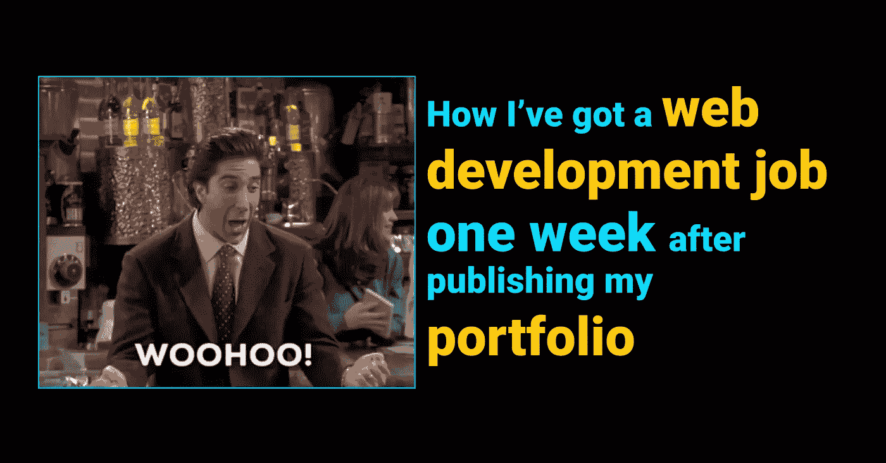
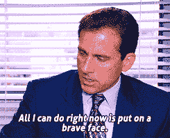
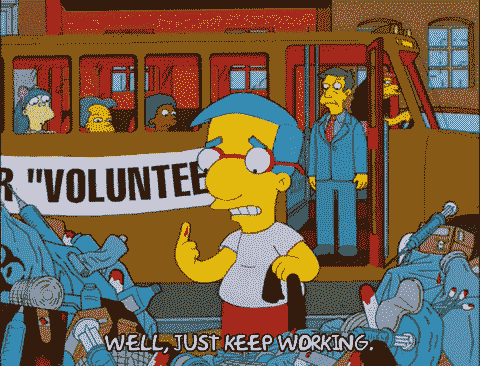
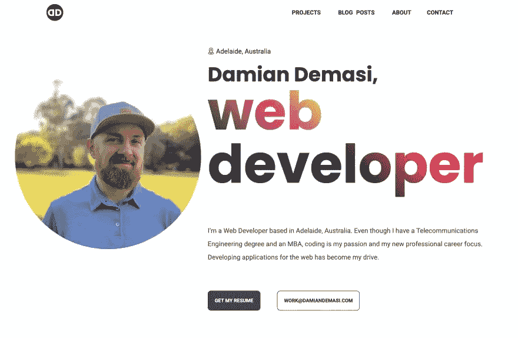

# 我是如何在发布作品集一周后找到一份网络开发工作的

> 原文：<https://blog.devgenius.io/how-ive-got-a-web-development-job-one-week-after-publishing-my-portfolio-d6b8e3c603c7?source=collection_archive---------9----------------------->

🗞️ **简讯** — *如果你想了解我最新的文章和有趣的软件开发内容，* [*订阅我的简讯*](https://chipper-designer-8106.ck.page/1a819bffe8) *。*

🐦**推特**——*关注我* [*推特*](https://twitter.com/DamianDemasi) *。*

# 用我的作品集作为面试的诱饵

在花了几个月的时间学习前端开发(HTML、CSS、JavaScript、React 和 Git)和几周的时间建立我的投资组合(嗯，实际上是两个投资组合，因为我不喜欢第一个的结局)后，在我开始寻找工作后不到一周的时间里，我设法在 web 开发行业找到了我的第一份工作。

这一切发生得非常快:

👉在一个周二的早上，我终于完成了我的作品集，并选择了我在 LinkedIn 和 Seek.com.au 上找到的五份工作邀请，把我更新的简历和我作品集的链接发了出去。

👉同一个星期二下午，我收到了一封来自我申请的一家公司的首席运营官的电子邮件，他说他喜欢我的故事以及我在自己的网站(也就是我的作品集)上展示自己的方式。他邀请我在同一周的星期四下午进行面试。

👉周三和周四上午，我复习了一些 JavaScript 概念，并练习了最常见的面试问题(稍后会有更多细节)。

👉周四下午**，我结束了对首席运营官和两位资深开发人员的两个小时的采访，在采访中我主要解释了我是如何在 40 多岁的时候想从电信工程转向网络开发的。面试的技术部分有点侧重于一般概念，没有太具体的内容。**

**👉在**周五早上**，我收到了另一封电子邮件，说他们认为我的简介非常适合这家公司，他们给我发了一份编码挑战，要求我在下周一提交，并在他们的高级开发人员面前展示。**

**👉我在周末花了 **30 个小时**进行编码挑战(GitLab 链接)，周一早上去公司回答关于开发流程和编程的一般问题。他们专注于挑战的特定部分，他们有兴趣知道为什么我选择了某些方法来解决问题。他们也提出了修正和建设性的批评，我很感激，因为我想要的是学习和提高。**

**👉在**周一下午**，我得到了一份工作邀请。首席运营官告诉我，团队对我的结果以及我对改进建议的回应非常满意。我对提供的薪水很满意(我在面试过程中讨论过)，并渴望开始在该公司工作。**

# **背景**

> ****警告:**在分享我的经历时，当我谈论自己时，我努力让自己听起来不那么傲慢或自恋。如果在你读这篇文章的时候你有这样的印象，我真诚的道歉，因为这是我最不想要的。**

**先说一下我自己吧，这样你可以更好的评价这次获得软件开发工作的经历。尽管在得到这份网站开发工作之前，我并不是一名专业的软件开发人员，但电脑对我来说并不陌生。25 年前我有了第一台个人电脑，我自己学会了如何使用它。我还学习了电信工程，这使我对计算机网络和一般技术有了深入的了解。从 18 岁起，我就开始玩开发网站，但总是作为一种爱好，没有什么太严重的。我没有接受过软件开发方面的培训，我知道的几个概念都是对技术修修补补的结果。**

# **学习 web 开发的过程**

**我会尽最大努力长话短说，尽可能真实地展示自己，所以我来了。**

****

**坚持住…这将是一篇长文！**

**在我之前的工作中，我在一家技术公司工作了 11 个月，做了我的第一份纯软件开发相关的工作。在此之前，我开发了一些 Bash 脚本和对现有代码库的一些修改，例如，大部分是用简单的语言，没有涉及纯 OOP。**

**他们雇用我在网络模块中实现一个开源软件，允许设备发送和接收 SNMP 消息。问题是，即使供应商说软件应该工作，但它并没有。这个障碍成了接受我老板建议的一个使能器:**“你能开发一个特定于设备的 C 实现吗？”我做过的唯一一次 C 编程是过去 10 多年在大学里，这是一个非常简单的应用程序，所以我试图通过告诉他我会尽力而为来管理他的期望，但是没有任何保证。****

****

**所以，我专注于重新学习 C 语言，并在有限的知识范围内尽我所能做到最好。我设法在大约 8 个月的时间里构建了一个功能实现。我记不清有多少次**感到沮丧**，**想退出**，还有**冒名顶替综合症发作**。但重要的是**我没有放弃**我完成了项目。然后我想:🤔**“考虑到这段经历，我为什么不干脆把职业道路换成 Web 开发，这是我多年来一直想做的事情？”****

**在我的整个职业生涯中，我曾胆怯地尝试成为一名网页开发者。我十几岁的时候读过一本 PHP 的书，这本书使我能够为一个家庭成员建立一个简单的网站，并为其他一些客户建立一些简单的网站。我在微软 Frontpage 和 Dreamweaver 上大多只用 HTML 和 CSS(是的，我有那么老了)。当我在大学开始学习电信工程的时候，我几乎完全放弃了这个爱好，并且在读完大学之后，在接下来的 8、9 年的企业工作中，我都没有接触过 HTML 或者 CSS。**

# **我读过的书和上过的课**

**因此，在我的上一份工作之后，我决定全力以赴进行网络开发，而且，一旦我的合同结束，我就没有再找工作。相反，我开始全职学习 web 开发(靠积蓄和妻子的工作生活，这对习惯于自给自足的人来说是一次可怕的经历)。**

**0️⃣在这最后一份工作的前一年，我在 Udemy 上完成了由 Colt Steele 撰写的[**Web developer boot camp(我强烈推荐它)，这让我对**成为一名 web 开发人员到底需要做多少工作有了一个全面的了解**。然后，我更深入地研究了前端相关技术。**](https://click.linksynergy.com/link?id=LO030NrbM0E&offerid=507388.625204&type=2&murl=https%3A%2F%2Fwww.udemy.com%2Fcourse%2Fthe-web-developer-bootcamp%2F)**

**1️⃣:我是通过阅读詹妮弗·尼德斯特·罗宾斯的《学习网页设计:HTML、Css、Javascript 和网页图形入门指南》开始学习 Html 和 CSS 的。**

**2️⃣然后我通过阅读 Marijn Haverbeke 的《雄辩的 JavaScript，第三版:编程的现代介绍》(我还没读完)和《2021 年完整的 JavaScript 课程:从零到专家》( T2，T3)继续学习 JavaScript。，作者乔纳斯·施梅德曼 ，在 Udemy(我目前为止上过的最好的软件开发课程！),**

**3️⃣一旦我完成了前面的课程，我就参加了另一个 Udemy 课程:[**React——完整指南(包括钩子、react 路由器、Redux)，作者 maximilian Schwarzüller**](https://click.linksynergy.com/link?id=LO030NrbM0E&offerid=507388.1362070&type=2&murl=https%3A%2F%2Fwww.udemy.com%2Fcourse%2Freact-the-complete-guide-incl-redux%2F)。**

**4️⃣:我还在这里和那里洒了一些 Git 和图案。**

**自从我从 HTML 和 CSS 开始，到我有足够的信心来建立我的作品集，四个月过去了。**

****

# **建立我能建立的最好的投资组合**

**从我在论坛和 Twitter 上读到的信息，我知道作品集会增加我被 web 开发行业录用的机会，尤其是在没有直接 it 经验的情况下。**

**为了最大化被雇佣的机会，投资组合[需要包括:](https://www.damiandemasi.com/)**

**0️⃣一个**自定义域名**。对我来说，damiandemasi.com 是可用的，所以我接受了。我还注册了 [colo.codes](https://colo.codes/) 域名，因为这是我在社交网络上的昵称。**

**1️⃣有一个**抓英雄部分**，有一个“联系我”按钮和一个下载我简历的选项，可以立即**采取行动**。**

**2️⃣一个**项目段**至少有两个项目。这些项目将需要显示我的 JavaScript 知识和 API 的使用。这一部分还应该包括项目现场版本的链接，以及正在使用的项目的 GIF 或视频(一种演示)，以及我跟随创建项目的过程的**描述。所有这些的目的是展示我如何应对编码挑战，我所做的决定，以及我如何处理问题。由于我没有 web 开发人员的商业经验，这部分是我展示自己作品的唯一途径。****

**3️⃣一个**博客版块**至少有三篇文章。这些文章应该展示我如何处理技术概念的描述，以及我用英语(不是我的母语)交流的好坏。我发现这是一个完美的借口，可以更深入地挖掘我在上一节中已经描述过的项目的一些具体方面，例如`useState` React 钩子的不同用法。**

**4️⃣有一个**关于我的部分**，通过简单明了的方式访问我的 **LinkedIn** 个人资料，以及我的**简历**、 **GitHub** 个人资料和 Twitter。即使我的简历可以从英雄部分获得，我相信冗余(没有垃圾邮件)是确保投资组合的重要部分(如简历)不被忽略的一种方式。在这一部分，我进入了**完全诚实的模式**，展现了真实的自己。通过这样做，我可以赶走与我性格不合的雇主，吸引那些真正喜欢我的人，从而加快工作选择过程。我还简要强调了我所熟悉的技术。最终，这被证明是一个正确的方法，因为首席运营官和雇佣我的公司的 CEO 都提到他们喜欢我在网上展示自己的方式。**

**5️⃣ A **社会证明(评论)部分**证明我作为一名员工和团队成员有着良好的记录。我用我的 **LinkedIn 推荐信**作为建立这个网站的原始材料，我提供了我的 LinkedIn 个人资料的链接，这样潜在的雇主就可以看到我没有不诚实。**

**6️⃣和最后一个**接触段**。在里面，我提供了三种不同的联系方式:一个**电子邮件地址**，一个 **LinkedIn 链接**，以及一个完全功能化的**表单**(感谢 [Netlify](https://docs.netlify.com/forms/setup/) )。在联系潜在员工时，人们有不同的偏好，所以我想尽可能提供更多的灵活性。**

****

**如你所见，作品集就像是你职业生活的**储存库**，它应该包括展示你工作方式的项目和文章。当我链接我的 Twitter、GitHub 和 LinkedIn 个人资料时，我确保它们都是最新的、完全完整的，并且在内容和外观上都符合我向世界展示自己的意愿。**

**构建投资组合的过程是我的 web 开发人员未来之旅中最长的。我从建立项目开始，然后写一些文章，润色我的 GitHub、LinkedIn 和 Twitter 个人资料，确保我的简历是最新的，适合一页纸，最后，建立投资组合本身。**

**我广泛使用 Reddit 来来回回地交换想法，并寻求关于我的项目和我的投资组合本身的反馈。对我来说是对的，对其他人来说却不是。我发现 [/r/webdev](https://www.reddit.com/r/webdev/) 和 [/r/careerquestions](https://www.reddit.com/r/cscareerquestions/) 子编辑在整个过程中非常有用。**

****

# **申请工作和准备面试**

**工作申请过程非常简单。我用 LinkedIn 上的**和[Seek.com.au](https://www.seek.com.au/)来寻找与我当时所知相关的职位。根据经验，如果我至少精通工作岗位要求的一半技术和要求，我会申请。****

**我最终在一个周二的上午向🖐 **申请了五个职位，并在当天下午获得了☝️ **one** 的面试机会，尽管他们正在寻找一名高级开发人员(但他们对职位没有提出太多要求)。其他四家申请我都没消息。尽管我在开始申请工作之前准备了很多，我还是忍不住觉得自己很幸运。****

**一旦我知道我得到了面试的机会，我就开始准备了。我决定为最常见的面试问题进行训练，这样我就可以流利地回答这些问题，同时也为最重要的 **JavaScript 相关问题**做准备，因为我知道我将会被高级开发人员面试。我只有一天半的时间来准备，所以我没有太大的压力(在这么短的时间内你能做的就这么多)。**

****

# **我用来准备面试问题的资源**

**对于一般的面试问题，我用了**杰夫苏** : [常见面试问答](https://www.youtube.com/watch?v=es7XtrloDIQ&list=PLo-kPya_Ww2wLc0USlqpuN_OAtJjc6qoP)的这些牛逼视频。他还有一个关于 LinkedIn 个人资料提示的播放列表，我可以推荐一下。**

**对于 JavaScript 的技术问题，我使用这些视频进行准备:**

*   **【Javascript 的 5 个必须知道的面试问题！**
*   **[7 分钟学会闭包](https://www.youtube.com/watch?v=3a0I8ICR1Vg)**
*   **[事件循环 javascript 会等吗？](https://www.youtube.com/watch?v=WvTMIKHvPxU)**
*   **[JavaScript 承诺 10 分钟](https://www.youtube.com/watch?v=DHvZLI7Db8E&t=57s)**
*   **[数组中的回调和箭头函数介绍](https://www.youtube.com/watch?v=Tny4_-QjNHg)**

**我还回顾了一些最基本和最重要的 JavaScript 概念，这些概念来自我在学习 JavaScript 时做的笔记。**

# **第一次面试**

**我提前五分钟到达了第一个面试地点，结束了对首席运营官和两位高级开发人员的两个小时的面试。我们谈论了这家公司、我的职业经历、我从阿根廷移民到澳大利亚的原因，以及我在澳大利亚的工作权利。**

**但是最重要的主题是我选择软件开发作为新的职业道路的原因。当我回答这个问题的时候，我允许我的热情和激情通过我的回答展现出来，而这正是他们在寻找的:一个对软件开发有足够热情的人，可以坐几天试图解决一个问题，并且有从初级到高级开发人员学习任何必要知识的意愿。**

**我在面试中留下的另一个非常清晰的概念是我的**成长心态**:我知道我还有很多要学，我不介意**承认错误**或被纠正，因为那是我可以学习的方式。**如果今天有什么我不知道的，我会说出来，我会渴望去了解它**。我也能够接受批评，因为这是我改进工作的方法。自我和骄傲在这个过程中没有位置，我把自己看作一个准备吸收知识的学生，同时也是一个准备解释和分享知识的老师。我认为这是从事软件开发职业的最明智的方式，他们同意了。**

****

**总而言之，在面试中，他们关注的焦点是:**

*   ****激情**:他们想知道我是否会长期留在这个行业，我的目标是否是成为一名高级开发人员。**
*   ****成长心态**:如果我能够很好地回应反馈。**
*   ****不认输**:坚持问题，直到找到解决办法。**

# **编码挑战和复试**

**第一次面试后，我得到了一个**编码挑战**。我必须在 React 中构建一个颜色选择器应用程序，它需要符合某些要求。那是一个星期五，我需要在接下来的星期一展示它，所以我有周末的时间去做。我最终总共花了 **30 个小时**开发这个应用，我设法满足了大部分需求，尽管**它并不完美**。一旦我完成了(复试前几个小时)，我就把代码发给了开发人员。**

**在第二次面试中，有人问我为什么选择了某些做事方式而不是其他方式。高级开发人员到处搜寻代码，问我为什么做了我所做的事情。最后，我想他们是在评估我是否真的知道自己做了什么。他们提出了一些建设性的批评，我欣然接受了。尽管这款应用没有达到预期的 100%效果，但他们对取得的结果感到满意。**

**第二次面试后，我被告知开发人员对我在编码挑战中的表现以及我对批评(反馈)的反应很满意，所以他们最终给了我一份他们公司的工作。**

****

# **我作为软件开发人员的第一周学到的经验教训**

**在我作为软件开发人员工作的最初几周，我面对了一个**庞大的代码库** (JavaScript、React、Ruby on Rails、SCSS 等等。)我仍然在一步一步地思考, **Git 和 GitLab** 在专业环境中的使用方式，以及**软件开发团队**的表现。**

**我发现自己有着强烈的求知欲，我不禁觉得自己有点像一个冒名顶替者，尽管我知道这是一种正常的感觉，而且，在面试过程中，我非常清楚地表明了我仍在学习的事实。**

# **旅程才刚刚开始**

**我在软件开发世界的旅程才刚刚开始。这是一条需要经常学习新技术的职业道路。我可以想象自己五年后成为一名高级开发人员，指导初级开发人员，并且，为什么不呢，拥有自己的创业项目。**

**🗞️ **简讯** — *如果你想了解我最新的文章和有趣的软件开发内容，* [*订阅我的简讯*](https://chipper-designer-8106.ck.page/1a819bffe8) *。***

**🐦**推特**——*关注我* [*推特*](https://twitter.com/DamianDemasi) *。***