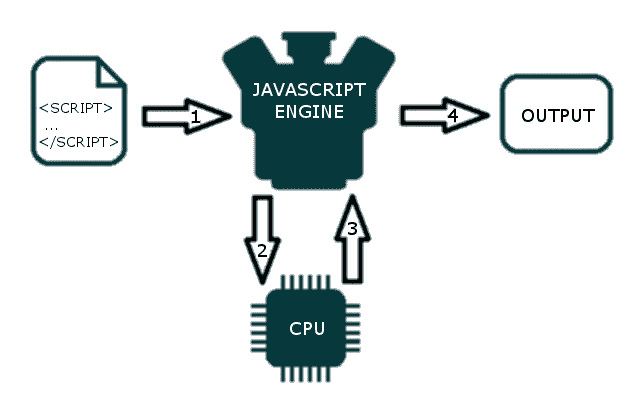

# JavaScript 如何在幕后工作？

> 原文：<https://blog.devgenius.io/how-javascript-works-behind-the-scenes-88c546173f32?source=collection_archive---------0----------------------->

## JavaScript 代码执行中涉及的所有核心组件的概述。


随着 JavaScript 越来越受欢迎，团队正在他们的堆栈中的许多层面上利用它的支持——前端、后端、混合应用、嵌入式设备等等。本文旨在更深入地挖掘 JavaScript 及其实际工作原理。

# 概观

几乎每个人都听说过 V8 引擎这个概念，大多数人都知道 JavaScript 是单线程的，或者它使用了回调队列。

在这篇文章中，我们将详细介绍所有这些概念，并解释 JavaScript 实际上是如何运行的。通过了解这些细节，您将能够编写更好的、非阻塞的应用程序，这些应用程序能够恰当地利用所提供的 API。

如果你对 JavaScript 相对陌生，这篇博文将帮助你理解为什么 JavaScript 与其他语言相比如此“怪异”。如果您是一名经验丰富的 JavaScript 开发人员，希望它能让您对每天使用的 JavaScript 运行时实际上是如何工作的有一些新的见解。

在本文中，我们将讨论 JavaScript 在运行时环境和浏览器中的内部工作。这将概述 JavaScript 代码执行中涉及的所有核心组件。我们将讨论以下组件:

1.  JavaScript 引擎
2.  JavaScript 运行时环境
3.  调用堆栈
4.  并发和事件循环

让我们从 JavaScript 引擎开始。

# JavaScript 引擎

正如你以前可能听说过的，JavaScript 是一种**解释编程语言**。这意味着源代码在执行前不会被编译成二进制代码。

你的计算机如何理解如何处理一个纯文本脚本？

这是 JavaScript 引擎的工作。JavaScript 引擎只是一个执行 JavaScript 代码计算机程序。今天，JavaScript 引擎内置在所有现代浏览器中。当 JavaScript 文件加载到浏览器中时，JavaScript 引擎将从上到下执行文件的每一行(为了简化解释我们在 JS 中避免提升)。JavaScript 引擎会逐行解析代码，转换成机器码然后执行。



每个浏览器都有自己的 JavaScript 引擎，但最著名的引擎是谷歌的 V8。V8 引擎支持 Google Chrome，也支持 Node.js，后者是 JavaScript 运行时。


浏览器引擎

该引擎由两个主要组件组成:
*内存堆——这是内存分配发生的地方
*调用堆栈——这是代码执行时堆栈帧所在的地方


任何 JavaScript 引擎总是包含一个调用栈和一个堆。调用堆栈是我们的代码实际执行的地方。那么堆就是一个非结构化的内存池，它存储了我们的应用程序需要的所有对象。

# 运行时

到目前为止，我们已经讨论了 JavaScript 引擎，但是 JavaScript 引擎并不是孤立运行的。它与许多其他组件一起运行在一个称为 JavaScript 运行时环境的环境中。JRE 负责使 JavaScript 异步。这就是 JavaScript 能够添加事件侦听器并异步发出 HTTP 请求的原因。

JRE 就像一个容器，由以下组件组成:

1.  JS 引擎
2.  Web API
3.  回调队列或消息队列
4.  事件表
5.  事件循环


然后，我们有如此受欢迎的**事件循环**和**回调队列**。

# 调用堆栈

JavaScript 是一种单线程编程语言，这意味着它只有一个调用栈。因此它一次只能做一件事。

调用栈是一种数据结构，它基本上记录了我们在程序中的位置。如果我们进入一个函数，我们把它放在栈顶。如果我们从一个函数返回，我们从栈顶弹出。堆栈只能做这些。

让我们看一个例子。看一下下面的代码:

```
function multiply(x, y) {
    return x * y;
}function printSquare(x) {
    var s = multiply(x, x);
    console.log(s);
}printSquare(5);
```

当引擎开始执行这段代码时，调用堆栈将为空。之后，步骤如下:


调用堆栈中的每个条目被称为一个**堆栈帧**。

在单线程上运行代码非常容易，因为您不必处理多线程环境中出现的复杂情况，例如死锁。

但是在单线程上运行也有很大的局限性。因为 JavaScript 只有一个调用栈。

# 并发性&事件循环

当调用堆栈中的函数调用需要花费大量时间来处理时，会发生什么情况？例如，假设您想在浏览器中用 JavaScript 进行一些复杂的图像转换。

你可能会问——为什么这甚至是一个问题？问题是，虽然调用堆栈有函数要执行，但浏览器实际上不能做任何其他事情——它被阻塞了。这意味着浏览器无法渲染，无法运行任何其他代码，只是卡住了。如果你想让你的应用程序有流畅的用户界面，这就产生了问题。

这还不是唯一的问题。一旦您的浏览器开始处理调用堆栈中的大量任务，它可能会在相当长的时间内停止响应。大多数浏览器会发出一个错误，询问你是否要终止网页。你可以在下面的文章中读到更多关于并发和事件循环的内容。

[](/concurrency-multi-threading-multi-processing-asynchronous-programming-and-event-loop-1b8df9fa6c20) [## 并发、多线程、多处理、异步编程和事件循环

### 并发、多线程、多处理、异步编程等概念之间的关系…

blog.devgenius.io](/concurrency-multi-threading-multi-processing-asynchronous-programming-and-event-loop-1b8df9fa6c20) 

我希望上面的文章能帮助你理解 JS 是如何工作的。现在，让我们在这里结束它。

如果你喜欢这篇文章，请广而告之。要获得我的新故事的更新，请关注我的[](https://adityayaduvanshi.medium.com/)****和** [**推特**](https://twitter.com/fixslyr) **。****