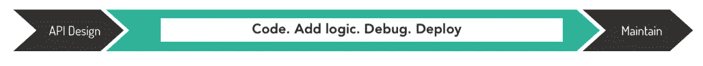
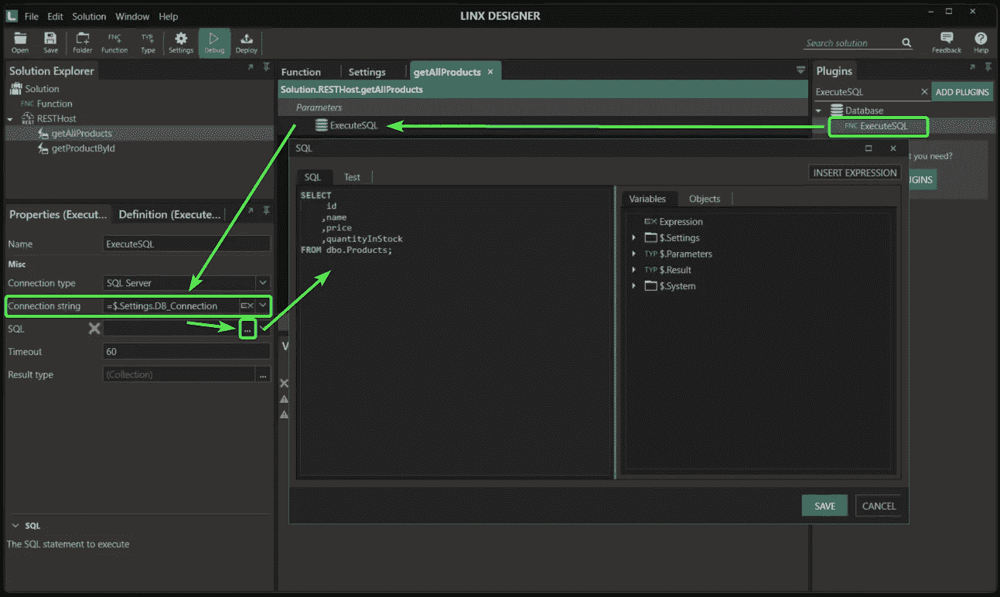

# 低级代码如何解决开发者工具冲突

> 原文：<https://blog.devgenius.io/how-low-code-solves-the-developer-tool-conflict-83078f7d9e2f?source=collection_archive---------13----------------------->

有许多方法可以对开发人员工具进行分类，但是主要的划分是工具是否提供了抽象性或复杂性。

开发人员如何决定使用哪种工具来解决他们的问题在为工作选择正确的工具时，没有什么灵丹妙药，但是一些指南可以帮助开发人员做出决定。第一步是确定需要解决的问题。一旦理解了问题，开发人员就可以研究各种工具并选择最适合他们需求的工具。

在考虑不同的工具时，开发人员应该考虑成本、易用性、功能和支持。此外，开发人员应该阅读评论，并与其他开发人员交谈，以获得他们对哪个工具最适合该任务的意见。有这么多的选项可用，决定正确的工具可能具有挑战性，但花时间做研究最终会有回报。

# 抽象与复杂，开发者工具的权衡

关于开发人员工具，在抽象和复杂性之间有一个权衡。工具越抽象，越容易使用。然而，代价是用抽象工具完成更复杂的任务可能更具挑战性。

类似地，开发人员工具越复杂，开发人员对他们工作的控制就越多。然而，这种增强的控制是以更大的复杂性和更陡峭的学习曲线为代价的。

关键是找到适合你需求的平衡点。如果你需要完全控制你的工作，那么一个更复杂的开发工具可能值得投资。然而，如果你正在寻找一些快捷易用的工具，抽象工具可能会更好。

# 工具工具工具！

开发人员总是在寻找新的方法来简化他们的工作流程并提高效率。开发人员最大的痛点之一是不同开发工具之间的冲突。这可能导致在尝试让不同的工具协同工作时浪费大量的时间和精力。

例如，使用[低代码工具进行 API 开发](https://linx.software/blog/28-api-tools-to-design-build-and-host-your-next-api/)有许多优势，包括快速创建和迭代原型的能力，以及减少对开发人员专业知识的需求。然而，一个关键的好处是它们可以帮助解决开发者工具冲突。

有如此多的选项可用，很难知道哪些工具用于哪些任务。这会导致挫败感和不知所措的感觉。例如，如果你曾经不得不从头开始构建一个 API，不可否认这是很难的。

可以说，开发一个 API 有三个重要的步骤:

*   设计 API，
*   构建 API 和
*   托管 API。

通常，一个 API 是分多个阶段开发的，通常使用各种工具——即使你想构建更小的东西，也要先有一个 SDK 和 go 代码。

API 开发流程

对于后端和全栈开发人员来说，使用一个使用开发人员熟悉的语言和约定的框架比学习新东西要快。

所以现在还没有问题，但是根据您的需求，当您的 API 被调用时，您可能需要做许多不同的事情。您可能需要存储数据、发送电子邮件、使用消息队列等等。显然，你也需要工具来做这件事；

让我们从最简单的选项开始，数据存储。您可能需要为您的应用程序存储数据。关于数据存储有许多其他选择，请务必选择适合您的。需要考虑的几件事是:

*   我是想自己托管数据库，还是将它托管在云中？
*   我想自己维护数据库吗？
*   我希望我的数据存储具有怎样的速度和可扩展性？

有很多可能性，每个都有利弊和价格标签。选择从 [AWS](https://aws.amazon.com/products/databases/) 、 [Azure](https://azure.microsoft.com/en-us/product-categories/databases/) 、 [MongoDB](https://www.mongodb.com/cloud/atlas) 、 [MySQL](https://www.mysql.com/) 、 [PostgreSQL](https://www.postgresql.org/) ，或者任何开源数据库开始。

电子邮件( [AWS SES](https://aws.amazon.com/ses/) 、 [Sendgrid](https://sendgrid.com/) 、 [Mailchimp](https://mailchimp.com/) )、消息队列( [AWS SQS](https://aws.amazon.com/sqs/) 、 [Azure](https://azure.microsoft.com/en-us/services/storage/queues/) 、 [CloudAMQP](https://www.cloudamqp.com/) 、 [Kafka](https://kafka.apache.org/) )甚至安全( [AWS Cognito](https://aws.amazon.com/cognito/) 、 [Okta](https://www.okta.com/) 、 [Auth0)等实用程序呢](https://auth0.com/)

突然之间，构建 API 所需的工具越来越多。

接下来的步骤可能包括测试(最受欢迎的工具是 h [oppscotch.io](https://hoppscotch.io/) 、 [Postma](https://www.postman.com/) n 或[失眠](https://insomnia.rest/))，但快速的谷歌搜索会告诉你，这比你想象的要多得多。

当需要部署、监控和维护 API 时，就需要更多的工具。在传统的 API 开发过程中，开发人员将负责托管和管理的所有元素。

托管 API 时需要考虑很多方面，比如可伸缩性、安全性、可观察性和维护。在部署中还有几个障碍需要跨越。

但是，这又一次落到了工具上。例如，Python 是构建 API 的绝佳选择。尽管如此，部署应用程序时仍然非常复杂，因为即使它托管在 AWS 或 Azure 上，您也必须维护基础架构，而且任何基础架构都必须同时部署，如数据库对象、文件、存储配置和插件。最简单的事情就是使用一个支持你选择的编程语言的托管平台。服务包括

*   [Heroku](https://www.heroku.com/)
*   [网络生活](https://www.netlify.com/)
*   [NodeChef](https://www.nodechef.com/rest-api-hosting)
*   [AWS API 网关](https://aws.amazon.com/api-gateway/)
*   [Azure 应用服务](https://azure.microsoft.com/en-us/services/app-service/api/)

# 低代码 API 构建器。新的解决方案

使用相同的 API 示例，低代码平台可能是答案，因为它更容易入门，并缩短了学习曲线。提供更结构化的开发方法并在整个组织中实现标准化，可以使开发人员更容易开始工作并有效地协作。

例如，使用低代码工具如 [Linx](https://linx.software) 可以简化 API 开发过程，只需使用两个工具，或者[只需一个](https://linx.software/build-and-deploy-api/)，如果你想代码优先的话。

通过减少开发 API 所需的工具数量，重点从技术能力和对特定框架的掌握转移到确保业务和复杂逻辑按预期运行。此外，由于低代码工具具有实现速度的额外好处，从设计到生产可以比传统工具快得多。

虽然这些现代工具和服务提高了开发者的工作效率，但仍然存在“应用鸿沟”。它是您的代码、构建代码所需的资源以及投入生产所需的知识、时间和成本之间的差距。

因此，低代码工具变得流行就不足为奇了。开发人员可以构建熟悉的概念，消除复杂性，并且通常使用低代码框架更快，因为他们的可视化设计框架和样板文件的缺乏使他们更快地理解和使用。

一个主要的例子是在托管和部署您的 API 时。除了易于启动(现成的基础设施)和高效(维护友好)之外，许多低代码平台还通过即时、全包的功能(一键式部署、内置安全性)解决了这个问题。

# 但是可扩展性和定制性呢？

Gartner 炒作周期可以说是对技术世界最敏锐的观察之一——技术推出时行业的最初(过度)热情，随后是我们开始评估承诺价值时的大规模采用阶段，以及后来技术改进时的成熟阶段。

当考虑采用低代码的权衡时，这可能是真的；大多数人会说，由于使用可视化的点击式“构建块”来指定应用程序定制的固有限制，随着应用程序需求逐渐变得更高级，大多数低代码平台很快就碰壁了。一些人认为，要么继续使用低代码工具来实现更高级的用例变得不可能，要么它变得令人难以置信地复杂——低代码变得更多的是障碍而不是帮助。

但不一定。新时代的开发平台通常支持通用语言，如 JavaScript、TypeScript 或 SQL。大多数可以通过插件或库进行扩展，这使得它们对开发人员非常友好。有些甚至提供构建自己的定制连接器的能力。

这里有一个简单的例子:一个应用程序需要一个复杂的 SQL 查询来满足客户的需求。无代码、可视化的 SQL 查询构建器非常强大，即使没有 SQL 知识的人也可以连接表、定义别名或使用聚合函数。但是，即使是最好的可视化查询生成器也比不上原始 SQL 的全部灵活性。

在一个好的低代码平台中，你可以无缝地从“无代码”切换到“全代码”，从查询构建器切换到 SQL 编辑器。作为开发人员，选择最佳的开发方法来解决问题取决于您。

Linx 中的 SQL 表达式编辑器

那么极限是什么呢？答案是，你想构建什么样的应用程序？低代码平台可能是专门为构建业务应用程序或内部工具而设计的。或者，它可能特别擅长构建面向消费者的应用程序，其中 UI 和 UX 更重要(但是，它开发定制业务逻辑的能力有限)。

然而，Forrester 的一项调查打破了这个神话，指出大多数用低代码构建的应用程序在多个部门或整个企业中使用，包括业务关键型应用程序。在正确的上下文中使用，您的低代码工具可能不会遇到任何限制。问题不在于特定工具或技术的局限性。相反，你应该问:这个平台是我项目的合适工具吗？

# 低代码 API

对于低代码平台来说，真正的亮点是当你的领域专家拥有使用与目标领域兼容的工具的编码技能时，即使他们不是专业开发人员。根据你选择的工具，你可以[开发一个 API](https://linx.software/blog/build-and-host-a-low-code-api/) ，甚至不需要接触代码，并且根据你的需求的复杂程度，在一天之内让你的 API 运行起来。

新一代的低代码工具，如 [Mendix](https://www.mendix.com/) 、 [Power App](https://powerapps.microsoft.com/en-us/) s、 [Linx](https://linx.software/?utm=dz) 和 [OutSystems](https://www.outsystems.com/) 提供了现代软件体验，符合当今不断变化的用户需求。它们使开发人员能够利用应用程序测试、质量和性能工具进行控制，同时结合在低代码解决方案中看到的高生产率技术，通过可视化方式加速开发。

从工具制造商的角度来看，这些平台承诺更快的开发、更低的成本、更少的错误、更容易的部署和可管理的环境。所以真正的问题是开发人员冲突是否存在，或者开发人员是否被他们当前的专业知识所困，这阻止了他们学习新技术。

没有放之四海而皆准的项目，因为在以前的项目中成功的东西在新项目的环境中可能是一场灾难。

软件是基于技术的，但它也是关于人的，以及你如何找到一种方法，做出一个解决方案。没有最好的方法；你必须适应环境、情况和背景。您选择的工具可能只是开始的第一步。