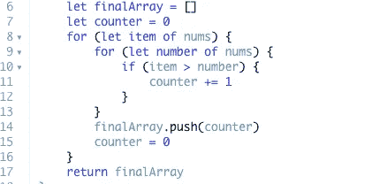

# 有多少个数字比当前数字小？(代码挑战)

> 原文：<https://blog.devgenius.io/how-many-numbers-are-smaller-than-the-current-number-code-challenge-2f8ee7711da?source=collection_archive---------21----------------------->

尼克·希利尔在 [Unsplash](https://unsplash.com?utm_source=medium&utm_medium=referral) 上的照片

*给定数组 nums，对于每个 nums[i]找出数组中有多少个数比它小。也就是说，对于每个 nums[i],你必须计算有效 j 的个数，使得 j！= i 和 nums[j] < nums[i]。*

*以数组形式返回答案。*

对于数组中的每个数字，我们希望返回一个相同长度的数组，其中每个数字将被数组中小于当前数字的数字的数量所替换。

有几种方法可以做到这一点，但我们将讨论我思考这个问题的方式以及我是如何着手解决它的。

这比一般的挑战要稍微复杂一点，因为每次我们看到一个数字时，我们都必须将它与数组的其余部分进行比较。

# 简单来说-

这是我们所知道的。我们知道，无论如何，我们必须线性地遍历整个数组至少一次。为了将每一项与数组的其余部分进行比较，这意味着我们将对数组进行 n * n 次循环。也称为二次时间复杂度。

所以简单来说，我们要如何记录有多少数字比当前的小？

我觉得解决这个问题最简单的方法是查看当前值，每次我们遍历整个数组进行比较时，我们可以使用一个计数器(变量)来记录当前值比下一个值大多少倍。

# 解决它-

这就是我们所看到的。对于每个当前数字的第一次迭代，我们将有一个 for 循环。接下来，我们将在 for 循环中加入另一个 for 循环，这样当我们开始进行二次循环时，就可以比较每个当前数字。

让我们稍微分解一下。我们初始化一个空数组，将内容放入。我们还想初始化一个从 0 开始的计数器。这样，我们就可以跟踪有多少个数字小于当前值，并将它们放入数组中。

这里是我们的第一个 for 循环，查看每个“当前”数字。接下来，我们可以进行第二次循环，将当前数字与整个数组中的每个数字进行比较。

如果条件等于真，让我们将计数器推入新的数组，我们希望在下一次迭代中将计数器重置为 0。

最后我们将返回 finalArray，这将解决这个问题。如果您以前在一个 for 循环中使用过另一个 for 循环，这个挑战就不会太难。当我第一次这样做的时候，我记得这真的令人难以置信和困惑。对于初学者来说，这是一个很好的中级挑战。习惯这种情况非常有帮助，因为它们可能会变得更加令人困惑。

这是少数人的挑战。我希望你觉得这有帮助或有趣。感谢阅读。