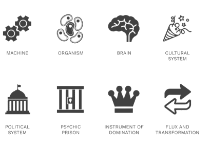
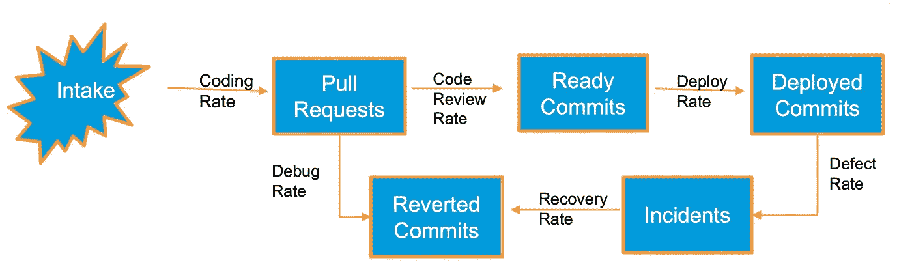
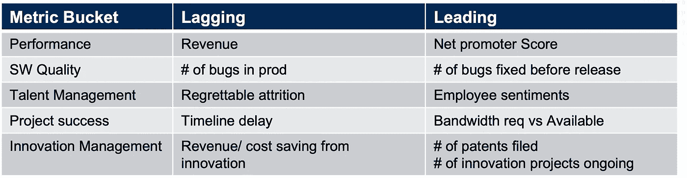
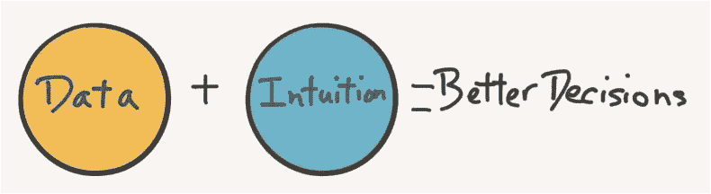

# 指标如何帮助设计您的组织

> 原文：<https://blog.devgenius.io/how-metrics-can-help-in-designing-your-organization-b2e101649515?source=collection_archive---------9----------------------->

## 除了招聘，组织设计是你人事管理工具包中的另一个强大工具。

这篇博客是博客系列的一部分— [工业时代的管理工具如何帮助有效的工程管理？](https://medium.com/@meet.aman.gupta/how-can-industrial-era-management-tools-help-in-effective-engineering-management-862104a33d80)

您可以访问上面的链接来了解上下文以及该系列中其他文章的链接。

*图 2.1:加雷斯·摩根*[*【1】*](https://en.wikipedia.org/wiki/Images_of_Organization)的组织形象

加雷斯·摩根在他 1986 年的著作《组织的形象》中提供了八个隐喻来想象组织，包括传统的组织，如机器、有机体、文化等。和一些令人沮丧的，如精神监狱或统治的工具。
团队或组织是抽象名词；因此，将它们想象成一个物理系统有助于我们将成功和失败识别为一种模式，而不仅仅是单个的交易。

我试图把软件工程想象成这个博客的机器。

# 作为机器的软件工程

*图 2.2:被想象成机器的软件工程*[*【4】*](https://www.amazon.in/Elegant-Puzzle-Systems-Engineering-Management/dp/1732265186)

如果软件工程是一台机器，原材料可能是需求，最终制造的产品可能是部署的故事。原始材料要经过不同的阶段，如开发、代码审查、调试等。相应的速率衡量代码从一个步骤移动到另一个步骤的速度。人们可以计算预测速度和实际速度之间的差异，以确定这台运转良好的机器是否存在流程差距。如果一个工程经理想要有效地运行这台机器，她需要一个系统来测量这些速率。这个系统强调了跟踪度量对于有效组织设计的重要性。

# 将愿景转化为现实——跟踪指标。

管理大师彼得·德鲁克打趣道:

> “你无法衡量的，你无法交付。”[【3】](https://www.growthink.com/content/two-most-important-quotes-business)

在之前的博客中，亨利·福特的愿景是“*人人都有汽车，”*但是福特需要跟踪他每辆车的生产时间来实现这一愿景。

视觉一般是抽象的。因此，它可能对不同的人有不同的含义。这些指标将整个团队和组织与一个共享的**目标**成功定义联系起来。

图 2.3:愿景实现的阶段

指标应该能够提供 4 个问题的快速快照

1.  你的组织去过哪里？
2.  它将走向何方？
3.  有路障吗？
4.  我们到了吗？

# 衡量什么是重要的

如果我们同意跟踪指标是必要的，那么下一个最重要的问题是这些指标应该是什么？我们可以测量任何东西，但是一个经验法则是，定义一个指标应该像讲一个笑话一样*——*

> *如果你不得不花太多时间解释它，它可能不会工作*

定义指标的一些指导原则可以是:

1.  **与愿景一致**

管理者应该使度量标准与组织的愿景一致，因为度量标准不仅衡量产出，还可以改变人们的行为。我们可以看到音乐行业中衡量标准改变行为的真实例子。

> 如果你仔细观察，就会发现与 2000 年代早期的歌曲相比，现在的歌曲几乎缩短了半分钟。持续时间较短的原因之一是 Spotify 的激励模式，该模式根据播放歌曲的数量而不是总播放时间来支付艺术家报酬。
> 
> 同样，只有当观众播放一首歌超过 30 秒时，Spotify 才会激励艺术家。
> 这个标准是许多流行歌曲如 ***Despacito*** 和***Senorita****的*挂钩*部分早在歌曲的前 30 秒就出现的原因之一。[【2】](https://www.theverge.com/2019/5/28/18642978/music-streaming-spotify-song-length-distribution-production-switched-on-pop-vergecast-interview)*

*可能 Spotify 的目的是激励音乐的质量和多样性，但用来衡量这些属性的代理指标改变了艺术家创作歌曲的方式。*

***2。多维***

*尽管我们应该将度量标准与共同的北极星保持一致，但是工程经理不能在单一的度量标准上过于短视。我们应该尝试跟踪互补领域的 4-5 个指标(但不要超过 5 个)。*

*例如，如果客户开始报告产品缺陷，及时完成项目就没有意义了。在这种情况下，我们需要跟踪时间和质量。*

***3。难到游戏***

*我们都与聪明的人一起工作，如果度量太容易 ***游戏*** ，那就失去了它的目的。例如，如果我们开始跟踪产品缺陷的总数，这减少了发布的故事总数，我们就失去了度量质量的意图。一个更聪明的指标可以是每篇文章中的 bug 百分比。*

***4。超前和滞后指示器的组合***

*资本主义的核心原则是，如果我们为客户提供良好的服务，他们会在他们的朋友中推广我们的业务，并与我们进行重复交易。这些额外的交易将增加公司的收入。*

*在本例中，**收入**是客户满意的结果；因此，客户满意度是引领我们获得更多收入的先行指标，而收入本身则是滞后指标。*

*领先指标是在公布实际结果之前帮助我们进行修正的指标。*

**

*表 2.1:软件工程世界中超前和滞后指标的例子*

*而诸如情绪、反馈等领先指标。，帮我们管理未来，他们也含糊其辞。因此，在选择指标时，平衡超前和滞后指标至关重要。*

# *结论*

*这篇博客阐述了组织设计的重要性，以及我们如何利用度量在我们的团队中创造更好的流动状态。*

*然而，我想提醒的是，一个人如何明智地选择和跟踪指标并不重要；管理者给人们的感觉仍然是人们脑海中唯一持久的印象，即使数字并非如此。因此，跟踪度量标准，但在做出关键的业务决策时，不要忽略直觉、感觉和感知。*

**

*请在 Linkedin[上联系我，以便进一步交流。](https://www.linkedin.com/in/meetguptaaman/)*

*[这里的](https://medium.com/@meet.aman.gupta/how-can-industrial-era-management-tools-help-in-effective-engineering-management-862104a33d80)是该系列主页的链接，方便参考。*

*如果你喜欢读这篇文章，别忘了鼓掌👏请关注我，了解更多关于工程管理的内容。欢迎反馈！*

*非常感谢！*

# *参考*

*[1][https://en.wikipedia.org/wiki/Images_of_Organization](https://en.wikipedia.org/wiki/Images_of_Organization)
【2】[https://www . the verge . com/2019/5/28/18642978/music-streaming-Spotify-song-length-distribution-production-switched-on-pop-verge cast-interview](https://www.theverge.com/2019/5/28/18642978/music-streaming-spotify-song-length-distribution-production-switched-on-pop-vergecast-interview)
【3】[https://www . growth ink . com/content/two-most-important-quotes-business](https://www.growthink.com/content/two-most-important-quotes-business)
【4】[https://www](https://www.amazon.in/Elegant-Puzzle-Systems-Engineering-Management/dp/1732265186)*