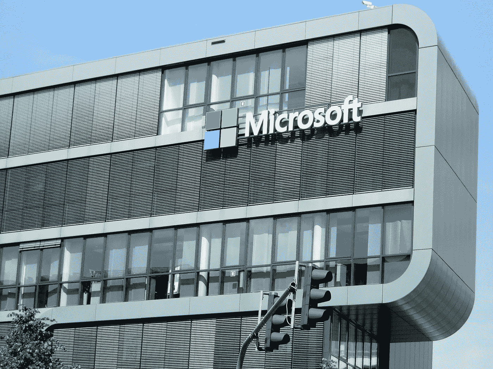

# 微软如何着眼于加强 JavaScript 开发者社区

> 原文：<https://blog.devgenius.io/how-microsoft-eyeing-to-strengthen-javascript-developer-community-fb4d830312b6?source=collection_archive---------15----------------------->

## 微软现在运行 GitHub 和 NPM 以及 Visual Studio Code & Typescript。

在最近收购了世界上最流行的分布式版本控制系统 **GitHub** 之后，微软还买下了 **NPM** —用于 [JavaScript](https://en.wikipedia.org/wiki/JavaScript) 语言的包管理器**T5。如今，GitHub 拥有约 4000 万用户，NPM 每月有约 750 亿次包下载。自 2014 年塞特亚·纳德拉接任首席执行官以来，微软开始在核心业务中采用开源。**

来源:Pixabay

[**微软公司**](https://www.microsoft.com/)**——一家由比尔·盖茨和保罗·艾伦于 1975 年创立的美国跨国公司，通过在 1980 年推出他们的第一个操作系统 **MS-DOS** 以及随后的 **Windows** ，给个人计算领域带来了一场革命。剩下的就是历史了。微软成为计算机软件、消费电子和个人电脑领域的领导者，其创始人比尔·盖茨在近 25 年的时间里一直是世界首富。纵观这些年，微软反对 [**开源软件**](https://en.wikipedia.org/wiki/Open_source_software) 范式——自由共享计算机源代码的范式。他们专注于企业商业模式，销售 Windows、办公套装。NET 框架、Surface 等等。**

**2014 年， [**塞特亚·纳德拉**](https://en.wikipedia.org/wiki/Satya_Nadella) 接替史蒂夫·鲍尔默担任首席执行官，他专注于由开源技术推动的云计算、嵌入式和移动计算技术等新的市场趋势。微软开源了一些高级软件，包括。NET 框架和 Visual Studio 代码。*与微软的意识形态相反，他在开源技术上投入了大量资金，并在 2016 年完成了收购 Xamarin、*[*LinkedIn*](https://en.wikipedia.org/wiki/LinkedIn)*以及 2018 年收购 GitHub 等引人注目的收购。现在 GitHub 拥有了 NPM。***

> **在首席执行官纳德拉的领导下，微软修改了其使命声明，与创始人比尔盖茨的“每张桌子和每个家庭都有一台运行微软软件的电脑”相比，“让地球上的每个人和每个组织都能实现更多的目标”。**

**今天，当我们谈到 JavaScript 开发者社区时，大多数用 **TypeScript** **语言**(JavaScript 的超集)编写代码的 JavaScript 开发者在 **Visual Studio 代码**集成开发环境(IDE)中从 **NPM** (库管理器)安装包，并通过 **GitHub** (代码版本软件)跟踪他们的代码。知道了上面提到的所有软件都是微软拥有的这一事实，我们可以简单地断言，微软已经慢慢开始维护作为一个整体的充满活力的 JavaScript 开发者社区。**

**下面我们来逐一讨论 Typescript、VS Code、Github 和 NPM 的简介和历史以及它们的用户群和受欢迎程度。**

# **[打字稿](https://www.typescriptlang.org/)**

**Typescript 是一种由微软开发和维护的开源编程语言。*它是****JavaScript****——构建万维网(WWW)* 的语言的超集。经过微软两年的内部开发，Typescript 于 2012 年 10 月首次公开。8 年后的今天，它有能力吞噬几乎所有的 JavaScript 开发社区。它遵循一个多范例——函数式的、面向对象的和命令式的编程范例。它增加了来自 T21 的最新更新。Typescript 可用于开发客户端(React 或 Angular)和服务器端(Node.js 或 Deno)应用程序。**

****

**照片由[巴拉特·帕蒂尔](https://unsplash.com/@bharat_patil_photography?utm_source=medium&utm_medium=referral)在 [Unsplash](https://unsplash.com?utm_source=medium&utm_medium=referral) 上拍摄**

# **[Visual Studio 代码](https://code.visualstudio.com/)**

**Visual Studio Code 是微软基于 [Electron](https://www.electronjs.org/) 框架开发的开源、跨平台的源代码编辑器。*根据 Stackoverflow 的* [*2019 开发者调查*](https://insights.stackoverflow.com/survey/2019) *，VS 代码是最受欢迎的开发环境(IDE)。* VS 代码于 2015 年 4 月 29 日公布，由微软在 2015 Build 大会上发布。除了所有主要语言之外，它还支持 TypeScript，并提供了调试、智能代码完成、代码片段、代码重构和嵌入式 Git 等功能。**

****

**克里斯托夫·高尔在 [Unsplash](https://unsplash.com?utm_source=medium&utm_medium=referral) 上拍摄的照片**

# **[GitHub](https://github.com/)**

**GitHub 是一个开放的社区平台，于 2008 年 2 月开始使用 [Ruby on Rails](https://en.wikipedia.org/wiki/Ruby_on_Rails) 开发。它提供 Git 的分布式版本控制和源代码管理(SCM)功能，并向所有人提供免费的托管帐户。*根据最新报道，截至 2020 年 1 月，GitHub 报告拥有超过****4000 万用户*** *，正如我在这篇文章的副标题中提到的，以及超过* ***1 亿个储存库*** *至少包括****2800 万个公共储存库*** *，使其成为世界上最大的源代码主机。***

**当有消息称微软计划收购 GitHub 时。主要的公司和团体不愿意在平台上存储他们的私有库。出于隐私和安全考虑，许多组织计划迁移到其他流行的版本控制托管系统，如 **Atlassian 的 Bitbucket** 和 **GitLab** 。微软旗下的 GitHub 推出了一个基于云的在线代码编辑器，与 GitHub 集成，名为 [**Codespaces**](https://visualstudio.microsoft.com/services/visual-studio-codespaces/) ，可以带来革命，还可以免费为所有帐户添加团队和项目等功能。**

****

**由[卢克·切瑟](https://unsplash.com/@lukechesser?utm_source=medium&utm_medium=referral)在 [Unsplash](https://unsplash.com?utm_source=medium&utm_medium=referral) 上拍摄的照片**

# **[NPM](https://www.npmjs.com/)**

**节点包管理器(NPM)是 JavaScript 运行时环境 [Node.js](https://nodejs.org/en/) 的默认包管理器。它最初于 2010 年 1 月 12 日发布；十年前。微软官员称，npm 目前支持超过**130 万个包和每月 750 亿次下载**。微软打算始终保持 npm 注册表对开发者开放源代码和免费，目前正计划将 GitHub 与 NPM 集成，以便共同服务于整个 JavaScript 开发者社区。**

****

**保罗·埃施-洛朗在 [Unsplash](https://unsplash.com?utm_source=medium&utm_medium=referral) 上的照片**

> **全世界数百万的 JavaScript 开发人员共同使用、支持和维护上述所有软件和工具。**

**微软现在是开源商业的最大贡献者之一。当微软拥有所有这些产品时，我们希望这个科技巨头投入更多，加强整个社区。我们知道像微软这样的组织对全球的开发者社区产生了巨大的影响。**

> **“通过专注于自由软件，我们创造了一个更好、更可靠的世界，在这个世界中，我们寻求技术及其发明，以使人类生活更加幸福和令人满意。”**

**我希望您喜欢这篇关于各种 JavaScipt 基本产品和微软简史的文章。在下面的反馈部分写下您的观点。**

****阅读我的其他文章&在 Medium 上关注我。****

** [## 一目了然地重温所有 10 款棱角分明的款式

### 谷歌最近发布了其广受欢迎的网络和移动框架的 v10。

medium.com](https://medium.com/swlh/revisit-all-10-angular-versions-in-a-glance-f7f778498160)  [## 仅用 5 行代码实现人脸检测

### 使用世界上最简单的人脸识别 python 库来识别和操作人脸。

towardsdatascience.com](https://towardsdatascience.com/face-detection-in-just-5-lines-of-code-5cc6087cb1a9) 

让我们在 LinkedIn([@ kapilraghuwansh](https://www.linkedin.com/in/kapilraghuwanshi/)I)和 Twitter ( [@techygeeek](https://twitter.com/techygeeeky) y)上保持联系，以获取更多此类引人入胜的技术文章和教程。🤝**