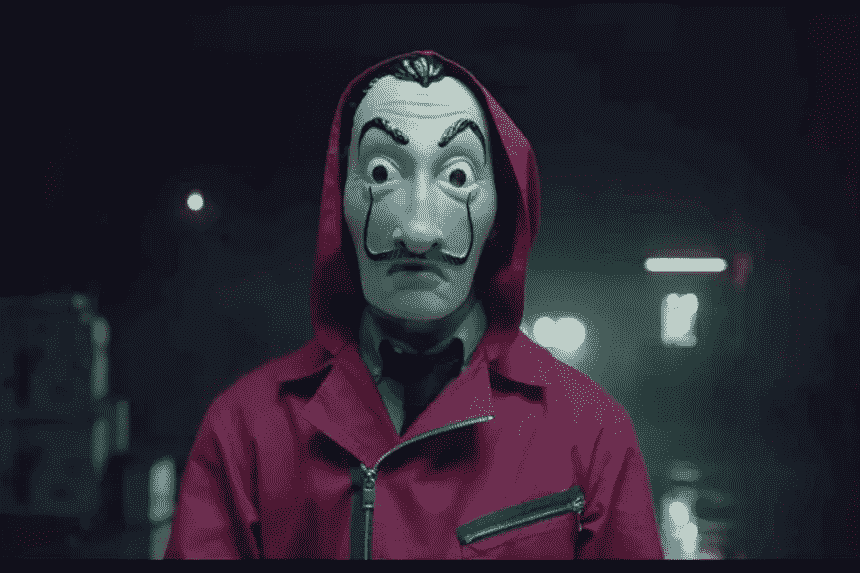
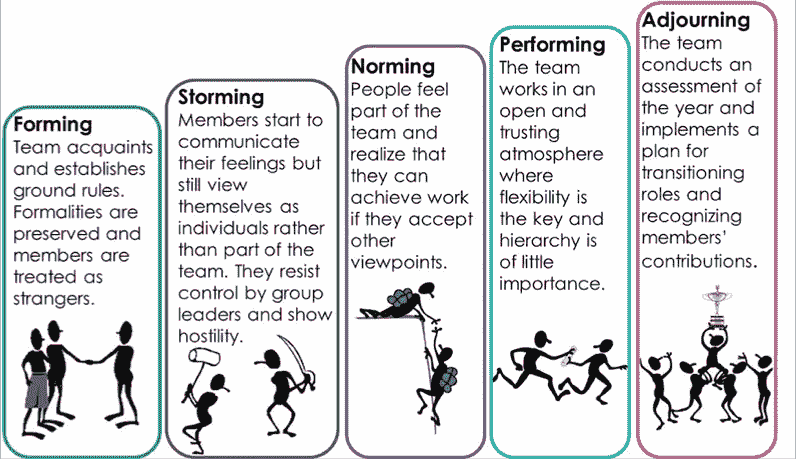
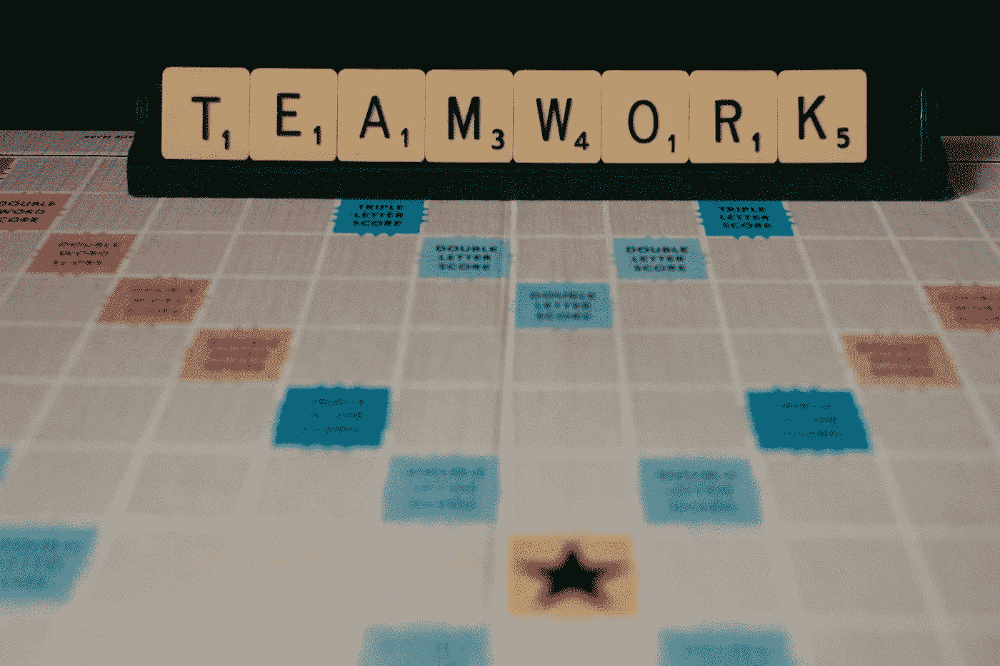

# 金钱是如何抢劫的教授采用了著名的塔克曼的模型，并实现了他的目标

> 原文：<https://blog.devgenius.io/how-money-heist-el-professor-adapted-the-famous-tuckmans-model-and-accomplished-his-goal-da0a098d3a21?source=collection_archive---------4----------------------->

网飞摄

免责声明:我试图在这里提供我的观点，我实际上不是一个试图在练习中完成塔克曼的团队建设模型的人，但是我试图从生活的不同方面进行研究和采纳。

教授。我绝对不是这个世界上唯一喜欢这个角色的人。虽然我一年前看过《金钱大劫案》，但我从未关注过社交媒体上的《教授》及其系列。当我这样做的时候，难怪会有大量的文章和视频将管理课程推断为人生课程。除了这些追随者和人们表现出的爱，这个系列还有什么可说的呢？

又一篇文章？？

当我有了写这方面的想法时，起初我被指派去寻找许多可以从教授和系列中学习的文章和教训。不知从哪里，我的直觉让我想到了一个著名的团队建设技巧和教授在系列中采用的策略。

> 如果不接受我把塔克曼的模型和教授的策略联系起来的想法，请不吝赐教。

好吧，你已经决定试一试，看看我的想法。谢谢大家！！

浅谈塔克曼的团队建设模式。来自维基百科。

团队发展的*形成-冲击-规范-执行*模型是由 [Bruce Tuckman](https://en.wikipedia.org/wiki/Bruce_Tuckman) 于 1965 年、[【1】](https://en.wikipedia.org/wiki/Tuckman%27s_stages_of_group_development#cite_note-1)首次提出的，他说这些阶段对于一个团队成长、面对挑战、解决问题、找到解决方案、计划工作和交付成果都是必要的和不可避免的。

[https://ns 4 business . com . br/tuck mans-stages-of-group-development/](https://ns4business.com.br/tuckmans-stages-of-group-development/)

现在有了塔克曼模型的简单概念，让我们深入教授关于整个抢劫的策略。

教授展示的一些最伟大的方面，证明了他是整个行动的恰当的领导者。

他有着明确的目标和坚定的决心，毫无疑问，他知道他的梦之队应该如何成功完成这次抢劫。

他的整个行动计划包含了最小的细节，包括对几乎所有情况的预测以及如何应对。别忘了他总是有 B 计划以防极端情况。这就暴露了完美主义和专注的程度。

他在抢劫、危机管理、谈判领域的知识，以及对警察、劫匪和公众心理的突破性把握，表明他是主题专家。

即使抢劫处于危险之中，这位教授仍然保持着坚定的道德和原则。这描述了他的正直，并将他的领导才能提升到了一个新的层次。

最后，教授保持冷静的因素。一个强有力的领导者的最大品质之一是如何适应不可预见的情况，并立即从挫折中恢复过来，而不会失去对局势的控制。

现在模型…

照片由 [Unsplash](https://unsplash.com/s/photos/teamwork?utm_source=unsplash&utm_medium=referral&utm_content=creditCopyText) 上的[尼克·费因斯](https://unsplash.com/@jannerboy62?utm_source=unsplash&utm_medium=referral&utm_content=creditCopyText)拍摄

# 形成

教授从团队成员的简短介绍开始，他制定了基本规则，如“我们中的任何人都不能用我们的真名，而要用国名”和“团队中没有私人关系”，我认为这是为了让团队专注于目标并振作精神。然而，到处都有里奥斯和托基奥斯在现场指挥球队。不管怎样，我们的教授也有快速治愈这种情况的方法。

教授在选择团队时做了大量研究，考虑了多样性和包容性。多元化——平衡团队中的专家和多面手，这自然让**每个团队成员都觉得自己对团队很重要。**

我们也看到教授展示了整个抢劫的执行计划，然后是具体的定位课程，这些课程主要是在情节中当情况出现时才透露的。**因此，我们可以假设已经向团队提供了良好的定位，以确保每个人都了解运营的个人挑战、方向和目标。**

# 暴风雨/早晨

这在本系列中作为两部分介绍。首先，当教授阐明个人责任并指派领导者进行实地执行时。在这种情况下，我们看到柏林被指定为地面上的总领导者，处理任何不需要教授帮助的情况，并在教授无法回应日常检查电话时做出决定，内罗毕领导货币印刷工作。

其次，在银行内部，我们已经看到，由于柏林采取的一些决定以及东京和里约的冲动性质，劫匪之间的局势立即变得敌对，导致抢劫失去控制，里约被警察开枪打死。虽然柏林被认为是讽刺的，心理变态的，但教授坚信他的专业精神和他的坚韧，这在第二部分的结尾得到了证明，在那里他保护整个团队逃脱警察让他的生命处于危险之中。

我们已经看到内罗毕领导货币印刷工作，因为她在质量控制方面表现出色，她的人际技能堪称典范，她可以在人们的喜好和运营目标之间建立平衡。当许多事情与柏林的决定背道而驰时，她表现出了维护整个团队的精神。教授选择她来演这个角色是一个伟大的决定。

这是团队领导重申和强调个人目标以及对运营总体目标的影响的时候。就我个人而言，我喜欢教授不参与地面抢劫团队的想法，这实际上给了他一些喘息的空间，让他能够在更大的范围内审视局势，而不会受到团队冲动本性的影响，并提出一些解决方案。这也建立了对教授的信任。当他们朝着共同的目标努力时，提高了团队精神和合作。

# **表演**

现在规范已经建立，个人开始为共同的目标做出贡献。有时候，团队开始自主决策，他们达到了最高水平的表现，就像内罗毕和团队在印刷货币和打破金库。但根据塔克曼和他的统计数据，维持这一阶段是相当困难的，许多团队甚至无法摆脱风暴。

我们在这个系列中已经看到了在各种情况下不断出现的风暴，以及地面领导正在做出的决定。因此，这是一个循环，并在各个阶段之间不断跳跃。很正常。

# 中止

阶段由领导者设定。庆祝项目的结束并重申成功、失败和牺牲是很重要的。当团队带着钱袋子到达时，教授已经准备好了计划。他召开了结束会议，并解释了拆分团队的计划以及他们未来的行动计划。

总而言之，如果我们从塔克曼的模型的角度来看这个系列，我们实际上是在这个阶段的每个阶段潜水。同意吗？请随时添加您的评论。

希望你还和我在一起:-)

如果你喜欢我的尝试，请评论贝拉再见，当然掌声给了我能量。贝拉再见…