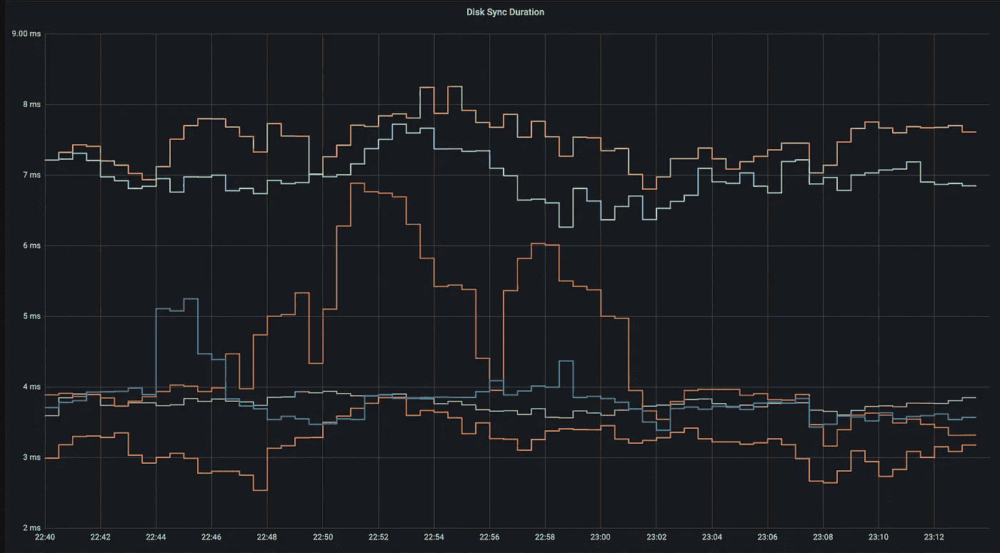
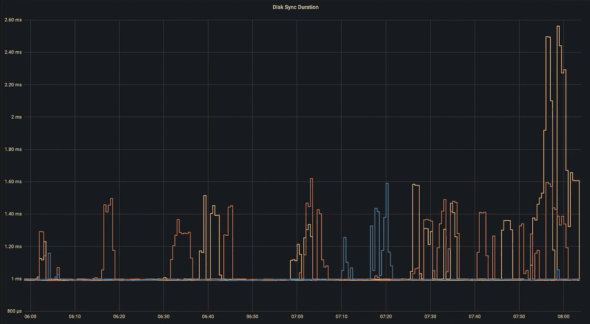
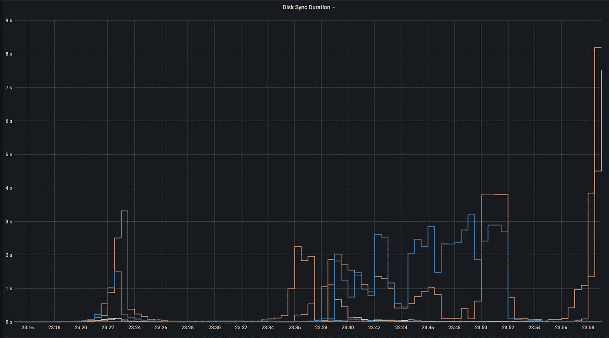
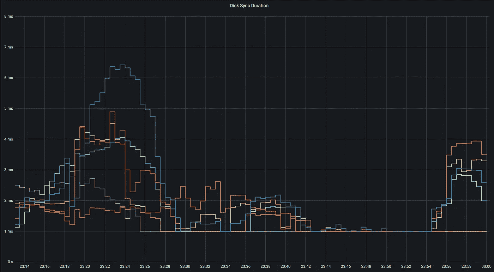

# 磁盘延迟对 etcd 的影响有多大

> 原文：<https://blog.devgenius.io/how-much-disk-latency-affects-etcd-a2042370f476?source=collection_archive---------4----------------------->

## k3s | k8s | etcd |磁盘延迟| kubernetes | k3os

## 通过几个选项使您的 k3s 集群更加稳定。


尼古拉斯·卡佩罗在 [Unsplash](https://unsplash.com/s/photos/graph?utm_source=unsplash&utm_medium=referral&utm_content=creditCopyText) 上拍摄的照片

# 动机

在我们公司，etcd 的磁盘延迟问题明显影响了集群的稳定性或性能。在将主节点转移到更好的硬件后，问题得到了解决。

在实验室设置中，我还遇到了 k3s 群集的稳定性问题。一个节点将定期变为*未就绪*。我用另一台 kvm 主机上的一个节点替换了它。然而集群(一个节点)再次变得不稳定，我注意到 k3s 记录了`etcd`超时消息。

因此，我抓住机会，使用实验室设置来试验`ext4`文件系统的选项，以缓解磁盘延迟问题。

# 实验室场景

三个 k3os 虚拟机(4 个内核，每个 8GB RAM)位于三个不同的主机上，具有简单的基本设置:

*   k3os 在没有 CNI 和入口的情况下启动 k3s。
*   安装纤毛 CNI
*   从 git 通过`kustomize`和`helm`安装了 ArgoCD，其中安装了 MetalLB、Ingress-Nginx、Longhorn、Victoria-Metrics……

Longhorn 用于 Grafana、Victoria Metrics 和 Loki 的 3 节点分布式存储。

## 没有 ext4 调整

这里您可以看到没有选项应用于`ext4`根文件系统的`etcd`的标准磁盘延迟。



Etcd 磁盘延迟图，介于 3 毫秒和 8 毫秒之间。一个节点具有明显更高的延迟。

## 带 ext4 调整

一旦应用了`ext4`文件系统选项，磁盘延迟指标就会显著降低。



Etcd 磁盘延迟图，介于 1 毫秒和 3 毫秒之间。

虽然看起来不多，但它仍然将最小延迟降低了**3 倍！**

## 运行时应用`ext4`选项

```
mount -o remount,noatime,barrier=0,commit=30 /
```

## 解释了文件系统选项

`noatime,barrier=0,commit=30`

没有时间

> 读取文件时，不要更新文件访问时间。这个选项在有大量文件的文件系统上很有用，并且**性能比更新文件访问时间更重要**(这很少是重要的)。

障碍=0

> 这允许/禁止在 jbd 代码中使用写屏障。barrier=0 禁用，barrier=1 使能。这也需要一个支持栅栏的 IO 堆栈，如果 jbd 在栅栏写操作中出错，它将再次禁用并发出警告。写屏障强制日志提交在磁盘上正确排序，使易失性磁盘写缓存可以安全使用，但性能会有所下降。如果您的磁盘以某种方式由电池供电，**禁用屏障可能会安全地提高性能**。挂载选项“barrier”和“nobarrier”也可用于启用或禁用屏障，以与其他 ext4 挂载选项保持一致。

提交=30

> Ext4 可以被告知每‘nrsec’秒同步其所有数据和元数据。默认值为 5 秒。这意味着，如果您断电，您将会丢失最近 5 秒钟的工作(由于日志记录，您的文件系统不会被损坏)。这个默认值(或任何较低的值)会损害性能，但有利于数据安全。将其设置为 0 与保留默认值(5 秒)的效果相同。将它设置为非常大的**值将会提高性能。**

# 灾难…(长角牛再平衡)

为了模拟磁盘上的一些负载，我简单地从一个没有应用 ext4 选项的节点上删除了一个大约 5GB 卷的副本。Longhorn 会自动重新创建并同步它，导致网络和磁盘负载。

## 没有 ext4 调整

节点变为“未就绪”，群集变得不稳定且无法恢复。磁盘延迟飙升，导致级联长角牛故障和重新平衡。重新启动 k3s 进程有助于恢复节点。



Etcd 磁盘延迟飙升至 8 秒。

## 带 ext4 调整

在应用 ext4 选项的同时，执行相同的操作—删除大约 5GB longhorn 副本的相同拷贝。什么都没有……图表上完全看不到任何东西。当然，延迟增加了一点，但它保持在 10 毫秒以下。



Etcd 磁盘延迟保持在 10 毫秒以下。

# 放弃

您会在主节点上运行 Longhorn 和工作负载吗？大概不会。但是，如果您只有三个节点可用，那么您必须确保您的集群保持稳定。

# 结论

留意 etcd 磁盘延迟！如果您有一个多节点集群，放松文件系统选项可以稳定您的 etcd 集群。我们牺牲了单个节点的可靠性，因为万一出现故障，我们还有另外两个节点。

快乐吉托普斯！