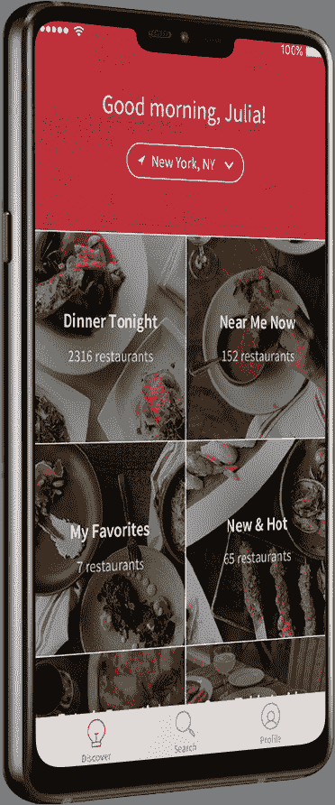
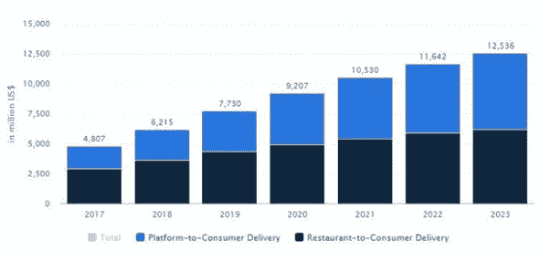

# 开发一个像 Swiggy 和 Zomato 这样的送餐 app 要多少钱！！？

> 原文：<https://blog.devgenius.io/how-much-does-it-cost-to-develop-a-food-delivery-app-like-swiggy-and-zomato-3aa1981c6009?source=collection_archive---------6----------------------->

通常，像 Swiggy、Zomato 这样的按需送餐应用程序的成本在$4K 到$ 20000 之间，取决于应用程序的功能和个性化需求。

像 Swiggy 这样的按需食品交付平台具有多种功能，可以同时供许多用户使用。所以，这对于人们来说不是一件容易的事情，也不是一个新的开始，他们可以在截止日期前得到预期的结果，提供比标准更少的成本，但却毁了你的想法。

该平台需要一个管理 web 系统以及三个应用程序来自动化操作和简化任务。去一家有经验的 [**网络和移动应用开发公司**](https://www.fugenx.com/top-mobile-app-development-companies-in-bangalore/) ，他们有足够的工作在你面前展示你的技能。

好吧，我们的工作外包会让你花费更多，但我们很遗憾你的决定，他们可以履行你的承诺，为你提供一个功能平台。

要创建这样一个平台，你只需要雇佣一个

> *安卓开发者，*
> 
> *HTML 开发者，*
> 
> *UI / UX 设计师和*
> 
> *Android 版送餐应用的质量分析师。*
> 
> *如果你也需要 iOS 版本，你也需要雇佣一个 iOS 开发者。*

由于它是一个数据库应用程序，Zomato like 应用程序的开发成本或其他餐厅应用程序的开发成本会比简单的功能应用程序高一点。成本取决于以下关键因素:

应用平台(Android、iOS (iPhone)或 Windows)、应用设计、应用大小、pp 开发者、移动钱包、影响 Zomato/Swiggy like 应用成本的特性和功能。

Zomato 应用程序适用于 [iOS](https://www.fugenx.com/services/iphone-application-development/) 、 [Android](https://fugenx.com/services/android-application-development/) 和 Windows 用户。这款应用程序让寻找餐厅和点餐变得更加容易和便捷

网上送餐市场统计:

基本特征:

*   餐厅的详细信息
*   用户概要
*   评级和评论:

高级功能:

*   带地图的地理位置功能
*   带成本的菜单
*   预订和订购设施
*   应用内支付
*   社交媒体整合
*   推送通知

Zomato/Swiggy like App 的开发成本

聘请有经验的 [**移动应用开发公司**](https://www.fugenx.com/mobile-app-development-companies-in-india/) 让你梦想的项目成为可能。 ***求*** [***报***](https://www.fugenx.com/zomato-app-development-cost/)

 [## 开发一个 Zomato 或者 Swiggy 这样的 App 要多少钱？

### Zomato 是一家公认的全球餐厅搜索和在线食品配送服务公司。成立于 2008 年的佐马托…

www.fugenx.com](https://www.fugenx.com/portfolio/how-much-does-app-like-zomato-cost/) 

在 [Fugenx](https://www.fugenx.com/zomato-app-development-cost/) 与专家联系，更好地了解您的食品配送应用开发。

**如果这与你有关，请为此鼓掌:)**

**阅读**[**Swiggy、Zomato、Ubereats 等点播应用的成本和功能。**](https://fugenxmobileappdevelopment.medium.com/cost-and-features-of-an-on-demand-apps-like-swiggy-zomato-ubereats-6e67039e5cef)