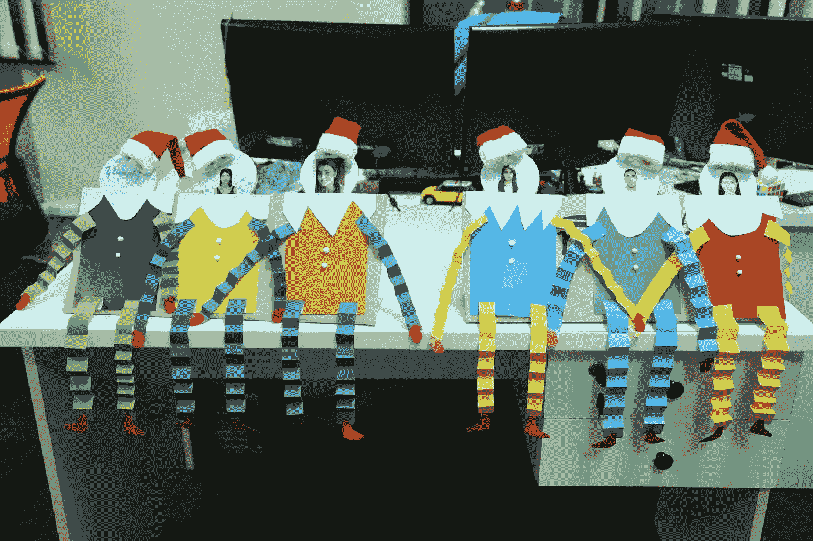

# 开发我的 SaaS 产品到底要花多少钱？

> 原文：<https://blog.devgenius.io/how-much-will-it-really-cost-to-develop-my-saas-product-30c0cd5c3584?source=collection_archive---------23----------------------->

很自然，这是一个许多希望推出产品的企业家关心的问题，然而，这很像问建造一座房子要花多少钱。答案是:视情况而定。你想建一个小森林别墅还是一个 4000 平方米的名人别墅？

纽约 2020

因此，解决这个问题的最佳方式不是直接询问报价，而是与您选择外包开发的公司合作，询问他们是如何以及为什么会得出这样的价格。相比之下，当你首先关注价格时，大多数公司不会认真对待你，知道你只关注底线而不是工作质量。为了有一个良好的开端，请考虑以下几点:

**做好准备**

对你的项目有一个清晰的概念是关键。准备尽可能多的信息，试着从外包公司的角度考虑你的项目。这将确保更顺畅的沟通，并帮助开发团队将正确的特性放在一起，从而提供准确的报价。

现实情况是，即使你已经做好了充分的准备，不同的公司对你的理解也会不同。一个将提议交付运行良好的软件，另一个将更关注它同时处理数百万用户的能力。因此，准备好一系列的沟通和澄清会议。

**费用公式**

一般来说**成本=所需时间 X 速率(每小时、每天、每月)** **+可能需要的任何其他东西(库存图像、库、其他软件)。这也被称为 T & M(时间和材料)模型，最终，所有的定价模型或多或少都基于这一模型。为了进一步分解它:**

a)所需的时间取决于许多因素，很难计算。你将得到的任何数字都只是基于你提供的信息的粗略估计(这是尽可能具体的另一个原因。)根据项目规模和工作范围，实际成本可能会超出 30-40 %,有时甚至是两倍。

b)费率取决于团队的经验水平、计算方法等。这也取决于位置。所以要考虑你合作国家的市场。

**我如何自己计算成本？**

快速计算是个好主意。当你达成价格协议时，这也会给你一个立足点，因为你已经做了自己的研究。

简单地把你的项目分成更小的部分，并再次要求评估。比如你想开发一个 Dropbox，可以这样划分:

1.核心理念，即多台设备上的文件同步

2.Web 仪表板

3.桌面软件

4.移动应用

另一种选择是要求对每个功能进行细分。这将帮助您了解哪些部分是最耗时的，如果需要，可以删除或修改它们。

另一个选择是使用这样的工具进行粗略的成本估算[https://calculator.st-dev.com](https://calculator.st-dev.com/)

**使用 MVP 作为发射台**

从最小可行产品(MVP)开始是保持低初始成本的好主意。在这种情况下，你也更有可能得到一个现实的估计。请记住，MVP 还允许更好的可操作性，这意味着您可以轻松地进行所需的更改，而不会有太多麻烦。

**公开你的预算**

如果你有预算限制，让公司提前知道，这样他们就可以专注于在你的价格范围内实际可以完成的事情。这将使公司有机会解释他们认为应该优先发展的领域。即使你们最终没有合作，他们的专业意见也是你前进过程中需要记住的。

冲刺规划

**外卖**

获得正确的价格确实是一项棘手的任务。你和公司都需要努力达成一致。在这上面花费比你最初预期的更多的时间是很自然的。保持耐心，保持开放，相信这个过程。

如何选择公司开发您的 SaaS 产品的 6 个重要提示

->下一步[开发我的 SaaS 产品的实际成本是多少——第二部分](https://medium.com/@karapet/how-much-will-it-really-cost-to-develop-my-saas-product-part-2-e8de217c09b2)