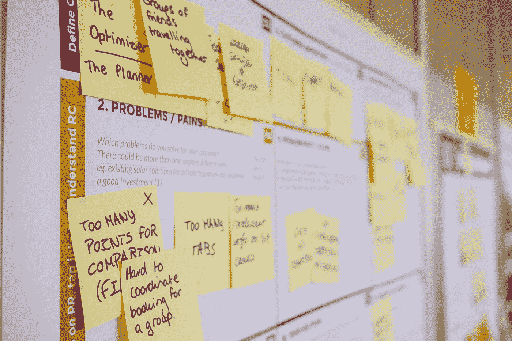

# 我的团队如何在开发中使用敏捷(scrum)

> 原文：<https://blog.devgenius.io/how-my-team-uses-agile-scrum-in-development-82503b4d0e9d?source=collection_archive---------25----------------------->

## 我第一次使用 Scrum 和吉拉的经历

Daria Nepriakhina 在 [Unsplash](https://unsplash.com?utm_source=medium&utm_medium=referral) 上拍摄的照片

在我以前的文章中，我谈到了我的开发团队中的所有人，他们的角色，以及我的日常工作流程。随着我们的项目不断扩大，我们决定需要一种更好的方法来管理任务，而不仅仅是使用 Trello。有敏捷开发经验的团队成员建议我们在工作流程中加入 scrum 和吉拉。

在进入使用这些工具的典型工作流程之前，我想先给你一个概述。

# 什么是敏捷和 Scrum？

简而言之，**敏捷**开发是一种你可以用来管理复杂项目的方法。它描述了管理项目的最佳实践和技术。Scrum 作为一个框架，描述了帮助团队管理他们的项目和工作所需的工具。

# 什么是短跑？

简而言之，冲刺是团队为了完成一定量的工作而要经历的一段时间。短跑有周期，这里有一个图像来展示它。

**冲刺中的关键点**

*   冲刺计划(与你的团队讨论需要完成什么任务，以及如何完成)
*   产品待办事项(团队创建的需要处理的所有任务的列表。大多数时候，这些只是用户故事)
*   Sprint backlog(团队在 Sprint 期间从 backlog 中选择的任务列表)
*   每日的 scrum/stands up(一次会议，检查团队如何完成他们的任务，以及他们是否有任何阻碍者)
*   冲刺回顾(你的团队将讨论他们在冲刺阶段完成了哪些任务)
*   Sprint 回顾(另一个讨论 sprint 的会议，如果有的话，下次可以改进)

# 什么是吉拉？

简而言之，吉拉是一个项目管理软件，用来更容易地管理 Scrum 项目。

# 我的 Scrum 工作流程

*旁注:产品 backlog(用户故事)项目已经由产品所有者完成。

*   在吉拉，我们的主要群体分为**。**我们的结构看起来像这样→[产品积压] [Sprint 积压][正在做][阻止者][完成]
*   我们的冲刺会议被设定在一个特定的日子，我的总理是决定这个的人(星期三)。
*   我们在周三有 sprint 会议，在会议期间，我们都决定了(前端团队、后端团队、设计师)我们更喜欢在 sprint 期间处理哪些任务(来自**产品积压**的用户故事)。因为我在前端，所以我选择与 UI 相关的任务。后端开发者和设计者选择他们的。
*   每个开发人员/设计师选择 2-3 项任务来完成。一旦我们都有了要处理的任务，我们的项目经理就把这些任务放在 **sprint backlog** 类别**中。这些是我们接下来两周的工作。**
*   在中间的某个地方，我们有一个会议更新来检查和查看每个人如何完成他们的任务。
*   当我们的两个星期结束时，我们又开了一次会(周三),说我们都完成了什么，我们学到了什么，解释我们的障碍(如果有的话),并讨论我们下次可以改进的地方。
*   这个循环从挑选任务开始重复。

这些是我在敏捷开发环境中工作的经历，我不得不说，它比我预期的要顺利和容易得多。我每天都认识新的人，这总是很棒。我希望这对其他人有所帮助。注意安全，不断学习。

尽情享受吧！👍

~ ***爱要活，活要码***